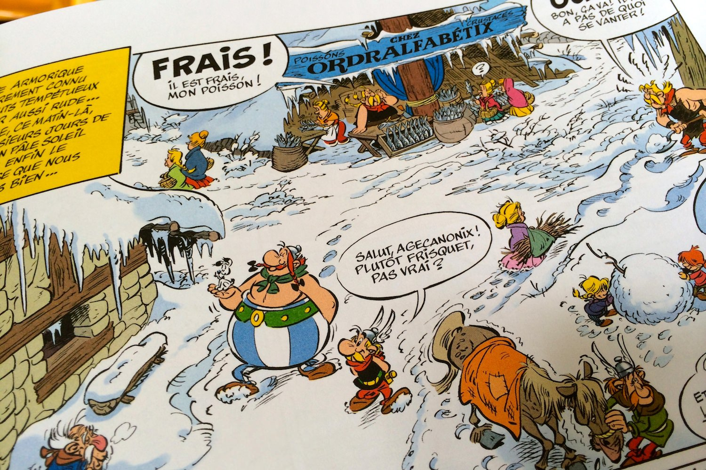
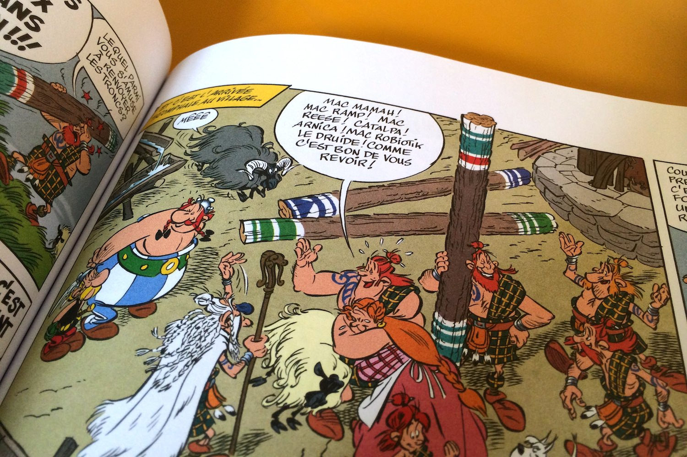

+++
titre = "<em>Astérix chez les Pictes</em>, Jean-Yves Ferri et Didier Conrad"
title = "Astérix chez les Pictes, Jean-Yves Ferri et Didier Conrad"
url = "/asterix-chez-les-pictes-ferri-conrad"
date = "2013-11-03T17:48:16"
Lastmod = "2013-11-03T18:06:09"
cover = "asterix-chez-les-pictes-ferri-conrad.jpg"
categorie = [ "À lire" ]
tag = [ "Astérix", "Bande dessinée", "Histoire", "Humour" ]
createur = [ "Didier Conrad", "Jean-Yves Ferri" ]
annee = [ "2013" ]
weight = 2013
saga = [ "Astérix" ]
pays = [ "France" ]

+++

Créée à la fin des années 1950, la série <em>Astérix</em> a connu un succès qui n’a jamais failli depuis. Dès les premiers tomes, publiés à l’origine sous la forme de séries dans un magazine, la série a trouvé son public et on peut dire que sa popularité n’a pas faibli aujourd’hui. Pourtant, les choses ne sont plus tout à fait les mêmes depuis la mort de René Goscinny, le scénariste qui a imaginé personnages et univers, à la fin des années 1970. Albert Uderzo, le dessinateur, a bien tenté de poursuivre le travail, mais les albums sortis depuis sont tous assez moyens. Cinquante-quatre ans après le premier volet, c’est une tout autre équipe qui essaie de prendre la relève. <em>Astérix chez les Pictes</em>, le trente-cinquième volet des aventures d’Astérix est dessiné par Didier Conrad et écrit par Jean-Yves Ferri et même si Uderzo est resté présent à toutes les étapes de la création, c’est bien une nouvelle page qui s’ouvre pour la saga. Pour un résultat meilleur que les derniers albums, certes, mais qui n’atteint pas le niveau de l’époque Goscinny…

Pour cet album de la rupture, les enjeux commerciaux étaient trop grands pour faire dans l’originalité et Jean-Yves Ferri tout comme Didier Conrad ont respecté à la lettre l’esprit <em>Astérix</em>. Le dessin ressemble très fortement à celui d’Uderzo, même si les différences existent, mais elles sont trop subtiles pour être repérées au premier coup d’œil. Ouvrez <em>Astérix chez les Pictes</em> au hasard, vous ne verrez pas la différence avec les albums précédents. On note tout quand même que le nouveau dessinateur a su imposer sa marque avec des dessins légèrement plus fouillés, plus réalistes par endroit. L’évolution est subtile, mais réelle et c’est un point plutôt positif dans l’ensemble. Après tout, le style d’Albert Uderzo a également évolué au fil des années et ses derniers travaux ne ressemblent pas aux tout premiers albums, beaucoup plus simples sur le plan visuel. Ainsi, on apprécie assez cette évolution dans la continuité : un dessin qui bouge par toute petite touche et un dessinateur qui prend ses marques, tout en respectant le travail original. <em>Astérix chez les Pictes</em> a été imprimé dès le départ à cinq millions d’exemplaires, on comprend bien que Didier Conrad ne pouvait se permettre aucun écart majeur et on sait d’ailleurs qu’Uderzo a approuvé chaque dessin, après éventuellement avoir apporté quelques modifications. Sur ce point, ce nouvel album est une réussite.

La réussite d’un bon album d’<em>Astérix</em> ne tient pas seulement en un bon dessin toutefois. Pour ce nouvel épisode, Jean-Yves Ferri n’a, lui aussi, eu qu’une marge de manœuvre sans doute limitée par l’éditeur et les ayants droit. Plutôt que de partir sur quelque chose de très original, l’auteur s’en est tenu au schéma imposé à la série par René Goscinny. <em>Astérix chez les Pictes</em> commence ainsi par une journée normale dans le village des irréductibles Gaulois et se termine sur un banquet dans le même village : la tradition est ici respectée à la lettre. Le schéma général n’est pas plus original, et c’est sans doute l’un des reproches que l’on pourra faire à cet épisode. Les Gaulois, en plein hiver, tombent par hasard sur un morceau de glace dans lequel il découvre un être inconnu. Ils découvrent qu’il s’agit d’un Picte, l’équivalent d’un Écossais aujourd’hui, et Astérix et Obélix l’accompagnent chez lui. L’occasion de découvrir un autre peuple et d’autres coutumes : c’est une idée bien connue dans la saga d’<em>Astérix et Cléopatre</em> à <em>Astérix en Corse</em>, en passant par <em>Astérix en Hispanie</em> ou <em>Astérix chez les Goths</em>. Reprendre cette idée n’est pas mauvais en soi, elle compose après tout l’essentiel de la série, mais elle est un peu légère dans cet épisode. L’excuse semble un peu facile — le Picte qui arrive dans un glaçon —, mais le problème survient surtout une fois sur place. Jean-Yves Ferri ne semble pas vraiment savoir quoi faire de son Écosse et une fois le Monstre du Loch Ness et quelques jeux de mots avec &laquo;&nbsp;Mac&nbsp;&raquo; exploités, le récit tourne court. Là où Goscinny proposait systématiquement une histoire riche et surtout très fluide, signe d’une grande réflexion en amont, <em>Astérix chez les Pictes</em> semble plutôt avoir été construit au fur et à mesure et plus pour remplir des cases qu’avec un véritable objectif. Au total, le récit n’est pas mauvais, mais il ne restera pas dans les annales alors qu’on se souvient tous de l’histoire des premières aventures d’Astérix et d’Obélix. 

<em>Astérix chez les Pictes</em> est loin d’être déshonorant, c’est un album tout à fait correct, mais succéder à Goscinny et Uderzo n’est décidément pas une chose aisée. Si le style graphique de Didier Conrad n’appelle pas de reproches, on est plus mitigés sur le récit imaginé par Jean-Yves Ferri. On s’amuse et quelques scènes sont très réussies, mais le récit est un peu chaotique et il manque de réflexion d’ensemble. Le côté pédagogique de la série a totalement disparu et le récit avance de manière un peu arbitraire par moment. Ce trente-cinquième épisode relève le niveau après d’énormes ratages, mais il n’empêche que ces nouvelles aventures ne semblent exister que pour des raisons commerciales — vendre d’une part, mais aussi maintenir tous les droits sur les personnages et l’univers — et cela se voit un peu. La série <em>Astérix</em> est déjà exceptionnelle en l’état, est-il vraiment nécessaire de la compléter encore ?

<h3>Vous voulez m’aider ?<a href="#footnote_0_10471" id="identifier_0_10471" class="footnote-link footnote-identifier-link" title="&Agrave; propos de la publicit&eacute;&hellip;">1</a></h3>
<ul>
<li><a href="http://www.amazon.fr/gp/product/2864972662/ref=as_li_ss_tl?ie=UTF8&#038;tag=leblogdenic07-21&#038;linkCode=as2&#038;camp=1642&#038;creative=19458&#038;creativeASIN=2864972662">Acheter la bande dessinée sur Amazon</a></li>
<li><a href="https://itunes.apple.com/fr/book/asterix-chez-les-pictes-35/id704239566?mt=11">Acheter la bande dessinée sur l&rsquo;iBookstore</a></li>
</ul>

<ol class="footnotes"><li id="footnote_0_10471" class="footnote"><a href="http://voiretmanger.fr/soutien/">À propos de la publicité…</a> [<a href="#identifier_0_10471" class="footnote-link footnote-back-link">&#8617;</a>]</li></ol>
