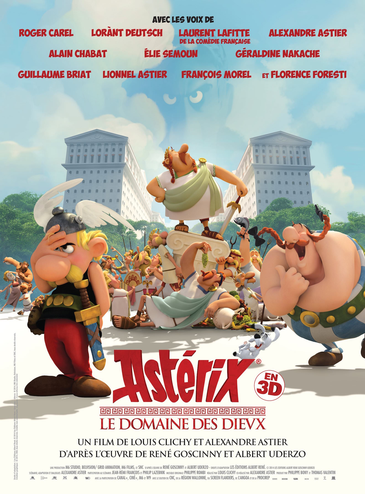

+++
type = "post"
titre = "<em>Astérix : Le Domaine des dieux</em>, Louis Clichy et Alexandre Astier"
title = "Astérix : Le Domaine des dieux, Louis Clichy et Alexandre Astier"
url = "/asterix-domaine-dieux-clichy-astier"
date = "2014-11-26T22:43:19"
Lastmod = "2014-11-26T22:53:28"
cover = "asterix-le-domaine-des-dieux-astier-clichy.jpg"
categorie = [ "À voir" ]
tag = [ "Adaptation bande-dessinée", "Animation", "Argent", "Comédie", "Humour", "Société", "Sociologie", "Sorties du mois" ]
createur = [ "Alexandre Astier", "Louis Clichy" ]
annee = [ "2014" ]
weight = 2014
saga = [ "Astérix" ]
pays = [ "France" ]

+++

La saga <em>Astérix</em>, si excellente en bande-dessinée, a connu des sorts divers au cinéma, mais les bonnes adaptations ont été beaucoup plus rares que les médiocres. À dire vrai, on ne retiendrait vraiment qu&rsquo;<em>Astérix et Obélix : Mission Cléopâtre</em>, mais cette excellente comédie était d&rsquo;abord un film d&rsquo;Alain Chabat, avant d&rsquo;être une adaptation de l&rsquo;œuvre de René Goscinny et Albert Uderzo. Après plusieurs essais totalement ratés en prises de vue réelles, il était probablement grand temps d&rsquo;essayer autre chose, et on ne peut que saluer le choix de Louis Clichy et d&rsquo;Alexandre Astier en faveur de l&rsquo;animation. D&rsquo;entrée, <em>Astérix : Le Domaine des dieux</em> est plus proche de la bande-dessinée et c&rsquo;est plutôt une bonne chose. Et bien entendu, il y a Alexandre Astier qui signe le scénario et qui est à l&rsquo;initiative du projet : l&rsquo;homme touche-à-tout prouve à nouveau qu&rsquo;il n&rsquo;est plus seulement le créateur de <em>Kaamelott</em> et on avait hâte de voir ce que son univers pouvait donner, une fois confronté à celui d&rsquo;<em>Astérix</em>. Et le résultat est très convaincant : <em>Astérix : Le Domaine des dieux</em> est une lecture modernisée du tome original qui plaira autant aux petits qu&rsquo;aux grands. Un excellent film familial !

Quand on a proposé à Alexandre Astier de réaliser « son » adaptation d&rsquo;un Astérix, il n&rsquo;a pas hésité une seconde et a choisi <em>Le Domaine des dieux</em>. Le dix-septième album des aventures du Gaulois n&rsquo;est pas forcément le plus célèbre, ce n&rsquo;est pas le plus exotique ou le plus spectaculaire, mais c&rsquo;est aussi le plus intéressant. Car c&rsquo;est le seul où César est vraiment à deux doigts de gagner et de raser le village des irréductibles gaulois, non pas en utilisant la force comme toujours, mais la ruse et l&rsquo;attrait de l&rsquo;argent. L&rsquo;idée de construire une ville romaine aux portes du village et ainsi d&rsquo;attirer les Gaulois dans la civilisation romaine et leur enlever l&rsquo;envie de défendre leur village et leur mode de vie. C&rsquo;est une idée assez diabolique et qui a failli réussir : même si Uderzo et Goscinny ont aussi imaginé d&rsquo;autres histoires où les Romains réussissent à détruire le village, c&rsquo;est probablement avec celle-ci que César est aussi proche de la victoire. <em>Astérix : Le Domaine des dieux</em> est donc un choix intéressant, mais pas forcément un choix facile, surtout pour un film qui se veut familial et qui doit plaire aux plus jeunes. Pour autant, on sent qu&rsquo;Alexandre Astier est un vrai fan non seulement de cet album, mais d&rsquo;Astérix de manière générale et son adaptation est très fidèle et respectueuse de l&rsquo;œuvre originale. Là où Alain Chabat importait son univers cinématographique dans celui des Gaulois, le scénario respecte à la lettre la bande-dessinée, à tel point que les meilleurs connaisseurs en reconnaitront certaines cases. Mais cela ne veut pas dire qu&rsquo;il est inutile de voir <em>Astérix : Le Domaine des dieux</em> si on connaît bien l&rsquo;original : tout en respectant sa source, le créateur de <em>Kaamelott</em> a aussi glissé sa patte, pour constituer un mélange original plutôt bien trouvé.

<em>Astérix : Le Domaine des dieux</em> vise toute la famille et à ce titre, le long-métrage joue sur plusieurs tableaux. Il y a bien entendu l&rsquo;histoire originale, celle du village gaulois qui ne cède pas par la force, mais sous la pression de l&rsquo;argent apporté par les Romains qui viennent habiter au pied du village. Comme dans la bande-dessinée, le film de Louis Clichy et Alexandre Astier s&rsquo;adresse autant aux plus jeunes qui comprendront en partie l&rsquo;histoire, qu&rsquo;aux adultes qui auront peut-être beaucoup plus conscience de ce que cela signifie. À bien des égards, c&rsquo;est une belle illustration du concept d&rsquo;acculturation en sociologie : deux groupes totalement différents se rencontrent et apprennent à se découvrir et à se connaître. Les civils venus de Rome ne sont pas forcément impressionnés par les Gaulois et ces derniers ne savent pas comment réagir face à ces hommes, ces femmes et ces enfants qu&rsquo;ils ne peuvent pas simplement baffe, comme les soldats de base. Le plan de César est vraiment diabolique et il fonctionne remarquablement bien : le film est d&rsquo;ailleurs excellent quand il s&rsquo;agit de faire sentir que la victoire romaine est proche. <em>Astérix : Le Domaine des dieux</em> reste avant tout une comédie et c&rsquo;est à ce niveau qu&rsquo;Alexandre Astier impose le plus sa marque. Là encore, le film joue sur plusieurs niveaux en mêlant les gags, souvent visuels, de l&rsquo;œuvre originale à des références et clins d&rsquo;œil plus modernes. Après un générique qui évoque assez ceux de <em>James Bond</em>, on a une citation directe au <em>Seigneur des Anneaux</em> et des dizaines de références, mais qui sont parfaitement intégrées à l&rsquo;histoire. Le film a l&rsquo;intelligence de ne pas assener une longue liste de références, comme c&rsquo;est parfois le cas et le résultat est très convaincant. On s&rsquo;amuse très souvent dans cette relecture de la bande-dessinée et même si la version d&rsquo;Alain Chabat reste meilleure sur ce point, il faut encore une fois saluer le respect de l&rsquo;œuvre originale. Ce qui n&rsquo;empêche pas Alexandre Astier de marquer son film de sa présence : il impose ses fidèles parmi les voix — on reconnaît aisément celle de son père, Lionnel Astier, et avec beaucoup de plaisir celle de Serge Papagalli — et il impose son humour dès qu&rsquo;il le peut. C&rsquo;est surtout l&rsquo;armée romaine qui tombe dans le ridicule sur le même mode que les Chevaliers de la Table ronde et c&rsquo;est souvent très drôle… sans être envahissant. Un bien bel équilibre.

Astérix est de retour au cinéma et pour une fois, c&rsquo;est une bonne nouvelle. On n&rsquo;osait plus vraiment attendre de bonne adaptation des bandes-dessinées de Goscinny et d&rsquo;Uderzo et il a fallu réunir un fan et un spécialiste de l&rsquo;animation pour obtenir, enfin, un bon résultat. <em>Astérix : Le Domaine des dieux</em> est une vraie réussite, un film familial qui plaira à tout âge et cette relecture fidèle, mais modernisée doit son succès autant à Alexandre Astier qu&rsquo;à Louis Clichy. Le premier signe un scénario malin, drôle sans être lourd, respectueux tout en conservant son propre univers et c&rsquo;est un succès incontestable. Le deuxième a fait ses armes chez Pixar (il a travaillé sur <em>Wall-E</em> et <em>Là Haut</em>, rien que cela) et cela se voit : le style est assez proche du dessin d&rsquo;Uderzo, mais dans une vision plus moderne, avec plus de relief et l&rsquo;animation est extrêmement réussie. <em>Astérix : Le Domaine des dieux</em> est une production française qui n&rsquo;a pas à rougir face aux superproductions américaines : ce film est aussi réussi techniquement, et son histoire est toujours aussi passionnante, plus de quarante ans après.

