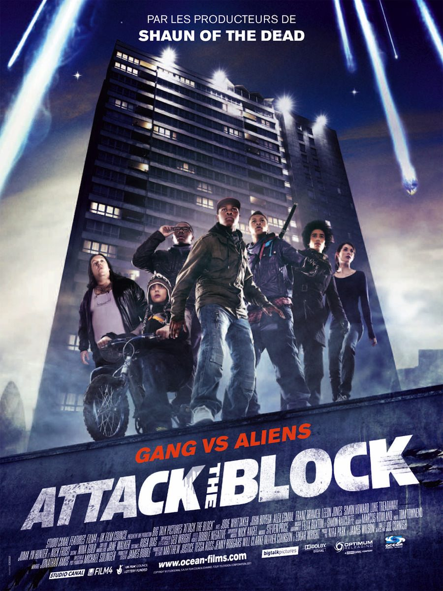
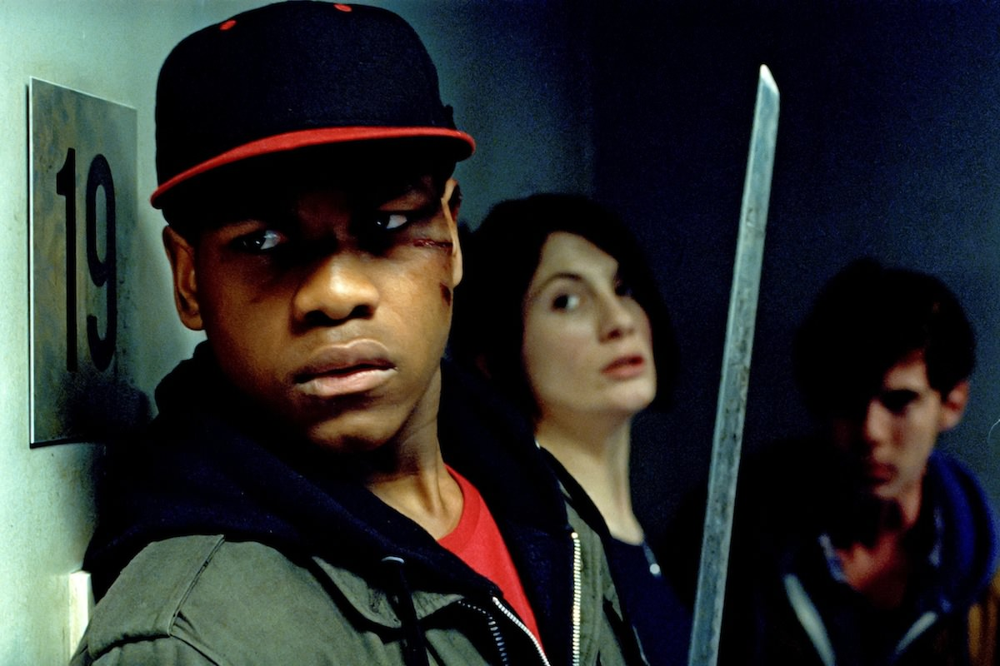

+++
type = "post"
titre = "Attack the Block, Joe Cornish"
title = "Attack the Block, Joe Cornish"
url = "/attack-the-block-cornish"
date = "2012-11-26T08:34:06"
Lastmod = "2012-11-24T23:39:58"
cover = "attack-the-block.jpg"
categorie = [ "À voir" ]
tag = [ "Banlieue", "Extra-terrestre", "Horreur", "Humour", "Science-Fiction", "Société", "Violence", "Vite oublié" ]
createur = [ "Joe Cornish" ]
acteur = [ "John Boyega", "Nick Frost" ]
annee = [ "2011" ]
weight = 2011

+++

Une attaque de zombies contre une cité du sud de Londres repoussée par une bande de voyous. Non, vous ne rêvez pas, c&rsquo;est bien l&rsquo;idée de départ d&rsquo;<em>Attack the Block</em>, étonnant film de série B qui navigue entre l&rsquo;horreur cheap et l&rsquo;humour britannique marqué par le langage de rue. Pour son premier film, Joe Cornish — mieux connu pour être le scénariste de <a href="http://voiretmanger.fr/2011/10/28/aventures-tintin-secret-licorne-spielberg/" title="Les Aventures de Tintin : Le Secret de la Licorne, Steven Spielberg - À voir et à manger"><em>Les Aventures de Tintin : Le Secret de la Licorne</em></a> qui n&rsquo;a vraiment rien à voir —, n&rsquo;a aucun moyen, mais il parvient à faire un film d&rsquo;horreur qui tient la route et une très drôle histoire à base de jeunes de banlieue, d&rsquo;aliens et de la police. À voir, mais au dixième degré. 

L&rsquo;histoire importe finalement assez peu. Comme dans tout bon film d&rsquo;horreur qui se respecte, <em>Attack the Block</em> filme la confrontation de deux groupes : prenez des jeunes de banlieue d&rsquo;un côté, et de vils extra-terrestres de l&rsquo;autre. Les motivations des envahisseurs ne sont jamais le sujet du film, elles ne sont même pas évoquées : qu&rsquo;importe, l&rsquo;essentiel est de réunir une proie et un prédateur. Dans cette cité manifestement abandonnée par la police, des bandes de jeunes adolescents font la loi et personne ne vient les aider quand l&rsquo;invasion commence. Ces jeunes doivent ainsi se débrouiller seuls et ils résistent comme ils peuvent, menés par Moïse qui fait figure de leader et armés seulement de couteaux, de battes de baseball et de quelques feux d&rsquo;artifice et pétards. Avant l&rsquo;attaque, ils s&rsquo;en sont pris à une jeune femme qui vient d&rsquo;emménager ; ils la retrouvent par la suite et la prennent avec eux, mais c&rsquo;est plus pour ajouter la touche féminine nécessaire. C&rsquo;est ainsi dans <em>Attack the Block</em>, tout est fait pour satisfaire tous les poncifs du genre et Joe Cornish semble mettre un soin particulier à remplir son film de passages obligés. Confrontation avec le gangster qui entend garder la main-mise sur le quartier, course-poursuites avec la police et même actes d&rsquo;héroïsme sur fond de drapeau anglais pour terminer : tout est là, mais rien n&rsquo;est vraiment sérieux. 

Joe Cornish n&rsquo;avait qu&rsquo;un budget très limité, mais le réalisateur britannique a su l&rsquo;exploiter de manière plutôt astucieuse. <em>Attack the Block</em> se déroule entièrement de nuit, ce qui évite de trop développer l&rsquo;action de quelques plans, mais c&rsquo;est surtout sur les bestioles venues de l&rsquo;espace que les moyens limités se font sentir. Si le premier extra-terrestre est plutôt bien rendu, quoiqu&rsquo;un peu trop proche de l&rsquo;Alien peut-être, les suivantes ne sont que des boules de poils noirs assez peu impressionnantes. Joe Cornish a eu une bonne idée qui fait que cela fonctionne toutefois : au lieu d&rsquo;éclairer les yeux de ses monstres, il leur a donné une dentition bleue fluo. Formidable idée de mise en scène qui leur donne une certaine efficacité, tout en gardant la dose de kitsch nécessaire dans ce film assez peu sérieux. Malgré son budget limité, <em>Attack the Block</em> n&rsquo;est pas avare en scènes d&rsquo;action, si bien que le film s&rsquo;avère plutôt prenant, avec un rythme qui ne faiblit jamais. L&rsquo;humour reste finalement assez discret, on ne tend jamais à la parodie simpliste et l&rsquo;action n&rsquo;est jamais sacrifiée sur l&rsquo;autel du rire. Les personnages imaginés par Joe Cornish ne sont pas tout à fait sérieux, mais ces jeunes de banlieue interprétés par des acteurs débutants s&rsquo;avèrent <em>in fine</em> très convaincants, et même touchants. Alors que le spectateur a tendance à les détester dans un premier temps, le scénario évolue de telle sorte qu&rsquo;ils deviennent des personnages positifs. Une écriture plus fine qu&rsquo;il n&rsquo;y paraît et qui explique indéniablement la réussite d&rsquo;<em>Attack the Block</em>, sans évidemment perdre de vue qu&rsquo;il s&rsquo;agit plus d&rsquo;une série B que d&rsquo;un chef-d&rsquo;œuvre du septième art. 

On pouvait craindre un film moral et moralisateur, mais Joe Cornish évite globalement cet écueil. <em>Attack the Block</em> valorise effectivement la cohésion du groupe et met en avant les difficultés sociales de ces jeunes de manière peut-être un peu trop présentes — surtout pour Moïse qui a un traitement différent des autres personnages. La fraicheur de leur jeu combinée à la naïveté touchante de ces gros durs qui fondent dès que le danger pointe son nez et rappellent alors qu&rsquo;ils sont malgré tout très jeunes, ce cocktail fait mouche et séduit. <em>Attack the Block</em> est drôle, un peu gore aussi, mais au fond plutôt touchant. Joe Cornish ne signe pas un chef-d&rsquo;œuvre naturellement, ce n&rsquo;était d&rsquo;ailleurs certainement pas son but, mais son premier film est très plaisant. À découvrir, du moins si le gore et le kitsch des séries B fauchées ne vous effraient pas…

<h3>Vous voulez m&rsquo;aider ?<a href="#footnote_0_7838" id="identifier_0_7838" class="footnote-link footnote-identifier-link" title="&Agrave; propos de la publicit&eacute;&hellip;">1</a></h3>
<ul>
<li><a href="http://www.amazon.fr/gp/product/B005OQ86EC/ref=as_li_ss_tl?ie=UTF8&#038;tag=leblogdenic07-21&#038;linkCode=as2&#038;camp=1642&#038;creative=19458&#038;creativeASIN=B005OQ86EC">Acheter le film en Blu-Ray sur Amazon</a></li>
<li><a href="http://www.amazon.fr/gp/product/B005OQ869C/ref=as_li_ss_tl?ie=UTF8&#038;tag=leblogdenic07-21&#038;linkCode=as2&#038;camp=1642&#038;creative=19458&#038;creativeASIN=B005OQ869C">Acheter le film en DVD sur Amazon</a></li>
<li><a href="https://itunes.apple.com/fr/movie/attack-the-block/id490686092">Acheter ou louer le film sur l&rsquo;iTunes Store</a></li>
</ul>

<ol class="footnotes"><li id="footnote_0_7838" class="footnote"><a href="http://voiretmanger.fr/soutien/">À propos de la publicité…</a> [<a href="#identifier_0_7838" class="footnote-link footnote-back-link">&#8617;</a>]</li></ol>
