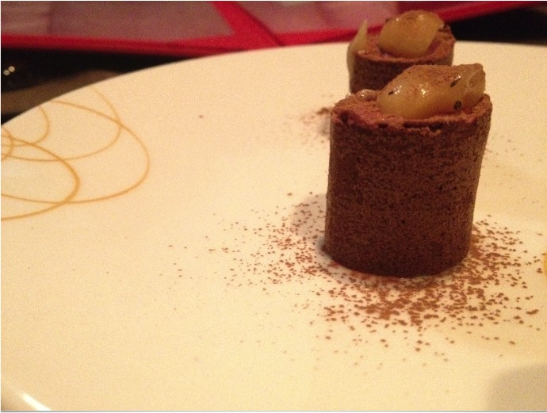
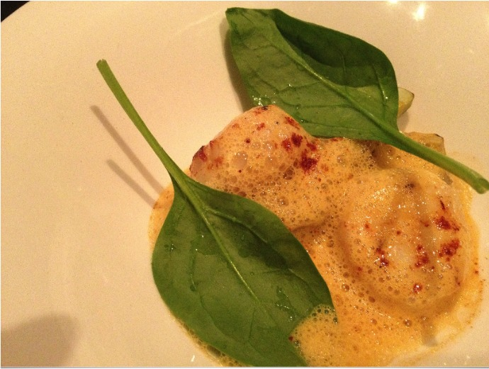
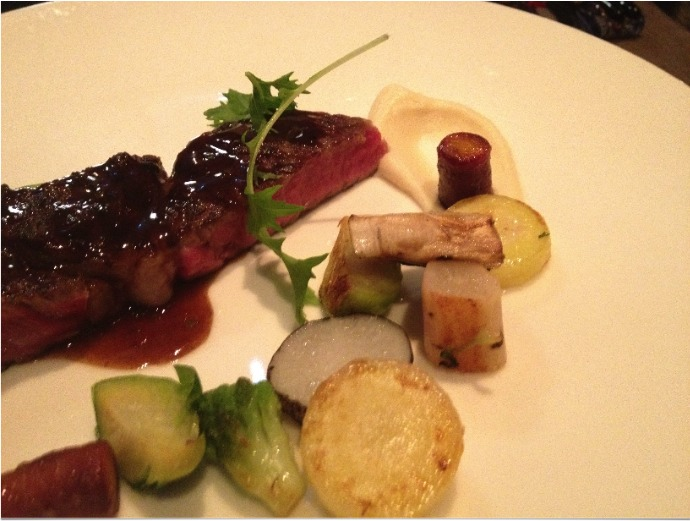
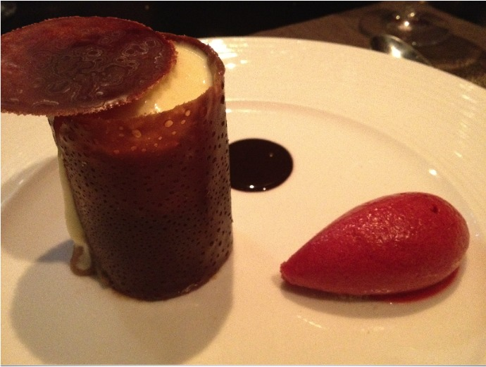

+++
titre = "Au 14 février, Lyon"
title = "Au 14 février, Lyon"
url = "/au-14-fevrier-lyon"
date = "2011-10-23T01:11:15"
Lastmod = "2012-08-02T20:02:52"
cover = "au-14-fevrier-lyon.jpg"
categorie = [ "À manger" ]
tag = [ "Association plat/vin", "Cuisine française", "Cuisine japonaise", "Mélange", "Une étoile Guide Michelin" ]

+++

Peut-on trouver restaurant plus décalé ? Situé au cœur du quartier du Vieux-Lyon, quartier des bouchons typiquement lyonnais s&rsquo;il en est, <a href="http://au14fevrier.com/vieux-lyon/"><strong>Au 14 février</strong> </a>est un restaurant totalement opposé à ces fameux bouchons. Au programme, un chef japonais qui revisite la cuisine française avec un menu unique par soir. Choisissez la quantité, donnez vos goûts et laissez-vous emporter et souvent surprendre par les préparations du chef. Le tout dans un cadre convivial, parfait pour les repas en couple : pas étonnant que deux à trois mois d&rsquo;attente soient nécessaires avant une réservation…

Le principe est simple dans ce restaurant atypique : vous avez le choix entre deux menus qui ne varient que par le nombre de plats à déguster. Si vous avez un gros appétit, vous pouvez ainsi commander le menu à neuf plats. Sinon, vous vous limiterez au menu à sept plats &laquo;&nbsp;seulement&nbsp;&raquo;. Si chaque élément n&rsquo;est pas trop copieux, vous aurez bien mangé à la fin. À vous de voir, mais nous sommes restés sur la formule la plus légère, sans regret : nous avons quitté le restaurant l&rsquo;estomac bien rempli. <strong>Au 14 février</strong>, vous n&rsquo;aurez pas le choix des plats : le restaurant ne propose aucune carte et son menu change tous les jours, en fonction des produits disponibles, mais aussi des envies du chef. En vous mettant à table, on vous demandera simplement ce que vous n&rsquo;aimez pas. Une bonne idée pour éviter le foie gras et obtenir en échange des coquilles Saint-Jacques, par exemple. Ce principe de personnalisation est vraiment plaisant, d&rsquo;autant qu&rsquo;il permet ainsi de s&rsquo;assurer du caractère unique des plats : il faudrait y retourner pour le vérifier, mais on ne mange normalement jamais deux fois la même chose <strong>Au 14 février</strong>.

La bonne idée, c&rsquo;est d&rsquo;accompagner chaque plat d&rsquo;un verre de vin. <strong>Au 14 février</strong> propose une carte de vins bien sûr, mais il est recommandé de choisir l&rsquo;une des trois formules de dégustation proposées par le restaurant. Là encore, seule la quantité change : vous n&rsquo;aurez pas le choix des vins, le restaurant proposera un verre en accord avec un plat. Même si la formule est coûteuse, on recommandera chaudement la formule six vins, de quoi avoir un verre adapté à chaque plat. Il faut compter une centaine d&rsquo;euros par personne avec le menu à sept plats, mais le résultat est magique. Les vins proposés sont variés, nous avons eu du blanc et du rouge traditionnels, mais aussi du champagne et du vin rouge liquoreux pour les deux desserts. Pensez simplement à ne pas venir en voiture, mais si vous aimez le vin, c&rsquo;est une excellente opportunité d&rsquo;en déguster de bons, et à un prix relativement modeste. L&rsquo;apéro maison, composé de champagne et d&rsquo;un mélange fruité, n&rsquo;est pas mauvais du tout et pourra ouvrir agréablement le repas…

Ce soir-là, nous avons eu droit à sept plats assez exceptionnels. Sur la table nous attendaient déjà deux tranches de saucisson chaud à la lyonnaise, revisité à la mode <strong>Au 14 février</strong> : il y a bien de la brioche et du saucisson, mais l&rsquo;un comme l&rsquo;autre sont extrêmement fins et craquants, parfait pour l&rsquo;apéro. L&rsquo;ambiance est donnée : on est à Lyon, c&rsquo;est de la gastronomie lyonnaise et française, mais revisitée. La touche japonaise ne s&rsquo;est pas forcément manifestée autant qu&rsquo;espéré, mais tous les plats proposés étaient recherchés. Sept éléments au menu, plus un amuse-bouche : soupe de potiron au pain d&rsquo;épices et au caramel au café, oursin avec une gelée de fruits de mer, coquilles saint-jacques ou foie gras poêlé aux fruits rouges, thon mi-cuit aux champignons, pièce de bœufs et ses légumes croquants, du fromage et enfin deux desserts. Quelques excellentes idées relevées au cours de notre soirée, comme cet amuse-bouche vraiment bon avec son caramel au café, ou ce dessert autour de la glace caramel au beurre salé accompagnée de fruits de la passion, mais aussi de mousse de Guinness. Un mélange étonnant entre l&rsquo;acidité des fruits, la douceur de la glace et l&rsquo;amertume de la mousse, un mélange qui fonctionne parfaitement, surtout relevé par le vin choisi. Même le fromage proposé ce soir, un brie de Meaux d&rsquo;ailleurs fort bon, était sublimé par le vin proposé en accompagnement.

Difficile d&rsquo;apporter une quelconque nuance : cette soirée passée <strong>Au 14 février</strong> n&rsquo;était pas loin de la perfection. On n&rsquo;a pas encore eu l&rsquo;occasion d&rsquo;évoquer le cadre, mais il est à la hauteur de la cuisine : classe, à tendance asiatique (jusqu&rsquo;aux toilettes qui peuvent nettoyer automatiquement votre postérieur…), très chaleureux. Les mois d&rsquo;attente pour réserver s&rsquo;expliquent facilement : il y a six tables seulement dans ce restaurant et l&rsquo;ambiance est agréable, même quand les voix montent un peu sous l&rsquo;effet des verres de vin… Peu de clients, mais beaucoup de demandes : <strong>Au 14 février</strong> ne chôme pas, et ce succès est mérité. Tous les plats n&rsquo;étaient pas aussi exceptionnels que les autres, certes, mais le résultat est vraiment satisfaisant et du niveau de certains restaurants étoilés, pour un prix finalement modeste. Si vous aimez la cuisine audacieuse et si vous avez quelque chose à fêter ou si vous voulez simplement passer un très bon moment en amoureux, réservez une table <strong>Au 14 février</strong>, vous ne devriez pas le regretter !

<strong>Mise à jour</strong> : depuis notre passage, le restaurant a reçu sa première étoile au Guide Michelin. Un argument de plus en sa faveur, même si cette étoile ne va malheureusement pas raccourcir les délais pour y réserver une table. Espérons aussi que les prix ne s&rsquo;envolent pas suite à cette récompense…

