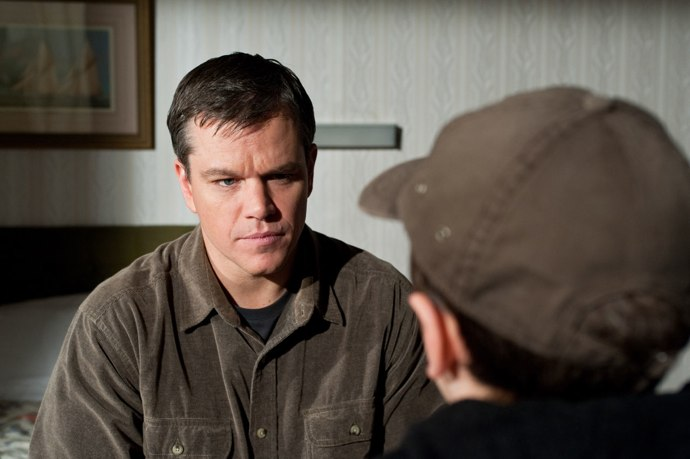
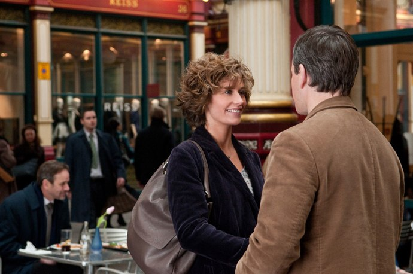

+++
type = "post"
titre = "<em>Au-Delà</em>, Clint Eastwood"
title = "Au-Delà, Clint Eastwood"
url = "/au-dela-eastwood"
date = "2011-01-20T00:27:50"
Lastmod = "2013-12-09T15:33:35"
cover = "clint-eastwood-au-dela.jpg"
categorie = [ "À voir" ]
tag = [ "Blockbuster", "Drame", "Famille", "Fantastique", "Mort", "Société" ]
createur = [ "Clint Eastwood" ]
acteur = [ "Cécile de France", "Matt Damon" ]
annee = [ "2011" ]
weight = 2011
pays = [ "États-Unis" ]
original = "Hereafter"

+++

Depuis <em><a href="http://voiretmanger.fr/2008/12/19/lechange-meme-les-grands-peuvent-se-planter/">L&rsquo;échange</a></em>, quelque chose s&rsquo;est cassé dans ma relation de cinéphile avec Clint Eastwood. Brusquement, ce mythe du cinéma, ce demi-dieu même, proposait un film déplaisant, pathétique, pompeux et pompant. Autant dire que je craignais beaucoup pour <em>Au-Delà</em>, son dernier film. Un sujet extrêmement dangereux au cinéma, la mort, une construction en triptyque à la Innaritù : le tout sentait à des kilomètres le pathos et les violons. Et pourtant, je suis allé le voir, plus par principe que par conviction. Et pourtant, je n&rsquo;en suis pas sorti totalement déçu, et presque convaincu.

<em>Au-Delà</em> reprend une structure extrêmement classique dans la littérature et popularisée au cinéma par le réalisateur mexicain Alejandro González Iñárritu. Plusieurs destins à travers le monde qui se déroulent en parallèle avant de se rejoindre. Clint Eastwood a choisi trois personnages très différents, mais réunis d&rsquo;emblée par la mort. On suivra donc George, un Américain qui a longtemps fait le médium, parlant avec des morts pour le compte d&rsquo;hommes et de femmes soucieux d&rsquo;en savoir plus sur un proche mort récemment et qui a sans doute quelque chose à dire aux vivants. On suit aussi Marie, journaliste de France Télévision à qui tout réussit, de la brillante carrière professionnelle où elle a l&rsquo;occasion de faire preuve d&rsquo;un journalisme intègre qui ne lâche rien, à ses amours avec son producteur, mais qui va connaître la mort suite à un tsunami. On suit enfin Marcus, jeune londonien qui perd son frère jumeau suite à un accident et qui ne parvient pas à faire son deuil. San Francisco, Paris et Londres, trois vies menées en parallèle, mais qui seront réunies <em>in fine</em>, comme on peut s&rsquo;en douter dès le départ. Au cœur d&rsquo;<em>Au-Delà</em> donc, le thème de la mort et du deuil : comment survivre à une tragédie humaine qui vous a touché personnellement par un bref passage dans l&rsquo;au-delà ? Comment survivre à la perte d&rsquo;un frère qui représentait tout pour vous et sur qui vous comptiez en toute chose ? Comment se débarrasser d&rsquo;une faculté vue comme un don par l&rsquo;entourage, mais comme une malédiction par vous-même ? Autant de questions qui se posent aux personnages filmés par Clint Eastwood et autant de questions auxquelles le film tente de répondre.

Le problème est évident dès la lecture du synopsis : comment un film comme <em>Au-Delà</em> peut tenir sans tomber dans le pathos ? La mort est toujours un sujet délicat puisque, par définition, on a rarement la chance de revenir pour expliquer comment cela se passe et c&rsquo;est donc un élément très difficile à filmer sans tomber dans la caricature. Dès les premières minutes, le film n&rsquo;évite ni le pathos, ni la caricature avec une première scène de tsunami. Si cette scène est indéniablement impressionnante sur le plan technique, Clint Eastwood insiste évidemment sur la petite fille qui accompagne son héroïne et tend à sur-dramatiser la scène, surtout après, dans le champ de décombres. Marie est emportée par les flots et tombe dans un état comateux pendant quelques minutes. <em>Au-Delà</em> est alors très explicite, elle atteint le pays des morts et le film n&rsquo;évite pas les lieux communs avec une représentation dépouillée, fuyante, pleine seulement de figures dans le vide et de sons. La caricature ne concerne malheureusement pas que la mort dans le film : comme tant d&rsquo;Américains, Clint Eastwood a une image très romancée de l&rsquo;Europe et filme un Paris de carte postale, ainsi qu&rsquo;une Suisse de papier glacé, avec les montagnes pures en arrière-plan et les inévitables prairies parfaitement vertes. L&rsquo;histoire elle-même n&rsquo;est pas un modèle de légèreté, avec une indéniable dose de pathos transmise essentiellement par une musique aussi lourde que violoneuse. Certaines scènes tirent ainsi de manière assez déplaisante aux tire-larmes, ce qui contribue immanquablement à effacer toute l&rsquo;émotion qu&rsquo;elles contenaient pourtant. Sans évoquer le happy-end mielleux sur lequel, fort heureusement, le réalisateur ne s&rsquo;appesantit pas trop.

Tous ces éléments négatifs sont indéniablement présents, mais ils ne sont néanmoins pas parvenus à me faire détester <em>Au-Delà</em>. Au contraire, le dernier film de Clint Eastwood m&rsquo;a laissé en sortie de salle dans un état étrange, contrarié d&rsquo;un côté par des défauts indéniables, mais en même temps plutôt satisfait par le film. Si le réalisateur tombe à plusieurs reprises dans certains travers, il parvient néanmoins dans l&rsquo;ensemble à se maintenir sur un fil extrêmement fragile, évitant la plupart du temps les lourdeurs attendues. Les thématiques développées par <em>Au-Delà</em> sont passionnantes et nonobstant la lourdeur des premières minutes, Clint Eastwood se garde bien de leur donner trop de présence à l&rsquo;écran, suggérant plus qu&rsquo;il ne montre. En ressort une vision de la mort finalement assez fine : on pouvait craindre les flashbacks, ou pire les apparitions de mort dans la vraie vie. Mais le réalisateur, malin, ne tombe pas dans ces travers et ne fait pas réapparaître les morts. Jason a disparu et Marcus devra apprendre à vivre sans, coûte que coûte. La mort effraie, c&rsquo;est connu, mais <em>Au-Delà</em> parvient bien à le montrer avec cette femme qui est tellement bouleversée par son contact avec un mort qu&rsquo;elle craque et n&rsquo;ose jamais se montrer à nouveau. La mort est un sujet difficile, et je trouve à l&rsquo;heure des bilans que Clint Eastwood s&rsquo;en est très bien. Le réalisateur, plus proche du cercueil que du berceau, fait sans doute de son film une thérapie personnelle pour apprivoiser ce passage obligé dans toute vie et c&rsquo;est, contre toute attente, plutôt réussi. On trouvera peut-être son optimisme forcé, c&rsquo;est vrai, mais je trouve sa démarche émouvante, notamment parce que Clint Eastwood ne remet à aucun moment en cause la faculté de George à communiquer avec les morts. C&rsquo;est un fait établi d&rsquo;entrée, comme un pacte avec le spectateur, signalant ainsi que le sujet est ailleurs, dans le deuil peut-être.

Si l&rsquo;on peut critiquer Clint Eastwood sur beaucoup de choses et notamment sur les choix ou les traitements de ses sujets, on peut plus difficilement l&rsquo;attaquer sur ses qualités de réalisateur. Il le prouve encore avec <em>Au-Delà</em>, modèle de film hollywoodien classique. Ce n&rsquo;est point un cinéma de l&rsquo;expérimentation, de la nouveauté, certes, mais après tout ce n&rsquo;est pas un objectif en soi du cinéma. Dans le genre, Eastwood fait très fort avec une photographie toujours très propre, assez froide peut-être, mais aussi très belle. Ses plans sont soignés et on (re)découvre avec la scène du tsunami que c&rsquo;est aussi un metteur en scène d&rsquo;action efficace. Après <em><a href="http://voiretmanger.fr/2010/01/16/invictus-clint-eastwood/">Invictus</a></em>, Matt Damon poursuit sa collaboration avec le réalisateur et c&rsquo;est une réussite : toujours juste dans ce rôle difficile de médium malgré lui, il convainc et semble porter tout le film. Même si son rôle est plus simple, le jeune George McLaren est assez impressionnant de force mature et triste, et touchant quand il suit, obstiné, le médium. Seule ombre au casting, une Cécile de France qui souffre vraiment de la comparaison face à ses collègues anglo-saxons et qui sonne faux quasiment sur toutes ses scènes. On ne croit jamais à ses états d&rsquo;âme et son histoire d&rsquo;amour aurait pu être évitée pour alléger toute la fin du film. À dire vrai, on se demande même si son rôle complet et la partie française n&rsquo;auraient pas dû être purement et simplement supprimés…

Avec un rythme digne de Woody Allen, Clint Eastwood poursuit, imperturbable, son impressionnante œuvre cinématographique. <em>Au-Delà</em> confirme son impressionnant talent de metteur en scène, en même temps qu&rsquo;il semble indiquer une tendance lourde de son cinéma, depuis <em>L&rsquo;échange</em> au moins. Avec l&rsquo;âge, Eastwood arrondit les angles, adoucit ses films qui deviennent plus doux, plus positifs, plus mielleux aussi peut-être… Il faudra s&rsquo;y faire, <em>Invictus</em> était aussi dans cette veine pressentie déjà dans <em>Million Dollar Baby</em> et que même <em><a href="http://voiretmanger.fr/2009/02/25/gran-torino-eastwood/">Gran Torino</a></em>, pourtant plus proche des films de la grande époque instaurait avec un happy-end christique assez lourd Clint Eastwood est un réalisateur classique qui ne ménage pas ses effets. <em>Au-Delà</em> ne fait que suivre cette tendance, mais si le film est critiquable sur bien des aspects, j&rsquo;en retiendrai le caractère émouvant d&rsquo;un film sur la mort réalisé par un vieil homme que l&rsquo;on sent profondément inquiet, comme si, alors qu&rsquo;il sent la fin approcher, Clint Eastwood ressentait le besoin de se rassurer par le cinéma. Je retiendrai aussi un traitement plus fin qu&rsquo;il n&rsquo;y paraît sur la mort comme perte et sur le deuil. Si l&rsquo;on peut sans problème oublier la partie française, <em>Au-Delà</em> reste un film fort, que je ne peux simplement écarter du revers de la main…

Nuançons cet avis globalement plutôt positif avec d&rsquo;autres avis, beaucoup moins enclins à pardonner à <em>Au-Delà</em> ses faiblesses. <a href="http://voiretmanger.fr/2009/02/25/gran-torino-eastwood/">Alexandre</a> le trouve ainsi vain et le qualifie de &laquo;&nbsp;complainte nombriliste&nbsp;&raquo;. <a href="http://www.critikat.com/Au-dela.html">Critikat</a> est encore plus dur et voit dans <em>Au-Delà</em> la confirmation que Clint Eastwood n&rsquo;est plus (pas ?) un grand réalisateur, mais l&rsquo;ombre de lui-même. Même constat de déception chez <a href="http://www.filmosphere.com/2011/01/critique-au-dela-hereafter-2010/">Nicolas</a> qui ne trouve rien, ou presque, à sauver dans le film. Ce flot de critiques quasiment unanimes contre le film m&rsquo;interpelle : je devais être de très bonne humeur, ce soir…

<h3>Vous voulez m&rsquo;aider ?<a href="#footnote_0_4561" id="identifier_0_4561" class="footnote-link footnote-identifier-link" title="&Agrave; propos de la publicit&eacute;&hellip;">1</a></h3>
<ul>
<li><a href="http://www.amazon.fr/gp/product/B004L2KQOS/ref=as_li_ss_tl?ie=UTF8&tag=leblogdenic07-21&linkCode=as2&camp=1642&creative=19458&creativeASIN=B004L2KQOS">Acheter le film en Blu-Ray sur Amazon</a></li>
<li><a href="http://www.amazon.fr/gp/product/B004L2KQOI/ref=as_li_ss_tl?ie=UTF8&tag=leblogdenic07-21&linkCode=as2&camp=1642&creative=19458&creativeASIN=B004L2KQOI">Acheter le film en DVD sur Amazon</a></li>
<li><a href="http://itunes.apple.com/fr/movie/au-dela/id436277521">Acheter le film sur l&rsquo;iTunes Store</a></li>
</ul>

<ol class="footnotes"><li id="footnote_0_4561" class="footnote"><a href="http://voiretmanger.fr/a-propos/publicite/">À propos de la publicité…</a> [<a href="#identifier_0_4561" class="footnote-link footnote-back-link">&#8617;</a>]</li></ol>
