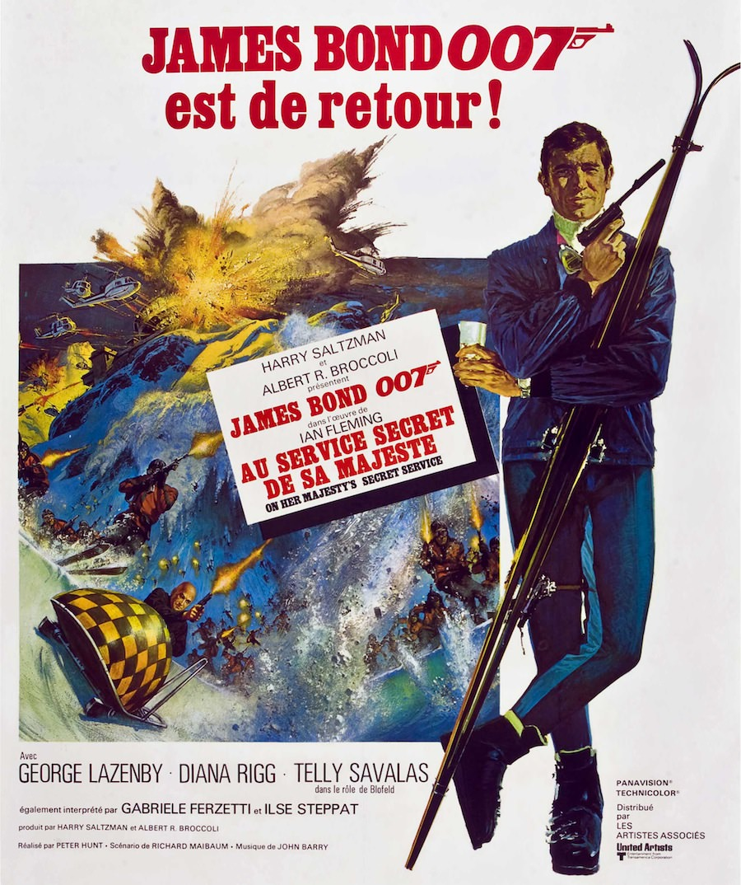
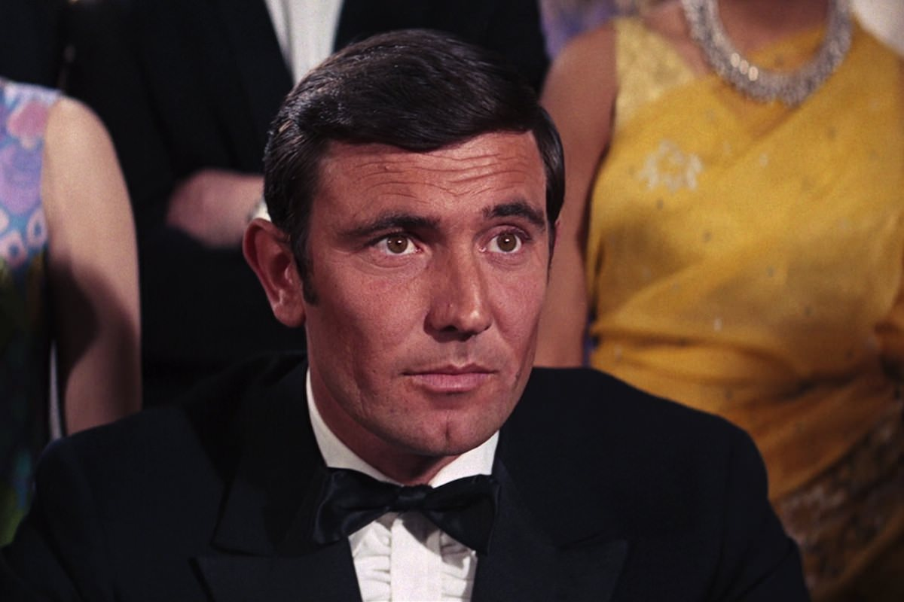
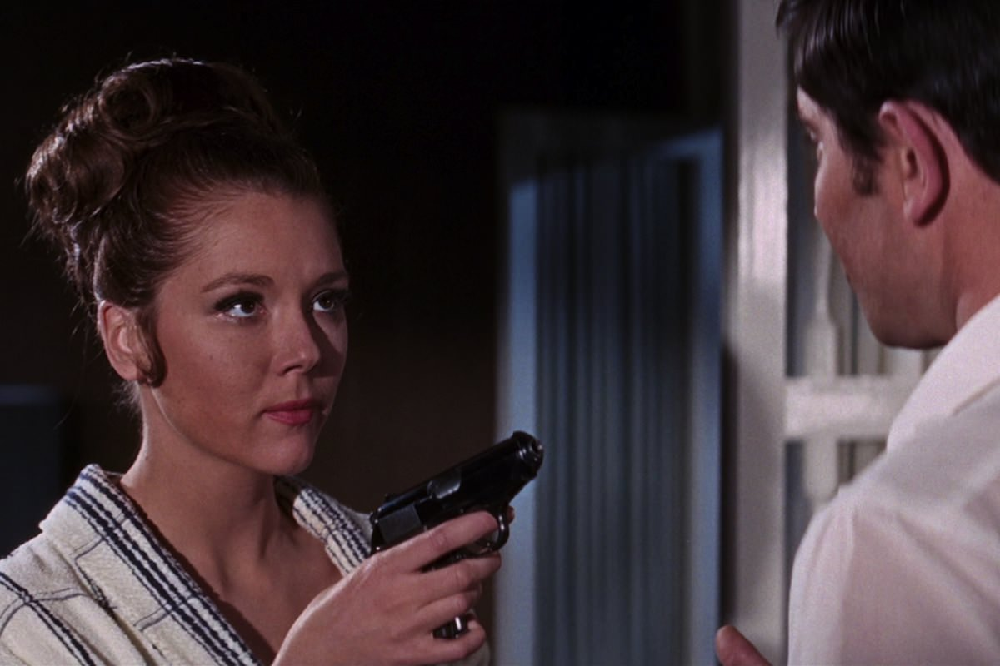

+++
type = "post"
titre = "<em>Au service secret de sa Majesté</em>, Peter Hunt"
title = "Au service secret de sa Majesté, Peter Hunt"
url = "/au-service-secret-de-sa-majeste-hunt"
date = "2013-01-27T15:17:36"
Lastmod = "2013-05-11T09:54:23"
cover = "au-service-secret-de-sa-majeste-hunt-lazenby.jpg"
categorie = [ "À voir" ]
tag = [ "Action", "Amour", "Blockbuster", "Espionnage", "James Bond" ]
createur = [ "Peter Hunt" ]
acteur = [ "Diana Rigg", "George Lazenby", "Telly Savalas" ]
annee = [ "1969" ]
weight = 1969
saga = [ "James Bond" ]
original = "On Her Majesty's Secret Service"

+++

Lancée sept ans auparavant, la saga <em>James Bond</em> s’est durablement installée dans l’imaginaire collectif et dans le succès. Chaque film remporte un énorme succès populaire et ce n’est pas la réussite d’<a href="http://voiretmanger.fr/2013/01/20/on-ne-vit-que-deux-fois-gilbert/" title="On ne vit que deux fois, Lewis Gilbert - À voir et à manger"><em>On ne vit que deux fois</em></a> qui vient inverser la tendance. <em>Au service secret de sa Majesté</em> est pourtant le premier épisode de rupture dans la saga. Une rupture qui n’est pas vraiment désirée par les producteurs, mais imposée par le départ de Sean Connery. L’acteur ne souhaite plus interpréter l’agent secret, il faut lui trouver un successeur, ce qui est évidemment plus simple à dire qu’à faire. Le sixième <em>James Bond</em> ne se contente pas de changer son acteur principal pourtant : Peter Hunt fait le pari risqué à l’époque du réalisme, une préoccupation qui offre au film une modernité bienvenue, même s’il reste imparfait. 

Sean Connery parti du projet, les producteurs pensent le remplacer facilement avec un nouvel acteur. James Bond a un nouveau visage, mais dans l’esprit du public, c’est l’acteur écossais qui reste associé au personnage. George Lazenby, jeune acteur australien, a beau ressembler un petit peu à son prédécesseur — c’est d’ailleurs pour cette raison qu’il est embauché —, il reste très différent et c’est un agent secret différent qu’il compose également. <em>Au service secret de sa Majesté</em> commence justement par un clin d’œil assez appuyé aux cinq films qui le précèdent : après un combat sur la plage, James Bond se tourne vers la caméra et lance, sous la forme d’un aparté, « <em>Ce n’est jamais arrivé à l’autre type.</em> » Un clin d’œil à Sean Connery bien sûr, mais Peter Hunt entend aussi préciser d’entrée de jeu que son agent secret n’est pas exactement comme le précédent. De fait, George Lazenby est un James Bond plus jeune — il n’a pas trente ans quand il tourne le film —, moins macho avec les femmes, mais aussi plus fragile et même amoureux au point de vouloir se marier. <em>Au service secret de sa Majesté</em> l’entoure malgré tout de filles, mais ce n’est plus comme avant, l’agent est plus attentionné et moins pressant. Autre indice, il semble touché par les attentions de Moneypenny, la secrétaire qui aimerait tant être aimée par 007, et il se permet même de lui offrir un baiser. C’est ainsi peut-être le premier <em>James Bond</em> romantique, avec d’ailleurs quelques scènes un peu trop dégoulinantes qui semblent hésiter avec la parodie, sans toutefois y adhérer complètement. 

Autre différence majeure, <em>Au service secret de sa Majesté</em> fait le pari de retirer les gadgets au profit d’une action plus réaliste. Les gadgets de l’agent secret ne sont pas totalement absents, mais ils n’apparaissent que sous la forme d’un clin d’œil aux précédents films. Quand James Bond range son bureau du MI6, il tombe sur l’appareil pour respirer sous l’eau d’<a href="http://voiretmanger.fr/2013/01/13/operation-tonerre-young/" title="Opération Tonnerre, Terence Young - À voir et à manger"><em>Opération Tonnerre</em></a> ou sur la montre avec corde à piano de <a href="http://voiretmanger.fr/2012/12/30/bons-baisers-russie-young/" title="Bons baisers de Russie, Terence Young - À voir et à manger"><em>Bons baisers de Russie</em></a>. Il ne garde pas ces gadgets toutefois et il part en mission les mains vides, sans passer par le débriefing de Q. De même, si James Bond roule encore en Aston Martin, sa <a href="http://en.wikipedia.org/wiki/Aston_Martin_DBS">DBS</a> n’est pas modifiée avec des gadgets, c’est un modèle de base qui ne fait rien de spécial et qui ne lui servira de toute manière que le temps du pré-générique, ou presque. <em>Au service secret de sa Majesté</em> oblige son personnage à se débrouiller seul : pour sortir d’une pièce par exemple, l’agent va bricoler un outil avec ce qui lui tombe sous la main, alors que l’on imagine qu’il ne serait pas parti sans le bon gadget dans les précédents films. Dans le même ordre d’idée, Peter Hunt filme ses combats de manière beaucoup plus réaliste et son agent secret est souvent mis en difficulté par ses adversaires, alors qu’il avait un peu tendance à gagner par principe dans les précédents. 

Pour appuyer ce renouvellement, on ne pouvait sans doute pas trouver mieux que le scénario d’<em>Au service secret de sa Majesté</em>. Basé sur le premier roman de Ian Flemming publié après la première apparition du personnage au cinéma, il a la bonne idée de mettre dès le départ l’agent secret en difficulté. Avant un combat sur une plage, Peter Hunt ouvre son long-métrage sur une scène au sein du MI6. On y retrouve un M très inquiet : il ne sait pas où est son agent et il s’inquiète de le retrouver. Quand 007 arrive enfin, un accueil glacial l’attend : son patron veut le retirer de l’affaire en cours pour incompétence. Froissé, James Bond veut demander sa démission et le reste du film se fait finalement hors du MI6. Cette idée apporte beaucoup de fragilité au personnage, c’est justement parce qu’il ne travaille pas officiellement pour le gouvernement britannique qu’il n’a pas les gadgets habituels et qu’il ne peut compter que sur lui-même. <em>Au service secret de sa Majesté</em> ne repose d’ailleurs sur aucune intrigue parfaitement définie, même si on retrouve vite le SPECTRE en guise de méchant, mais le plan du groupe n’a pas tellement d’importance finalement. James Bond part en Suisse pour son enquête en se faisant passer pour un spécialiste en généalogie qui se fait vite démasquer, mais la résolution de l’intrigue importe assez peu. Peter Hunt est assez moderne avec cette intrigue, mais c’est un facteur incontestable dans l’absence de succès populaire. Par rapport à ses prédécesseurs, <em>Au service secret de sa Majesté</em> est moins explicite, plus flou dans son déroulement, ce qui n’est pas nécessairement une mauvaise chose, mais qui a été mal compris.

<em>Au service secret de sa Majesté</em> n’est peut-être pas le plus flamboyant des <em>James Bond</em>, mais il est en revanche très spectaculaire, surtout pour l’époque. À sa sortie, fin 1969, on n’avait jamais vu des scènes d’action filmées ainsi, avec un montage très rapide qui alterne les points de vue en permanence pour produire plus d’effets. Peter Hunt n’a jamais réalisé de film quand il s’attaque à celui-ci, mais il a monté tous les épisodes précédents. Le montage est justement son point fort : le découpage des scènes d’action marque les esprits et on retrouve quelque chose de très moderne, que l’on a l’habitude de voir aujourd’hui dans tous les gros films d’action. C’est particulièrement visible pendant les scènes de ski, très impressionnantes<a href="#footnote_0_8384" id="identifier_0_8384" class="footnote-link footnote-identifier-link" title="Elles auraient m&ecirc;me inspir&eacute; Christopher Nolan pour ses propres sc&egrave;nes &agrave; ski dans Inception&hellip;">1</a>, même si la technique de la nuit américaine n’était vraiment pas au point. Nonobstant cette technique défaillante, ces plans ont étonnamment bien vieilli et ils justifient à eux seuls de regarder <em>Au service secret de sa Majesté</em>. On n’en dira pas autant des scènes où l’agent est censé être amoureux, des scènes qui passent assez mal. George Lazenby est sans doute responsable : le jeune acteur peine à convaincre, surtout après son si charismatique prédécesseur. Il n’est guère surprenant, dès lors, que Sean Connery fasse son retour dès le film suivant et que celui-ci s’arrête à un film. Si l’acteur du rôle principal ne séduit pas totalement, Dania Rigg est excellente dans le rôle de la James Bond girl, tandis que Telly Savalas est très bien dans le rôle du méchant. 

Épisode à part, <em>Au service secret de sa Majesté</em> séduit précisément pour cette raison : il ne ressemble pas à un <em>James Bond</em>. Alors que la saga s’orientait vers sa tendance générale, pleine de gadgets et avec un personnage principal quasiment superhéros, Peter Hunt filme un agent secret très humain, fragile et amoureux. Son film n’est pas sans défaut, on reste notamment très sceptique sur la partie romance, mais <em>Au service secret de sa Majesté</em> mérite malgré tout de s’y intéresser.

<strong>James Bond reviendra dans… <a href="http://voiretmanger.fr/2013/02/03/les-diamants-sont-eternels-hamilton/" title="Les diamants sont éternels, Guy Hamilton"><em>Les diamants sont éternels</em></a></strong>

<h3>Vous voulez m’aider ?<a href="#footnote_1_8384" id="identifier_1_8384" class="footnote-link footnote-identifier-link" title="&Agrave; propos de la publicit&eacute;&hellip;">2</a></h3>
<ul>
<li><a href="http://www.amazon.fr/gp/product/B00AOALX7A/ref=as_li_ss_tl?ie=UTF8&#038;tag=leblogdenic07-21&#038;linkCode=as2&#038;camp=1642&#038;creative=19458&#038;creativeASIN=B00AOALX7A">Acheter le film en Blu-Ray sur Amazon</a></li>
<li><a href="http://www.amazon.fr/gp/product/B000NJM5SI/ref=as_li_ss_tl?ie=UTF8&#038;tag=leblogdenic07-21&#038;linkCode=as2&#038;camp=1642&#038;creative=19458&#038;creativeASIN=B000NJM5SI">Acheter le film en DVD sur Amazon</a></li>
<li><a href="https://itunes.apple.com/fr/movie/au-service-secret-sa-majeste/id561926438">Acheter ou louer le film sur l’iTunes Store</a></li>
</ul>
<ul>
<li><a href="http://www.amazon.fr/gp/product/B008U6R9B4/ref=as_li_ss_tl?ie=UTF8&amp;tag=leblogdenic07-21&amp;linkCode=as2&amp;camp=1642&amp;creative=19458&amp;creativeASIN=B008U6R9B4">Acheter la trilogie complète en Blu-Ray sur Amazon</a></li>
<li><a href="http://www.amazon.fr/gp/product/B008U6R93C/ref=as_li_ss_tl?ie=UTF8&amp;tag=leblogdenic07-21&amp;linkCode=as2&amp;camp=1642&amp;creative=19458&amp;creativeASIN=B008U6R93C">Acheter la trilogie complète en DVD sur Amazon</a></li>
</ul>

<ol class="footnotes"><li id="footnote_0_8384" class="footnote">Elles auraient même inspiré Christopher Nolan pour ses propres scènes à ski dans <a href="http://voiretmanger.fr/2010/07/17/inception-nolan/" title="Inception, Christopher Nolan - À voir et à manger"><em>Inception</em></a>… [<a href="#identifier_0_8384" class="footnote-link footnote-back-link">&#8617;</a>]</li><li id="footnote_1_8384" class="footnote"><a href="http://voiretmanger.fr/soutien/">À propos de la publicité…</a> [<a href="#identifier_1_8384" class="footnote-link footnote-back-link">&#8617;</a>]</li></ol>
