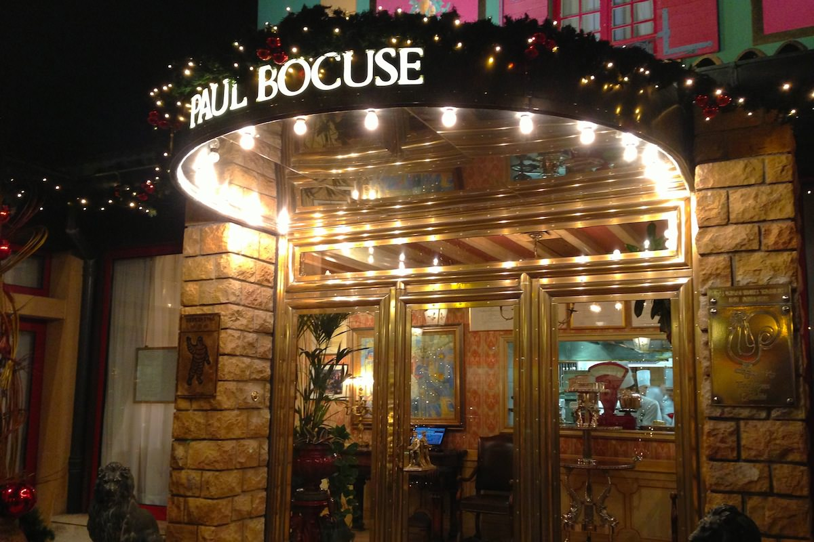
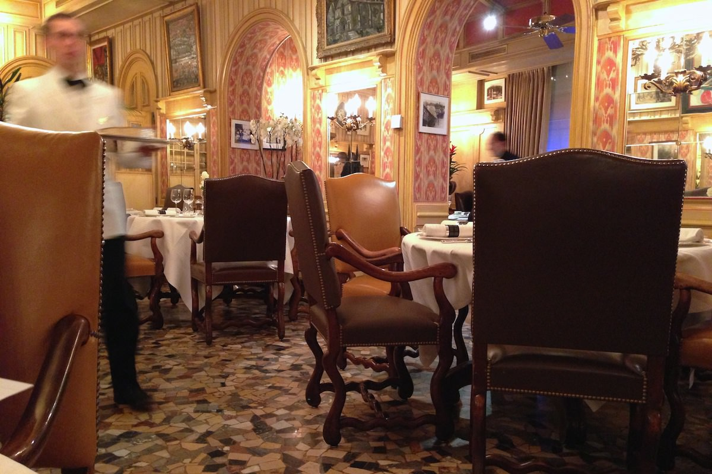
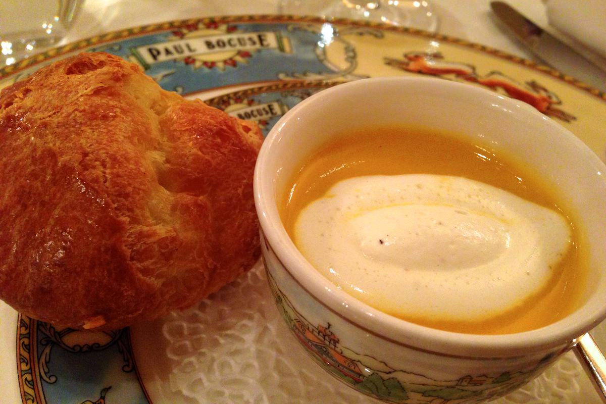
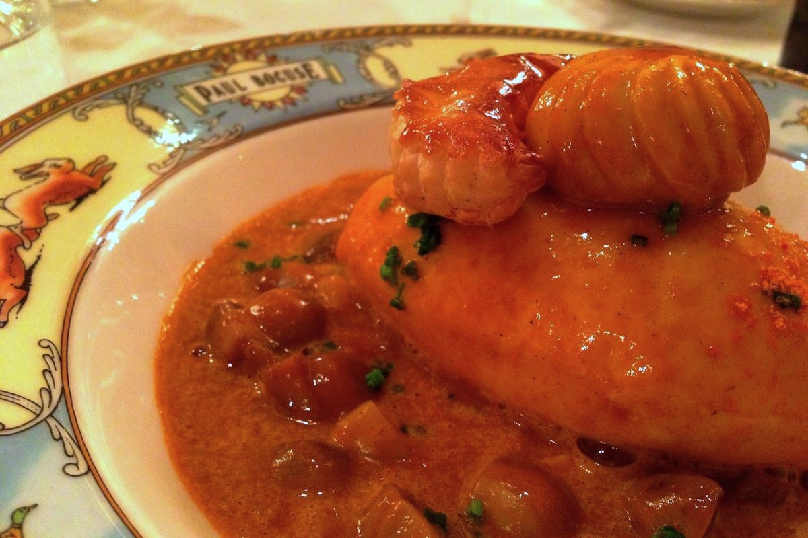
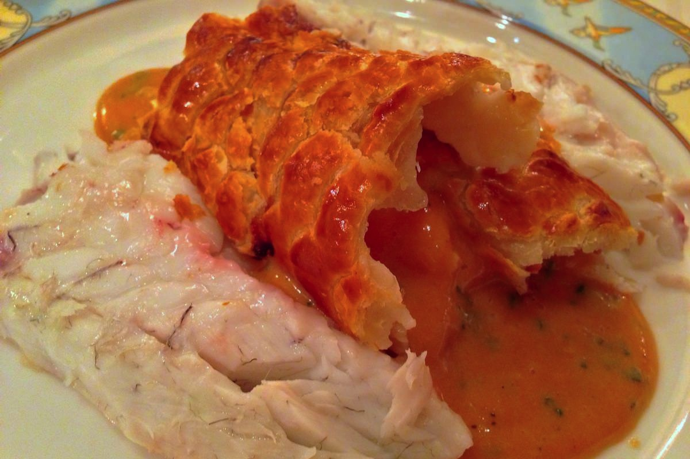
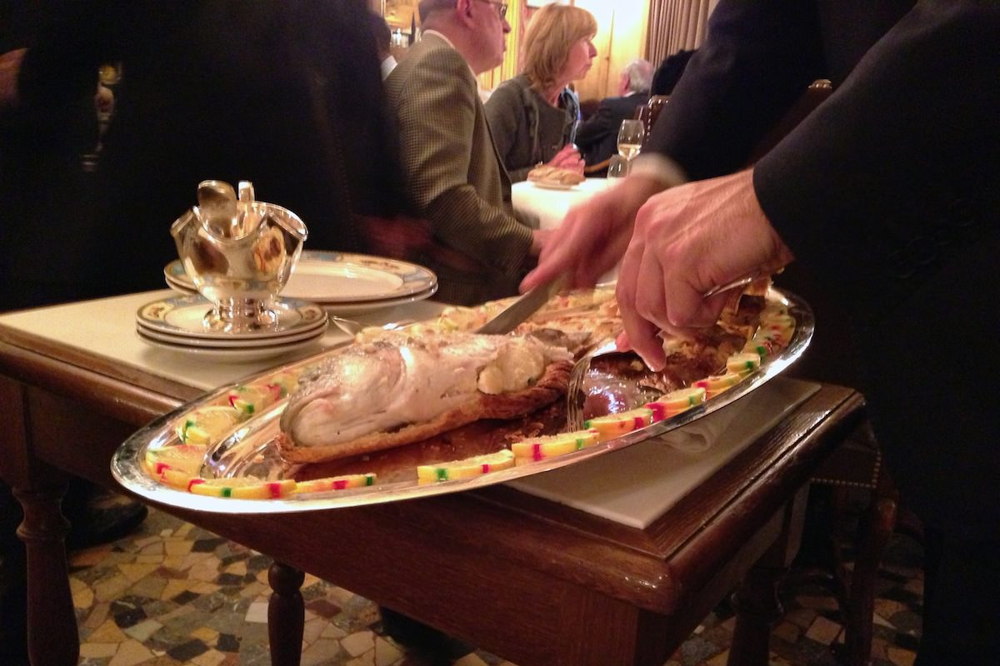
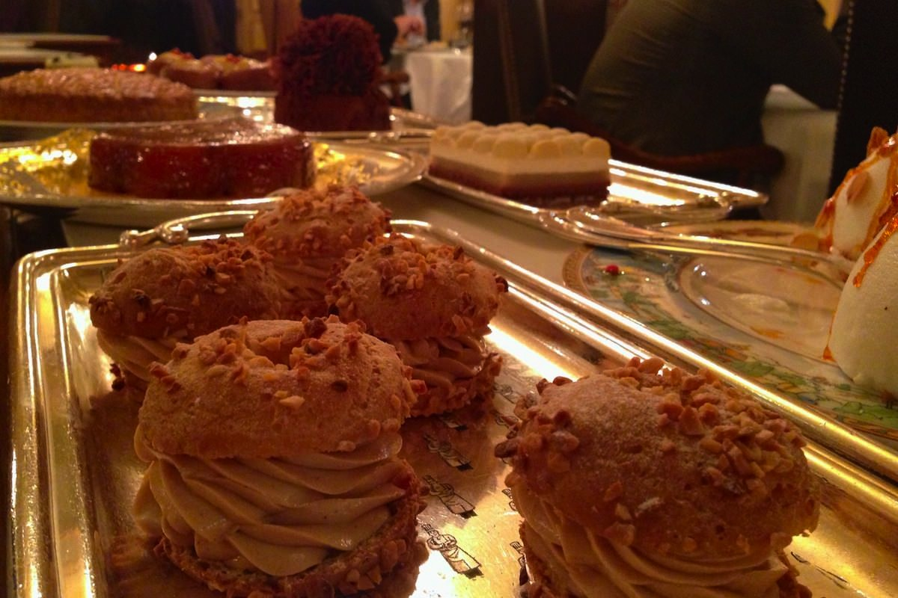

+++
type = "post"
titre = "L&rsquo;Auberge du Pont de Collonges, à Collonges au Mont d&rsquo;Or (Paul Bocuse)"
title = "L'Auberge du Pont de Collonges, à Collonges au Mont d'Or (Paul Bocuse)"
url = "/auberge-pont-collonges-bocuse"
date = "2013-01-04T00:51:51"
Lastmod = "2015-03-15T00:37:04"
cover = "paul-bocuse-auberge-pont-collonges.jpg"
categorie = [ "À manger" ]
tag = [ "69660", "Cuisine française", "Cuisine régionale", "Cuisine traditionnelle", "Trois étoiles Guide Michelin" ]

+++

Paul Bocuse a obtenu trois étoiles au fameux Guide Michelin en 1965 et il ne les a jamais perdues depuis. &laquo;&nbsp;Cuisinier du siècle&nbsp;&raquo; et &laquo;&nbsp;Pape de la cuisine&nbsp;&raquo; selon le Gault-Millau, son palmarès impressionne encore aujourd&rsquo;hui. Comme tous les grands chefs cuisiniers, Paul Bocuse a multiplié ses restaurants et ses activités, mais c&rsquo;est à Collonges au Mont d&rsquo;Or, à une dizaine de kilomètres de Lyon, que se situe son établissement d&rsquo;origine et le plus prestigieux. Manger à <a href="http://www.bocuse.fr/auberge-collonges.aspx"><strong>L&rsquo;Auberge du Pont de Collonges</strong></a>, c&rsquo;est un voyage dans le temps, de la décoration d&rsquo;époque à la cuisine, dans le plus grand respect de la tradition française. Un voyage qui n&rsquo;est pas donné, mais un voyage qui mérite d&rsquo;être fait si vous en avez l&rsquo;occasion et les moyens…

Le restaurant se voit de loin. Quand on vient de Lyon déjà, les seuls panneaux indicateurs que l&rsquo;on croisera sur la route qui longe la Saône n&rsquo;est pas pour préciser la distance avant Collonges au Mont d&rsquo;Or, mais celle qui vous sépare encore de Paul Bocuse, c&rsquo;est dire l&rsquo;importance du lieu. En approchant, vous ne pourrez pas passer à côté de <strong>L&rsquo;Auberge du Pont de Collonges</strong>, grande bâtisse colorée surmontée d&rsquo;un énorme panneau &laquo;&nbsp;Paul Bocuse&nbsp;&raquo;. La maison est très colorée et évoque plus un décor de théâtre qu&rsquo;un grand restaurant. L&rsquo;ensemble, délicieusement désuet, est en parfait accord avec la réputation de la cuisine de Bocuse et ce n&rsquo;est pas la majestueuse entrée à l&rsquo;ancienne, où l&rsquo;on devine sans difficulté un tapis rouge et où les dorures dominent, qui fait mentir cette première approche. En entrant, vous n&rsquo;entrez pas dans n&rsquo;importe quel restaurant. On vient immédiatement vous prendre en charge et déjà le nombre d&rsquo;employés impressionne, tandis que l&rsquo;on voit la brigade au grand complet s&rsquo;affairer dans les cuisines, juste derrière une vitre.

<blockquote class="pull-quote">
Déjeuner à Collonges, c’est un peu aller au cirque sous le plus grand chapiteau du monde : le spectacle est total, les artistes connaissent leurs acrobaties sur le bout des doigts, les numéros sont réglés au millimètre et à la seconde près.<cite class="author"> — Site officiel du restaurant</cite>

</blockquote>

Le site officiel du restaurant parle de cirque et de fait, il règne une étrange ambiance à l&rsquo;intérieur de <strong>L&rsquo;Auberge du Pont de Collonges</strong>. La salle est décorée à l&rsquo;ancienne, de la tapisserie chargée au mur jusqu&rsquo;au sol et sa mosaïque, en passant par les lourdes chaises autour des tables rondes et des lustres dorés un peu partout ; un décor assez kitsch aujourd&rsquo;hui, très chargé, mais qui a son charme. À l&rsquo;intérieur, c&rsquo;est effectivement un ballet constant d&rsquo;hommes (jamais de femmes…) en noir et en blanc. Ils portent de lourds plateaux d&rsquo;argent, remplissent les verres qui commencent à se vider, débarrassent les tables, servent les différents plats… cela n&rsquo;arrête jamais. Jusqu&rsquo;à soixante personnes officient chaque soir dans le restaurant et cela se sent, même si l&rsquo;ambiance générale reste plutôt calfeutrée et confortable. <strong>L&rsquo;Auberge du Pont de Collonges</strong> est astucieusement découpée en petites salles, si bien que l&rsquo;on n&rsquo;a jamais l&rsquo;impression d&rsquo;être dans un trop gros restaurant. Les invités peuvent se révéler bruyants bien sûr, mais l&rsquo;ambiance était plutôt calme ce soir-là. Les va-et-viens permanents du personnel peuvent gêner, mais il faut malgré tout noter que le service, bien que très respectueux des traditions, n&rsquo;est jamais guindé et on peut discuter librement avec les serveurs, un bon point pour un repas agréable.

Chez Paul Bocuse, le ticket d&rsquo;entrée pour un repas complet est de 160 €, sans boisson. C&rsquo;est le prix du premier menu, dit &laquo;&nbsp;<a href="/wp-content/2013/01/201501-FR_03-MENU_CLASSIQUE.pdf">Classique</a>&nbsp;&raquo; et qui se compose d&rsquo;une entrée et d&rsquo;un plat, suivi des plateaux de fromages et desserts. Si votre appétit et votre porte-monnaie l&rsquo;autorisent, vous pouvez aussi opter pour le menu &laquo;&nbsp;<a href="/wp-content/2013/01/201501-FR_02-MENU_BOURGEOIS.pdf">Bourgeois</a>&nbsp;&raquo; avec un plat de plus (210 €), voire pour le menu &laquo;&nbsp;<a href="/wp-content/2013/01/201501-FR_01-MENU_GRANDE_TRADITION.pdf">Grande tradition</a>&nbsp;&raquo; qui est composé de pas moins de sept éléments pour 250 € par personne. Les prix sont évidemment très élevés, bien que dans la moyenne basse pour une adresse triplement étoilée. Si l&rsquo;argent n&rsquo;est pas un problème, le choix devra se faire sur le nombre de plats : le menu classique n&rsquo;a beau comporter &laquo;&nbsp;que&nbsp;&raquo; quatre éléments, il est déjà extrêmement complet et les petits appétits auront de la peine à le finir sans sauter une étape (le fromage est certainement la plus simple à éviter). Quant au menu le plus complet, mieux vaut ne pas avoir mangé depuis un jour ou deux pour en venir à bout, et avoir un grand appétit. Ces prix sont déjà élevés, mais il faut encore ajouter le vin — difficile de trouver une bouteille à moins de 100 € — pour un total assurément déraisonnable sur le papier. Le décor n&rsquo;est pas anodin, mais on vient à <strong>L&rsquo;Auberge du Pont de Collonges</strong> d&rsquo;abord et avant tout pour manger : la qualité est-elle à la hauteur de ces tarifs ?

Sans hésiter, la réponse est : oui. Difficile de savoir si la cuisine de Paul Bocuse vaut les prix qu&rsquo;il demande, mais elle vaut en tout cas le détour tant les produits sont d&rsquo;excellente qualité, et surtout sont travaillés d&rsquo;une manière exceptionnelle. Prenez la quenelle de brochet aux écrevisses par exemple, un classique de la cuisine lyonnaise que n&rsquo;importe quel bouchon sert. Vous n&rsquo;avez jamais mangé une quenelle comme celle qui est servie ici néanmoins : en plus d&rsquo;être parfaitement gonflée et techniquement irréprochable, c&rsquo;est son fumet qui surprend. Accompagnée d&rsquo;une sauce qui a vraiment le goût d&rsquo;écrevisse, elle compose une entrée vraiment excellente, tout en douceur et en caractère (ci-dessus). La marmite de homard qui peut faire également office d&rsquo;entrée est très caractérisée, avec un goût iodé remarquable. Par la suite, les plats continuent d&rsquo;impressionner par leurs saveurs, en particulier le fameux loup en croûte feuilletée sauce Choron du chef, un vrai délice (ci-dessous). <strong>L&rsquo;Auberge du Pont de Collonges</strong> propose une cuisine qui n&rsquo;est simple que sur le papier : dans l&rsquo;assiette, le travail sur les saveurs est remarquable et on redécouvre certains classiques que l&rsquo;on croyait connaître sur le bout des doigts.

<strong>L&rsquo;Auberge du Pont de Collonges</strong> sert à la russe, c&rsquo;est-à-dire à table. Si vous commandez le loup, c&rsquo;est le poisson entier qui arrive à votre table et les serveurs le préparent pour le disposer dans vos assiettes sous vos yeux. Ce sera la même chose que vous commandiez une volaille (celle cuisinée dans une vessie de porc, une autre spécialité de la maison, est impressionnante à regarder), un carré d&rsquo;agneau ou une côte de veau. Le spectacle est amusant et les serveurs se laissent volontiers prendre en photo pendant l&rsquo;opération, mais c&rsquo;est aussi un moyen de valoriser le produit avant tout. Ce qui caractérise la grande cuisine, c&rsquo;est d&rsquo;abord un grand produit qui bénéficie d&rsquo;une préparation optimale<a href="#fn-8237-1" rel="footnote">1</a> et de voir ainsi votre poisson arriver entier et préparé sous vos yeux est le meilleur gage de sa qualité. Ce n&rsquo;est pas aussi époustouflant que la cuisine moléculaire, certes, mais le résultat est au rendez-vous dans l&rsquo;assiette, avec des saveurs incomparables.

Quand arrivent les fromages, puis les desserts, l&rsquo;estomac commence déjà à avoir de la peine. Loin de la cuisine moderne où les quantités sont souvent très réduites, <strong>L&rsquo;Auberge du Pont de Collonges</strong> propose des proportions dignes de la Belle Époque. La cuisine de Paul Bocuse n&rsquo;est pas connue pour sa légèreté et le chef ne lésine ni sur le beurre, ni sur la crème. En bouche, l&rsquo;intérêt est évident, mais l&rsquo;impact sur un régime est tout aussi indéniable. Il serait dommage, pourtant, de passer à côté des fromages &laquo;&nbsp;Mère Richard&nbsp;&raquo; (célèbre fromagerie lyonnaise) tous à point et goûteux, ou de l&rsquo;énorme choix de desserts. Là encore, pas d&rsquo;inventivité folle, mais des classiques parfaitement maîtrisés, du Paris-Brest au baba au rhum, en passant par la tarte tatin où une étonnante île flottante que nous n&rsquo;avons malheureusement pas eu le courage de goûter. 

Manger à <strong>L&rsquo;Auberge du Pont de Collonges</strong>, c&rsquo;est choisir une cuisine traditionnelle, loin des expérimentations actuelles. Un choix rétrograde assumé, pour des plats parfaitement maîtrisés, à l&rsquo;image de la célèbre soupe aux truffes créée par Paul Bocuse pour Valéry Giscard d&rsquo;Estaing en… 1975 ! Ne venez pas y découvrir de nouvelles sensations, n&rsquo;y cherchez pas une cuisine audacieuse qui mêle goûts et textures dans l&rsquo;assiette, mais vous trouverez des plats bien connus, mais que vous découvrirez à nouveau avec ces versions parfaites, tout simplement. On peut trouver que c&rsquo;est cher pour ce que c&rsquo;est, et il est vrai que l&rsquo;on paye aussi le décor, les trois étoiles et le nom, la marque Bocuse même, même si le chef fait encore l&rsquo;effort de venir saluer chaque table avant le service. Si votre budget est limité, on recommandera plutôt de petits restaurants comme <a href="/2011/10/23/au-14-fevrier-lyon/" title="Au 14 février, Lyon - À voir et à manger"><strong>Au 14 février</strong></a> à Lyon, ou <a href="/2012/03/25/imaginaire-brest/" title="L'Imaginaire à Brest - À voir et à manger"><strong>L&rsquo;Imaginaire</strong></a> à Brest qui proposent une cuisine plus inventive et plus intéressante peut-être, pour des prix beaucoup plus raisonnables. Reste que l&rsquo;expérience proposée par <strong>L&rsquo;Auberge du Pont de Collonges</strong> est incomparable, tant pour le cadre que pour la cuisine. Si on vous invite ou que vous pouvez vous l&rsquo;offrir, n&rsquo;hésitez pas, c&rsquo;est une expérience que vous n&rsquo;oublierez pas…

<ol>
<li id="fn-8237-1">
Ce que j&rsquo;avais eu l&rsquo;occasion de comprendre le temps d&rsquo;un <a href="/2008/10/26/stage-ducasse-1/">stage chez Ducasse</a>, autre grand nom de la gastronomie française.&#160;<a href="#fnref-8237-1" rev="footnote">&#8617;</a>
</li>
</ol>

