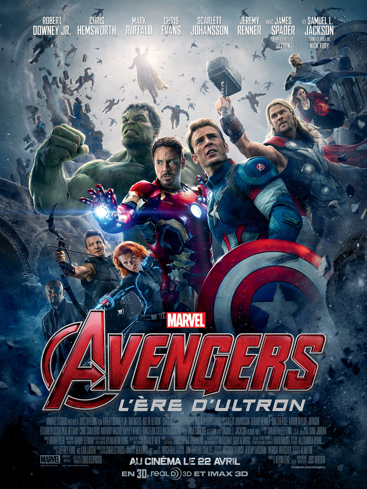
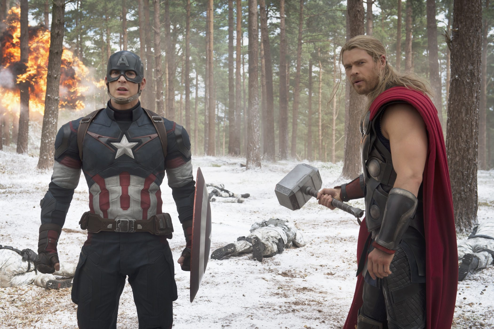
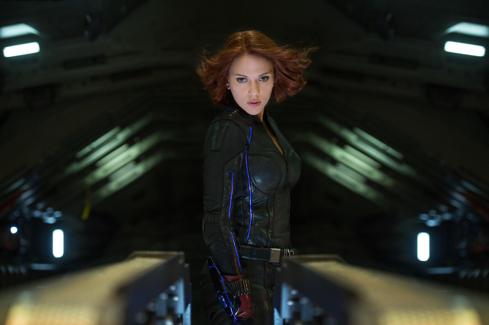

+++
titre = "<em>Avengers : L&rsquo;Ère d&rsquo;Ultron</em>, Joss Whedon"
title = "Avengers : L'Ère d'Ultron, Joss Whedon"
url = "/avengers-ere-ultron-whedon"
date = "2015-04-26T17:35:30"
Lastmod = "2015-04-27T11:15:53"
cover = "avengers-ere-ultron-robert-downey-jr.jpg"
categorie = [ "À voir" ]
tag = [ "Action", "Adaptation bande-dessinée", "Blockbuster", "Comics", "Intelligence artificielle", "Science-Fiction", "Sorties du mois", "Superhéros" ]
createur = [ "Joss Whedon" ]
acteur = [ "Aaron Taylor-Johnson", "Chris Evans", "Chris Hemworth", "Elizabeth Olsen", "Jeremy Renner", "Mark Ruffalo", "Robert Downey Jr", "Samuel L Jackson", "Scarlett Johansson" ]
annee = [ "2015" ]
weight = 2015
saga = [ "Avengers" ]
pays = [ "États-Unis" ]
original = "Avengers: Age of Ultron"

+++

La <a href="http://voiretmanger.fr/saga/avengers/">saga des <em>Avengers</em></a> est si complexe qu&rsquo;elle a été divisée en plusieurs phases. Comme la première se terminait avec un long-métrage qui rassemblait tous les superhéros, nommé <a href="http://voiretmanger.fr/avengers-whedon/" title="Avengers, Joss Whedon"><em>Avengers</em></a>, la deuxième phase se conclut elle aussi sur un film de rassemblement. Joss Whedon est à nouveau au rendez-vous pour <em>Avengers : L&rsquo;Ère d&rsquo;Ultron</em>, après trois étapes intermédiaires de préparation concentrées sur Iron Man, Thor et Captain America. Cette fois, les superhéros se retrouvent et ils affrontent une nouvelle menace encore plus terrible que toutes les précédentes, comme sil se doit. Le résultat est un blockbuster de près de 2h30 comme seul Hollywood sait les faire : on ne s&rsquo;ennuie jamais, on en prend plein la vue avec ce divertissement de haute volée. Plus sérieux que son prédécesseur, le film n&rsquo;oublie pas les pointes de second degré qui ont fait son succès et si vous aimez le genre, vous ne devriez pas être déçu. Vivement la phase 3 !

<em>Avengers : L&rsquo;Ère d&rsquo;Ultron</em> ne prend pas la peine de faire le lien avec ses prédécesseurs, il reprend immédiatement là où la saga s&rsquo;était arrêtée et plonge les spectateurs dans une scène de combat déjà très violente. Et contrairement à un James Bond par exemple, cette séquence n&rsquo;est pas séparée du reste puisque l&rsquo;intrigue principale se met immédiatement en place. On est plongé instantanément au cœur du nouveau film, et Jess Whedon ne nous laisse guère le temps de respirer. Autant dire que si vous n&rsquo;avez pas en mémoire, au moins vaguement, le combat contre les extra-terrestres d&rsquo;<em>Avengers</em>, l&rsquo;évolution du personnage de Tony Stark dans <a href="http://voiretmanger.fr/iron-man-3-black/" title="Iron Man 3, Shane Black"><em>Iron Man 3</em></a> ou encore le démantèlement du S.H.I.E.L.D. dans <a href="http://voiretmanger.fr/captain-america-soldat-hiver-russo/" title="Captain America : Le Soldat de l’hiver, Anthony et Joe Russo"><em>Captain America : Le Soldat de l’hiver</em></a><a href="#fn-13574-1" rel="footnote">1</a>, vous risquez de ne pas tout comprendre dans ce nouvel épisode. Ce n&rsquo;est pas forcément très gênant pour autant, car on est vite pris par la nouvelle intrigue déployée par Joss Whedon. On retrouve Hydra, l&rsquo;organisation qui s&rsquo;oppose aux gentils depuis les débuts de la saga, mais ce n&rsquo;est que le prélude au vrai méchant d&rsquo;<em>Avengers : L&rsquo;Ère d&rsquo;Ultron</em>. Son nom est donné par le titre, mais son identité reste un mystère, et pour cause. Après avoir joué la carte des entités extra-terrestres, la saga avance un autre classique de la science-fiction : l&rsquo;intelligence artificielle. Cet Ultron est une forme d&rsquo;IA très développée, créée par inadvertance par deux des superhéros, et qui prend sa mission — sauver l&rsquo;humanité de la guerre — un peu de travers. Les scénaristes n&rsquo;ont pas fait preuve de beaucoup d&rsquo;originalité en imaginant que cette intelligence considère que les humains sont incapables de maintenir la paix et décide par conséquent de les exterminer, mais ce classique de la SF n&rsquo;a pas pris une ride. Et Joss Whedon l&rsquo;amène plutôt bien, exploitant au passage l&rsquo;idée que cette intelligence s&rsquo;installe dans le monde entier par l&rsquo;internet. À l&rsquo;arrivée, on en revient à des combats entre les superhéros et des robots, c&rsquo;est vrai, mais on peut saluer l&rsquo;effort de renouvellement. Même si, au fond, tout ça n&rsquo;a pas trop d&rsquo;importance : l&rsquo;intrigue n&rsquo;est qu&rsquo;une excuse pour rassembler tous les superhéros, ce qui est vraiment la raison d&rsquo;être du film, comme de son prédécesseur.

Et à cet égard, il faut bien reconnaître que Joss Whedon fait très fort en ouvrant son film avec l&rsquo;attaque contre Hydra et sa forteresse fortifiée. Même si le S.H.I.E.L.D., l&rsquo;organisation qui rassemblait auparavant les Avengers, n&rsquo;est plus, les superhéros continuent le combat ensemble et ils sont tous là dans cette première séquence hivernale. Chacun a son rôle, ils avancent ensemble et peuvent compter les uns sur les autres. Comme le premier volet, <em>Avengers : L&rsquo;Ère d&rsquo;Ultron</em> prend bien soin de ne pas favoriser un héros par rapport à un autre. Les plus importants ont leur film spécifique, mais ici, tout le monde est sur un pied d&rsquo;égalité, même si tous ne sont pas aussi intéressants. La nouveauté, c&rsquo;est qu&rsquo;après cette première scène d&rsquo;union, les héros ne sont plus tous sur la même longueur d&rsquo;onde. Pendant le film, ils vont même s&rsquo;affronter plus d&rsquo;une fois et douter, plus que jamais, de leur raison d&rsquo;être. Pour cette raison, Joss Whedon signe un long-métrage plus sombre que le précédent, qui restait assez léger malgré l&rsquo;importance de la menace. Cette fois, le plus grand danger n&rsquo;est peut-être pas tant Ultron — qui sera battu, on le sait d&rsquo;emblée —, mais plutôt les superhéros eux-mêmes. Il y a Tony Stark et le docteur Banner qui travaillent de leur côté, sans prévenir les autres. Il y a Thor, qui part sans prévenir les autres, ni dire pour quoi faire. <em>Avengers : L&rsquo;Ère d&rsquo;Ultron</em> trouve une explication à certaines de ces dissensions avec le personnage de la Sorcière Rouge<a href="#fn-13574-2" rel="footnote">2</a>, mais on sent que ce n&rsquo;est pas la raison profonde de leur désaccord, tout au plus un élément déclencheur. Comme le Batman de Christopher Nolan, les superhéros doutent d&rsquo;eux-mêmes, un thème récurrent dans la saga, mais qui n&rsquo;avait jamais été autant mis en avant qu&rsquo;ici. Résultat, le film est plus sombre, mais sans oublier le second degré qui rendrait l&rsquo;ensemble indigeste. Il y a Tony Stark et son humour noir, mais tous les personnages y participent, y compris Captain America. Au-delà de cet humour que l&rsquo;on attendait, l&rsquo;accent porté sur l&rsquo;émotion, avec des couples qui se forment et des familles qui se dévoilent, est plus inattendu. Ce n&rsquo;est sans doute pas le point fort de Joss Whedon, il faut bien le dire, mais on peut apprécier l&rsquo;effort pour apporter une épaisseur psychologique à tous ces personnages improbables.

Joss Whedon en fait encore plus que dans <em>Avengers</em> et ce nouvel épisode est sans doute le plus spectaculaire de la saga. Conséquence logique, c&rsquo;est aussi celui qui va le plus loin dans le « n&rsquo;importe quoi » permanent, mais est-ce un défaut ? <em>Avengers : L&rsquo;Ère d&rsquo;Ultron</em> n&rsquo;est pas censé être réaliste et c&rsquo;est précisément parce qu&rsquo;il a conscience de sa bêtise qu&rsquo;il évite le piège de se prendre trop au sérieux. On s&rsquo;amuse beaucoup face à ce spectacle parfois si énorme qu&rsquo;on ne comprend pas toujours tout ce qui se passe, et c&rsquo;est bien là l&rsquo;essentiel. Joss Whedon n&rsquo;a pas d&rsquo;ambition démesurée, mais il signe un blockbuster prenant et plaisant, on n&rsquo;en demandait pas plus.

<ol>
<li id="fn-13574-1">
Et bien sûr, on apprenait avec <a href="http://voiretmanger.fr/thor-le-monde-des-tenebres-taylor/" title="Thor : Le Monde des Ténèbres, Alan Taylor"><em>Thor : Le Monde des Ténèbres</em></a>… euh rien de bien intéressant en fait. C&rsquo;était vraiment un épisode assez faible dans la saga.&#160;<a href="#fnref-13574-1" rev="footnote">&#8617;</a>
</li>
<li id="fn-13574-2">
<em>Avengers : L&rsquo;Ère d&rsquo;Ultron</em> ajoute non pas un, mais trois nouveaux superhéros à la saga, décidément très riche en la matière. Il y a donc les deux jumeaux Maximoff, mais aussi Vision, créé de toute pièce pendant le film. On frise l&rsquo;indigestion, mais le scénario et le réalisateur s&rsquo;en tirent étonnament bien.&#160;<a href="#fnref-13574-2" rev="footnote">&#8617;</a>
</li>
</ol>

