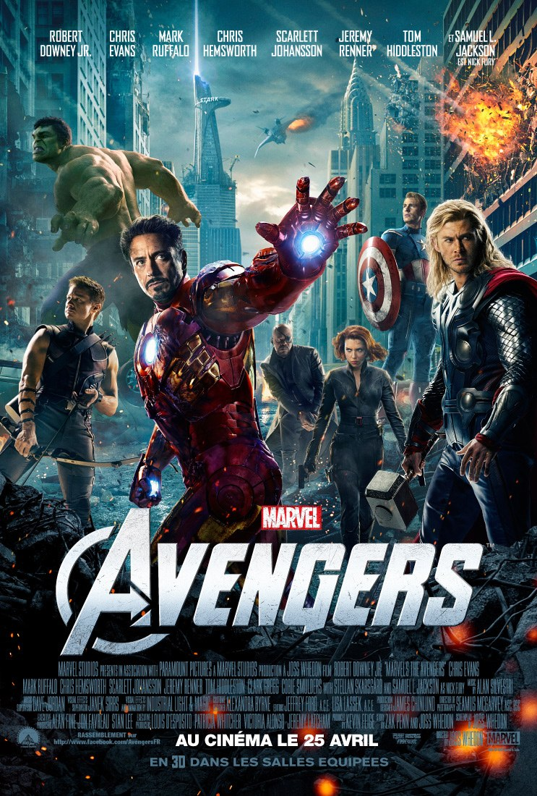
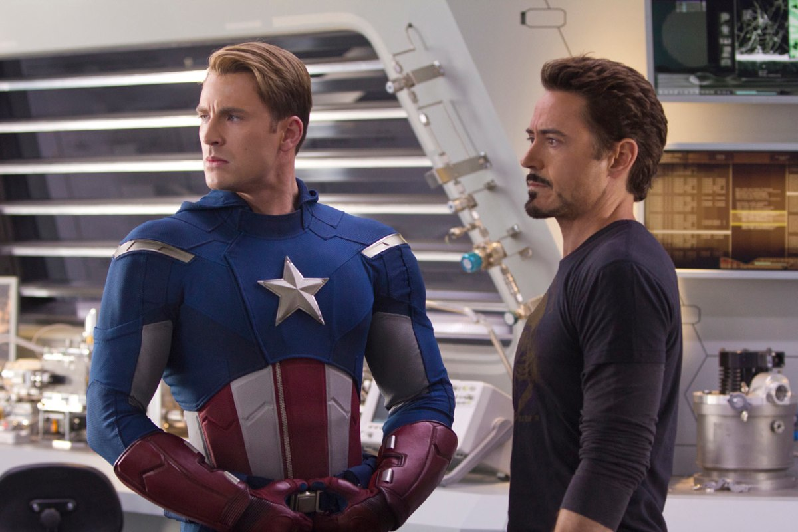
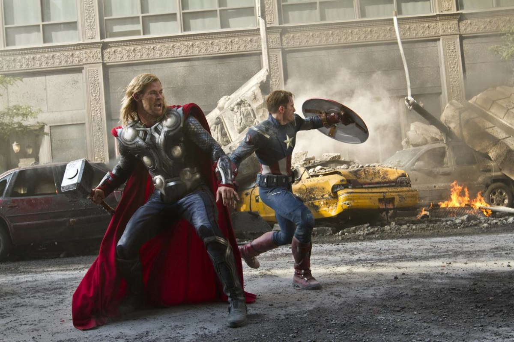

+++
type = "post"
titre = "<em>Avengers</em>, Joss Whedon"
title = "Avengers, Joss Whedon"
url = "/avengers-whedon"
date = "2012-04-26T00:52:21"
Lastmod = "2015-04-25T12:47:31"
cover = "the-avengers-whedon.jpg"
categorie = [ "À voir" ]
tag = [ "Action", "Blockbuster", "Comics", "Humour", "Superhéros" ]
createur = [ "Joss Whedon" ]
acteur = [ "Chris Evans", "Chris Hemworth", "Mark Ruffalo", "Robert Downey Jr", "Samuel L Jackson", "Scarlett Johansson" ]
annee = [ "2012" ]
weight = 2012
saga = [ "Avengers" ]
pays = [ "États-Unis" ]
original = "The Avengers"

+++

Il faut reconnaître aux studios Marvel un certain entêtement et de la suite dans les idées. Depuis <em><a href="http://voiretmanger.fr/2012/01/18/iron-man-favreau/">Iron Man</a></em> sorti en 2008, ils préparent patiemment la sortie de ce film, <em>Avengers</em> qui réunit sous la même affiche non pas un superhéros, mais une demi-douzaine. Même si ça n&rsquo;a peut-être pas été le cas, Marvel a donné le sentiment d&rsquo;avoir tout préparé à l&rsquo;avance en introduisant à la fin de chacun de ses films une scène qui introduit le suivant et en les parsemant d&rsquo;indices<a href="#fn-6310-1" rel="footnote">1</a>. Tous menaient à ce final qui s&rsquo;annonçait brillant… ou particulièrement décevant. Les deux films sortis l&rsquo;an dernier, <em><a href="http://voiretmanger.fr/2011/04/30/thor-branagh/">Thor</a></em> et <em><a href="http://voiretmanger.fr/2011/08/20/captain-america-first-avenger-johnston/">Captain America : First Avenger</a></em> n&rsquo;inspiraient pas vraiment confiance, mais Joss Whedon a réussi ce tour de force de faire tenir plein de superhéros dans un film sans le faire exploser. <em>Avengers</em> s&rsquo;avère finalement fun, très fun même et il place la barre très haute en matière d&rsquo;adaptation de comics. On en prend plein la vue, mais le film ne se prend jamais trop au sérieux… bref, <em>Avengers</em> est un blockbuster particulièrement réussi.

Vous pouvez entrer dans une salle pour voir <em>Avengers</em> sans avoir vu aucun des films de superhéros qui ont précédé ce grand rassemblement final. Ce serait toutefois rater une bonne partie du scénario qui risque bien de devenir totalement obscur… Disons-le, mieux vaut connaître les différents personnages qui composent le groupe des Avengers et pour cela, le plus simple est encore de commencer par les anciens films des studios Marvel. <em>Avengers</em> commence quand Loki — qui a comploté contre Thor, son frère, dans le film éponyme — attaque une base du SHIELD pour voler un cube bleu découvert dans <em>Captain America : First Avengers</em>. Cet objet n&rsquo;est pas anodin puisqu&rsquo;il s&rsquo;agit du Cube Cosmique, une source inépuisable d&rsquo;énergie capable d&rsquo;alimenter toute la planète en énergie… mais aussi de construire des armes surpuissances, ou encore d&rsquo;ouvrir des portails dans l&rsquo;espace-temps. C&rsquo;est justement cette fonction que cherche Loki : il veut asservir les humains en faisant attaquer la Terre par une force maléfique venue de l&rsquo;espace. Après ce vol, Nick Fury, le directeur du SHIELD, convoque tous les superhéros pour tenter de les faire travailler ensemble à retrouver le Cube et stopper Loki tout en sauvant la planète au passage. Difficile toutefois de faire travailler ensemble tous ces personnages aux caractères bien trempés et aux égos surdimensionnés…

<em>Avengers</em> ressemble d&rsquo;abord à un rêve de geek. Un film avec un superhéros, c&rsquo;est bien, mais un film avec plein de superhéros, c&rsquo;est mieux. Telle pourrait être la devise qui a présidé à la conception du film de Joss Whedon, même s&rsquo;il s&rsquo;agit bien sûr d&rsquo;abord de l&rsquo;adaptation d&rsquo;une série de comics. Tous ces héros que l&rsquo;on a pu découvrir séparément dans des films qui leur étaient entièrement consacrés sont ainsi tous réunis et ils combinent leurs forces pour former une entité invincible. L&rsquo;idée est séduisante, mais il fallait un scénario en béton et parfaitement maîtrisé pour éviter un effet best of. Les studios Marvel ne pouvaient sans doute pas mieux tomber qu&rsquo;avec Joss Whedon qui était scénariste avant de passer derrière la caméra. L&rsquo;homme est un habitué des films ou séries de science-fiction ou fantastique, voire des comics et on sent ici qu&rsquo;il aime tout particulièrement cet univers. Le scénario est incontestablement le point fort d&rsquo;<em>Avengers</em> : il est à la fois énorme, totalement dingue et parfaitement logique et maîtrisé. Ce qui surprend le plus, c&rsquo;est peut-être qu&rsquo;aucun superhéros n&rsquo;est privilégié par l&rsquo;histoire : chacun a son moment de gloire, mais <em>Avengers</em> a su éviter les pièges de l&rsquo;accumulation. Loin de la collection de cartes, Joss Whedon a su proposer un film cohérent où chaque personnage est à sa place et où aucun ne semble présent parce qu&rsquo;il devait l&rsquo;être.

Les superhéros sauvent le monde dans <em>Avengers</em>, c&rsquo;est bien le service minimum et à dire vrai, il ne s&rsquo;agit pas d&rsquo;un enjeu scénaristique fort. Même si le film sait ménager une véritable tension et même parfois un peu de suspense, il respecte aussi les codes du genre et les superhéros sortent victorieux contre des méchants forcément très méchants et moches. Joss Whedon a l&rsquo;intelligence de ne pas accorder trop d&rsquo;importance à ces aspects assez caricaturaux, de les considérer acquis et de se consacrer plutôt sur autre chose. <em>Avengers</em> est en l&rsquo;occurrence un film assez léger et même souvent drôle, de manière assez surprenante quand on le compare au sérieux de <em>Thor</em> ou de <em>Captain America : First Avenger</em>. Peut-être est-ce lié à la présence du sarcastique Iron Man, mais les superhéros sont tous ici traités avec dérision et Joss Whedon n&rsquo;oublie jamais une dose de second degré. Dans la bataille finale, alors que les humains sont au bord du gouffre, le personnage de Hulk notamment est l&rsquo;occasion de quelques rires bienvenus. La guerre des égos entre Captain America, Iron Man et Thor était déjà plus amusante que sérieuse et <em>Avengers</em> ménage ainsi quelques pauses détentes et évite au passage de se prendre trop au sérieux, ce qui est toujours une bonne idée quand on évoque des superhéros aux pouvoirs magiques. Un précepte que <em><a href="http://voiretmanger.fr/2011/11/29/green-lantern-campbell/">Green Lantern</a></em> aurait mieux fait de suivre…

S&rsquo;il est une chose que Joss Whedon prend au sérieux, c&rsquo;est bien l&rsquo;action et on peut dire que l&rsquo;on est servi par <em>Avengers</em>. Le film dure 2h20 et on ne voit pas une minute passer. Le cinéaste mène son scénario avec un rythme intense qui ne faiblit jamais : les scènes s&rsquo;enchaînent rapidement, sans jamais conduire à un film brouillon toutefois. Là encore, le scénario étant cohérent, le spectateur n&rsquo;est pas perdu et on suit avec plaisir ce film qui prend parfois des allures de feuilleton à l&rsquo;ancienne. Joss Whedon n&rsquo;est pas un maître de la mise en scène et <em>Avengers</em> n&rsquo;est pas un chef-d&rsquo;œuvre du septième art, mais ce n&rsquo;est pas du tout son ambition. Le film est très efficace et fun, c&rsquo;est bien tout ce que l&rsquo;on demande à un blockbuster. Le voir en salle est indispensable pour en prendre vraiment plein la vue : à bien des égards, <em>Avengers</em> est même assez jouissif avec tous ses superhéros qui unissent leurs forces. À une exception près, on retrouve des visages connus si l&rsquo;on a vu les précédents films des studios Marvel. Le personnage de Hulk, interprété ici par Mark Ruffalo, est une exception, les autres superhéros sont connus. Dans le lot, Robert Downey Jr. est toujours aussi efficace en Iron Man et la présence d&rsquo;autre superhéros l&rsquo;empêche de trop avancer en roue libre. Chris Evans et Chris Hemsworth interprètent toujours respectivement Captain America et Thor et ils ne sont pas bien plus passionnants, tandis que Scarlett Johansson ajoute une touche féminine bienvenue avec son rôle de Black Widow. Signalons enfin Nick Fury qui ne pouvait qu&rsquo;être interprété par Samuel L. Jackson : l&rsquo;acteur, égal à lui-même, en impose dans ce rôle.

À condition bien sûr d&rsquo;aimer les adaptations de comics et les superhéros, regarder <em>Avengers</em> est un peu l&rsquo;occasion d&rsquo;un retour en enfance. Joss Whedon a réussi à transmettre à l&rsquo;écran son enthousiasme pour ses personnages réunis ici comme le bouquet final d&rsquo;un feu d&rsquo;artifice. On en prend plein la vue, avec même une 3D plutôt bien utilisée, on rigole aussi parfois dans ce film qui ne se prend pas trop au sérieux. On passe donc un bon moment, et c&rsquo;est bien là l&rsquo;essentiel. Dans la veine légère des superhéros, <em>Avengers</em> atteint incontestablement le haut du panier et Marvel frappe fort cette année. Reste maintenant à attendre la réponse de DC Comics et de Christopher Nolan avec <a href="http://voiretmanger.fr/2012/07/25/dark-knight-rises-nolan/" title="The Dark Knight Rises, Christopher Nolan"><em>The Dark Knight Rises</em></a> cet été, dans la veine sérieuse.

<h3>Vous voulez <a href="http://voiretmanger.fr/soutien/">m&rsquo;aider</a> ?</h3>
<ul>
<li><a href="http://www.amazon.fr/gp/product/B00649LT06/ref=as_li_ss_tl?ie=UTF8&amp;tag=leblogdenic07-21&amp;linkCode=as2&amp;camp=1642&amp;creative=19458&amp;creativeASIN=B00649LT06">Acheter le film en Blu-ray sur Amazon</a></li>
<li><a href="http://www.amazon.fr/gp/product/B00649LSV6/ref=as_li_ss_tl?ie=UTF8&amp;tag=leblogdenic07-21&amp;linkCode=as2&amp;camp=1642&amp;creative=19458&amp;creativeASIN=B00649LSV6">Acheter le film en DVD sur Amazon</a></li>
<li><a href="http://itunes.apple.com/fr/movie/avengers/id543820640">Acheter ou louer le film sur l&rsquo;iTunes Store</a></li>
<li><a href="http://www.netflix.com/WiMovie/70217913?trkid=50361908">Regarder le film sur Netflix</a></li>
</ul>

<ol>
<li id="fn-6310-1">
Une fois n&rsquo;est pas coutume, cette <a href="http://haterz.fr/2012/04/avengers/">infographie</a> résume très bien la situation…&#160;<a href="#fnref-6310-1" rev="footnote">&#8617;</a>
</li>
</ol>

