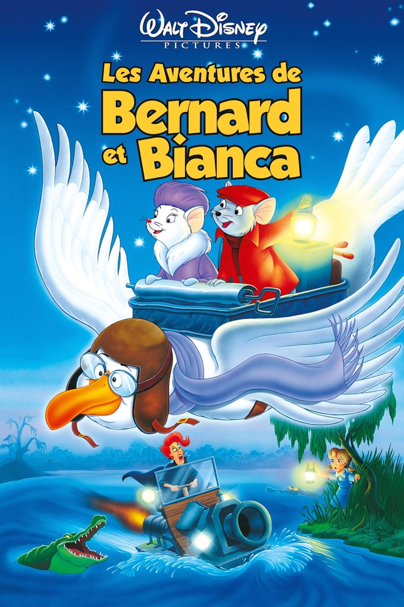
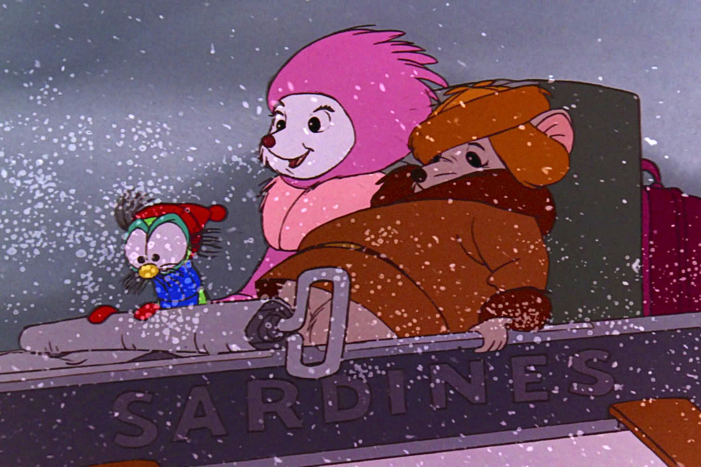
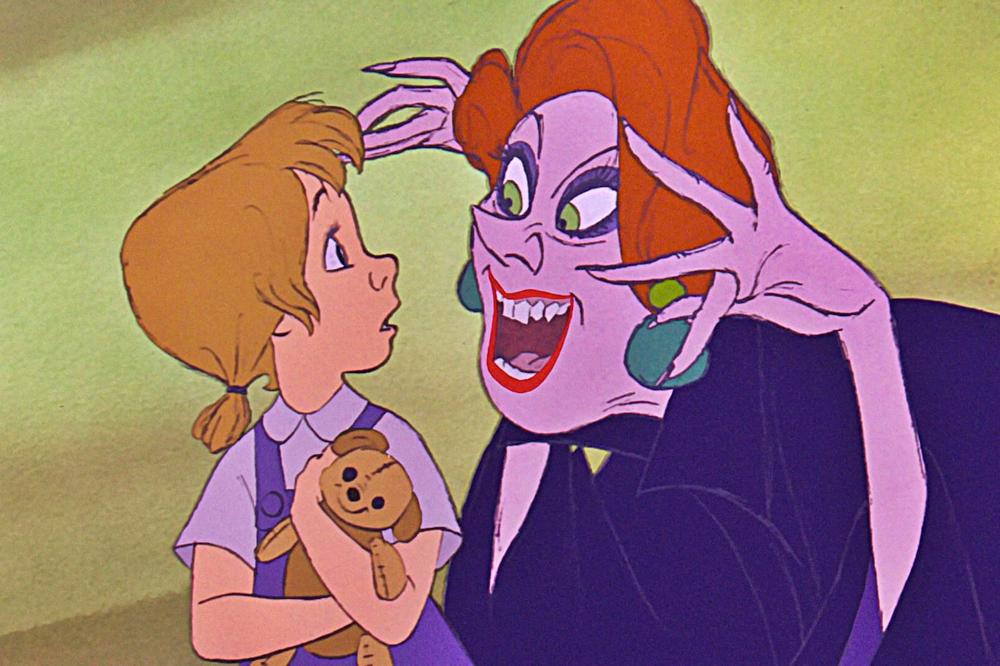

+++
type = "post"
titre = "<em>Les Aventures de Bernard et Bianca</em>, Wolfgang Reitherman, Art Stevens et John Lounsbery"
title = "Les Aventures de Bernard et Bianca, Wolfgang Reitherman, Art Stevens et John Lounsbery"
url = "/aventures-bernard-et-bianca-reitherman-stevens-lounsbery"
date = "2014-04-22T23:45:22"
Lastmod = "2014-04-22T23:49:33"
cover = "bernard-et-bianca-disney.jpg"
categorie = [ "À voir" ]
tag = [ "Adaptation littéraire", "Amour", "Animation", "Animaux", "Enfance" ]
createur = [ "Art Stevens", "John Lounsbery", "Walt Disney", "Wolfgang Reitherman" ]
annee = [ "1977" ]
weight = 1977
saga = [ "Classiques d'animation Disney" ]
pays = [ "États-Unis" ]
original = "The Rescuers"

+++

En 1973, <a href="/robin-des-bois-reitherman/" title="Robin des Bois, Wolfgang Reitherman"><em>Robin des Bois</em></a> a bien prouvé que les studios Disney étaient dans une impasse. Depuis la mort de Walt Disney et faute d’idées nouvelles, les productions s’enlisent dans un sentiment de redite de plus en plus visible. Quatre ans après, le message est, semble-t-il, passé : si l’indéboulonnable Wolfgang Reitherman est toujours sur l’affichage, le réalisateur est rejoint par deux autres noms. Art Stevens et John Lounsbery n’ont encore jamais réalisé de film d’animation pour le studio et leur participation montre bien que ce vingt-troisième <a href="/saga/classiques-danimation-disney/">classique</a> est placé sous le signe du renouvellement. L’ensemble est prometteur et <em>Les Aventures de Bernard et Bianca</em> offre en effet quelques nouveautés, à commencer par un style très différent, tant dans l’animation que dans le scénario. Même si l’ensemble a un peu vieilli, ce style différent procure une vraie bouffée d’air pur après quelques productions plus banales et le public ne s’y s’est pas trompé. Il reste, aujourd’hui encore, un divertissement plutôt convaincant.

Pour trouver un nouvel élan, les studios Disney vont à nouveau chercher en Europe, mais cette fois à l’époque contemporaine en adaptant les romans de Margery Sharp qui imaginent une société de souris chargée d’aider tous ceux qui sont dans le besoin autour du monde. <em>Les Aventures de Bernard et Bianca</em> signent ainsi le retour du contemporain pour la première fois depuis <a href="/101-dalmatiens-geronimi-luske-reitherman/" title="Les 101 Dalmatiens, Clyde Geronimi, Hamilton Luske et Wolfgang Reitherman"><em>Les 101 Dalmatiens</em></a>. L’intrigue se met d’ailleurs en place à New York, sans doute dans les années 1970 : jamais un long-métrage signé Walt Disney n’avait été aussi proche de ses contemporains. L’action se déplace toutefois rapidement, puisque le scénario imagine que Bernard et Bianca, deux souris qui appartiennent à cette société d’aide, partent à la recherche de Penny, une petite orpheline emmenée de force par Medusa, une prêteuse à gages aux intentions troubles. Les deux héros partent dans les bayous du sud des États-Unis pour sauver la petite fille des griffes de la terrible femme qui ne l’a recueillie qu’en raison de sa petite taille, pour chercher un gros diamant au fond d’un puits. Ainsi, le film de Wolfgang Reitherman, Art Stevens et de John Lounsbery fait preuve d’originalité, tout en racontant une histoire somme toute assez banale. L’introduction aux Nations Unies reprend l’idée déjà exploitée dans <em>Les 101 Dalmatiens</em>, mais qui fait à nouveau ses preuves : on croit que l’on s’intéresse aux humains, alors que les vrais héros de l’histoire sont des petites souris diplomates cachées dans les sacs des diplomates humains. Le décalage est bien pensé et la scène qui suit, dans une assemblée miniature composée exclusivement d’objets humains, est une vraie réussite. <em>Les Aventures de Bernard et Bianca</em> fourmille d’idées similaires, avec notamment un avion remplacé par un albatros ou encore une libellule qui fait avancer un canoë de sauvetage.

Les idées ne manquent pas, mais le long-métrage hésite dès les premiers plans entre plusieurs genres. <em>Les Aventures de Bernard et Bianca</em> surprend d’abord par son style crayonné très différent de ce que le studio faisait jusque-là. Les décors, notamment ceux dans le bayou, sont magnifiques, tout en restant assez simples et ils sont, à bien des égards, assez modernes. Par dessus, le studio appose ses personnages, comme c’est toujours le cas, mais il choisit un style tantôt très réaliste — la scène des Nations Unies est sans doute l’une des plus réalistes réalisées par le studio dans ces années-là — tantôt très caricatural. L’exemple le plus frappant est sans doute le personnage de Medusa, un clone de la Cruella des <em>101 Dalmatiens</em>, mais qui est encore plus caricaturale. Même si elle parvient incontestablement à effrayer les plus jeunes, elle crée un décalage troublant avec le reste du film, plutôt sérieux. <em>Les Aventures de Bernard et Bianca</em> peine, de fait, à trouver le ton juste et le film hésite entre l’humour, le drame ou même la romance, si bien que l’on ne sait plus vraiment à quoi s’en tenir. Il y a d’abord l’histoire assez terrible d’ailleurs de Penny, cette orpheline qui n’a pas été choisie par une famille parce qu’elle était moins belle qu’une autre fille, puis qui est séquestrée par une femme terrifiante. Pour elle, Wolfgang Reitherman et les autres optent pour le ton du drame, avec des chansons poignantes, comme le studio en fera de plus en plus. À côté, il y a des méchants si caricaturaux qu’ils en deviennent ridicules et même drôles. Même si Medusa et ses crocodiles sont impressionnants, que dire de Snoops, qui n’a pas d’autre rôle que celui du bouffon ? Et puis <em>Les Aventures de Bernard et Bianca</em> raconte aussi, de manière assez surprenante, l’histoire d’amour entre les deux souris avec une simplicité troublante. L’ensemble est un peu confus et le film aurait sans doute gagné à se recentrer sur son histoire principale.

S’il n’est pas sans défaut, ce nouveau classique évite au moins les travers de ses prédécesseurs. À l’exception peut-être de sa méchante récupérée d’un autre film, <em>Les Aventures de Bernard et Bianca</em> apporte des idées nouvelles et un souffle d’air frais salutaire pour le studio. Le succès populaire de l’époque — c’est le film le plus rentable pour un long-métrage Disney depuis <a href="/livre-jungle-reitherman/" title="Le Livre de la Jungle, Wolfgang Reitherman"><em>Le Livre de la Jungle</em></a> — montre bien que le public est au rendez-vous et on se met alors à espérer à un renouveau. Las, la réussite retombe vite et il faudra plus de dix ans à Walt Disney pour retrouver son inspiration, mais c’est encore une autre histoire…

<h3>Vous voulez <a href="/soutien/">m’aider</a> ?</h3>
<ul>
<li><a href="http://www.amazon.fr/gp/product/B008M8HE2O/ref=as_li_ss_tl?ie=UTF8&amp;tag=leblogdenic07-21&amp;linkCode=as2&amp;camp=1642&amp;creative=19458&amp;creativeASIN=B008M8HE2O">Acheter le film en Blu-ray sur Amazon</a></li>
<li><a href="http://www.amazon.fr/gp/product/B00006AGKE/ref=as_li_ss_tl?ie=UTF8&amp;tag=leblogdenic07-21&amp;linkCode=as2&amp;camp=1642&amp;creative=19458&amp;creativeASIN=B00006AGKE">Acheter le film en DVD sur Amazon</a></li>
<li><a href="https://itunes.apple.com/fr/movie/les-aventures-bernard-et-bianca/id519357534">Acheter ou louer le film sur l’iTunes Store</a></li>
</ul>

