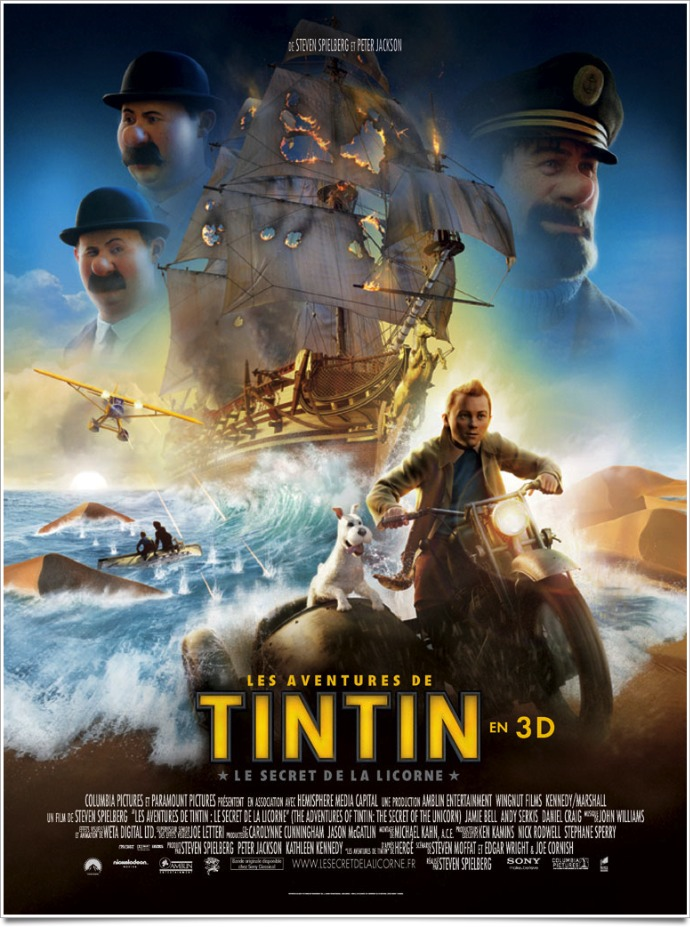
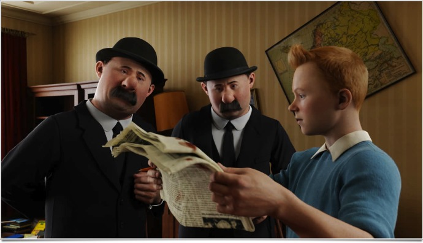
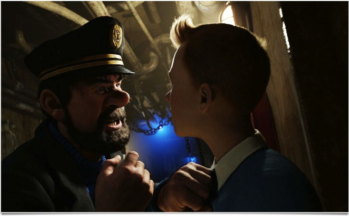

+++
type = "post"
titre = "<em>Les Aventures de Tintin : Le Secret de la Licorne</em>, Steven Spielberg"
title = "Les Aventures de Tintin : Le Secret de la Licorne, Steven Spielberg"
url = "/aventures-tintin-secret-licorne-spielberg"
date = "2011-10-28T00:19:29"
Lastmod = "2015-02-21T00:48:44"
cover = "les-aventures-de-tintin-le-secret-de-la-licorne.jpg"
categorie = [ "À voir" ]
tag = [ "Action", "Adaptation bande-dessinée", "Animation", "Aventure", "Blockbuster", "Pirates" ]
createur = [ "Steven Spielberg" ]
annee = [ "2011" ]
weight = 2011
saga = [ "Les Aventures de Tintin" ]
pays = [ "États-Unis", "Nouvelle-Zélande" ]
original = "The Adventures of Tintin: Secret of the Unicorn"

+++

Réaliser un film sur Tintin ? Seul un réalisateur de la trempe de Steven Spielberg pouvait se lancer dans une aventure aussi folle… Autant le dire, je faisais partie des sceptiques après avoir vu les premières images : ce film d&rsquo;animation plus vrai que nature dans ses décors, devenait instantanément faux dès qu&rsquo;un personnage entrait à l&rsquo;écran. C&rsquo;était oublier l&rsquo;essentiel : <em>Les Aventures de Tintin : Le Secret de la Licorne</em> est d&rsquo;abord et avant tout un formidable film d&rsquo;action et d&rsquo;aventures comme on en fait plus. Loin de l&rsquo;illustration polie et probablement sans intérêt que l&rsquo;on aurait pu craindre, <em>Les Aventures de Tintin : Le Secret de la Licorne</em> s&rsquo;inspire de l&rsquo;univers créé par Hergé, mais pour faire autre chose de bien plus intense. Spielberg crée un univers démesuré où sa caméra virevolte avec une aisance jamais vue au cinéma. À voir, sur grand écran évidemment.

Tintin, jeune reporter, tombe par hasard sur une splendide maquette. La Licorne, un trois-mats du XVIIe siècle doté de 50 canons… le navire attire immédiatement Tintin qui l&rsquo;achète pour une bouchée de pain. À peine l&rsquo;a-t-il acheté, cette reproduction intéresse mystérieusement beaucoup de monde : deux hommes tentent successivement de la lui acheter, en vain. Par la suite, son appartement va être fouillé à plusieurs reprises, la maquette va disparaître et Tintin va être entraîné dans une aventure décoiffante. Fait prisonnier, il se retrouve sur un bateau, un vrai. À son bord, il fait la rencontre du capitaine Haddock et ensemble ils s&rsquo;enfuient pour finir par arriver en plein Sahara. Tintin et le capitaine, aidés par le fidèle Milou, partent en quête d&rsquo;un trésor gigantesque, mais ils ne sont pas seuls. Le terrible Sakharine se dresse sur leur route : lui aussi recherche ce fabuleux trésor…

<em>Les Aventures de Tintin : Le Secret de la Licorne</em> n&rsquo;est pas l&rsquo;adaptation d&rsquo;un seul album de bande dessinée. Steven Spielberg a choisi au contraire de rassembler plusieurs albums dans son film : on y retrouve ainsi des morceaux de <em>Le Crabe aux pinces d&rsquo;or</em>, du <em>Secret de la Licorne</em> et même du <em>Trésor de Rackham le Rouge</em>. Trois albums qui se suivent presque dans la chronologie des albums de Hergé, mais qui ne sont pas liés à l&rsquo;origine : le premier est indépendant, des deux autres. La bonne idée du film est justement d&rsquo;avoir créé ces liens : loin de n&rsquo;être qu&rsquo;une banale illustration, <em>Les Aventures de Tintin : Le Secret de la Licorne</em> est un fascinant travail de relecture de l&rsquo;univers pensé par Hergé. Les histoires sont bien là, les meilleurs connaisseurs reconnaitront même certaines cases des bandes dessinées, mais le Tintin de Spielberg n&rsquo;a plus rien à voir avec celui de Hergé. Finis les traits bien nets et précis, les personnages sont maintenant beaucoup plus complexes, du moins par leurs traits. Le reporter moderne est un jeune homme bien moins indéfini, que ce soit par le sexe ou l&rsquo;âge, que celui des œuvres originales et c&rsquo;est également le cas de tous les personnages, du capitaine Haddock ou Dupondt en passant par Milou, un petit chien débrouillard qui ne manquera pas d&rsquo;émouvoir le jeune public. Pour lier ces différentes histoires, <em>Les Aventures de Tintin : Le Secret de la Licorne</em> se permet même de créer de toutes pièces des situations… ou des personnages. Le film invente ainsi un héritier à Rackham le Rouge pour en faire un méchant unique. Cette relecture pourra choquer les puristes, mais elle s&rsquo;avère vraiment réussie et efficace et offre à l&rsquo;ensemble un dynamisme inattendu à Tintin.

Le générique d&rsquo;ouverture est très significatif de ce travail de relecture. À bien des égards, il est comme un passage de flambeau symbolique entre le dessinateur belge et le réalisateur américain. On y voit un Tintin en deux dimensions, on y voit même des bulles et en même temps c&rsquo;est un vrai film qui se prépare. Quand les premières images apparaissent, un temps d&rsquo;adaptation est rendu nécessaire par la technique utilisée. La <em>motion capture</em> n&rsquo;en est pas à ses premiers faits d&rsquo;armes, on l&rsquo;a déjà vu notamment dans <em><a href="/2009/12/18/avatar-james-cameron/">Avatar</a></em>, mais elle atteint ici un niveau étonnant. L&rsquo;animation offre aux <em>Aventures de Tintin : Le Secret de la Licorne</em> des décors d&rsquo;un réalisme incroyable, on peut même parler de photoréalisme dans la plupart des cas. Le travail réalisé sur les différents décors est ahurissant, que ce soit les plans dans des bateaux ou des ports, ou la ville maghrébine reconstituée avec une précision qui fait peur. Il suffit de regarder les quelques images proposées ici pour en prendre conscience : <em>Les Aventures de Tintin : Le Secret de la Licorne</em> marque un nouveau pas en avant pour l&rsquo;animation réaliste. Tous les éléments virtuels mis en scène par Steven Spielberg paraissent vraiment exister et la technique s&rsquo;efface totalement… pour ne revenir que plus violemment quand un personnage entre en scène.

Que l&rsquo;on ne se méprenne pas, l&rsquo;animation des personnages dans <em>Les Aventures de Tintin : Le Secret de la Licorne</em> est très bien faite, c&rsquo;est même certainement la meilleure dans l&rsquo;histoire du cinéma d&rsquo;animation. Cela ne suffit pas à tromper l&rsquo;œil humain toutefois, bien au contraire même : le phénomène connu sous le nom de <a href="http://fr.wikipedia.org/wiki/Vallée_dérangeante">vallée dérangeante</a>, se manifeste avec encore plus de force. Le cerveau humain voit un homme, mais un petit détail comme une expression du visage ou plutôt en l&rsquo;occurrence un mouvement du corps qui manque de réalisme, casse l&rsquo;illusion et rappelle abruptement qu&rsquo;il ne s&rsquo;agit que d&rsquo;une animation. Ce phénomène m&rsquo;avait gêné dans la bande-annonce, il reste une gêne pendant le film, même si on finit par s&rsquo;y habituer avec le temps. Ce choix technique a ses inconvénients, certes, mais ils ne sont rien par rapport aux avantages évidents qu&rsquo;il apporte. L&rsquo;animation permet à Steven Spielberg de réaliser ses envies les plus folles, elle libère totalement le film qui devient d&rsquo;une liberté et d&rsquo;une virtuosité rarement vues au cinéma. <em>Les Aventures de Tintin : Le Secret de la Licorne</em> regorge de scènes d&rsquo;action, c&rsquo;est un film très rythmé et parsemé de luttes et de courses-poursuites spectaculaires. À plusieurs reprises, Spielberg a réussi à pousser d&rsquo;un cran le niveau : le combat entre les deux navires est beaucoup plus spectaculaire et impressionnant que tous les combats de la saga <em>Pirate des Caraïbes</em>, la scène de course-poursuite dans la ville africaine est plus époustouflante que celles de <em>Jason Bourne</em>. Faire mieux que ces films, il fallait le faire et c&rsquo;est justement grâce à l&rsquo;animation qui enlève toutes les contraintes liées à une caméra physique que Spielberg y parvient.

<em>Les Aventures de Tintin : Le Secret de la Licorne</em> est d&rsquo;abord et avant tout un époustouflant blockbuster, un film d&rsquo;action intense qui ne ménage aucune pause et qui dépasse, sur le plan du spectacle, bien d&rsquo;autres films. Steven Spielberg, on le voit bien, s&rsquo;est ainsi largement éloigné des bandes dessinées de Hergé. C&rsquo;est, à mon sens, la plus grande réussite de ce film : s&rsquo;inspirer de l&rsquo;œuvre originale, se l&rsquo;approprier et en faire autre chose, l&rsquo;amener plus loin. <em>Les Aventures de Tintin : Le Secret de la Licorne</em> est un film généreux en action, trop peut-être, mais Steven Spielberg est sans doute le meilleur dans ce domaine. Rares, très rares sont ceux qui parviennent à imposer un tel rythme à un film tout en maintenant en permanence sa lisibilité et sa compréhension. Le cinéaste a réalisé son rêve d&rsquo;enfance avec <em>Les Aventures de Tintin : Le Secret de la Licorne</em> et trente ans après le premier <em><a href="/2011/10/24/saga-indiana-jones-spielberg/">Indiana Jones</a></em>, on peut le dire, c&rsquo;est une réussite.

<h3>Vous voulez m&rsquo;aider ?</h3>
<ul>
<li><a href="http://www.amazon.fr/gp/product/B0064XQ51U/ref=as_li_ss_tl?ie=UTF8&tag=leblogdenic07-21&linkCode=as2&camp=1642&creative=19458&creativeASIN=B0064XQ51U">Acheter le film en Blu-Ray sur Amazon</a></li>
<li><a href="http://www.amazon.fr/gp/product/B0062JJWNY/ref=as_li_ss_tl?ie=UTF8&tag=leblogdenic07-21&linkCode=as2&camp=1642&creative=19458&creativeASIN=B0062JJWNY">Acheter le film en DVD sur Amazon</a></li>
<li><a href="https://itunes.apple.com/fr/movie/les-aventures-tintin-le-secret/id498436551">Acheter ou louer le film sur l&rsquo;iTunes Store</a></li>
</ul>

