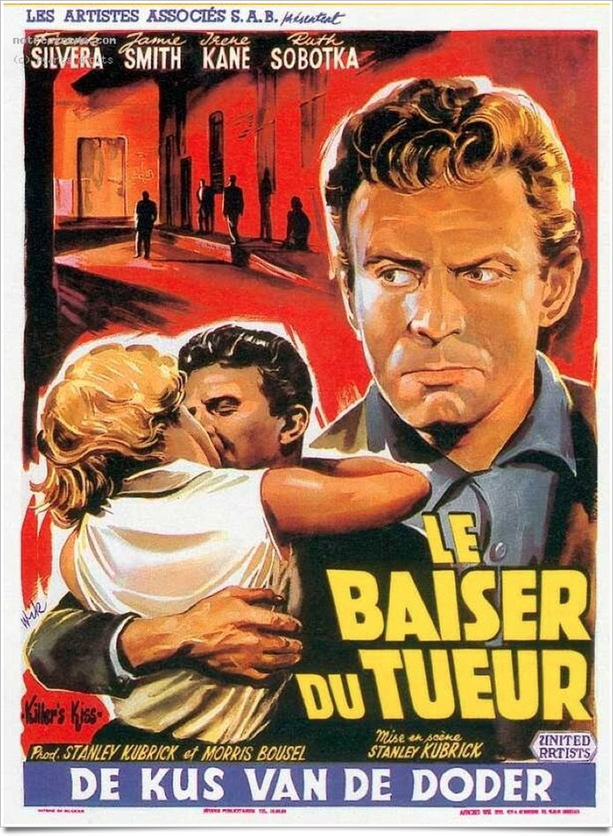
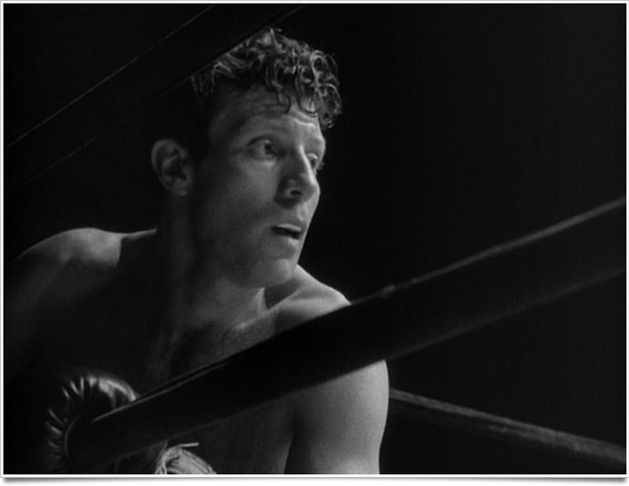

+++
type = "post"
titre = "Le baiser du tueur, Stanley Kubrick"
title = "Le baiser du tueur, Stanley Kubrick"
url = "/baiser-tueur-kubrick"
date = "2011-06-12T09:56:49"
Lastmod = "2011-08-28T18:08:10"
cover = "killer-kiss.jpg"
categorie = [ "À voir" ]
tag = [ "Amour", "Cinéma classique", "Film noir" ]
createur = [ "Stanley Kubrick" ]
annee = [ "1955" ]
weight = 1955
pays = [ "États-Unis" ]

+++

Deuxième film de Stanley Kubrick, <em>Le Baiser du tueur</em> est néanmoins le premier que le cinéaste reconnaît et accepte. C&rsquo;est aussi le premier film qui a permis à l&rsquo;ancien photographe de se faire connaître dans le milieu du cinéma, à défaut d&rsquo;être encore connu du grand public. C&rsquo;est également le premier des deux films noirs de Kubrick, un an avant <em><a href="/?p=4806">L&rsquo;Ultime Razzia</a></em>. Un film de genre donc, qui permet toutefois au jeune cinéaste — il n&rsquo;a que 26 ans quand il tourne ce film – de se plonger dans le monde du cinéma grâce à ses multiples casquettes, mais aussi de mener quelques expérimentations formelles qui annoncent déjà le Stanley Kubrick de la grande époque.

Disons-le, on ne s&rsquo;intéresserait pas autant à ce court film noir s&rsquo;il n&rsquo;était signé de Stanley Kubrick. <em>Le Baiser du Tueur</em> raconte une histoire assez étrange qui n&rsquo;est pour autant pas sans intérêt. Son héros est un boxeur en fin de carrière, un boxeur travailleur et manifestement doué, mais pas assez pour devenir une star. Quand le film commence, il a 29 ans et il est au bout du rouleau. Une nouvelle défaite complète sur le ring le persuade de quitter New York pour rejoindre le ranch de son oncle à Seattle. Le soir de la défaite, il entend un cri venant de la chambre de sa voisine, une charmante demoiselle qu&rsquo;il avait l&rsquo;habitude de croiser et qui n&rsquo;est pas sans lui déplaire. La jeune femme cherche à se débarrasser d&rsquo;un patron un peu envahissant et le boxeur la sauve… et en tombe immédiatement amoureux. Les deux tourtereaux sont si éperdument amoureux qu&rsquo;ils décident de quitter ensemble la ville, provoquant la colère du patron…

Le Stanley Kubrick de la vingtaine n&rsquo;est pas encore le réalisateur de films ambitieux et longs. <em>Le Baiser du Tueur</em> ne dure ainsi qu&rsquo;une heure, c&rsquo;est un film bref et direct. Toute l&rsquo;action est racontée en flash-back, puisque le présent du film est situé directement après les faits, quand le héros est à la gare, sur le point de partir. Flash-backs qui sont déjà rares chez Kubrick et qui s&rsquo;emboitent ici sur deux niveaux, pour raconter l&rsquo;histoire de la jeune femme. Si ce procédé est rare dans le cinéma de Kubrick, le narrateur l&rsquo;est beaucoup moins. Cette fois, c&rsquo;est le héros qui commente et c&rsquo;est en gros son point de vue que l&rsquo;on va suivre pendant tout le film, contrairement à <em>L&rsquo;Ultime Razzia</em> et son narrateur à l&rsquo;objectivité proche du documentaire. Le procédé n&rsquo;est que partiellement respecté toutefois puisque l&rsquo;on voit quelques scènes où le héros est absent. Film bref et intense, <em>Le Baiser du Tueur</em> n&rsquo;en est pas moins un film où l&rsquo;on prend le temps de regarder la ville et de la filmer. Stanley Kubrick rappelle là qu&rsquo;il a commencé en faisant également des documentaires et ce film des débuts anticipe les recherches acharnées qui seront effectuées dans ses futures réalisations. Le match de boxe est un bon exemple de la précision des films de Kubrick, tandis que la seule fois où il filme New York, sa ville d&rsquo;origine qu&rsquo;il n&rsquo;a, semble-t-il,

<em>Le Baiser du Tueur</em> n&rsquo;est pas un film aussi virtuose que pourront l&rsquo;être les films de Stanley Kubrick par la suite, ce qui est après tout bien normal. Ce film n&rsquo;est pourtant pas sans intérêt sur le plan visuel, avec notamment une photographie contrastée très réussie qui rappelle qu&rsquo;avant d&rsquo;être un réalisateur génial, Stanley Kubrick était un photographe de talent. Certains plans sont magnifiques, notamment sur le ring ou encore le combat dans la ruelle qui semble démultiplier les personnages par un simple jeu d&rsquo;ombres et de lumières. On note aussi l&rsquo;appétit du cinéaste pour la symétrie et quelques jeux de caméras, avec le bocal du poisson ou la jambe du boxeur par exemple. Dans la carrière du cinéaste, ce film a aussi la particularité d&rsquo;avoir été écrit par Kubrick et d&rsquo;être doté d&rsquo;une musique originale, composée pour le film.

Les premiers films d&rsquo;un grand cinéaste sont toujours passionnants, ne serait-ce que pour voir comment un réalisateur a débuté sa carrière. Stanley Kubrick a commencé avec le film noir, un genre en vogue dans les années 1950 qu&rsquo;il abandonnera ensuite bien vite, pas seulement parce qu&rsquo;il passait de mode. <em>Le Baiser du Tueur</em> intéresse d&rsquo;abord parce que c&rsquo;est le premier film revendiqué par Kubrick, mais pas seulement, c&rsquo;est aussi un film noir plaisant et bien réalisé.

