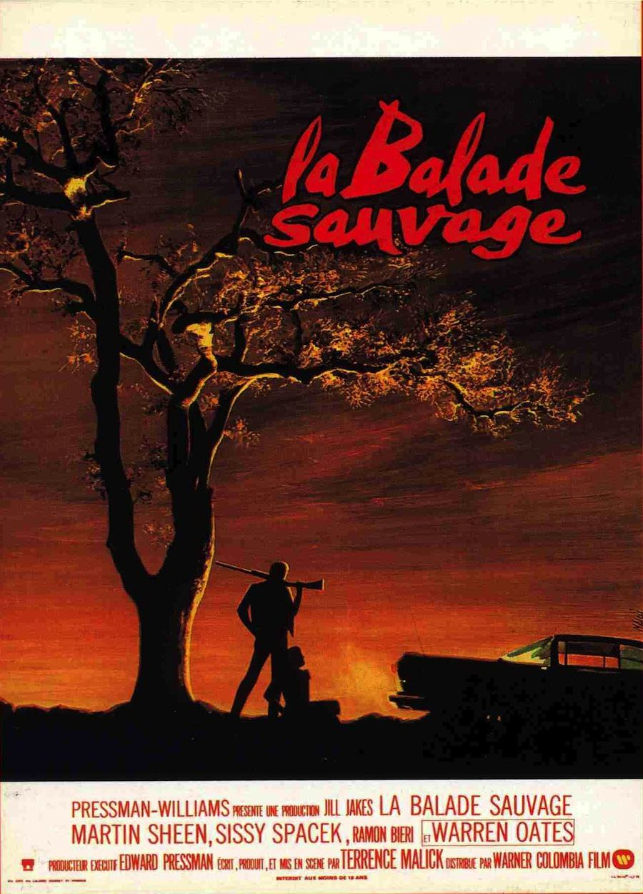
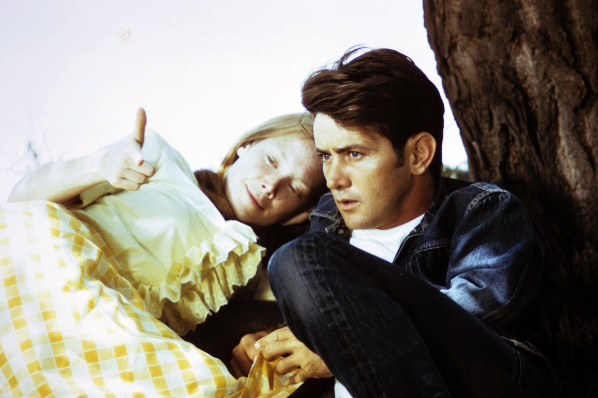
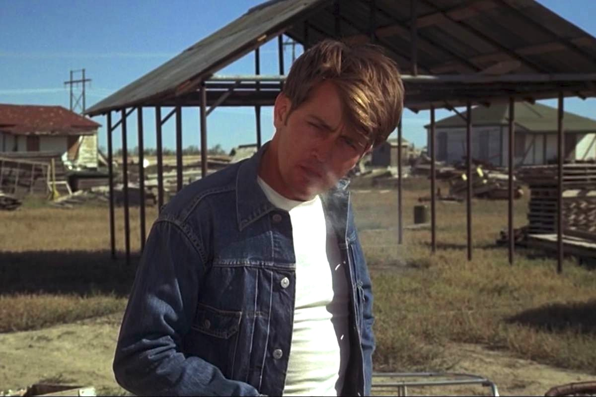

+++
type = "post"
titre = "La Balade sauvage, Terrence Malick"
title = "La Balade sauvage, Terrence Malick"
url = "/balade-sauvage-malick"
date = "2013-03-14T10:38:50"
Lastmod = "2013-03-10T10:45:47"
cover = "la-balade-sauvage-terrence-malick.jpg"
categorie = [ "À voir" ]
tag = [ "Adolescence", "Amour", "Drame", "Histoire vraie", "Road-movie", "Société", "Violence" ]
createur = [ "Terrence Malick" ]
acteur = [ "Martin Sheen", "Sissy Spacek" ]
annee = [ "1975" ]
weight = 1975
pays = [ "États-Unis" ]
original = "Badlands"

+++

Le premier film est toujours un moment pour un cinéaste et c’est d’autant plus le cas quand ce cinéaste se nomme Terrence Malick. Lui qui n’a signé que six films en quarante ans de carrière a pourtant eu un début précoce : il n’a que trente ans quand sort <em>La Balade sauvage</em>. Ce <em>road-movie</em> criminel surprenant porte déjà toutes les marques de son cinéma, même si Terrence Malick n’a pas encore atteint toute la sophistication de ses prochains films. Une première réalisation qui force malgré tout le respect par sa maîtrise et sa puissance… un premier très beau film. 

<em>La Balade sauvage</em> s’inspire de l’histoire vraie de <a href="http://fr.wikipedia.org/wiki/Charles_Starkweather">Charles Starkweather</a>, un tueur en série qui a fait onze victimes en quelques semaines avec sa copine, une adolescente plus jeune que lui. Terrence Malick reprend l’idée principale avec deux personnages : Kit est un jeune de 25 ans, un marginal qui travaille comme éboueur et qui tombe amoureux de Holly, 15 ans seulement. La jeune fille est encore au lycée et pour une raison qui reste mystérieuse, elle tombe elle aussi amoureuse du jeune homme. Le film n’explicite pas leurs raisons, mais on imagine très bien que ce grand et beau garçon offre à la fille très sage de nouveaux horizons faits de liberté totale. Il faut dire aussi que Kit, interprété par Martin Sheen, a un vague air de James Dean, ce qui n’est pas pour déplaire à Holly (Sissy Spacek). Les deux tourtereaux passent du temps ensemble, mais en cachette, car le père de Holly n’approuve pas cette relation et il a d’ailleurs très vite interdit à sa fille de fréquenter Kit. Ce qui n’empêche pas le jeune homme de venir aussi régulièrement voir sa copine dans des virées enivrantes dans sa grande voiture noire. <em>La Balade sauvage</em> bascule quand Kit décide de partir contre l’avis du père avec Holly. Alors qu’il est en train de préparer la valise de son amie, le père entre dans la maison et veut appeler la police. Kit a un pistolet et il tire, le père meurt sur le coup. Ce premier meurtre est le début d’une longue série et d’une fuite en avant de plusieurs jours pour le couple, mais aussi une période de très grande liberté.

Si le premier long-métrage de Terrence Malick a été considéré à sa sortie comme un film novateur, on le voit aujourd’hui plutôt comme le représentant classique du <em>road-movie</em> à l’ancienne. <em>La Balade sauvage</em>, comme son nom l’indique d’ailleurs, est ainsi constitué d’une série de séquences sur la route, entrecoupée de pauses qui servent en général de rencontres qui sont autant de moments importants dans l’évolution du couple. La première partie du film est consacrée aux présentations et elle permet de poser les deux personnages. Kit est d’emblée présenté comme un type un peu singulier, il apprécie son travail d’éboueur, mais n’en fait toujours qu’à sa tête et il finit par se faire virer. Il ne semble en rien peiné par cette nouvelle qui était, il est vrai, moins grave dans les années 1950 pendant lesquelles se déroule <em>La Balade sauvage</em>. Qu’importe, il a une autre obsession désormais : Holly. Terrence Malick est avare en détail dans ce récit qui avance assez rapidement, avec une certaine désinvolture et presque même un désintérêt. Pourquoi ce jeune homme porte son dévolu sur Holly, une jeune fille encore timide et qui est aussi calme que lui peut être agité ? La principale intéressée se pose la même question, mais sans y apporter de réponse et ce n’est pas le sujet du film de toute manière. L’amour motive le départ et donc le <em>road-movie</em>, mais une fois sur les routes, c’est la folie meurtrière qui finit par prendre le dessus. 

Au départ, ce n’est peut-être qu’un accident. Kit tire sur le père de Holly alors que ce dernier s’apprête à appeler la police. Le jeune homme l’avait prévenu à plusieurs reprises et <em>La Balade sauvage</em> peut montrer qu’il a tiré un peu trop vite, certes, mais que ce n’était pas tout à fait volontaire. Terrence Malick préfère astucieusement ne pas s’étendre sur la question, mais on finit par comprendre, alors que les morts se succèdent, que Kit n’a pas toute sa tête. Le jeune homme tue comme ça, sans plaisir, mais sans aucune difficulté non plus. Il tue ceux qui le dérangent, il tue les témoins de ses meurtres, il tue à tout va et ne se gêne jamais, ni ne se pose vraiment de question. Son indifférence est surprenante, mais c’est l’autre personnage de <em>La Balade sauvage</em> qui s’avère le plus surprenant à cet égard. Alors que son petit ami vient de tuer son père sans vraiment son consentement, elle reste impassible et ne réagit pas au-delà d’une petite baffe. Elle semble n’éprouver aucune peine pour la mort de son père et reste complètement froide, comme si les émotions ne pouvaient pas l’atteindre. La suite le confirme : Terrence Malick impose à son actrice un jeu toujours impassible et les morts qui s’accumulent ne semblent jamais vraiment l’atteindre, même si elle s’en plaint parfois mollement auprès de son copain. Kit n’est pas en reste et ce psychopathe qui n’hésite jamais à tirer, même sans savoir trop pourquoi, fait tout pour être pris. Après avoir tué le père de Holly, après avoir aspergé toute la maison d’essence, il enregistre un message s’accusant explicitement qu’il fait tourner en boucle avant de mettre le feu. Plus tard, il s’enregistre à nouveau sur un dictaphone pour donner des nouvelles à la police et <em>La Balade sauvage</em> se termine par une arrestation qu’il semble avoir provoquée. Quels étaient ses motifs exactement ? Sans l’excuser, Terrence Malick offre à son personnage des motifs bien éloignés de ceux des <em>serial-killers</em> traditionnels. 

Les deux personnages de <em>La Balade sauvage</em> sont en fait marqués par une profonde innocence qui pourrait être celle de l’adolescence. Outre l’indifférence de Holly et le comportement étrange de Kit, Terrence Malick présente un couple en fuite qui réagit à l’instinct et avec une vraie liberté, ce qui explique certainement la sympathie qu’ils procurent, même auprès des policiers qui viennent les arrêter. Si l’on se doute du sort de Kit, le cinéaste nous indique dès les premières minutes que la jeune adolescente va s’en sortir en la faisant narratrice du film. Ce procédé qui deviendra avec les films la marque de fabrique du cinéaste sert ici à instituer un point de vue interne qui renforce le mystère autour du couple et en même temps permet au spectateur de s’identifier avec Holly. <em>La Balade sauvage</em> est ainsi son récit, ce qui ne permet pas d’expliciter pour autant son indifférence à ce qui l’entoure et surtout aux actes criminels de Kit. C’est peut-être ce doute permanent qui fait le succès du film : Terrence Malick en dit très peu et frôle même en permanence l’indifférence envers ses personnages. Un effet déroutant, mais qui fonctionne parfaitement pour maintenir l’intérêt du film d’un bout à l’autre. <em>La Balade sauvage</em> est un premier long-métrage bref (1h30) et il sert aussi au cinéaste de brouillon pour le reste de son œuvre. Tout est déjà là, concentré, le narrateur, mais aussi son intérêt pour la nature, un rythme assez lent, bref cette manière de filmer un fait divers comme un poème et une ode à la liberté insouciante de la jeunesse. Le cinéaste était encore jeune, mais toute son œuvre à venir est presque concentrée dans ce premier film, une belle performance…

<em>La Balade sauvage</em> ressemble un peu à une répétition générale quelques années avant <a href="/2010/06/26/moissons-ciel-malick/" title="Les moissons du ciel, Terrence Malick - À voir et à manger"><em>Les moissons du ciel</em></a> et le reste de sa filmographie. Terrence Malick impose déjà ses thèmes fétiches avec une maturité qui force le respect et ce premier film est déjà un coup de maître. À travers la fuite de ces deux jeunes personnages, le cinéaste raconte une histoire de liberté totale et insouciante pour un très beau film. À (re)découvrir… 

<h3>Vous voulez m&rsquo;aider ?<a href="#footnote_0_8801" id="identifier_0_8801" class="footnote-link footnote-identifier-link" title="&Agrave; propos de la publicit&eacute;&hellip;">1</a></h3>
<ul>
<li><a href="http://www.amazon.fr/gp/product/B00008ARDW/ref=as_li_ss_tl?ie=UTF8&tag=leblogdenic07-21&linkCode=as2&camp=1642&creative=19458&creativeASIN=B00008ARDW">Acheter le film en DVD sur Amazon</a></li>
<li><a href="https://itunes.apple.com/fr/movie/la-balade-sauvage/id436105446">Acheter le film sur l&rsquo;iTunes Store</a></li>
</ul>

<ol class="footnotes"><li id="footnote_0_8801" class="footnote"><a href="/soutien/">À propos de la publicité…</a> [<a href="#identifier_0_8801" class="footnote-link footnote-back-link">&#8617;</a>]</li></ol>
