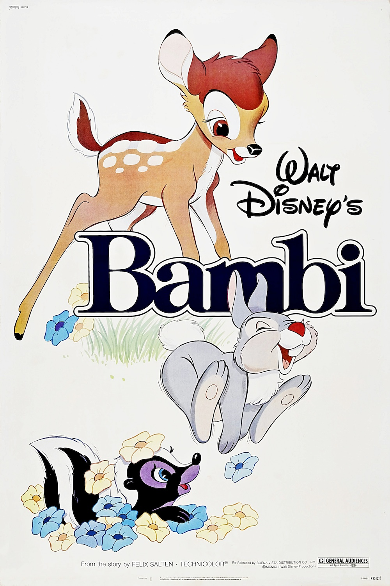
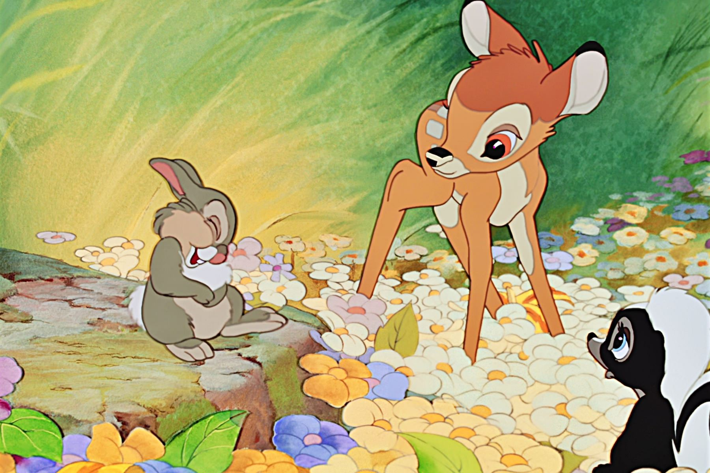
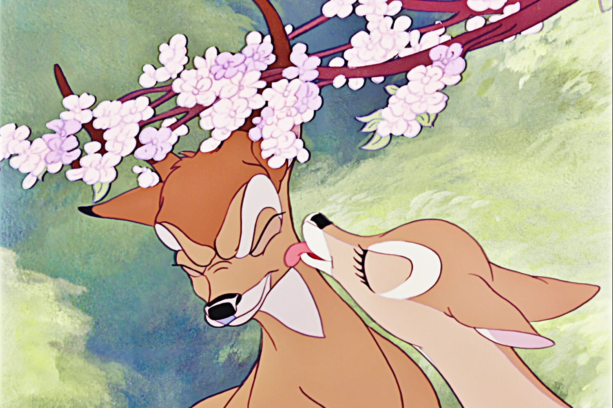

+++
type = "post"
titre = "<em>Bambi</em>, David Hand"
title = "Bambi, David Hand"
url = "/bambi-hand"
date = "2014-01-30T20:50:27"
Lastmod = "2014-01-29T23:43:03"
cover = "bambi-disney.jpg"
categorie = [ "À voir" ]
tag = [ "Adaptation littéraire", "Animation", "Animaux", "Drame", "Enfance", "Famille", "Nature" ]
createur = [ "David Hand", "Walt Disney" ]
annee = [ "1942" ]
weight = 1942
saga = [ "Classiques d'animation Disney" ]
pays = [ "États-Unis" ]

+++

Le cinquième <a href="/saga/classiques-danimation-disney/">classique d’animation</a> Disney n’est sorti qu’en 1942, mais le film qui allait ravir et traumatiser des générations de jeunes enfants devait sortir beaucoup plus tôt. De fait, le projet qui a conduit à <em>Bambi</em> a été initié dans les années 1930, avant même <a href="/blanche-neige-sept-nains-hand/" title="Blanche-Neige et les sept nains, David Hand"><em>Blanche-Neige et les sept nains</em></a> selon certains avis. Ce qui est sûr, c’est que ce long-métrage traverse une petite dizaine d’années dans les studios de Walt Disney et qu’il a été repoussé plusieurs fois pour céder la place d’abord à <a href="/pinocchio-luske-sharpsteen/" title="Pinocchio, Hamilton Luske et Ben Sharpsteen"><em>Pinocchio</em></a>, et puis à <em>Fantasia</em> et même à <a href="/dumbo-sharpsteen/" title="Dumbo, Ben Sharpsteen"><em>Dumbo</em></a>. Ces difficultés à sortir ce film trahissent des problèmes financiers, certes, mais aussi et surtout un problème de fond. Contrairement à tous ses prédécesseurs, <em>Bambi</em> n’est pas une comédie, mais un drame qui tranche non seulement par son sérieux, mais aussi par ses personnages : il n’y a aucun être humain dans le film. David Hand réalise un classique qui étonne encore aujourd’hui par son style, même si le ton très enfantin aura du mal à convaincre les plus âgés. Une œuvre intemporelle…

Pour la deuxième fois après <em>Dumbo</em>, les studios Disney n’adaptent pas un conte du XIXe siècle, mais un récit contemporain. À l’origine de <em>Bambi</em>, un roman pour enfants publié en 1923 par Felix Salten. Ce récit d’apprentissage d’un faon dans la forêt séduit Walt Disney qui lance une adaptation une dizaine d’années après sa sortie, alors que le roman traduit en anglais connaît un beau succès. On comprend aisément pourquoi le patron des studios s’intéresse à cette histoire qui ne peut que toucher les enfants, mais dès le départ, l’adaptation pose problème. De fait, cette histoire marque une rupture nette par rapport aux scénarios qui avaient été jusque-là adaptés par Disney. <em>Bambi</em> n&rsquo;est composé que d’animaux qui parlent, certes, mais qui respectent malgré tout leur condition animale. Avant même de parler de scénario, les animateurs ont passé du temps à comprendre comment les animaux se déplacent pour offrir des dessins réalistes. Même si tout n’est pas parfait, il faut noter que les équipes menées par David Hand ont su capter l’essence des animaux. On croit dès les premiers plans à ce jeune faon qui ne sait pas tenir en équilibre, qui ne cesse de tomber en s’emmêlant les pattes, mais qui prend peu à peu de l’assurance. Tous les animaux autour du héros ont fait l’objet du même soin et que ce soit le lapin Panpan ou le putois Fleur, on a vraiment le sentiment de voir des animaux et non des caricatures. La plus grosse réussite des studios toutefois, ce sont peut-être les décors. <em>Bambi</em> commence avec un long travelling qui met en avant la forêt peinte par les artistes de Disney et on ne peut qu’être bluffé par le résultat. Mélange de peinture à l’huile et de gouache, ces décors restent, encore aujourd’hui, sublimes et si l’illusion de photoréalisme ressentie par certains contemporains ne tient plus — on a fait beaucoup mieux en matière d’animation depuis —, l’ambiance créée par ces décors est vraiment réussie. 

On peut revoir <em>Bambi</em> uniquement pour ses magnifiques décors de forêt ou encore pour quelques scènes exemplaires, à commencer par celle de pluie qui offre un spectacle largement digne de ce que l’on a pu voir dans <em>Fantasia</em>. Le scénario intéressera beaucoup plus difficilement passées les premières années. On sait que ce point a été énormément travaillé par le studio qui a longtemps hésité entre plusieurs directions à prendre. L’histoire originale a été conservée dans les grandes lignes, mais Walt Disney a tenu à ajouter ses touches personnelles, à commencer par une part bien plus importante accordée au personnage de Panpan, le seul qui ajoute une touche de comique à l’ensemble. Pour autant, un peu comme <em>Dumbo</em> sorti un an avant, <em>Bambi</em> n’est pas une comédie et il n’est pas drôle. Il commence de façon très mignonne avec les premiers pas du faon avec sa mère, une phase de découverte enchantée de la forêt avec des séquences dans la prairie, une autre dans la neige et bien sûr la rencontre avec un(e) faon. Cet enchaînement joyeux, à défaut d’être drôle, est brutalement interrompu par la mort de la mère, un épisode qui a traumatisé de nombreux enfants, alors même que le film ne montre rien. S’il faut reconnaître un coup de génie dans ce long-métrage, c’est bien cette scène qui se contente d’un bruit — un coup de fusil — et d’une absence et qui, par son absence de représentation, fait travailler l’imagination pour un résultat bien plus fort. Il n’est pas difficile de comprendre pourquoi, à trois ou quatre ans, on peut être bouleversé par cette disparition : comme le personnage de Bambi lui-même, on comprend peu à peu tout ce que la mort implique. Difficile de conclure après cela, mais <em>Bambi</em> le fait de manière très intelligente, en montrant que la vie continue et que l’histoire de Bambi n’est qu’un éternel recommencement. Pour un adulte, ce scénario qui tient sur un ticket de métro peut faire sourire, mais il faut bien reconnaître que David Hand fait exactement ce qu’il faut et que le film fonctionne parfaitement.

<em>Bambi</em> fait partie de ces œuvres intemporelles qui ne peuvent pas vieillir. Est-ce l’absence totale de l’homme qui explique cet aspect que peu d’autres films, y compris ceux de Walt Disney, peuvent revendiquer ? Toujours est-il que le long-métrage de David Hand frappe aujourd’hui encore par son actualité. En une bonne heure, le film parvient à toucher les enfants uniquement avec des animaux et en offrant une vision somme toute très réaliste de la nature. Une vision qui peut-être terrible, souvent à cause de l’homme, même si le final offre une note d’espoir. <em>Bambi</em> a déjà rapporté à ses concepteurs plus de 250 millions de dollars, il a été vu par des générations et des générations d’enfants et ce n’est sûrement pas prêt de s’arrêter, et c&rsquo;est tant mieux…

<h3>Vous voulez m’aider ?<a href="#footnote_0_11042" id="identifier_0_11042" class="footnote-link footnote-identifier-link" title="&Agrave; propos de la publicit&eacute;&hellip;">1</a></h3>
<ul>
<li><a href="http://www.amazon.fr/gp/product/B004EBUWZO/ref=as_li_ss_tl?ie=UTF8&tag=leblogdenic07-21&linkCode=as2&camp=1642&creative=19458&creativeASIN=B004EBUWZO">Acheter le film en Blu-Ray et DVD sur Amazon</a></li>
<li><a href="http://www.amazon.fr/gp/product/B004EBUWZ4/ref=as_li_ss_tl?ie=UTF8&tag=leblogdenic07-21&linkCode=as2&camp=1642&creative=19458&creativeASIN=B004EBUWZ4">Acheter le film en DVD sur Amazon</a></li>
<li><a href="https://itunes.apple.com/fr/movie/bambi/id416438154">Acheter ou louer le film sur l’iTunes Store</a></li>
</ul>

<ol class="footnotes"><li id="footnote_0_11042" class="footnote"><a href="/soutien/">À propos de la publicité…</a> [<a href="#identifier_0_11042" class="footnote-link footnote-back-link">&#8617;</a>]</li></ol>
