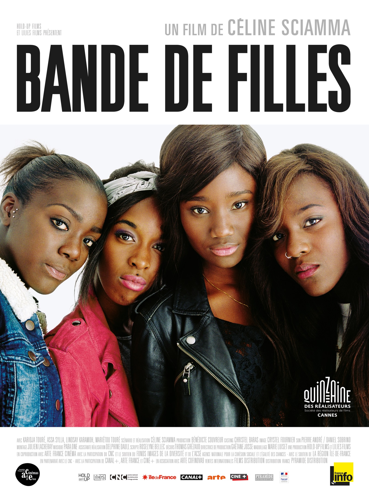
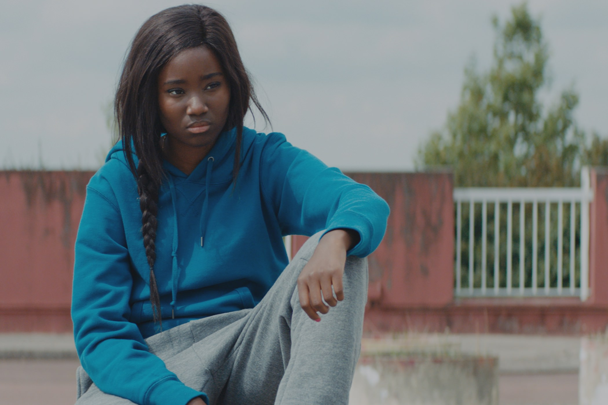

+++
type = "post"
titre = "<em>Bande de filles</em>, Céline Sciamma"
title = "Bande de filles, Céline Sciamma"
url = "/bande-filles-sciamma"
date = "2014-11-01T20:31:55"
Lastmod = "2014-11-01T20:36:20"
cover = "bande-de-filles-celine-sciamma.jpg"
categorie = [ "À voir" ]
tag = [ "Adolescence", "Amitié", "Banlieue", "Famille", "Humour", "Société", "Sorties du mois", "Violence" ]
createur = [ "Céline Sciamma" ]
acteur = [ "Assa Sylla", "Karidja Touré", "Lindsay Karamoh", "Mariétou Touré" ]
annee = [ "2014" ]
weight = 2014
pays = [ "France" ]

+++

Après <a href="http://voiretmanger.fr/tomboy-sciamma/" title="Tomboy, Céline Sciamma"><em>Tomboy</em></a> qui lui a valu beaucoup de bruits et de scandales, Céline Sciamma revient à ses premières amours en quelque sorte avec son troisième long-métrage. Comme dans <em>Naissances d&rsquo;une pieuvre</em>, son premier, <em>Bande de filles</em> a pour sujet principal des adolescents, et en l&rsquo;occurrence une bande d&rsquo;adolescentes. Pour autant, il est vain d&rsquo;essayer de trouver des points communs entre chaque film de la réalisatrice : même si la question du genre est toujours en toile de fond, ce n&rsquo;est absolument pas l&rsquo;enjeu ici. <em>Bande de filles</em> est une plongée en banlieue et, à bien des égards, il rappelle plus le travail d&rsquo;Abdellatif Kechiche… sans toutefois le répéter, bien au contraire. Céline Sciamma change de milieu social, mais elle évite toujours aussi bien les clichés et compose un film oppressant, passionnant, à ne pas rater.

À la manière de <a href="http://voiretmanger.fr/esquive-kechiche/" title="L’esquive, Abdellatif Kechiche"><em>L’esquive</em></a>, Céline Sciamma plonge ses caméras dans la cité et le dépaysement est total pour le spectateur. Comme chez Abdellatif Kechiche, on est d&rsquo;abord surpris par cette langue si souvent entendue à la télévision, mais au fond si rare au cinéma : une langue plus riche et imagée qu&rsquo;on ne veut bien le dire parfois, une langue aussi souvent violente. C&rsquo;est ce qui frappe très vite dans <em>Bande de filles</em>, la violence est omniprésente, le plus souvent verbale, parfois physique aussi et le fait de commencer avec un match de football américain est une manière d&rsquo;annoncer la couleur. Cette première séquence assez surprenante est aussi une façon de marquer ses distances avec <em>L&rsquo;esquive</em> justement : là où Kechiche optait pour un traitement exclusivement réaliste, Céline Sciamma n&rsquo;hésite pas à parier sur une esthétique plus travaillée, avec une musique qui envahit la salle — <a href="http://www.amazon.fr/gp/product/B00OKXA8V4/ref=as_li_ss_tl?ie=UTF8&amp;tag=leblogdenic07-21&amp;linkCode=as2&amp;camp=1642&amp;creative=19458&amp;creativeASIN=B00OKXA8V4">bande-originale signée Para One</a> et très réussie, au passage — et des couleurs vives qui prennent le dessus sur l&rsquo;écran. Après cette introduction très pop, <em>Bandes de fille</em> oscille ainsi constamment entre des scènes du quotidien au réalisme appuyé, presque exagéré, et d&rsquo;autres au contraire où les enregistrements sonores se coupent et où l&rsquo;on n&rsquo;a plus que la musique, des couleurs vives et une scène que l&rsquo;on imaginerait plus chez Wong Kar-waï, ou chez Xavier Dolan. Cette ambivalence de la forme trahit peut-être un changement de fond : en effet, si le dernier film de Céline Sciamma évoque celui d&rsquo;Abdellatif Kechiche au départ, les deux n&rsquo;ont pourtant pas grand-chose en commun.

<em>Bande de filles</em> nous présente une banlieue fermée sur elle-même, sans aucune ouverture sur l&rsquo;extérieur. On suit les pas de Marieme, alias Vic, une adolescente de 16 ans qui voit sa vie se refermer pour elle. Elle est toujours au collège et au début du film, on lui apprend qu&rsquo;elle ne pourra pas aller au lycée, car elle n&rsquo;a pas le niveau. Elle ne veut pas d&rsquo;un CAP et pour faire simple, elle est en échec scolaire, sans solution d&rsquo;avenir : son seul espoir désormais est de trouver un mari et de fonder une famille. Sauf que ce n&rsquo;est pas du tout ce qu&rsquo;elle veut : Marieme aurait probablement voulu être son grand frère, pas forcément être un homme, mais au moins avoir leur liberté. À défaut, elle rencontre un jour trois autres filles qui l&rsquo;intègrent dans leur bande et ensemble, elles deviennent les meilleures amies. Céline Sciamma filme quelques semaines de leur quotidien, pendant les vacances d&rsquo;été, une parenthèse avant la rentrée. Elle filme surtout un univers fermé, non pas géographiquement — on les voit aller « sur Paris » et à la fin, on sort un peu de la cité —, mais socialement : <em>Bande de filles</em> est irrémédiablement fermé à toutes les influences extérieures. Dans <em>L&rsquo;esquive</em>, il y avait au moins le théâtre et Marivaux ; ici, il n&rsquo;y a absolument rien pour sortir ces jeunes femmes de la violence du quotidien qu&rsquo;elles ont fini par absorber. Quand elles rencontrent une autre bande, c&rsquo;est plus fort qu&rsquo;elles, elles doivent les interpeller, au moins verbalement, mais elles en finissent souvent aux mains. Et en toile de fond, il y a toujours les hommes qui font la loi : le grand frère qui passe ses journées enfermé à jouer sur sa console, le caïd du coin qui recrute des jeunes filles pour les prostituer ou vendre de la drogue… Pour les quatre héroïnes de Céline Sciamma, la seule parenthèse, c&rsquo;est quand elles ont assez d&rsquo;argent pour s&rsquo;offrir une nuit dans un hôtel loin de la cité. Le temps d&rsquo;une soirée et d&rsquo;une nuit, elles se maquillent, mettent de belles robes — souvent avec l&rsquo;antivol encore en place — dansent et chantent… Pendant quelques heures, cette <em>Bande de filles</em> peut respirer et le spectateur aussi. Une parenthèse touchante, au cœur d&rsquo;un film poignant, car sans espoir.

<iframe class="aligncenter" src="//www.youtube.com/embed/1f7EGBPIxtE" frameborder="0" allowfullscreen></iframe>

On commence par sourire avec ces quatre actrices touchantes et certaines scènes, à l&rsquo;image de celle dans le métro, sont vraiment drôles. Dans le rôle de Vic, Karidja Touré est une vraie révélation, mais tout le casting est également très convaincant. <em>Bande de filles</em> commencerait ainsi presque comme une très bonne comédie… jusqu&rsquo;au moment où on prend conscience de ce que l&rsquo;on regarde. Très vite, Céline Sciamma nous montre que ces filles n&rsquo;ont aucun avenir et aucun espoir d&rsquo;en trouver un. On ne racontera pas la fin, mais la cité fonctionne jusqu&rsquo;au bout comme un huis clos, non pas au sens géographique, mais un huis clos social. <em>Bande de filles</em> n&rsquo;est absolument pas un long-métrage joyeux, mais ça n&rsquo;en est pas moins un film passionnant.

