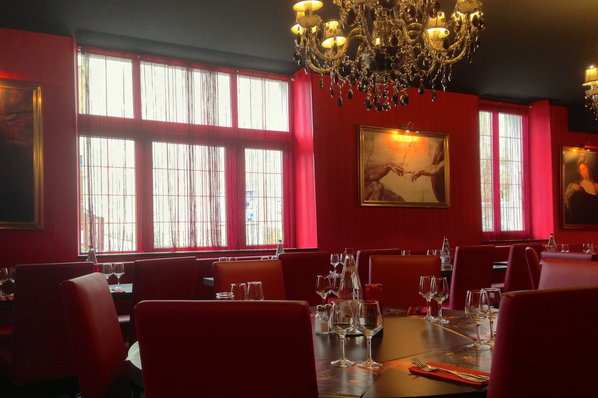
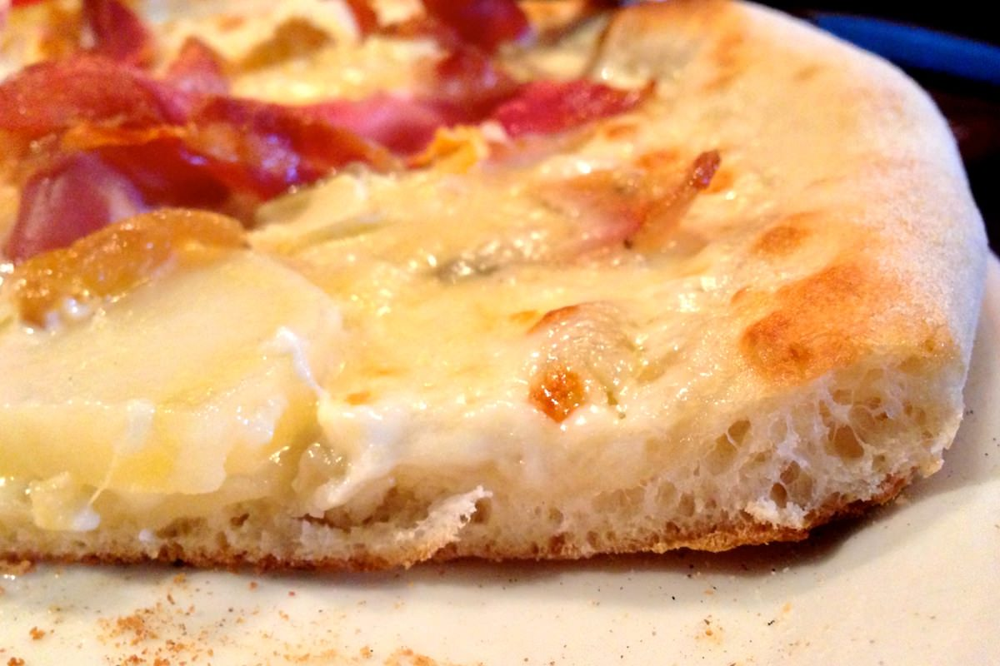
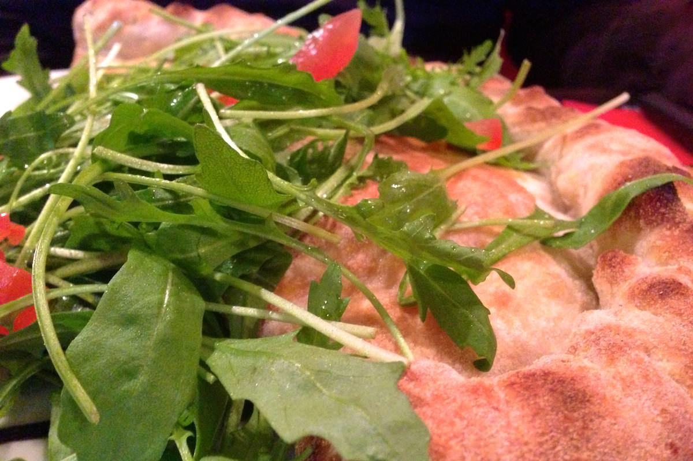
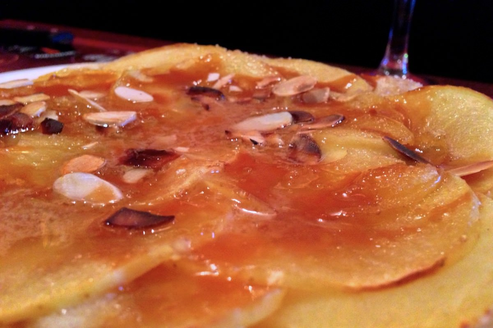

+++
type = "post"
titre = "Le Barocco à Saint-Nicolas-de-Macherin"
title = "Le Barocco à Saint-Nicolas-de-Macherin"
url = "/barocco-saint-nicolas-macherin"
date = "2012-12-01T20:47:48"
Lastmod = "2012-12-03T12:14:44"
cover = "barocco-saint-nicolas-macherin.jpg"
categorie = [ "À manger" ]
tag = [ "Ambiance", "Cuisine française", "Cuisine italienne", "Pizza" ]

+++

Le <strong><a href="http://www.pagesjaunes.fr/pros/53927940">Barocco</a></strong> est un restaurant italien à la décoration tendance et branchée qui semble avoir été placé au mauvais endroit. Loin des grandes villes, il se situe en effet à Saint-Nicolas-de-Macherin, un petit village de la campagne voironnaise, à une bonne demi-heure de Grenoble et une heure de Lyon. Un choix étonnant pour cette adresse assez classique, mais qui propose une cuisine de bonne qualité.

Le contraste est saisissant dès la façade. Situé sur la place du village, en face de l’église et de la salle des fêtes, le <strong>Barocco</strong> impose son style baroque tendance rococo dès son nom, écrit en lettres fantaisistes. Un style qui tranche avec la façade en pierres brutes de la vieille maison qui héberge le restaurant. À l’intérieur, le dépaysement est total : les propriétaires du lieu ont opté pour l’outrance avec des murs totalement rouges qui tranchent avec un sol complètement noir. Au plafond, des lustres baroques flamboyants, tandis que des vraies copies de toiles de maîtres italiens complètent la décoration. Difficile d’imaginer que l’on a affaire à une adresse campagnarde, le <strong>Barocco</strong> joue la carte du décalage à fond. En ce samedi midi, la salle est bien vide et les quelques personnes présentes sont venues manger en famille, avec des enfants. La salle assez grande peut accueillir pas mal de couverts et l’ambiance doit alors être plus bruyante, mais les clients étaient, ce jour-là, assez tranquilles, nonobstant quelques cris d’enfants.

La carte du <strong>Barocco</strong> ne joue pas autant dans l’excentricité que sa décoration de salle le laissait espérer. On y trouve des classiques de la cuisine italienne, certes, mais pas seulement. Le restaurant propose un large choix de pizzas, mais aussi de calzones, de la basique Margharita jusqu’aux recettes qui tentent la cuisine locale, à l’image de cette pizza au reblochon et aux pommes de terre qui entend imiter l’esprit de la tartiflette. Bizarrement, cette carte n’est pas qu’italienne, loin de là : on y trouve en fait un peu de tout, des pâtes et risottos bien sûr, mais aussi des plats traditionnels français, voire lyonnais. Dans l’unique menu de près de 20 €, on trouve ainsi en entrée un gâteau de foies de volaille, tandis que la liste des plats de résistance contient une assiette de cuisses de grenouilles qui n’a plus grand-chose à voir avec l’Italie… Étonnant, mais les mentions &laquo;&nbsp;fait maison&nbsp;&raquo; un peu partout sur la carte rassurent sur la qualité de certains produits, notamment sur la page à pizza qui est annoncée comme étant faite sur place. 

Nos choix se sont portés vers la longue et alléchante liste de pizzas. On aura d’un côté une &laquo;&nbsp;Reblochonade&nbsp;&raquo; dans l’esprit de la tartiflette, et de l’autre une classique quatre fromages, mais en version Calzone. Les pizzas sont de bonne taille, sans être non plus exagérément grandes et leur garniture est généreuse, bref ce sont des pizzas appétissantes qui arrivent sur la table. Leur particularité, c’est justement la pâte. Le <strong>Barocco</strong> a opté non pas pour une pâte fine et molle, mais pour une pâte assez épaisse, mais bien croustillante. La préférence pour l’une ou l’autre dépend de choix personnels, mais le résultat ici est très séduisant, avec un aspect qui se rapproche du pain qui est loin d’être désagréable. Le reblochon de la pizza blanche était bien présent, un bon point, en revanche le Saint-Marcellin annoncé dans la quatre fromages ne se faisait pas connaître, dommage, d’autant que la sauce tomate elle aussi maison est très bonne. Ajoutons que si cette pâte épaisse séduit sur une pizza traditionnelle, elle devient un peu trop présente sur un chausson – heureusement qu’il est servi avec une petite salade.

Côté desserts, le <strong>Barocco</strong> se démarque avec deux pizzas sucrées, l’une au Nutella et à la banane, l’autre aux pommes et au caramel. C’est cette dernière qui a eu notre faveur et c’était une réussite : les pommes et le caramel accompagnaient très bien la pâte à pizza, tandis que le calvados flambé à la table apportait une touche corsée bienvenue. Un excellent dessert, mais à partager à deux, surtout après une pizza : même si la taille est plus réduite, ce dessert n’est vraiment pas très léger et la pâte assez épaisse là encore ne facilite pas les choses. À côté de ces deux pizzas sucrées, on retrouve les incontournables de la cuisine italienne et notamment de savoureux tiramisus qui changent en plus en fonction de la saison (poire et chocolat en hiver, mais fruits rouges en été).

Le <strong>Barocco</strong> est une adresse atypique, incontestablement, mais qui mérite de s’y intéresser. Le restaurant est discrètement placé au cœur d’un petit village et il propose une cuisine plutôt urbaine, classique et séduisante à la fois. Ne venez pas y chercher de l’inventivité, le <strong>Barocco</strong> entend plutôt offrir des valeurs sûres et c’est plutôt efficace. 

