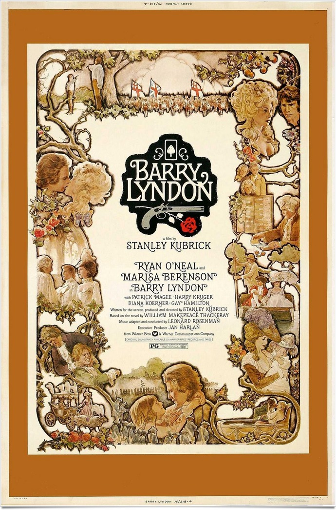
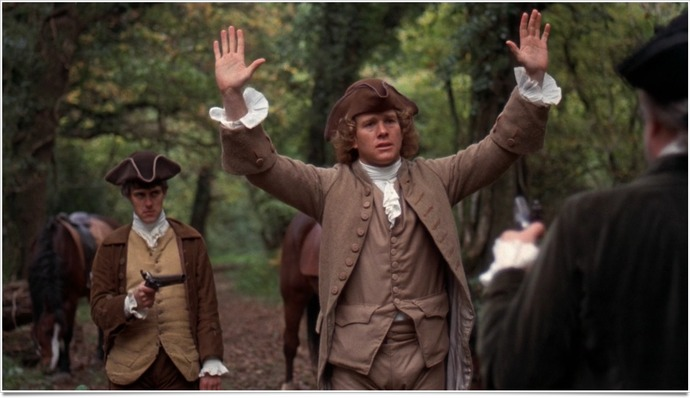
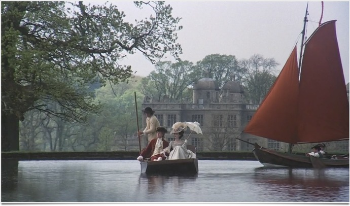

+++
type = "post"
titre = "<em>Barry Lyndon</em>, Stanley Kubrick"
title = "Barry Lyndon, Stanley Kubrick"
url = "/barry-lyndon-kubrick"
date = "2011-05-22T01:51:19"
Lastmod = "2014-02-12T08:49:32"
cover = "barry-lyndon-kubrick.jpg"
categorie = [ "À voir" ]
tag = [ "Drame", "Histoire", "Humour", "Société" ]
createur = [ "Stanley Kubrick" ]
acteur = [ "Hardy Krüger", "Marisa Berenson", "Patrick Magee", "Ryan O'Neal" ]
annee = [ "1975" ]
weight = 1975
pays = [ "États-Unis" ]

+++

Toute sa vie, Stanley Kubrick a rêvé de réaliser un film sur Napoléon Bonaparte. Ce film n&rsquo;a jamais vu le jour, mais le cinéaste était fin prêt à tourner ce qui aurait dû être son chef-d&rsquo;œuvre. Si les studios ont accordé un soutien financier aveugle après les premiers succès, le réalisateur n&rsquo;a plus la côte depuis le coûteux <em><a title="2001 : l’odyssée de l’espace, Stanley Kubrick" href="http://voiretmanger.fr/2011/08/07/2001-odyssee-espace-kubrick/">2001, Odyssée de l&rsquo;espace</a></em>, film mal compris à l&rsquo;époque par le grand public. Le dixième film de Stanley Kubrick est une sorte de vengeance suite à l&rsquo;échec du projet Napoléon, un plan B qui lui permet de faire un film au XVIIIe siècle. <em>Barry Lyndon</em> n&rsquo;a pourtant rien du film de seconde zone : cette fresque de trois heures a été également très mal comprise des contemporains, mais elle apparaît aujourd&rsquo;hui sans aucun doute comme un des meilleurs films de Stanley Kubrick. Un chef-d&rsquo;œuvre à (re)voir…

Séparé en deux parties bien distinctes, <em>Barry Lyndon</em> propose une structure très classique héritée du roman qui a été adapté ici par Stanley Kubrick, <em>Les Mémoires de Barry Lyndon</em> de William Makepeace Thackeray. La première partie est nommée &laquo;&nbsp;Comment Redmond Barry a acquis la manière et le titre de Barry Lyndon&nbsp;&raquo; et elle évoque sans surprise l&rsquo;ascension sociale de Redmond Barry, Irlandais sans le sou au cœur du XVIIIe siècle. La seconde partie, &laquo;&nbsp;Relation des malheurs et désastres qui menèrent Barry Lyndon à sa chute.&nbsp;&raquo;, évoque quant à elle la chute sociale du même Redmond. Structure pyramidale assez conventionnelle qui exclut tout suspense : sans détailler la fin du film, il ne fait guère de doute d&rsquo;entrée de jeu qu&rsquo;elle ne sera pas positive, en tout cas pas au sens que l&rsquo;espère le personnage principal. <em>Barry Lyndon</em> ouvre sur un duel qui tue le père de Redmond et le laisse seul avec sa mère. Alors que le jeune homme découvre l&rsquo;amour, son entourage ne lui parle que d&rsquo;argent et un premier duel le force à quitter la région de son enfance pour Dublin. Dépouillé sur la route, il s&rsquo;engage dans l&rsquo;armée britannique et part servir la Couronne sur le continent, alors que la <a href="http://fr.wikipedia.org/wiki/Guerre_de_Sept_Ans">guerre des Sept Ans</a> bat son plein. Quelques péripéties plus tard, le voici au plus près des hauts de ce monde, fréquentant la noblesse qu&rsquo;il rêve de rejoindre. Il rencontre alors la bientôt veuve Lyndon qu&rsquo;il épouse un an après et atteint enfin le niveau social qu&rsquo;il voulait. L&rsquo;apogée n&rsquo;est que de courte durée et bien vite les évènements se tournent contre Barry Lyndon…

Film historique, <em>Barry Lyndon</em> est un modèle du genre du film en costumes. Fidèle à son habitude, Stanley Kubrick a amassé une masse considérable de connaissances et informations sur l&rsquo;époque, plus qu&rsquo;à l&rsquo;accoutumée même puisque ces informations devaient servir à l&rsquo;origine pour <em>Napoléon</em>. Ces informations sont mises à profit dans le film, avec une précision dans les costumes, le mode de vie de l&rsquo;époque, les cultures… Kubrick disait alors qu&rsquo;il voulait réaliser un documentaire situé au XVIIIe siècle et les scènes de bataille en particulier sont très réalistes. Le film devait absolument paraître crédible pour intéresser les spectateurs et Stanley Kubrick a pris comme toujours beaucoup de temps en amont du tournage, pour le préparer et choisir avec soin les lieux. Ce choix a de nombreuses conséquences techniques, mais la plus importante est sans doute que le film est (presque) tourné entièrement en lumières naturelles, sans éclairages additionnels. Les plans extérieurs utilisent la lumière naturelle, tandis que les décors intérieurs ne sont pas des décors de studio, mais de vraies pièces de château ou de chaumière éclairées uniquement à la bougie. Certes, ce procédé nuit un peu au réalisme puisqu&rsquo;il était inconcevable à l&rsquo;époque, même chez les plus riches, de placer autant de bougies dans une même pièce, mais l&rsquo;effet de réalisme que procure ce choix est réel. De manière générale, <em>Barry Lyndon</em> sonne vraie, il n&rsquo;est jamais dans le vieillot un peu kitsch, on s&rsquo;y croirait, que ce soit sur le champ de bataille ou dans les salons à la mode.

Réalisme historique, certes, mais <em>Barry Lyndon</em> est d&rsquo;abord l&rsquo;adaptation d&rsquo;un roman picaresque et le film s&rsquo;avère très littéraire. Tous les films de Stanley Kubrick ou presque sont des adaptations d&rsquo;œuvres littéraires, mais <em>Barry Lyndon</em> est peut-être son film le plus écrit, et peut-être aussi celui qui s&rsquo;éloigne le moins de l&rsquo;œuvre originale. Stanley Kubrick a quand même largement modifié le roman : il change complètement la fin, ajoute et supprime des personnages parfois importants et surtout il change le point de vue. Le roman était écrit à la première personne, mais le film est raconté par un narrateur externe et omniscient. Reprenant une idée déjà exploitée par le cinéaste dans <em><a href="http://voiretmanger.fr/2011/05/15/ultime-razzia-kubrick/">L&rsquo;Ultime Razzia</a></em>, ce narrateur juge les évènements montrés dans le film et il juge, souvent de manière assez dure, le héros. Le narrateur n&rsquo;hésite pas à se moquer, à montrer son mépris pour ce jeune parvenu qui cherche à tout prix la particule. Pour montrer à quel point Redmond est ridicule, il va même jusqu&rsquo;à… raconter la suite. L&rsquo;effet est déroutant quand on découvre <em>Barry Lyndon</em> pour la première fois : Kubrick se permet à plusieurs reprises de raconter ce qui se passe quelques minutes après, désamorçant là encore toute idée de suspense ; le film montre aussi bien à quel point Barry était déterminé à échouer. Le narrateur est très présent dans <em>Barry Lyndon</em>, c&rsquo;est un personnage à part entière qui a le plus de lignes de dialogue dans le film, beaucoup plus que le héros qui reste finalement discret. Sa présence est précisément ce qui donne au film son aspect littéraire, mais elle est aussi responsable de l&rsquo;humour, omniprésent dans <em>Barry Lyndon</em>. Si le ton est globalement dramatique, voire tragique, le film s&rsquo;avère aussi assez drôle, d&rsquo;un humour pince-sans-rire à l&rsquo;anglaise. On pense au <em>Tristram Shandy</em> de Sterne, ou en français à Stendhal qui a l&rsquo;habitude d&rsquo;utiliser des narrateurs moqueurs envers &laquo;&nbsp;notre héros&nbsp;&raquo; (Fabrice dans <em>La Chartreuse de Parme</em>, par exemple). <em>Barry Lyndon</em> n&rsquo;est pas une comédie, assurément, mais l&rsquo;humour est un aspect essentiel qui rend le film très plaisant.

Stanley Kubrick s&rsquo;est peut-être résolu dans les années 1970 à ne pas tourner son <em>Napoléon</em>, mais cela ne veut pas dire qu&rsquo;il a abandonné les idées ambitieuses. En témoigne son dixième film : <em>Barry Lyndon</em> a nécessité un budget énorme pour l&rsquo;époque et son tournage s&rsquo;est déroulé sur une année entière. Toujours plus perfectionniste, le réalisateur n&rsquo;hésite jamais à refaire des prises : plus de 50 pour la scène de la mort de l&rsquo;enfant, par exemple. On n&rsquo;est pas encore au niveau de <em><a href="http://voiretmanger.fr/2011/04/17/shining-kubrick/">Shining</a></em> pour le nombre de prises, ou d&rsquo;<em><a href="http://voiretmanger.fr/2011/05/01/eyes-wide-shut-kubrick/">Eyes Wide Shut</a></em> pour la durée du tournage, mais le cinéaste renforce son image de perfectionniste. Le résultat est, il faut le dire, à la hauteur de ce travail monstrueux. Le choix de tourner en lumière naturelle a contraint Stanley Kubrick a répondre à des problèmes techniques majeurs (il utilise finalement un objectif de la NASA pour les scènes d&rsquo;intérieur) qui ont participé à leur tour à l&rsquo;élaboration du film : les plans en intérieur sont éclairés par de nombreuses bougies, la caméra se concentre sur un ou deux personnages au premier plan, des personnages qui restent le plus souvent statiques. Ce travail technique ne prend néanmoins jamais le dessus et <em>Barry Lyndon</em> évite le phénomène de la démonstration technique, même si on peut tout de même admirer de splendides plans dans la nature, ou à la bougie.

Comment évoquer <em>Barry Lyndon</em> sans parler de sa musique ? Comme souvent chez Stanley Kubrick, elle joue un rôle essentiel dans le film, elle devient même un personnage à part entière. On pourrait en fait écrire un article entier sur l&rsquo;utilisation de la musique dans ce film : le cinéaste compose un patchwork à partir de chansons traditionnelles irlandaises et de grands compositeurs. Mozart, Bach ou Vivaldi sont au rendez-vous, mais c&rsquo;est surtout Haëndel et Schubert qui offrent au film son identité sonore. La &laquo;&nbsp;Sarabande&nbsp;&raquo; du premier sert à tous les duels qui ponctuent le film à intervalles réguliers. Le second offre des morceaux splendides (<em>Trio en Mi Bémol Majeur (Op 100)</em>) au piano, violon et violoncelle qui illustrent parfaitement la naissance du sentiment amoureux ou bien la chute finale. C&rsquo;est sobre, intense, brillant : la <a href="http://www.amazon.fr/gp/product/B000006SR1/ref=as_li_ss_tl?ie=UTF8&#038;tag=leblogdenic07-21&#038;linkCode=as2&#038;camp=1642&#038;creative=19458&#038;creativeASIN=B000006SR1">bande originale du film</a> mérite d&rsquo;être écoutée pour elle-même.

Comme <em>2001, Odyssée de l&rsquo;espace</em> avant lui, <em>Barry Lyndon</em> a été un échec commercial cuisant. Le public de 1975 n&rsquo;a pas compris ce film lent, il n&rsquo;a pas apprécié sa beauté visuelle, il n&rsquo;a pas adhéré à ce film qui se voulait documentaire historique. Ce manque de succès en salles conduit Stanley Kubrick à chercher à satisfaire un plus grand public avec <em>Shining</em>, mais son film d&rsquo;époque mal-aimé a depuis été considéré comme un de ses plus grands films. Au-delà des aspects techniques, <em>Barry Lyndon</em> est une histoire, certes classique, mais très bien menée d&rsquo;une ascension sociale puis de son échec. Un film à (re)voir, sans hésitation.

<h3>Vous voulez m&rsquo;aider ?<a href="#footnote_0_4848" id="identifier_0_4848" class="footnote-link footnote-identifier-link" title="&Agrave; propos de la publicit&eacute;&hellip;">1</a></h3>
<ul>
<li><a href="http://www.amazon.fr/gp/product/B004LS7G6S/ref=as_li_ss_tl?ie=UTF8&#038;tag=leblogdenic07-21&#038;linkCode=as2&#038;camp=1642&#038;creative=19458&#038;creativeASIN=B004LS7G6S">Acheter le film en Blu-Ray sur Amazon</a></li>
<li><a href="http://www.amazon.fr/gp/product/B00005NDRX/ref=as_li_ss_tl?ie=UTF8&#038;tag=leblogdenic07-21&#038;linkCode=as2&#038;camp=1642&#038;creative=19458&#038;creativeASIN=B00005NDRX">Acheter le film en DVD sur Amazon</a></li>
<li><a href="https://itunes.apple.com/fr/movie/barry-lyndon/id382993726">Acheter ou louer le film sur l&rsquo;iTunes Store</a></li>
</ul>

<ol class="footnotes"><li id="footnote_0_4848" class="footnote"><a href="http://voiretmanger.fr/a-propos/publicite/">À propos de la publicité…</a> [<a href="#identifier_0_4848" class="footnote-link footnote-back-link">&#8617;</a>]</li></ol>
