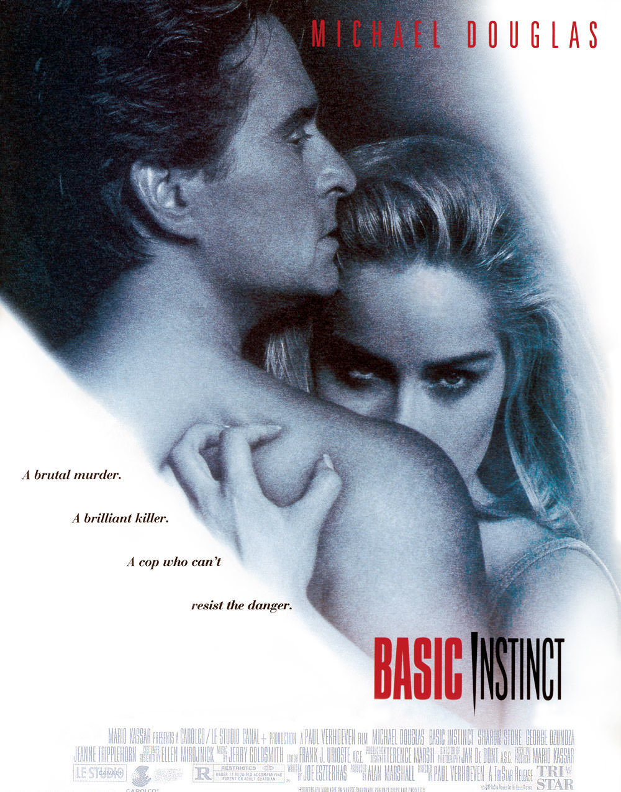

+++
titre = "<em>Basic Instinct</em>, Paul Verhoeven"
title = "Basic Instinct, Paul Verhoeven"
url = "/basic-instinct-verhoeven"
date = "2013-12-21T00:08:57"
Lastmod = "2013-12-21T00:12:15"
cover = "basic-instinct-sharon-stone-verhoeven.jpg"
categorie = [ "À voir" ]
tag = [ "Enquête", "Homosexualité", "Police", "Psychologie", "Sexe", "Thriller" ]
createur = [ "Paul Verhoeven" ]
acteur = [ "George Dzundza", "Jeanne Tripplehorn", "Michael Douglas", "Sharon Stone" ]
annee = [ "1992" ]
weight = 1992
pays = [ "États-Unis", "France" ]

+++

Rares sont les films qui peuvent se targuer, comme <em>Basic Instinct</em>, d’avoir être connu grâce à une seule scène. Ici, celle de l’interrogatoire est restée dans les annales au point qu’elle a été détournée des milliers de fois et pour à peu près tout et n’importe quoi. Quand le long-métrage réalisé par Paul Verhoeven sort, en 1992, la polémique fait rage. On lui reproche son érotisme cliché ou encore son traitement suspect de l’homosexualité féminine.  Avec le temps, la polémique s’oublie et il reste un thriller teinté d’érotisme, mais surtout porté par des personnages extrêmement travaillés sur le plan psychologique. <em>Basic Instinct</em> n’est sans doute pas très original, mais son efficacité hors pair en fait un divertissement très efficace, une vingtaine d’années après. 

Paul Verhoeven ouvre son film sur une scène de meurtre. Un homme fait l’amour à une blonde que l’on imagine magnifique et qui contrôle la situation. À un moment donné, elle l’attache au lit pour mieux le trucider à coups de pic à glace. Ce meurtre violent attire la police et c’est Nick Curran, un flic usé par son métier et surtout par un drame survenu quelques années plus tôt, qui se charge de l’affaire. <em>Basic Instinct</em> ne montre pas vraiment le visage de la tueuse dans cette scène et le long-métrage prend grand soin d’entretenir le doute pendant plus de deux heures sur l’identité de la coupable. De fait, le scénario introduit très rapidement la suspecte numéro un en la personne de Catherine Trammell, écrivaine à succès qui a justement publié peu avant un thriller dans lequel un homme meurt sous les coups d’un pic de glace. Une proximité troublante avec l’enquête lancée par Nick et qui ne s’arrête pas là : l’identité du meurtrier est similaire et quelques détails sont identiques. Catherine a-t-elle tué cet homme et utiliserait-elle son livre en guise d’alibi ? Ou bien est-elle la victime d’une meurtrière qui se couvrirait en reprenant les idées de son livre ? La question reste ouverte quasiment jusqu’à la toute fin, mais au fond, ce n’est pas l’essentiel. 

Plus qu&rsquo;un vrai policier où l’enjeu est véritablement de découvrir qui est le tueur, <em>Basic Instinct</em> est plutôt un thriller psychologique d’une redoutable efficacité. On évoquait en préambule la scène d’interrogatoire qui n’a pas volé sa popularité : elle est incontestablement remarquable, par le niveau de tension qu’elle maintient pendant plusieurs minutes. Il faut saluer la performance de Sharon Stone qui, plus que Michael Douglas en policier, impressionne dans ce rôle de romancière manipulatrice. Sans même parler de ses formes avantageuses, elle perce ses interlocuteurs du regard et déstabilise les policiers en un claquement de doigts, comme si c’était sa nature profonde. La réussite est indéniable et le reste est nécessairement un cran en dessous, mais Paul Verhoeven s’en sort bien dans l’ensemble avec ce scénario bien ficelé. Le rythme tombe un peu vers la fin et les quelques tentatives de relancer le suspense semblent alors un peu artificielles, mais ce n’est pas très grave. L’intrigue n’étant pas au cœur des enjeux, on prend du plaisir à suivre ces personnages et à découvrir au fur et à mesure comment cette femme qui semble de plus en plus la coupable idéale parvient à s’en sortir. <em>Basic Instinct</em> tient entièrement grâce à ce personnage et à la performance de son actrice. Certes, la vision des femmes en général, de l’homosexualité féminine en particulier, est assez rétrograde, mais ce n’est pas une raison suffisante pour oublier complètement le long-métrage. La tension psychologique suffit à justifier de le (re)voir et on peut au passage relever que la <a href="https://itunes.apple.com/fr/album/basic-instinct/id259010612">bande originale</a>, très expressive, fait elle aussi beaucoup pour maintenir la tension.

Vingt ans après, les modes vestimentaires, les décors et les voitures ont bien changé, mais <em>Basic Instinct</em> n’a pas perdu de son intensité psychologique et de son efficacité assez redoutable. Le long-métrage vaut mieux que pour sa seule scène d’interrogatoire, même si Paul Verhoeven atteint indéniablement des sommets pendant ces minutes où le spectateur est enfermé avec une manipulatrice de premier ordre. Michael Douglas et surtout Sharon Stone sont exceptionnels et l’ensemble est un spectacle prenant et divertissant. À (re)voir sans hésiter…

<h3>Vous voulez m&rsquo;aider ?<a href="#footnote_0_10761" id="identifier_0_10761" class="footnote-link footnote-identifier-link" title="&Agrave; propos de la publicit&eacute;&hellip;">1</a></h3>
<ul>
<li><a href="http://www.amazon.fr/gp/product/B001BXN8ZE/ref=as_li_ss_tl?ie=UTF8&#038;tag=leblogdenic07-21&#038;linkCode=as2&#038;camp=1642&#038;creative=19458&#038;creativeASIN=B001BXN8ZE">Acheter le film en Blu-Ray sur Amazon</a></li>
<li><a href="http://www.amazon.fr/gp/product/B00004VY25/ref=as_li_ss_tl?ie=UTF8&#038;tag=leblogdenic07-21&#038;linkCode=as2&#038;camp=1642&#038;creative=19458&#038;creativeASIN=B00004VY25">Acheter le film en DVD sur Amazon</a></li>
<li><a href="https://itunes.apple.com/fr/movie/basic-instinct/id435231291">Acheter ou louer le film sur l&rsquo;iTunes Store</a></li>
</ul>

<ol class="footnotes"><li id="footnote_0_10761" class="footnote"><a href="http://voiretmanger.fr/soutien/">À propos de la publicité…</a> [<a href="#identifier_0_10761" class="footnote-link footnote-back-link">&#8617;</a>]</li></ol>
