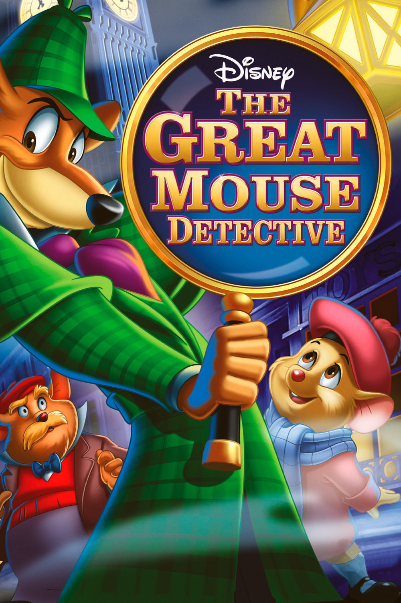
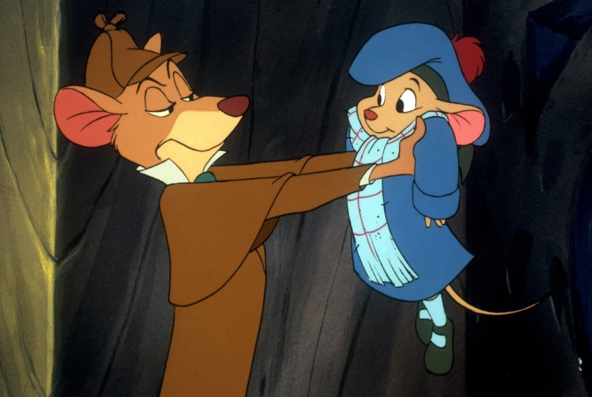
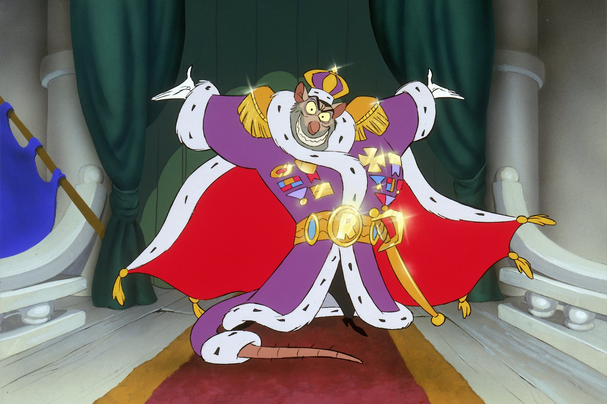

+++
titre = "<em>Basil, détective privé</em>, Ron Clements, Burny Mattinson, David Michener et John Musker"
title = "Basil, détective privé, Ron Clements, Burny Mattinson, David Michener et John Musker"
url = "/basil-detective-prive-clements-mattinson-michener-musker"
date = "2014-05-24T11:40:05"
Lastmod = "2014-05-24T11:43:58"
cover = "basil-detective-prive-disney.jpg"
categorie = [ "À voir" ]
tag = [ "Animation", "Animaux", "Aventure", "Enquête", "Famille", "Sherlock Holmes" ]
createur = [ "Burny Mattinson", "David Michener", "John Musker", "Ron Clements", "Walt Disney" ]
annee = [ "1986" ]
weight = 1986
saga = [ "Classiques d'animation Disney" ]
pays = [ "États-Unis" ]
original = "The Great Mouse Detective"

+++

Avec <a href="http://voiretmanger.fr/taram-chaudron-magique-berman-rich/" title="Taram et le chaudron magique, Ted Berman et Richard Rich"><em>Taram et le chaudron magique</em></a>, les studios Disney ont voulu faire autre chose. Après une série de films animaliers qui commençaient tous à se ressembler, le vingt-cinquième <a href="http://voiretmanger.fr/saga/classiques-danimation-disney/">classique</a> partait sur une tout autre piste, un changement peut-être trop radical, d’autant qu’il n’était pas maîtrisé. Le résultat a été sans appel : un échec commercial et critique sans précédent pour les studios Disney. Pour les nouveaux dirigeants, les choses sont assez simples : si les longs-métrages d’animation ne sont plus rentables, autant arrêter les frais et se concentrer sur la télévision, les parcs d’attraction et autres produits dérivés. L’équipe qui prend la suite a donc un gros défi à relever : retrouver à tout prix la voie de la rentabilité. <em>Basil, détective privé</em> retrouve ainsi le penchant animalier du studio avec un film formaté pour plaire à la famille, mais qui devait coûter le moins cher possible. Ron Clements, Burny Mattinson, David Michener et John Musker n’ont pas signé le chef-d’œuvre Disney, mais ce nouveau classique est un divertissement sympathique a bien trouvé son public et assuré la pérennité du studio.

<em>Basil, détective privé</em> se déroule dans le Londres du XIXe siècle et suit les pas de Basil, qui est comme Sherlock Holmes un détective privé. La comparaison n’est pas innocente : ce long-métrage adapte en effet une série de livres pour enfants qui partaient du principe de raconter l’histoire du célèbre détective privé créé par Sir Arthur Conan Doyle. Walt Disney a repris l’idée à son compte et ce film évoque l’histoire d’un monde parallèle de souris : Basile vit dans la cave du vrai Sherlock et il doit empêcher un complot contre la reine… une autre souris qui vit dans Buckingham Palace. Le principe vous dira peut-être quelque chose, et pour cause : c’est très exactement celui des <a href="http://voiretmanger.fr/aventures-bernard-et-bianca-reitherman-stevens-lounsbery/" title="Les Aventures de Bernard et Bianca, Wolfgang Reitherman, Art Stevens et John Lounsbery"><em>Aventures de Bernard et Bianca</em></a> sorti près de dix ans auparavant. Après un long-métrage très original, le studio reprend les vieilles recettes qui ont fait leur preuve et annonce d’emblée la couleur avec cet air de déjà-vu que l’on connaît bien dans les productions des années 1980. Pour autant, le scénario de <em>Basil, détective privé</em> est plus surprenant, avec une construction assez complexe autour d’abord de l’enlèvement du père de la petite Olivia, puis du complot contre la reine. Puisqu’il s’agit d’une variation autour de Sherlock Holmes, l’histoire doit suivre quelques passages obligés qui ajoutent un peu d’originalité à l’ensemble. Ainsi, même si ce classique ne brille pas par son originalité, il reste plus intéressant que bon nombre de ses prédécesseurs et peut même être vu comme un jeu de pistes pour trouver toutes les références au vrai détective.

Pour la première fois peut-être, les studios Disney ont exploité ici un principe qui fait recette depuis, au point d’alimenter tous les films d’animation qui sortent. <em>Basil, détective privé</em> se construit au moins en partie sur les références et le décalage entretenu avec le vrai Sherlock Holmes. Passée l’introduction avec l’enlèvement du père, on retrouve le docteur Watson, ou plutôt ici Dawson, qui revient d’un service en Afghanistan. Même si les circonstances ne sont pas les mêmes, il cherche aussi à se loger à Londres et finit par trouver l’adresse du détective avec qui il trouve un arrangement. Le célèbre couple est né et la première rencontre est un clone quasiment parfait de la scène écrite par Sir Arthur Conan Doyle. Dans les deux cas, Sherlock analyse Watson et comprend qu’il est un ancien militaire et qu’il y travaillait comme médecin. Cette proximité est intéressante, même si elle ne parlera qu’aux adultes naturellement, mais c’est rare qu’un Disney soit aussi ouvert sur une autre œuvre. Ron Clements, Burny Mattinson, David Michener et John Musker multiplient d’ailleurs les clins d’œil, à la fois à l’œuvre originale et à d’autres longs-métrages du studio : on voit par exemple l’éléphant de <a href="http://voiretmanger.fr/dumbo-sharpsteen/" title="Dumbo, Ben Sharpsteen"><em>Dumbo</em></a> dans une scène. Un traitement plus mature peut-être, qui va de pair avec un méchant assez cruel : le professeur Ratigan, un clone de Moriarty bien sûr, est un rat qui n’hésite pas à tuer tous ceux qui le gênent et qui est loin du bouffon d’autres films. D’ailleurs, même si l’affiche originale du film <a href="http://fr.wikipedia.org/wiki/Basil,_détective_privé#Autour_du_film">annonçait</a> « <em>Tout nouveau ! Vraiment amusant !</em> », <em>Basil, détective privé</em> n’est pas une comédie et le film est assez sérieux, dans l’ensemble.

Techniquement assez banal avec une animation plutôt grossière — même si c’est la première à utiliser les ordinateurs pour générer toute une scène, celle du combat dans Big Ben —, <em>Basil, détective privé</em> n’est pas un grand film d’animation. Pour les studios Disney, ce retour au classicisme signe aussi le retour des bénéfices et dans la foulée, ils lancent la production de <em>La Petite Sirène</em>. Le vingt-sixième classique aura donc servi à assurer l’avenir du studio, mais c’est aussi un petit divertissement familial assez sympathique et qui parvient même à surprendre avec son traitement plus adulte qu’il n’y paraît.

<h3>Vous voulez <a href="http://voiretmanger.fr/soutien/">m’aider</a> ?</h3>
<ul>
<li><a href="http://www.amazon.fr/gp/product/B0000DD2ZQ/ref=as_li_ss_tl?ie=UTF8&amp;tag=leblogdenic07-21&amp;linkCode=as2&amp;camp=1642&amp;creative=19458&amp;creativeASIN=B0000DD2ZQ">Acheter le film en DVD sur Amazon</a></li>
<li><a href="https://itunes.apple.com/fr/movie/basil-detective-prive/id368945766">Acheter ou louer le film sur l’iTunes Store</a></li>
</ul>

