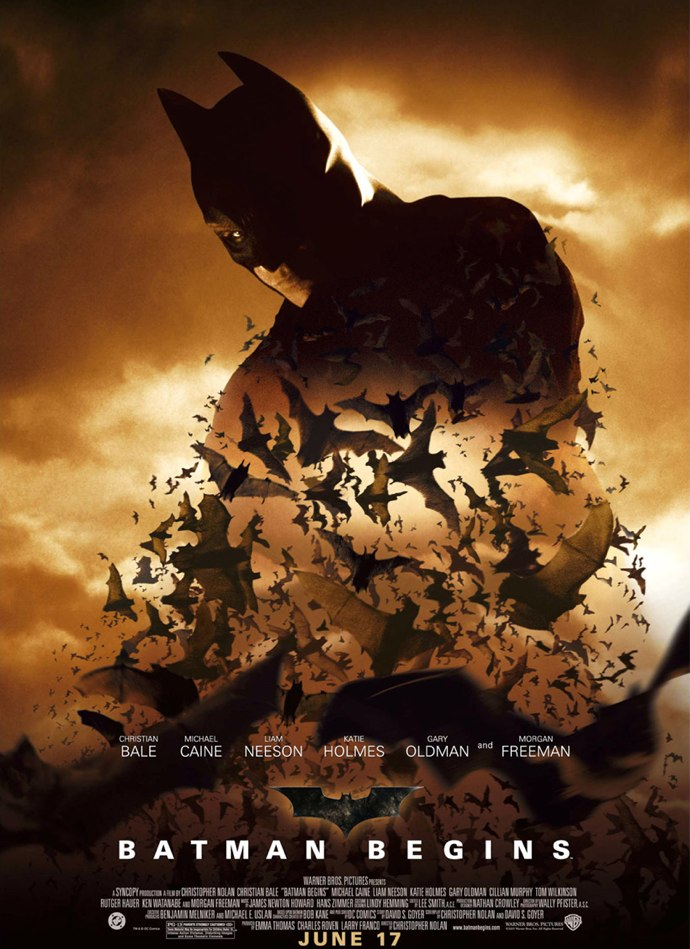
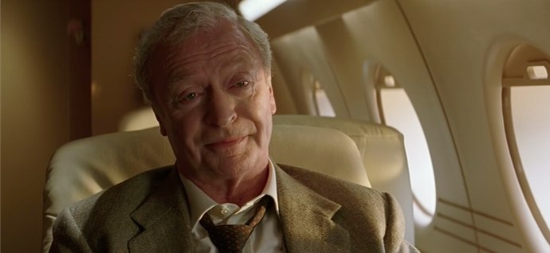
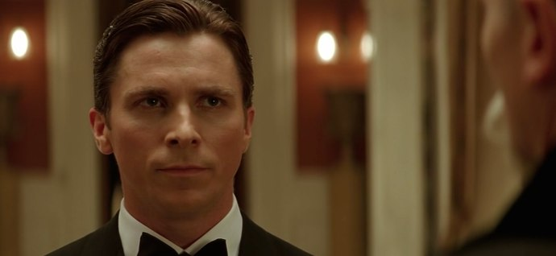
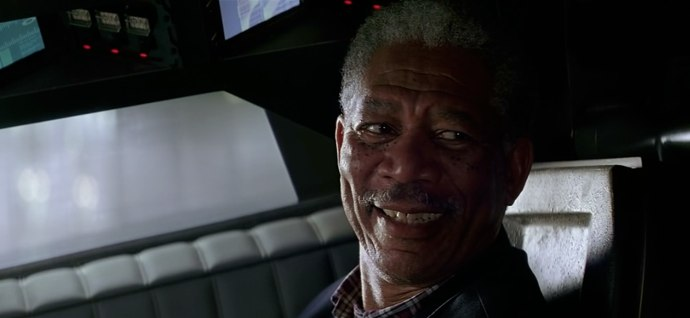
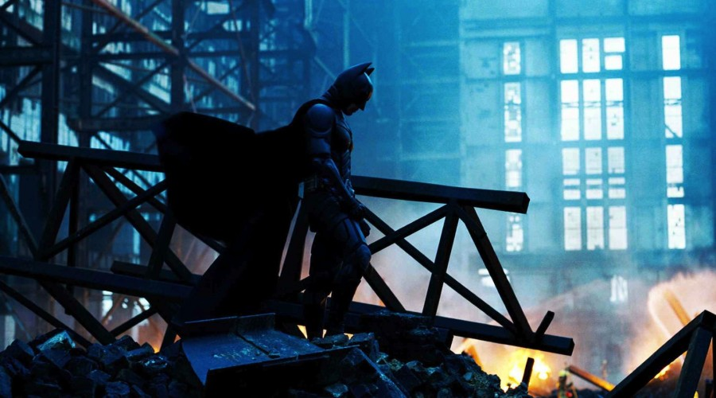

+++
type = "post"
titre = "Batman Begins, Christopher Nolan"
title = "Batman Begins, Christopher Nolan"
url = "/batman-begins-nolan"
date = "2010-08-30T00:03:11"
Lastmod = "2013-06-19T00:13:24"
cover = "nolan-batman-begins.jpg"
categorie = [ "À voir" ]
tag = [ "Batman", "Blockbuster", "Comics", "Mafia", "Société", "Terrorisme" ]
createur = [ "Christopher Nolan" ]
acteur = [ "Christian Bale", "Morgan Freeman" ]
annee = [ "2004" ]
weight = 2004
saga = [ "Batman (Christopher Nolan)" ]
pays = [ "États-Unis" ]

+++

Depuis <em><a href="http://voiretmanger.fr/2010/08/10/memento-nolan/">Memento</a></em> puis <em><a href="http://voiretmanger.fr/2010/08/23/insomnia-nolan/">Insomnia</a></em>, Christopher Nolan n&rsquo;est plus le réalisateur qui bricole des films indépendants, il est aussi devenu un réalisateur capable de faire des blockbusters. Et il le prouve avec <em>Batman Begins</em>, exercice d&rsquo;autant plus difficile que non content d&rsquo;embrasser les codes du blockbuster, Christopher Nolan choisi aussi l&rsquo;univers extrêmement codé du comics. Il aurait pu prendre un superhéros mineur, inconnu du grand public, mais il préfère se concentrer sur un personnage bien connu du grand public, qui a fait l&rsquo;objet déjà de nombreuses adaptations au cinéma dont l&rsquo;une, mythique, par Tim Burton : Batman. Un superhéros passionnant, peut-être même le plus intéressant, parce qu&rsquo;absolument et uniquement humain. Dès lors, commencer par les origines, c&rsquo;est-à-dire ce qui a conduit Bruce Wayne à devenir Batman, prend tout son sens. Quatre ans avant <a href="http://voiretmanger.fr/2012/07/18/dark-knight-nolan/" title="The Dark Knight, Christopher Nolan"><em>The Dark Knight</em></a>, Christopher Nolan livrait déjà une lecture noire et réaliste d&rsquo;un univers de comics. À (re)voir.

Raconter l&rsquo;origine, la naissance d&rsquo;un personnage, voilà un exercice apprécié des studios d&rsquo;Hollywood. Le très récent <em><a href="http://voiretmanger.fr/2010/05/14/robin-des-bois-scott/">Robin Hood</a></em> de Ridley Scott en est le dernier représentant et il permet bien de comprendre l&rsquo;intérêt de l&rsquo;industrie du cinéma. Il est vrai que comprendre la naissance d&rsquo;un mythe est aussi passionnant que fascinant. Comment un gars normal devient un personnage qui le dépasse, une légende qui transcende sa personne ? C&rsquo;est aussi ce que raconte <em>Batman Begins</em> qui ouvre sur un Bruce Wayne enfermé dans une prison quelque part en Asie, sans doute en Chine. On ne sait pas ce qu&rsquo;il fait là, mais d&rsquo;emblée le film montre sa force et sa maîtrise des arts martiaux, en même temps que sa volonté de détruire le mal partout où il peut se trouver. Un jour, un homme mystérieux arrive et l&rsquo;incite à rendre visite à un mystérieux sage censé le libérer de ses propres peurs et se dépasser. Libéré aussitôt, il part tout en haut de la montagne où il découvre une sorte de secte qui entend libérer le monde du mal, ce que Bruce voulait aussi faire. Mais il ne veut pas de leurs méthodes, brutales dirons nous : pour éradiquer le mal de Gotham City, ils veulent tout simplement tuer tous ses habitants. Croyant encore en la possibilité de sauver la ville, Bruce revient à Gotham City avec une seule idée en tête : éradiquer la mafia et la corruption. Pour cela, il ne veut pas utiliser son image de fils de, en l&rsquo;occurrence fils de la dynastie Wayne qui est une multinationale aux activités assez obscures, mais qui est en tout cas très riche, et c&rsquo;est bien l&rsquo;essentiel. Émerge alors l&rsquo;idée de Batman, symbole de la lutte contre le mal, non pas un homme, mais une certaine idée de la justice, un superhéros.

De manière traditionnelle, le film de Christopher Nolan plonge dans l&rsquo;enfance de son personnage pour trouver des raisons. La chauve-souris est ainsi liée à un traumatisme de l&rsquo;enfance : alors qu&rsquo;il devait avoir une petite dizaine d&rsquo;années, Bruce est tombé au fond d&rsquo;un puits qui abritait un passage vers une grotte pleine de chauves-souris. Effrayées par l&rsquo;impromptu, elles ont fait ce que tout être menacé fait, elles ont fui, effrayant au passage le garçon. Adulte, la phobie persiste, mais plutôt que de la fuir éternellement, il décide de l&rsquo;affronter et de l&rsquo;utiliser à son avantage pour effrayer ses adversaires. De même, sa volonté de sauver Gotham et d&rsquo;éradiquer le mal vient de son père qui luttait dans ce sens et a apporté des réponses sociales ou politiques, avec notamment la construction d&rsquo;un métro ou la création d&rsquo;un réseau d&rsquo;eau potable à l&rsquo;échelle de la ville entière. Mais elle vient surtout de cette nuit où, après avoir poussé ses parents à sortir de l&rsquo;opéra à cause de rôles de chauve-souris sur scène, ses deux parents sont tués par un malfrat, sous ses yeux. De cette mort, Bruce conserve toute sa vie une véritable haine pour le mal, mêlée d&rsquo;une volonté de justice légale qui lui vient peut-être de ce policier qui l&rsquo;a traité avec gentillesse. Ce même policier sera James Gordon, l&rsquo;allié de Batman au sein de la police. Manque à ce tableau Rachel, amie d&rsquo;enfance et tout est posé. Toute l&rsquo;histoire de Batman provient de son enfance, puis de son voyage initiatique en Asie. Vision on ne peut plus classique, peut-être même caricaturale, mais qui est traditionnelle dans les récits populaires, vaste catégorie où l&rsquo;on range sans hésiter les comics américains.

Dans la grande famille des superhéros nés de l&rsquo;imagination fertile d&rsquo;auteurs américains depuis les années 1950 essentiellement, Batman tient une place à part. C&rsquo;est en effet l&rsquo;un des rares superhéros, peut-être même le seul, à ne disposer d&rsquo;aucun pouvoir spécifique, surnaturel. Batman est simplement un Bruce Wayne équipé de technologies modernes hors de prix, mais rien ne le distingue sinon du commun des mortels. Certes, il faut être richissime pour être Batman, disposer si possible d&rsquo;une multinationale à son compte et pouvoir compter sur des aides précieuses, comme celle d&rsquo;un majordome dévoué, Alfred, ou d&rsquo;un excellent inventeur, Fox. Ces deux alliés sont indispensables à Batman, le dernier pour fournir au héros toutes les technologies les plus folles qui lui sont nécessaires, le premier pour le soutenir à tout moment, lui servir de couverture et à plusieurs reprises, sauver sa peau. Mais en dehors d&rsquo;accessoires et d&rsquo;alliés, parmi lesquels il ne faudrait oublier la ravissante Rachel et le lieutenant Gordon, Bruce Wayne est un Batman sans le masque. La majeure partie des superhéros jouent sur la dualité entre une vie civile plus ou moins normale, et une vie de héros assez éloignée de la norme. Avec Batman, la différence devient aussi ténue que peut l&rsquo;être un simple masque. Cela fait aussi de Batman le superhéros le plus fragile, celui qui peut craquer le plus facilement. Dans son apprentissage, il chute plusieurs fois, échoue et repart. <em>Batman Begins</em> est passionnant dans cette construction du superhéros, qui devient plutôt déconstruction du mythe forgé par des livres et des films. Ce film est un peu la recette qui a conduit au personnage que l&rsquo;on a déjà croisé, jusqu&rsquo;à l&rsquo;élaboration méthodique du costume ou des armes. Batman est très proche de vous et moi, et c&rsquo;est ce qui en fait tout l&rsquo;intérêt, c&rsquo;est ce qui rend son engagement aussi fort.

<em>Batman Begins</em> propose en fait deux ennemis pour le prix d&rsquo;un. Le premier est classique, il s&rsquo;agit de la mafia italienne qui a corrompu toute la ville. Le parrain, nommé Falcone, un qui n&rsquo;est pas sans rappeler un certain Corleone, vit de trafics de drogue, arrose tous ceux qui pourraient se dresser sur sa route et notamment des membres de la police ou de la justice. Ces méchants-là ne sont pas les plus intéressants, et ils sont d&rsquo;ailleurs rapidement évacués par le film avec l&rsquo;emprisonnement de Falcone. Un autre méchant, beaucoup plus inquiétant et original, prend alors la place. Ces méchants, ce sont évidemment ceux qui voulaient éradiquer Gotham City dans son ensemble. Ils entendent le faire d&rsquo;une manière inattendue, en déversant dans tous les réseaux d&rsquo;eau de la ville une substance qui, une fois transformée en vapeur, rend fou ceux qui l&rsquo;inhale. La transformation en vapeur doit se faire avec un mystérieux appareil volé à l&rsquo;entreprise Wayne, mais cela importe peu. Ce qui est intéressant, c&rsquo;est cette attaque chimique que redoutent tant tous nos dirigeants à l&rsquo;heure actuelle. Une attaque totalement incontrôlable, car transitant par les réseaux d&rsquo;eau potable, et indétectable sans une intervention extérieure. Quand celle-ci intervient, il est trop tard et Gotham City est sauvée vraiment de justesse et en détruisant une partie de son métro.

<em>The Dark Knight</em> est sans doute l&rsquo;adaptation de comics la plus noire que l&rsquo;on a pu voir ces dernières années au cinéma. <em>Batman Begins</em> annonçait déjà cette noirceur par son environnement très réaliste et sale. La ville de Gotham City notamment est très bien rendue, avec d&rsquo;un côté ses grattes-ciel archétypiques du CBD à l&rsquo;américaine, et d&rsquo;autre part ses bas quartiers pauvres, défoncés, mal fréquentés. On retrouve à la fois les images de ghettos américains, et la représentation de la ville dans bon nombre d&rsquo;œuvres de science-fiction, avec une évolution vers la pauvreté plus on s&rsquo;approche du niveau du sol. Ici, les méchants ne veulent pas détruire le monde, ils font des trafics de drogue où créent artificiellement une folie destructrice qui réveille l&rsquo;animal qui sommeille en tout homme. S&rsquo;ils sont encore motivés et rationnels, contrairement au Joker, ils sont quand même terrifiants par leur noirceur réaliste. Pourtant, il y a encore de la lumière, de l&rsquo;espoir. À ce stade, Bruce pense encore vraiment pouvoir vaincre le mal à Gotham City. Un premier coup a été porté, certes il reste encore du travail, mais lui et Gordon sont confiants sur l&rsquo;avenir quand le film se termine. Rachel a renouvelé son amour auprès de Bruce en lui promettant d&rsquo;attendre que Gotham n&rsquo;ait plus besoin de Batman et donc que Bruce redevienne pleinement lui-même. Les méchants ont vraiment été battus, la victoire est réelle, même si elle n&rsquo;a pas évité de nombreuses destructions, mais tout est clair dans <em>Batman Begins</em>. La carte du Joker annonce par contre la noirceur totale qui prévaudra quatre ans après, celle du méchant terrifiant car imprévisible et sans motif, celle de la victoire en demi-teinte où finalement tout le monde a gagné, ou a perdu. La noirceur n&rsquo;est pas encore totale, mais on la pressent déjà.

Avec le gros budget d&rsquo;Hollywood, Christopher Nolan ne peut plus se permettre les libertés formelles des débuts. <em>Batman Begins</em> est donc un film beaucoup plus classique sur la forme, avec à nouveau une structure rigoureusement linéaire, si l&rsquo;on met de côté les flashbacks sur l&rsquo;enfance. Pourtant, Christopher Nolan est loin d&rsquo;être un simple exécutant et il n&rsquo;a pas perdu son esprit de réalisateur. Il le prouve ici avec la multiplication des séquences en parallèle, un principe qu&rsquo;il exploitera aussi dans <em>The Dark Knight</em>, mais qui atteint bien sûr des sommets dans <em><a href="http://voiretmanger.fr/2010/07/17/inception-nolan/">Inception</a></em>. Le réalisateur n&rsquo;hésite pas à proposer au spectateur en même temps plusieurs éléments de l&rsquo;intrigue qui se déroulent en parallèle, dans des lieux différents par exemple. Ce procédé n&rsquo;est pas original, certes, mais il est difficile de maintenir la lisibilité nécessaire pour suivre l&rsquo;intrigue dans de bonnes conditions. Christopher Nolan a beaucoup appris depuis <em><a href="http://voiretmanger.fr/2010/08/02/following-nolan/">Following</a></em>, et il met ici en œuvre tout ce qu&rsquo;il a appris pour proposer aux spectateurs une histoire toujours parfaitement claire, passant d&rsquo;une scène à l&rsquo;autre sans jamais perdre en fluidité. Certes, le réalisateur est encore timide, mais lui qui n&rsquo;avait jusque-là réalisé que de &laquo;&nbsp;petits&nbsp;&raquo; films s&rsquo;en sort remarquablement bien aux manettes d&rsquo;une machine de guerre hollywoodienne.

<em>Batman Begins</em> est la première incursion de Christopher Nolan du côté du cinéma populaire et de l&rsquo;univers des comics. Pour un premier essai, le résultat est vraiment bon. Les choix de Batman, superhéros sans super pouvoirs, et de la formation de Batman se révèlent payants, tant ils offrent au film des éléments passionnants. <em>Batman Begins</em> est aussi un film sur l&rsquo;engagement, le dévouement pour une cause qui nous dépasse et qui nous consume. Mais Nolan n&rsquo;oublie pas le grand spectacle et fait défiler son histoire à toute allure pour notre plus grand plaisir. Plus convenu sur la forme, <em>Batman Begins</em> compense par sa noirceur réaliste qui, si elle reste teintée d&rsquo;espoir, reste rare dans les adaptations de comics. C&rsquo;est sans doute la patte Nolan, et ce n&rsquo;est pas pour me déplaire.

<h3 style="text-align: center;">Trilogie Batman par Christopher Nolan</h3>

<h3>Vous voulez m&rsquo;aider ?<a href="#footnote_0_3963" id="identifier_0_3963" class="footnote-link footnote-identifier-link" title="&Agrave; propos de la publicit&eacute;&hellip;">1</a></h3>
<ul>
<li><a href="http://www.amazon.fr/gp/product/B001927NAI/ref=as_li_ss_tl?ie=UTF8&#038;tag=leblogdenic07-21&#038;linkCode=as2&#038;camp=1642&#038;creative=19458&#038;creativeASIN=B001927NAI">Acheter le film en Blu-Ray sur Amazon</a></li>
<li><a href="http://www.amazon.fr/gp/product/B000BPYYJ2/ref=as_li_ss_tl?ie=UTF8&#038;tag=leblogdenic07-21&#038;linkCode=as2&#038;camp=1642&#038;creative=19458&#038;creativeASIN=B000BPYYJ2">Acheter le film en DVD sur Amazon</a></li>
<li><a href="http://itunes.apple.com/fr/movie/batman-begins/id366043746">Acheter ou louer le film sur l&rsquo;iTunes Store</a></li>
</ul>
<ul>
<li><a href="http://www.amazon.fr/gp/product/B008U6R9B4/ref=as_li_ss_tl?ie=UTF8&#038;tag=leblogdenic07-21&#038;linkCode=as2&#038;camp=1642&#038;creative=19458&#038;creativeASIN=B008U6R9B4">Acheter la trilogie complète en Blu-Ray sur Amazon</a></li>
<li><a href="http://www.amazon.fr/gp/product/B008U6R93C/ref=as_li_ss_tl?ie=UTF8&#038;tag=leblogdenic07-21&#038;linkCode=as2&#038;camp=1642&#038;creative=19458&#038;creativeASIN=B008U6R93C">Acheter la trilogie complète en DVD sur Amazon</a></li>
</ul>

<ol class="footnotes"><li id="footnote_0_3963" class="footnote"><a href="http://voiretmanger.fr/soutien/">À propos de la publicité…</a> [<a href="#identifier_0_3963" class="footnote-link footnote-back-link">&#8617;</a>]</li></ol>
