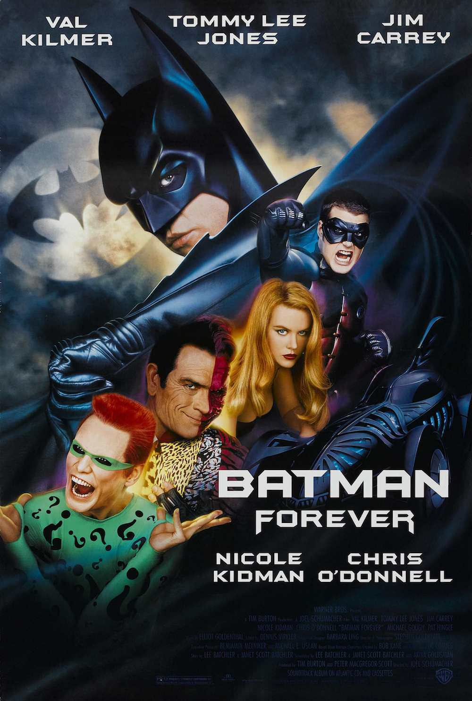
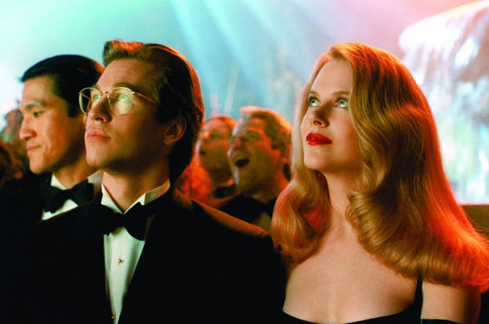

+++
type = "post"
titre = "<em>Batman Forever</em>, Joel Schumacher"
title = "Batman Forever, Joel Schumacher"
url = "/batman-forever-schumacher"
date = "2013-08-17T15:03:53"
Lastmod = "2013-08-17T15:14:41"
cover = "batman-forever-tommy-lee-jones-jim-carrey.jpg"
categorie = [ "À voir" ]
tag = [ "Blockbuster", "Comics", "Homosexualité", "Superhéros", "Vite oublié" ]
createur = [ "Joel Schumacher" ]
acteur = [ "Chris O'Donnell", "Jim Carrey", "Michael Gough", "Nicole Kidman", "Pat Hingle", "Tommy Lee Jones", "Val Kilmer" ]
annee = [ "1995" ]
weight = 1995
saga = [ "Batman" ]
pays = [ "États-Unis" ]

+++

Jugé trop sombre, Tim Burton est remercié par les producteurs qui souhaitent ouvrir la <a href="/saga/batman/">saga <em>Batman</em></a> à un autre public, plus familial. Alors même que <a href="/batman-burton/" title="Batman, Tim Burton"><em>Batman</em></a> et <a href="/batman-defi-burton/" title="Batman, le défi, Tim Burton"><em>Batman, le défi</em></a> ont été des succès sur le plan commercial, le cinéaste est remplacé par Joel Schumacher avec cet objectif simple : oublier la noirceur de son prédécesseur. Mécontent de cette nouvelle direction, Michael Keaton abandonne aussi le projet et c’est Val Kilmer qui donne un nouveau visage au superhéros ailé. Le résultat, <em>Batman Forever</em>, est un long-métrage très étrange qui semble constamment tendre vers la parodie sans l’adopter totalement. Un film assez bordélique avec deux méchants outranciers en face de héros assez creux. Une suite assez médiocre, que l’on peut oublier sans peine.

Plutôt que de choisir la voie du <em>reboot</em> comme Christopher Nolan le fera dix ans après, Joel Schmacher offre à la saga une suite. <em>Batman Forever</em> est ainsi censé se dérouler après les évènements de <em>Batman, le défi</em>, mais cela n’a en fait aucune importance. Ce nouvel épisode n’entretient que très peu de liens avec son prédécesseur, jusqu’aux personnages qui changent tous à une ou deux exceptions près. En fait, seuls Alfred, le fidèle serviteur de Batman, et le commissaire Gordon gardent leurs acteurs puisque Michael Gough et Pat Hingle les reprennent respectivement pour la troisième fois. Pour le reste, l’équipe est nouvelle et même si Tim Burton reste en tant que producteur, le cinéaste change beaucoup de choses, tout en conservant en partie l’univers imaginé par son prédécesseur. Même si <em>Batman Forever</em> est effectivement moins sombre, il retrouve le Gotham gothique imaginé pour <em>Batman</em>, ce qui provoque un contraste surprenant lors des séquences plus colorées. Car de la couleur, il y en a : Joel Schumacher a choisi d’en ajouter partout, de la Batmobile éclairée par des néons bleus, aux deux méchants (l’un vert, l’autre rouge/violet), en passant bien sûr par l’éclairage de ses scènes qui sont souvent monochromes. L’ensemble a un côté kitsch assez étonnant, dans ce film qui hésite souvent entre sérieux et parodie, et entre réalisme et animation parfois grossière. Tous les plans de Gotham sont, à cet égard, si mal rendus à l&rsquo;ordinateur que l&rsquo;on a l&rsquo;impression de se retrouver dans le comics original.

Au fond, c’est le principal problème de ce <em>Batman Forever</em> : est-ce un film sérieux ou une parodie ? Si Joel Schumacher a voulu faire une parodie, il ne le montre jamais et n’a laissé aucun indice de second degré. Certes, il s’agit d’un film de superhéros et les incohérences sont légion, mais le récit ne va pas dans tous les sens et reste dans l’ensemble crédible. Reste que le cinéaste se permet quelques scènes tellement folles que l’on peine à y croire, ni même à croire le sérieux de l’ensemble. C’est Double-Face qui officie d’abord comme méchant et Tommy Lee Jones d’ordinaire plutôt sobre l’interprète ici avec un déchainement rare. Ajoutons à cela un maquillage outrancier qui peine à être crédible et on obtient un personnage qui pourrait être une parodie de méchant. À ses côtés, Jim Carey interprète un savant fou en multipliant les grimaces comme il sait bien le faire, mais ce duo en fait en permanence toujours trop. On est presque gêné devant ce déferlement de n’importe quoi qui ne s’arrête pas aux deux méchants, mais qui contamine tout <em>Batman Forever</em>. Certaines séquences sont kitsch et manquent de tout réalisme, les dialogues sont le plus souvent médiocres avec quelques séquences qui évoquent quasiment le mauvais porno. Rien, ou presque, n’est réussi dans cette suite et Joel Schumacher tombe systématiquement à côté, ou presque. On pourrait encore évoquer le cas de Robin — Chris O’Donnell — en qui on ne croit jamais, mais qui devient en une demi-seconde l’égal de Batman ; il faut dire un mot de Batman, incarné par un Val Kilmer qui semble ne jamais croire à son interprétation ou au film et qui reste toujours impassible. À ses côtés, Nicole Kidman se lâche, quitte à en faire souvent trop du côté de la séduction. On pourrait aussi toucher un mot de la <a href="http://www.amazon.fr/gp/product/B000002J4P/ref=as_li_ss_tl?ie=UTF8&tag=leblogdenic07-21&linkCode=as2&camp=1642&creative=19458&creativeASIN=B000002J4P">bande originale</a> envahissante et sans originalité, mais <em>Batman Forever</em> en a sûrement déjà suffisamment pris pour son grade.

Donner une suite aux deux épisodes de la saga réalisés par Tim Burton n’était pas une mauvaise idée. Changer la série d’orientation en l’ouvrant à un public plus large n’était pas forcément non plus une mauvaise piste, mais peut-être aurait-il mieux valu repartir de zéro. En essayant de poursuivre le travail de son prédécesseur, Joel Schumacher se plante et réalise un film un peu bordélique, qui hésite entre sérieux et parodie. <em>Batman Forever</em> n’est malheureusement ni l’un ni l’autre et ce n’est pas un très bon épisode, mais le succès public est au rendez-vous, plus encore que pour les deux précédents. Suffisamment en tout cas pour lancer la production d’une suite…

<h3>Vous voulez m’aider ?<a href="#footnote_0_10107" id="identifier_0_10107" class="footnote-link footnote-identifier-link" title="&Agrave; propos de la publicit&eacute;&hellip;">1</a></h3>
<ul>
<li><a href="http://www.amazon.fr/gp/product/B001NZA0Z6/ref=as_li_ss_tl?ie=UTF8&tag=leblogdenic07-21&linkCode=as2&camp=1642&creative=19458&creativeASIN=B001NZA0Z6">Acheter le film en Blu-Ray sur Amazon</a></li>
<li><a href="http://www.amazon.fr/gp/product/B00004VYNB/ref=as_li_ss_tl?ie=UTF8&tag=leblogdenic07-21&linkCode=as2&camp=1642&creative=19458&creativeASIN=B00004VYNB">Acheter le film en DVD sur Amazon</a></li>
<li><a href="https://itunes.apple.com/fr/movie/batman-forever/id383030573">Acheter ou louer le film sur l’iTunes Store</a></li>
</ul>
<ul>
<li><a href="http://www.amazon.fr/gp/product/B002HESRBG/ref=as_li_ss_tl?ie=UTF8&tag=leblogdenic07-21&linkCode=as2&camp=1642&creative=19458&creativeASIN=B002HESRBG">Acheter la saga <em>Batman</em> en Blu-Ray</a></li>
<li><a href="http://www.amazon.fr/gp/product/B001RIGDKA/ref=as_li_ss_tl?ie=UTF8&tag=leblogdenic07-21&linkCode=as2&camp=1642&creative=19458&creativeASIN=B001RIGDKA">Acheter la saga <em>Batman</em> en DVD</a></li>
</ul>

<ol class="footnotes"><li id="footnote_0_10107" class="footnote"><a href="/soutien/">À propos de la publicité…</a> [<a href="#identifier_0_10107" class="footnote-link footnote-back-link">&#8617;</a>]</li></ol>
