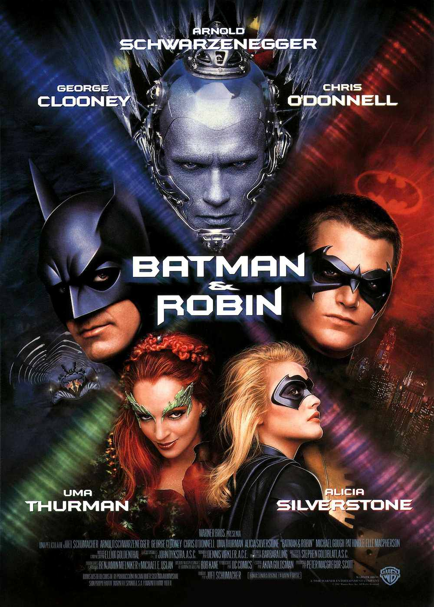
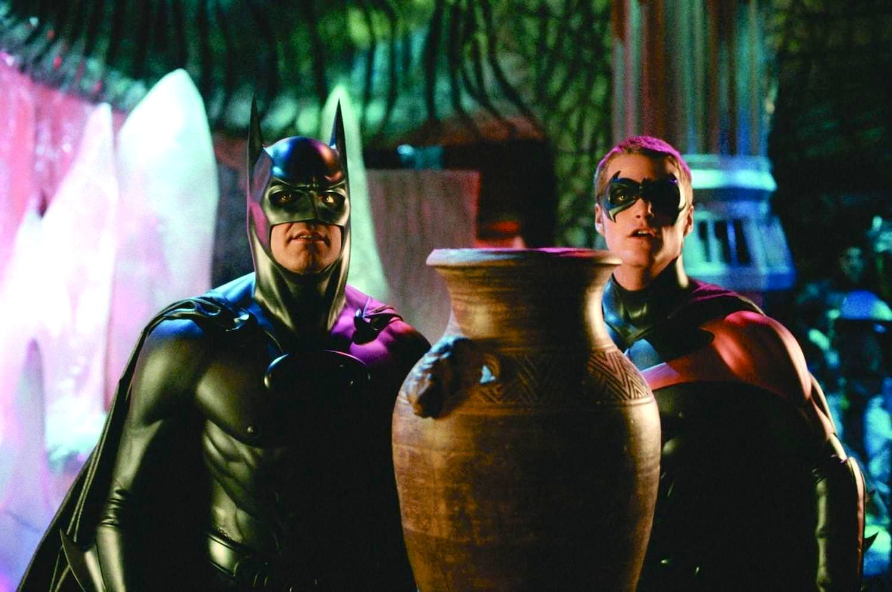
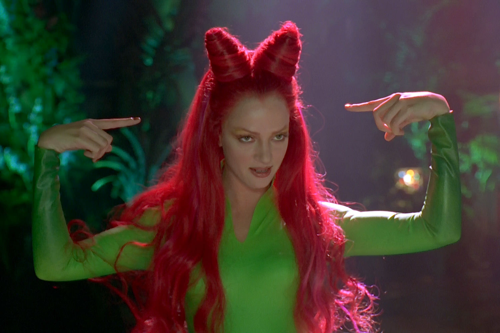

+++
titre = "<em>Batman &#038; Robin</em>, Joel Schumacher"
title = "Batman &#038; Robin, Joel Schumacher"
url = "/batman-robin-schumacher"
date = "2013-08-27T10:05:47"
Lastmod = "2013-08-26T08:18:23"
cover = "batman-robin-arnold-schwarzenegger.jpg"
categorie = [ "À voir" ]
tag = [ "Blockbuster", "Comics", "Humour", "Superhéros", "Vite oublié" ]
createur = [ "Joel Schumacher" ]
acteur = [ "Arnold Schwarzenegger", "Chris O'Donnell", "George Clooney", "Michael Gough", "Uma Thurman" ]
annee = [ "1997" ]
weight = 1997
saga = [ "Batman" ]
pays = [ "États-Unis" ]

+++

Après deux volets réalisés par Tim Burton, la <a href="http://voiretmanger.fr/saga/batman/">saga <em>Batman</em></a> change brutalement de style avec l’arrivée de Joel Schumacher. <a href="http://voiretmanger.fr/batman-forever-schumacher/" title="Batman Forever, Joel Schumacher"><em>Batman Forever</em></a> abandonnait le côté sombre des deux premiers, au profit d’une histoire loufoque et outrancière qui ne fonctionnait malheureusement pas du tout. Malgré cet échec critique, le film a eu du succès, si bien que c’est à nouveau Joel Schumacher qui se charge de l’ultime volet de la saga. <em>Batman &#038; Robin</em> va encore plus loin dans l’outrance et le n’importe quoi. Le résultat aurait pu tomber dans le second degré et même être assez drôle, mais malgré quelques éléments comiques, c’est surtout à nouveau raté. Des acteurs au scénario en passant par l’univers visuel, rien ne fonctionne dans ce film qui n’est même pas vraiment plaisant à regarder…

Dans l’épisode précédent, le duo Batman et Robin se formait avec l’apparition de Dick Grayson, orphelin recueilli par Bruce Wayne qui finissait par l’aider dans sa tâche de superhéros. Comme son titre l’indique bien, <em>Batman &#038; Robin</em> suit les aventures des deux héros qui travaillent désormais de concert. Joel Schumacher ouvre d’ailleurs son film avec la sortie des deux qui enfilent leur costume respectif, avant de prendre chacun un véhicule. D’emblée, le ton est au second degré avec Robin qui se plaint d’avoir moins que Batman, au départ il ne s’agit que de critiquer sa moto contre la Batmobile. Ce thème récurrent est l’un des motifs humoristiques du film et un moteur de scénario, puisque Robin préférerait agir seul. L’idée n’est pas mauvaise et le cinéaste joue encore plus que dans son précédent film la carte de l’homosexualité diffuse et du vieux couple. Les costumes mettent en avant leurs formes parfaites, jusqu’aux fameux emplacements pour tétons qui n’ont d’autre but que de valoriser leur côté sexe, tandis que le cinéaste insiste bien sur leur postérieur, avant même de montrer les visages. Dans le même temps, <em>Batman &#038; Robin</em> reste bien sage et en reste au stade de l’amitié : les deux superhéros ont des relations amoureuses avec des femmes et le film paraît presque schizophrénique à hésiter entre les deux. Une manière de brouiller l’ensemble, dans ce long-métrage qui part constamment dans tous les sens.

Plus encore que dans <em>Batman Forever</em>, Joel Schumacher multiplie les personnages. Il y a déjà deux superhéros et un méchant, le Dr Freeze, quand commence le film. Comme si cela ne suffisait pas, le scénario ajoute rapidement un méchant avec l’entrée en matière d’Ivy Poison, mais aussi une héroïne avec la nièce d’Alfred qui vient prêter main-forte aux deux héros de départ. C’est trop, d’autant que cette surenchère paraît un peu forcée. Contrairement au précédent, les deux ennemis sont très proches : ils sont nés tous les deux d’une expérience scientifique qui a mal tourné, même s’il s’agit d’un meurtre raté pour la femme fatale. Leurs objectifs sont communs et ils agissent bien vite de concert. L’ensemble constitue un scénario d’une banalité assez affligeante, tant les enjeux sont nuls. <em>Batman &#038; Robin</em> déploie son scénario avec paresse et on finit rapidement par s’ennuyer devant cet enchaînement sans surprise. La fin est connue dès le départ, les tentatives des méchants sont systématiquement déjouées et personne ne semble y croire. Joel Schumacher rassemble des acteurs de talent, mais ils peinent à tenir un film aussi vain, à l’exception notable d’Uma Thurman, inspirée par son personnage de Poison Ivy. Pour le reste, c’est un peu la débandade avec un Arnold Schwarzenegger ridicule sous son maquillage bleu, mais le pire est sans doute le personnage de Batman. Sur le papier déjà, l’idée de confier le rôle à George Clooney ne fonctionnait pas, mais à l’écran c’est encore pire. L’acteur n’est jamais dans son rôle, il ne se voit pas en superhéros et nous non plus, il devient un petit peu plus crédible uniquement quand il endosse le rôle de Bruce Wayne.

Inutile de s’attarder sur ce film qui termine dans la douleur la première saga <em>Batman</em>. Joel Schumacher a tout faux avec cette adaptation qui pourrait être une parodie amusante à force d’en faire trop, mais qui ne fait rire personne. <em>Batman &#038; Robin</em> n’a rien pour plaire et on finit par s’ennuyer ferme devant ce spectacle si peu crédible que même les acteurs semblent se demander ce qu’ils font. Heureusement, l’échec commercial a été tel que l’idée d’une suite a été abandonnée : le nouveau départ opéré par Christopher Nolan avec <a href="http://voiretmanger.fr/batman-begins-nolan/" title="Batman Begins, Christopher Nolan"><em>Batman Begins</em></a> est tout de même bien plus intéressant et réussi…

<h3>Vous voulez m&rsquo;aider ?<a href="#footnote_0_10174" id="identifier_0_10174" class="footnote-link footnote-identifier-link" title="&Agrave; propos de la publicit&eacute;&hellip;">1</a></h3>
<ul>
<li><a href="http://www.amazon.fr/gp/product/B001NZA0YM/ref=as_li_ss_tl?ie=UTF8&#038;tag=leblogdenic07-21&#038;linkCode=as2&#038;camp=1642&#038;creative=19458&#038;creativeASIN=B001NZA0YM">Acheter le film en Blu-Ray sur Amazon</a></li>
<li><a href="http://www.amazon.fr/gp/product/B00004VYNP/ref=as_li_ss_tl?ie=UTF8&#038;tag=leblogdenic07-21&#038;linkCode=as2&#038;camp=1642&#038;creative=19458&#038;creativeASIN=B00004VYNP">Acheter le film en DVD sur Amazon</a></li>
<li><a href="https://itunes.apple.com/fr/movie/batman-et-robin/id382366768">Acheter ou louer le film sur l&rsquo;iTunes Store</a></li>
</ul>
<ul>
<li><a href="http://www.amazon.fr/gp/product/B002HESRBG/ref=as_li_ss_tl?ie=UTF8&#038;tag=leblogdenic07-21&#038;linkCode=as2&#038;camp=1642&#038;creative=19458&#038;creativeASIN=B002HESRBG">Acheter la saga <em>Batman</em> en Blu-Ray</a></li>
<li><a href="http://www.amazon.fr/gp/product/B001RIGDKA/ref=as_li_ss_tl?ie=UTF8&#038;tag=leblogdenic07-21&#038;linkCode=as2&#038;camp=1642&#038;creative=19458&#038;creativeASIN=B001RIGDKA">Acheter la saga <em>Batman</em> en DVD</a></li>
</ul>

<ol class="footnotes"><li id="footnote_0_10174" class="footnote"><a href="http://voiretmanger.fr/soutien/">À propos de la publicité…</a> [<a href="#identifier_0_10174" class="footnote-link footnote-back-link">&#8617;</a>]</li></ol>
