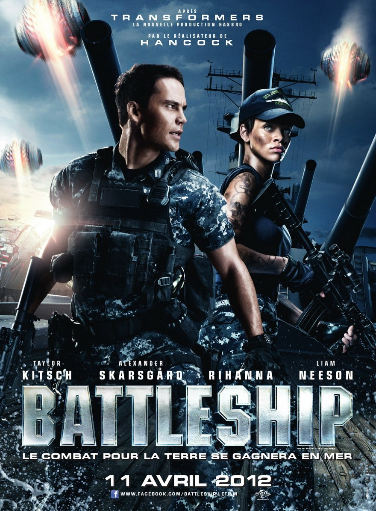
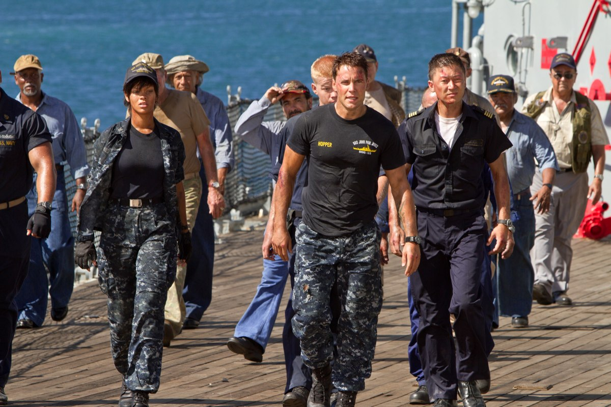
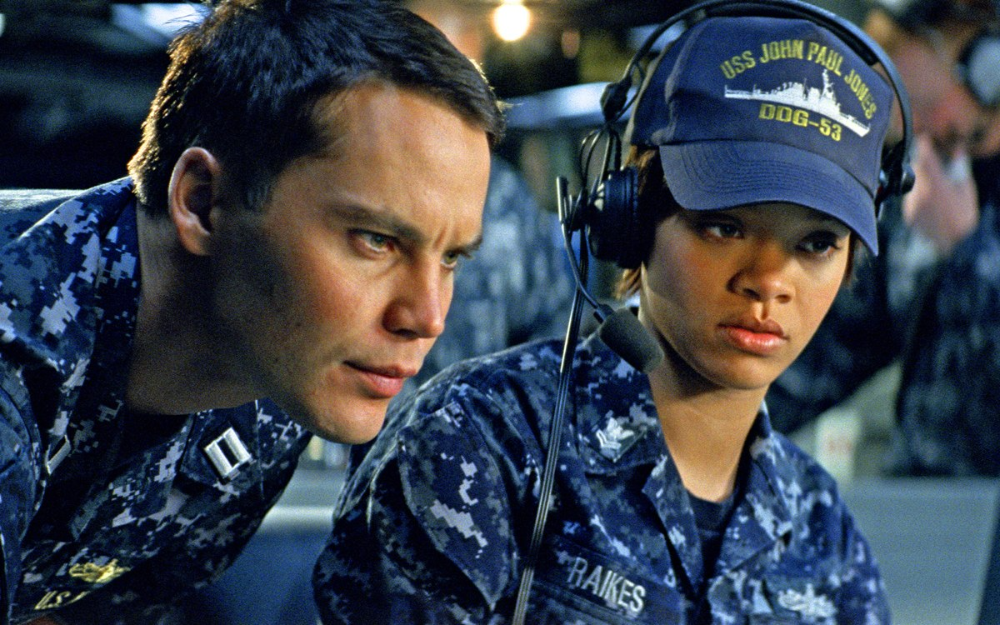

+++
type = "post"
titre = "<em>Battleship</em>, Peter Berg"
title = "Battleship, Peter Berg"
url = "/battleship-berg"
date = "2012-04-14T00:09:19"
Lastmod = "2015-05-03T16:34:02"
cover = "berg-battleship.jpg"
categorie = [ "À voir" ]
tag = [ "Action", "Bateau", "Blockbuster", "Guerre", "Science-Fiction", "Vite oublié" ]
createur = [ "Peter Berg" ]
acteur = [ "Alexander Skarsgård", "Liam Neeson", "Rihanna", "Taylor Kitsch" ]
annee = [ "2012" ]
weight = 2012
pays = [ "États-Unis" ]

+++

<em>Battleship</em> annonce la couleur avec son affiche : &laquo;&nbsp;Après <em>Transformers</em> la nouvelle production Hasbro&nbsp;&raquo;. Difficile de faire plus clair, Hollywood s&rsquo;amuse encore avec un jeu, mais il s&rsquo;agit cette fois du Toucher-Couler, cet éternel jeu de stratégie où il faut couler les navires de l&rsquo;adversaire avant de se faire couler sa propre flotte. Pour tenir 2h20, les scénaristes se sont retroussé les manches pour enrober le principe du jeu, mais <em>Battleship</em> est effectivement l&rsquo;histoire d&rsquo;une bataille navale. C&rsquo;est aussi un blockbuster décérébré qui assume pleinement son statut. Le dernier film de Peter Berg s&rsquo;avère très amusant, et c&rsquo;est largement suffisant…

La bataille navale avec ses porte-avions et autres cuirassiers a été un peu dépoussiérée dans <em>Battleship</em>. Si les navires des marines modernes sont toujours présents d&rsquo;un côté, leurs ennemis viennent… de l&rsquo;espace. À une époque non déterminée, mais qui pourrait très bien être contemporaine, la société humaine a découvert une planète dans l&rsquo;univers qui présente exactement les mêmes caractéristiques que la nôtre. On met alors au point un ingénieux système pour leur envoyer un signal. Il se trouve que cette planète héberge effectivement une forme de vie extraterrestre, mais celle-ci est non seulement évoluée, mais aussi hostile. Alors que les marines du monde entier parader au large d’Hawaii, cinq vaisseaux débarquent sur Terre et construisent un bouclier autour de l&rsquo;archipel. Leurs intentions sont clairement hostiles et ils cherchent à appeler des renforts. Le bouclier empêche quiconque de s&rsquo;approcher : le sort de l&rsquo;humanité dépend ainsi des trois navires qui sont restés bloqués à l&rsquo;intérieur. Ce n&rsquo;est pas gagné…

Peter Berg a compris que <em>Battleship</em> ne saurait briller par son scénario et contrairement à Michael Bay qui a tenté maladroitement d&rsquo;ajouter à <em><a href="http://voiretmanger.fr/2011/06/30/transformers-3-face-cachee-lune-bay/">Transformers 3 : La Face cachée de la Lune</a></em> une bien vaine justification sérieuse, son film assume son côté action brute. Après une introduction presque trop longue encore, les navires partent en mer sur fond d&rsquo;AC/DC et le spectateur venu chercher du grand spectacle trouve enfin son compte. On sait d&rsquo;emblée que ce qui ne devait être qu&rsquo;une ballade santé va très vite mal tourner, et <em>Battleship</em> ne déçoit pas nos attentes. Les vaisseaux spatiaux ne tardent pas à arriver et les hostilités commencent très fort avec la destruction de deux des trois navires en jeu dans les toutes premières minutes. La suite est une longue série de combats avec, en guise de points d&rsquo;orgue, deux impressionnantes séquences de batailles navales. La dernière, l&rsquo;ultime combat évidemment, rappelle les grands moments des batailles napoléoniennes, les voiles en moins, mais <em>Battleship</em> surprend avec une véritable séquence de Toucher-Couler. Il fait nuit, les radars de l&rsquo;armée américaine ne parviennent pas à détecter les vaisseaux ennemis. Le champ de bataille se résume ainsi à une vaste grille où il faut tirer presque en aveugle : presque, car un système de détection des tsunamis donne quand même aux gentils une indication sur la position de l&rsquo;ennemi. La performance n&rsquo;en est pas moins réelle : Peter Berg a réussi à intégrer à son blockbuster musclé une partie de Toucher-Couler…

Blockbuster oblige, <em>Battleship</em> n&rsquo;évite pas tous les poncifs du genre. Il fallait une galerie de personnages supposés attachants et Peter Berg s&rsquo;est alors senti obligé d&rsquo;enrober sa bataille navale dans un cadre plus général pourtant bien superflu. Le héros du film, Alex, est un incapable qui vit toujours chez son frère et ne fait rien de sa vie. Sa rencontre avec une belle blonde, fille d&rsquo;amiral de la marine américaine, change tout : il accepte de s&rsquo;engager avec son frère dans la marine et il devient un nouvel homme, forcément. Quand le film commence, il doit justement demander au père de la belle la main de sa fille, mais le garnement a gardé de mauvaises habitudes et il est viré quasiment sur-le-champ. Fort heureusement pour lui, c&rsquo;est à ce moment précis que <em>Battleship</em> fait intervenir les extraterrestres. Vous l&rsquo;aurez compris, ces combats vont changer notre héros qui va vite devenir le gendre idéal que son futur beau-père ne pourra finalement pas refuser, on s&rsquo;en doute bien. Disons-le, cette histoire d&rsquo;amour est ridicule, déjà vue mille fois et même assez pénible quand la blonde un peu potiche prend part à l&rsquo;action. Peter Berg a le bon goût de réduire cette histoire à sa plus simple expression dans son film.

<em>Battleship</em> reste d&rsquo;abord et avant tout un film d&rsquo;action hollywoodien et il se devait d&rsquo;assurer sur ce plan. Mission réussie pour Peter Berg qui tourne des scènes d&rsquo;action vives, mais jamais illisibles. Les effets spéciaux sont spectaculaires et l&rsquo;ensemble est prenant : les amateurs du genre apprécieront non pas le suspense, mais la tension souvent présente dans le film. On regrettera simplement sur ce point l&rsquo;abus d&rsquo;effets lense-flare à la J.J. Abrams, mais on apprécie en revanche le choix de ne pas proposer de 3D alors que <em>Battleship</em> se prêtait à une utilisation gadget. Le film ne brille pas par le scénario, on l&rsquo;aura compris, pas plus par ses acteurs. Taylor Kitsch est décidément à la mode, mais il confirme ici l&rsquo;impression que l&rsquo;on avait eue avec <em><a href="http://voiretmanger.fr/2012/03/07/john-carter-stanton/">John Carter</a></em> : cet acteur est vraiment médiocre. Heureusement, son rôle ici se résume à être présent et donner quelques ordres et sa prestation semble alors correcte. Même punition pour Rihanna qui ne sert pas à grand-chose, si ce n&rsquo;est ajouter un nom connu sur l&rsquo;affiche, tandis que Liam Neeson fait vraiment le service minimum. Ce sont encore les extraterrestres les plus réussis, finalement : les scénaristes ont eu la bonne idée d&rsquo;en faire quasiment des humains, leur planète étant une copie de la nôtre après tout. <em>Battleship</em> fait ainsi honneur à son statut de blockbuster : ce sont encore les scènes d&rsquo;action qui sont le mieux réussies. On l&rsquo;a déjà évoquée, mais la bande-originale est très efficace et contribue au côté fun du film : AC/DC et ZZ Top correspondent bien à l&rsquo;ambiance gros bateaux militaires…

Pour apprécier <em>Battleship</em>, il faut savoir à quoi s&rsquo;attendre. Ce film Hasbro ne propose pas vraiment de scénario, pas plus de personnages, non il s&rsquo;agit d&rsquo;abord et avant tout d&rsquo;un film d&rsquo;action. Peter Berg assume ce rôle et il réussit ainsi à proposer un film très fun. <em>Battleship</em> s&rsquo;appréciera plutôt sur grand écran, avec un son puissant : les conditions sont alors idéales pour profiter pleinement de ce film stupide, mais jouissif.

<h3>Vous voulez m&rsquo;aider ?</h3>
<ul>
<li><a href="http://www.amazon.fr/gp/product/B007K60NA4/ref=as_li_ss_tl?ie=UTF8&tag=leblogdenic07-21&linkCode=as2&camp=1642&creative=19458&creativeASIN=B007K60NA4">Acheter le film en Blu-Ray et DVD sur Amazon</a></li>
<li><a href="http://www.amazon.fr/gp/product/B007K60MQY/ref=as_li_ss_tl?ie=UTF8&tag=leblogdenic07-21&linkCode=as2&camp=1642&creative=19458&creativeASIN=B007K60MQY">Acheter le film en DVD sur Amazon</a></li>
<li><a href="http://itunes.apple.com/fr/movie/battleship/id532922660">Acheter ou louer le film sur l&rsquo;iTunes Store</a></li>
</ul>

