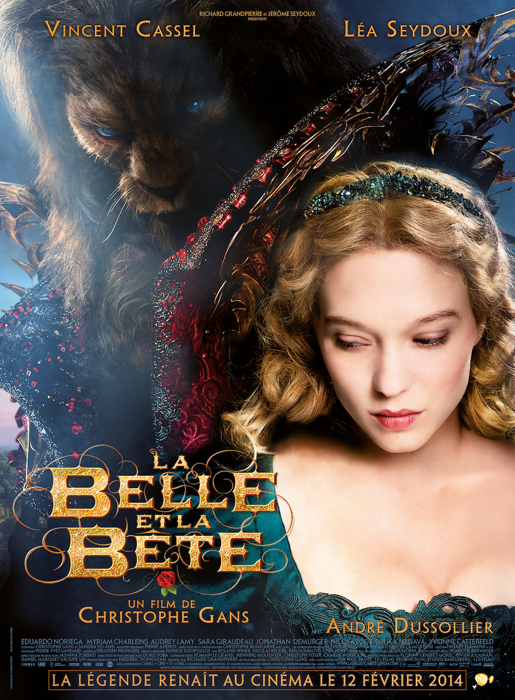
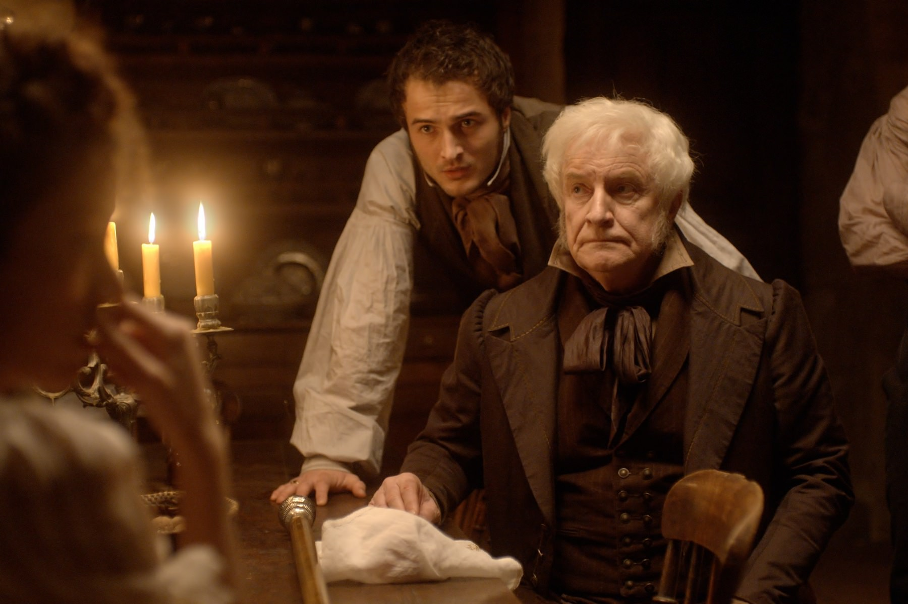
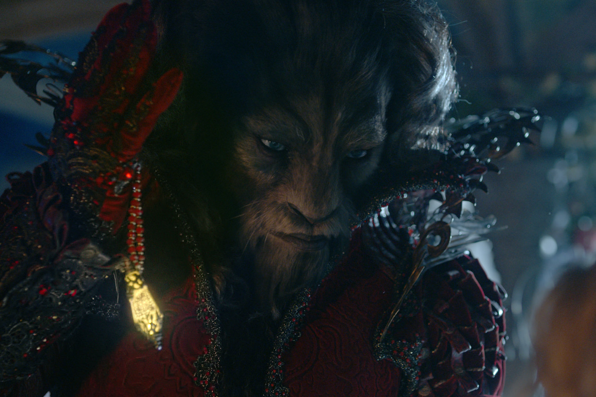

+++
type = "post"
titre = "<em>La Belle et la Bête</em>, Christophe Gans"
title = "La Belle et la Bête, Christophe Gans"
url = "/belle-bete-gans"
date = "2014-02-16T15:54:48"
Lastmod = "2014-02-16T15:59:16"
cover = "la-belle-et-la-bete-lea-seydoux-christophe-gans.jpg"
categorie = [ "À voir" ]
tag = [ "Adaptation littéraire", "Amour", "Blockbuster", "Conte", "Fantastique", "Monstres", "Vite oublié" ]
createur = [ "Christophe Gans" ]
acteur = [ "André Dussollier", "Audrey Lamy", "Eduardo Noriega", "Léa Seydoux", "Vincent Cassel" ]
annee = [ "2014" ]
weight = 2014
pays = [ "Allemagne", "France" ]

+++

En 2012 et 2013, ce ne sont pas moins de trois versions du conte de <em>Blanche-Neige</em> qui sont sorties au cinéma. De la <a href="/blanche-neige-chasseur-sanders/">relecture guerrière</a> à <a href="/blanche-neige-singh/">la farce</a> en passant par le <a href="/blancanieves-berger/">film muet</a>, il y en a eu pour tous les goûts. Va-t-on assister à la même chose pour <em>La Belle et la Bête</em>, ce conte qui circule dans toutes les cultures depuis aussi longtemps que l’on peut remonter dans le temps ? Christophe Gans livre en tout cas sa version, avec un film ambitieux qui n’est pas un remake du film de Cocteau, ni de la vision de Walt Disney, mais un retour aux sources. Pour ce long-métrage, le cinéaste a voulu retrouver le texte original de Gabrielle-Suzanne de Villeneuve qui date du XVIIIe siècle, tout en offrant une vision réaliste et modernisée. Le résultat visuellement époustouflant, malgré quelques faux pas, mais <em>La Belle et la Bête</em> souffre cruellement d’acteurs fades et surtout d’un scénario très moyen.

On connaît tous les grandes lignes de ce conte qui oppose un ancien homme transformé en monstre et une charmante jeune fille. Christophe Gans parvient malgré tout à en proposer une relecture rafraichissante en accordant beaucoup plus de place que les versions qui le précèdent au contexte et aux explications. Ainsi, <em>La Belle et la Bête</em> commence bien comme un conte raconté par une jeune femme à deux enfants et même si on retrouve l’idée du livre que l’on ouvre comme dans les dessins animés Disney, on ne passe pas rapidement sur les origines du récit. On aurait pu s’attendre à un rapide résumé de la situation pour amener rapidement la Bête, mais le cinéaste préfère reculer au maximum son sujet principal. Avant cela, il présente le père de Belle et ses frères et sœurs. On voit leur situation initiale favorable et puis la richesse qui disparait avec une tempête, l’obligation d’abandonner la ville et leur vie au profit d’une vie beaucoup plus simple à la campagne. Pendant toute la première partie, le long-métrage garde le fantastique à l’écart pour mieux le faire survenir quand la Bête apparaît enfin. Christophe Gans conserve l’idée du père qui récupère par erreur une rose auprès du château abandonné qui est en fait celui de la Bête. Le reste est aussi très proche de ce que l’on connaît : Belle qui se sacrifie pour sauver son père, le monstre qui ne la tue pas et qui tombe amoureux et enfin la jeune femme qui tombe à son tour sous le charme de cet ancien homme maudit. Même s’il suit le conte original, <em>La Belle et la Bête</em> ne manque pas d’idées pour créer la surprise, à l’image de ce combats avec géants de pierre vers la fin. On apprécie aussi le côté historique qui reste bien présent jusqu’au bout, sans remettre en cause le fantastique qui est, lui aussi, toujours présent. On ne s’attendait pas à un tel équilibre et on le trouve plutôt séduisant : les autres modernisations de contes que l’on évoquait en préambule faisaient plutôt le pari du réalisme et avoir su conserver le fantastique est une bonne chose.

Le scénario de <em>La Belle et la Bête</em> séduit dans l’ensemble, mais il déçoit aussi sur d’autres points. Le plus gênant est sans doute que Christophe Gans n’a pas su choisir son public : à trop vouloir créer une œuvre grand public, susceptible de plaire aux familles avec enfants, il ne séduit personne. Pour les enfants, le long-métrage risque d’être un peu trop impressionnant et on ne recommandera pas le film aux plus jeunes. Pour les adultes, il sera au contraire un peu trop gentillet par moment : que dire de ces créatures qui évoquent vaguement des grelins au premier abord et qui ne sont là que pour leur côté mignon qui doit plaire aux enfants ? Dans le même ordre d’idée, le film a tenu à copier les blockbusters américains avec une dose d’humour qui passe presque exclusivement par les personnages des deux sœurs. Même si Audrey Lamy et Sara Giraudeau sont parmi les meilleures actrices du casting, leur présence est trop rare pour ne pas agacer plus qu’autre chose et on aurait préféré que le réalisateur fasse un choix et assume le sérieux de son œuvre, ou au contraire renforce sérieusement cette légèreté. <em>La Belle et la Bête</em> déçoit surtout par ses dialogues trop souvent ratés et par ses acteurs qui, peut-être à cause des mauvais dialogues, semblent ne jamais y croire et sont parfois très mauvais. Vincent Cassel interprète une bête convaincante, même si son costume virtuel peine à effrayer et s’avère plutôt ridicule, pour ne pas dire kitsch. Léa Seydoux est quant à elle assez médiocre, toujours dans le même rôle, avec cette moue qu’on lui connaît bien, jamais vraiment dans son personnage. Le pire vient de ses frères et des autres personnages secondaires — exception faite du père, interprété par un André Dussolier correct — qui sont mauvais, tout simplement. Est-ce une faute de casting, ou de scénario ? Toujours est-il que ces fausses notes gâchent le spectacle et c’est d’autant plus dommage que, pour une fois, <em>La Belle et la Bête</em> n’avait rien de honteux sur le plan visuel. Entièrement réalisé en studio, le film se défend bien avec des décors époustouflants et une ambiance gothique et écologique à la fois qui est très forte et très bien vue. Christophe Gans cite volontiers Hayao Miyazaki et on ressent un petit peu l’influence du maître japonais de l’animation. Le château et sa végétation luxuriante sont parfaitement exécutés et l’ensemble est beau, fluide et logique. On peut saluer le travail des équipes techniques sur ce point, les décors et l’ambiance générale sont une réussite dans le film.

Des décors et une ambiance peuvent-ils sauver un blockbuster ? Malheureusement, <em>La Belle et la Bête</em> prouvent que non : même si on apprécie le gothique écologique imaginé par Christophe Gans, le spectacle est gâché par une volonté de plaire à tout le monde et surtout par des dialogues et des acteurs qui cassent systématiquement la magie. On apprécie le réalisme teinté de fantastique, on salue la démarche qui justifie ici totalement le besoin de revoir le conte, mais le résultat n’est pas tout à fait à la hauteur. <em>La Belle et la Bête</em> n’est pas un divertissement pénible à regarder, mais il déçoit en passant à côté du très bon film qu’il aurait pu être. À voir, et puis à oublier…

