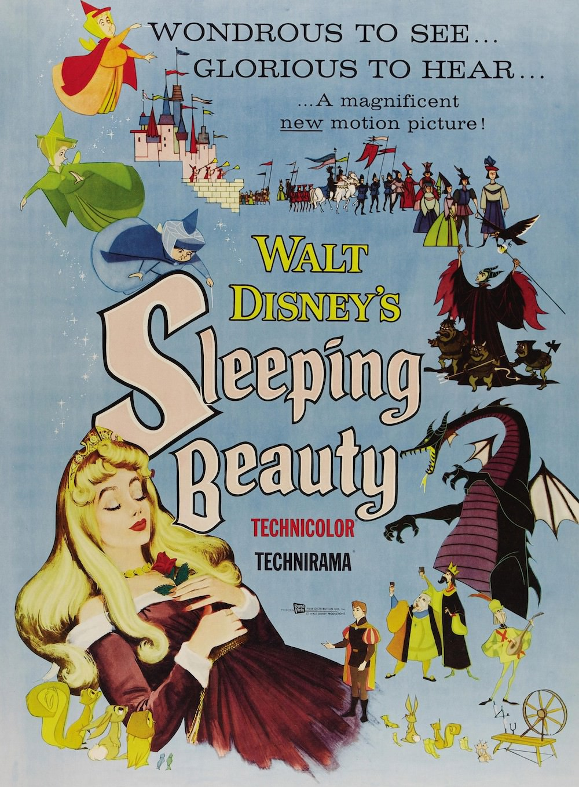
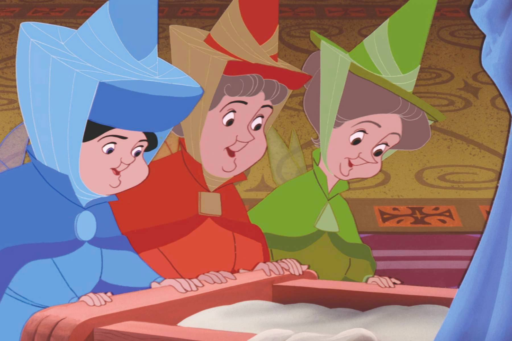
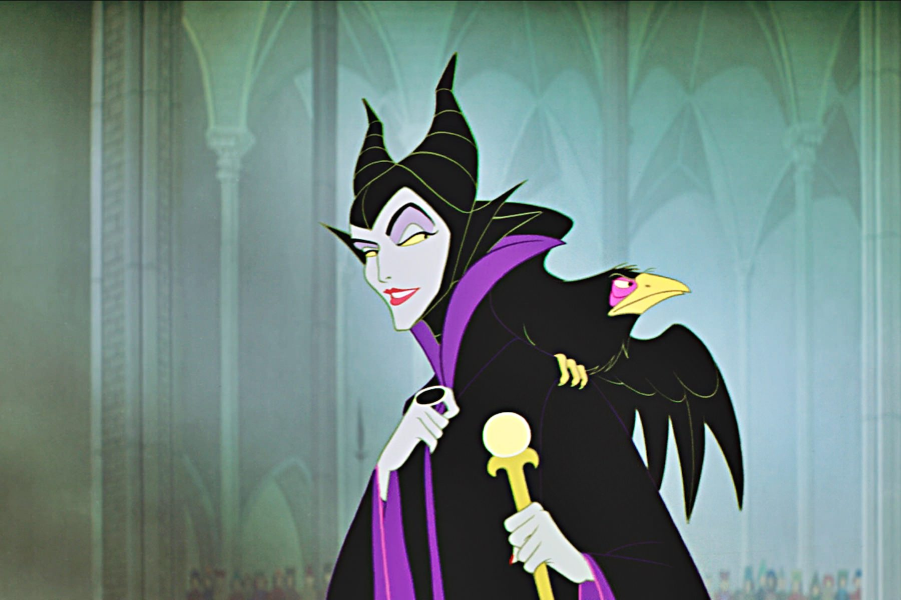

+++
type = "post"
titre = "<em>La Belle au bois dormant</em>, Clyde Geronimi"
title = "La Belle au bois dormant, Clyde Geronimi"
url = "/belle-bois-dormant-geronimi"
date = "2014-03-22T11:47:49"
Lastmod = "2014-03-22T11:51:09"
cover = "la-belle-au-bois-dormant-disney.jpg"
categorie = [ "À voir" ]
tag = [ "Adaptation littéraire", "Amour", "Animation", "Conte", "Famille", "Fantastique", "Magie", "Princesse" ]
createur = [ "Clyde Geronimi", "Walt Disney" ]
annee = [ "1959" ]
weight = 1959
saga = [ "Classiques d'animation Disney" ]
pays = [ "États-Unis" ]
original = "Sleeping Beauty"

+++

Les studios Disney ont retrouvé une seconde jeunesse dans les années 1950 avec le retour aux longs-métrages d’animation ambitieux, mais à part avec <a href="http://voiretmanger.fr/belle-clochard-geronimi-jackson-luske/" title="La Belle et le Clochard, Clyde Geronimi, Wilfred Jackson et Hamilton Luske"><em>La Belle et le Clochard</em></a>, ces années n’ont pas été placées sous le signe de la rentabilité. Les productions ambitieuses n’ont pas trouvé immédiatement leur public, sans doute parce que le public d’alors voulait voir autre chose. Alors que Walt Disney délaisse ces gros projets au profit des courts-métrages et du premier parc d’attraction qui ouvre en Californie en 1955, deux activités bien plus rentables, le studio lance son projet le plus ambitieux : l’adaptation de <em>La Belle au bois dormant</em>. À l’origine, un conte européen qui a connu de multiples variations, comme <a href="http://voiretmanger.fr/blanche-neige-sept-nains-hand/" title="Blanche-Neige et les sept nains, David Hand"><em>Blanche-Neige et les sept nains</em></a> puis <a href="http://voiretmanger.fr/cendrillon-geronimi-jackson-luske/" title="Cendrillon, Clyde Geronimi, Wilfred Jackson et Hamilton Luske"><em>Cendrillon</em></a>. Est-ce la proximité des thèmes abordés qui a gêné le public ? Toujours est-il que le film réalisé par Clyde Geronimi a été un échec commercial et qu’il reste encore aujourd’hui un classique Disney controversé. Pourtant, cet étrange film qui ose un style tranché est intéressant à bien des égards…

Comme tous les contes de princesse, <em>La Belle au bois dormant</em> n’est pas bien original sur le papier. Prenez une très belle jeune fille, une princesse aussi magnifique qu’elle est insipide et sans grande personnalité. Prenez un prince lui aussi magnifique, mais sans personnalité marquée. Faites-les se rencontrer une fois, c’est le coup de foudre et ils vécurent heureux et eurent beaucoup d’enfants. Ainsi résumé, on comprend que le seizième <a href="http://voiretmanger.fr/saga/classiques-danimation-disney/">classique Disney</a> n’ait pas connu le succès, mais c’est très injuste pour ce long-métrage plus intéressant qu’il n’y paraît. De fait, les personnages qui comptent vraiment ne sont pas, comme bien souvent, le prince et sa princesse.  Clyde Geronimi et ses équipes ont imaginé un trio de fée et surtout une sorcière particulièrement réussie, au point que ce sont elles les personnages les plus intéressants. Dans les contes originaux, que ce soit chez Perrault ou les frères Grimm, il n’y a pas seulement trois bonnes fées, mais une dizaine<a href="#fn-11373-1" rel="footnote">1</a>. Le studio simplifie cette situation et crée trois vrais personnages, qui servent de caution comique dans le film. Chacune a une couleur bien spécifique, chacune a une personnalité également et elles servent autant de principal moteur de l’intrigue — en bien et en mal d’ailleurs — que de ressort comique par leurs chamailleries incessantes. Mais le vrai personnage fort de ce long-métrage, c’est bien évidemment Maléfique, la sorcière qui déteste la princesse et qui la condamne, d’un terrible sort, à une mort certaine avant ses 16 ans. On comprend sans peine pourquoi la nouvelle adaptation cinématographique du conte prévue pour le mois de mai se concentre exclusivement sur ce personnage : c’est, de loin, le plus fort et le plus intéressant et la version Disney ne fait pas exception.

À sa sortie, on a souvent reproché à <em>La Belle au bois dormant</em> son ton un peu trop dur pour les enfants. Même si le long-métrage choquerait beaucoup moins aujourd’hui, les mentalités ayant considérablement évolué, il faut reconnaître que le personnage de Maléfique en particulier est très impressionnant. Avec son corbeau qui surprend par le réalisme de sa représentation, elle a incontestablement un côté terrifiant, d’autant que l’on ne sait rien d’elle. Alors que la version moderne de Robert Stromberg tente d’expliquer l’origine et le parcours de la sorcière, Clyde Geronimi ne dit rien, faisant du personnage un être éternellement mauvais. On ne sait pas pourquoi Maléfique en veut à la famille royale, ni pourquoi elle condamne la princesse à mourir avant ses seize ans, il n’y a aucune explication rationnelle à cela. C’est peut-être la différence la plus importante avec les adaptations précédentes de Disney : on a affaire à un être fondamentalement mauvais, et il n’y a rien pour justifier son action, encore moins pour l’excuser. La méchanceté semble totalement gratuite dans <em>La Belle au bois dormant</em>, ce qui est une conception assez moderne qui distingue ce film du reste de la production Disney et qui le rend aussi passionnant. Autre différence majeure qui saute aux yeux dès les premières images : le style graphique. On sait que Walt Disney ne s’est pas impliqué dans la production de ce long-métrage et le fondateur du studio est alors de plus en plus éloigné des films au profit du parc d’attractions et des cours-métrages. C’est peut-être pour cette raison que les animateurs ont pu se lâcher et faire ce qu’il voulait, avec comme résultat des dessins vraiment surprenants, très éloignés de ceux de <em>La Belle et le Clochard</em> sorti quatre ans auparavant. Si certains éléments sont extrêmement détaillés, notamment dans les fonds forestiers — on pense souvent à <a href="http://voiretmanger.fr/bambi-hand/" title="Bambi, David Hand"><em>Bambi</em></a> pour cette raison —, il y a à l’inverse des éléments beaucoup plus simples, parfois même résumés à quelques formes géométriques de base. On pense souvent aux tableaux du XIVe siècle, quand on découvrait alors la profondeur de champ et que les traits étaient souvent très simples. Là encore, on peut comprendre que le résultat ait déplu, mais cette animation sort du lot et fait que <em>La Belle au bois dormant</em> semble, aujourd’hui, bien plus intéressant que d’autres productions beaucoup plus banales, comme le sera son successeur, <em>Les 101 Dalmatiens</em>.

Mal aimé, <em>La Belle au bois dormant</em> est incontestablement un Disney atypique dans la production du studio des années 1950 et 1960 et c’est précisément ce qui en fait son intérêt aujourd’hui. Clyde Geronimi et toutes les équipes ont travaillé comme ils le souhaitaient et ils ont produit un film visuellement étonnant, mais aussi surprenant sur le fond. Paradoxalement, le résultat plaira peut-être plus aux parents qu’aux enfants, même si le ton Disney assez enfantin reste encore présent. Au fond, c’est peut-être pour cette raison que <em>La Belle au bois dormant</em> n’a pas connu le succès escompté, même si l’utilisation de son château dans tous les parcs Disney ou bien encore la place dans la culture populaire de la <a href="http://www.dailymotion.com/video/x32nmz_la-belle-au-bois-dormant-j-en-ai-re_shortfilms">chanson « J&rsquo;en ai rêvé »</a> prouvent qu’il n’a pas volé sa place au sein des classiques du studio…

<h3>Vous voulez m&rsquo;aider ?</h3>
<ul>
<li><a href="http://www.amazon.fr/gp/product/B001D6OKXI/ref=as_li_ss_tl?ie=UTF8&#038;tag=leblogdenic07-21&#038;linkCode=as2&#038;camp=1642&#038;creative=19458&#038;creativeASIN=B001D6OKXI">Acheter le film en Blu-Ray sur Amazon</a></li>
<li><a href="http://www.amazon.fr/gp/product/B001D6OL0K/ref=as_li_ss_tl?ie=UTF8&#038;tag=leblogdenic07-21&#038;linkCode=as2&#038;camp=1642&#038;creative=19458&#038;creativeASIN=B001D6OL0K">Acheter le film en DVD sur Amazon</a></li>
</ul>

<ol>
<li id="fn-11373-1">
Pour <a href="http://fr.wikipedia.org/wiki/La_Belle_au_bois_dormant#Les_marraines">être précis</a>, Charles Perrault en avait imaginé sept, et les frères Grimm pas moins de douze. On comprend pourquoi la version Disney a quelque peu simplifié cela.&#160;<a href="#fnref-11373-1" rev="footnote">&#8617;</a>
</li>
</ol>

