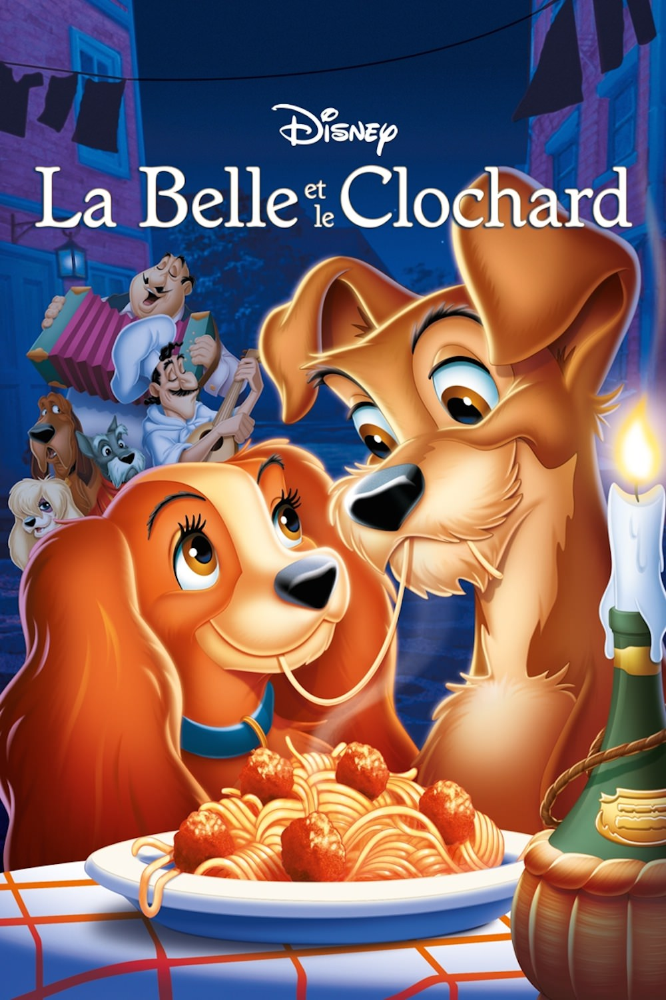
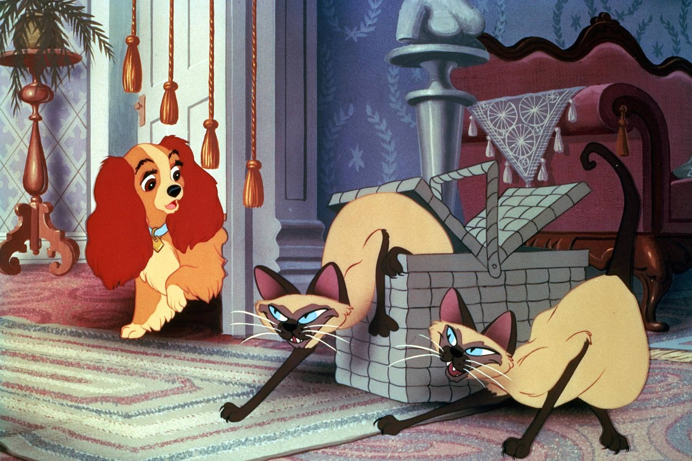
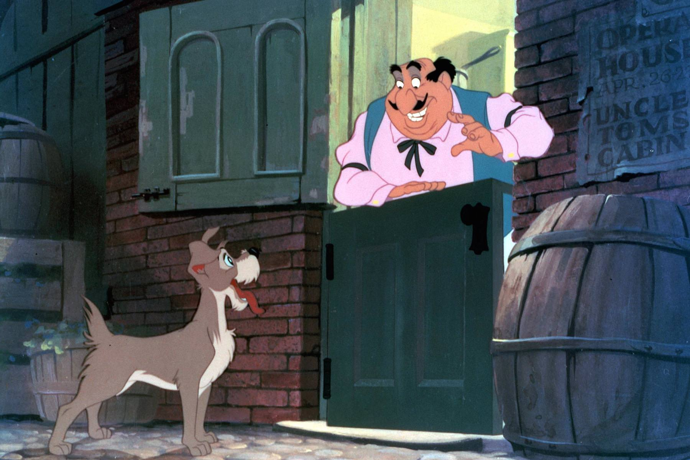

+++
titre = "<em>La Belle et le Clochard</em>, Clyde Geronimi, Wilfred Jackson et Hamilton Luske"
title = "La Belle et le Clochard, Clyde Geronimi, Wilfred Jackson et Hamilton Luske"
url = "/belle-clochard-geronimi-jackson-luske"
date = "2014-03-16T16:16:53"
Lastmod = "2014-03-16T16:20:28"
cover = "la-belle-et-le-clochard-luske-geronimi-jackson.jpg"
categorie = [ "À voir" ]
tag = [ "Amour", "Animation", "Animaux", "Famille", "Société" ]
createur = [ "Clyde Geronimi", "Hamilton Luske", "Walt Disney", "Wilfred Jackson" ]
annee = [ "1955" ]
weight = 1955
saga = [ "Classiques d'animation Disney" ]
pays = [ "États-Unis" ]
original = "Lady and the Tramp"

+++

Déçus par les échecs commerciaux successifs d’<a href="http://voiretmanger.fr/alice-pays-merveilles-geronimi-jackson-luske/" title="Alice au pays des merveilles, Clyde Geronimi, Wilfred Jackson et Hamilton Luske"><em>Alice au pays des merveilles</em></a> et de <a href="http://voiretmanger.fr/peter-pan-geronimi-jackson-luske/" title="Peter Pan, Clyde Geronimi, Wilfred Jackson et Hamilton Luske"><em>Peter Pan</em></a>, les studios Disney cherchent à retrouver le succès. Avant que de revenir à l’adaptation de contes classiques européens quelques années après avec <em>La Belle au bois dormant</em>, les équipes menées par Walt Disney s’essaient à un nouvel exercice avec une histoire originale. <em>La Belle et le Clochard</em> est inspiré d’une histoire publiée par Ward Greene dans les années 1930, certes, mais le studio se l’est si largement appropriée que l’on peut parler de récit original. Loin d’innover, le studio compte au contraire sur ses plus solides bases pour ce quinzième <a href="http://voiretmanger.fr/saga/classiques-danimation-disney/">classique</a> avec, à la réalisation, trois habitués : Clyde Geronimi, Wilfred Jackson et Hamilton Luske ont déjà été à l’œuvre sur plusieurs longs-métrages, souvent en même temps. Le résultat est ainsi sans surprise, une histoire calibrée pour plaire aux plus petits, mais sans grand intérêt.

Pour raconter son histoire d’amour, Walt Disney préfère exploiter des animaux plutôt que des hommes. Un phénomène assez classique dans l’animation qui nous fait ici rencontrer des chiens, et plus particulièrement une chienne. La belle annoncée par le titre est un <a href="http://fr.wikipedia.org/wiki/Cocker_spaniel_anglais">cocker spaniel anglais</a> offert par un mari à sa femme un soir de Noël. La petite chienne est toute mignonne et elle est immédiatement adoptée par sa famille, mais l’intrigue se met en place quand un bébé arrive dans la famille. L’héroïne de <em>La Belle et le Clochard</em> est alors délaissée par ses deux maîtres, naturellement plus préoccupés par leur premier enfant que par leur chienne. Sur ces entrefaites, les scénaristes imaginent que la maison est abandonnée à la tante de la famille pour quelques jours, une femme qui déteste les chiens et repousse la Belle. Celle-ci s’enfuit et rencontre dans les mauvais quartiers de la ville le clochard du titre, un chien sans race et sans maître qui erre au hasard de ses rencontres. Sans surprise, les deux animaux tombent amoureux et même si leur condition sociale n’a absolument rien à voir et même s’ils ne devaient jamais se rencontrer, encore moins s’aimer, l’amour est inévitablement plus fort que tout. Une belle allégorie animale pour évoquer, sans doute, l’amour que peuvent se porter les humains eux-mêmes. L’idée est plutôt intéressante, mais c’est le traitement parfois simpliste qui pêche un peu. Sans compter une vision sociale qui semble aujourd’hui totalement dépassée.

<em>La Belle et le Clochard</em> commence ainsi dans les beaux quartiers d’une ville américaine qui ne reste pas caractérisée. À cet égard, les studios Disney expérimentent à plusieurs niveaux : c’est la première fois que leur film se déroule sur le sol américain, à une époque récente, même si l’action n’est pas contemporaine de la sortie du film — 1955 —, mais remonte aux années 1910. Quoi qu’il en soit, le studio n’a jamais été aussi proche de son actualité avec cette nouvelle production. Une modernité qui est aussi technique : le long-métrage adopte pour la première fois un format allongé avec même le CinemaScope, deux ans seulement après sa première utilisation au cinéma. C’est aussi la première fois que Walt Disney s’affranchit d’un distributeur existant et crée pour les besoins de ce film sa propre entreprise, Buena Vista Pictures Distribution. Techniquement, le film n’innove pas par ailleurs, mais il faut noter que l’animation est désormais parfaitement fluide. Moderne sur ces aspects techniques, <em>La Belle et le Clochard</em> tranche d’autant plus par son fond assez rétrograde. La vision de la société divisée en deux groupes bien distincts — les beaux quartiers aisés et fleuris d’un côté, la ville salle et pauvre de l’autre — n’est pas très originale, mais on sera surtout surpris aujourd’hui par la caractérisation très caricaturale des chiens. La Belle a parmi ses amis un terrier écossais qui a un accent britannique à couper au couteau et un flegme que l’on imagine tout autant britannique. Plus tard, deux chats siamois débarquent avec un accent vaguement chinois et on pourrait aussi évoquer le restaurateur italien, vraie caricature lui aussi. Au-delà de tous ces traits assez grossiers, le récit manque ici singulièrement d’ampleur et ennuiera vite tous ceux qui ne sont plus capables de s’émerveiller pour des chiens qui parlent. À part la très belle scène du spaghetti qui fait toujours mouche, l’ensemble reste finalement assez banal et <em>La Belle et le Clochard</em> n’est sans doute pas le classique le plus réussi à cet égard.

Opération réussie pour Walt Disney et ses équipes : <em>La Belle et le Clochard</em> permet effectivement au studio de retrouver une rentabilité immédiate, puisque le film connaît un beau succès populaire à sa sortie. Ce classique n’est pas aussi ambitieux que ses prédécesseurs, mais il fait finalement mieux dans l’immédiat. Une belle réussite commerciale, pour un long-métrage pas forcément aussi intéressant sur le fond que les autres. Reste quand même une histoire d’amour universel et une très belle scène autour d’un plat de spaghetti…

<h3>Vous voulez m’aider ?<a href="#footnote_0_11347" id="identifier_0_11347" class="footnote-link footnote-identifier-link" title="&Agrave; propos de la publicit&eacute;&hellip;">1</a></h3>
<ul>
<li><a href="http://www.amazon.fr/gp/product/B008M8HDPM/ref=as_li_ss_tl?ie=UTF8&#038;tag=leblogdenic07-21&#038;linkCode=as2&#038;camp=1642&#038;creative=19458&#038;creativeASIN=B008M8HDPM">Acheter le film en Blu-Ray sur Amazon</a></li>
<li><a href="http://www.amazon.fr/gp/product/B0065HDMNO/ref=as_li_ss_tl?ie=UTF8&#038;tag=leblogdenic07-21&#038;linkCode=as2&#038;camp=1642&#038;creative=19458&#038;creativeASIN=B0065HDMNO">Acheter le film en DVD sur Amazon</a></li>
<li><a href="https://itunes.apple.com/fr/movie/la-belle-et-le-clochard/id483271562">Acheter ou louer le film sur l’iTunes Store</a></li>
</ul>

<ol class="footnotes"><li id="footnote_0_11347" class="footnote"><a href="http://voiretmanger.fr/soutien/">À propos de la publicité…</a> [<a href="#identifier_0_11347" class="footnote-link footnote-back-link">&#8617;</a>]</li></ol>
