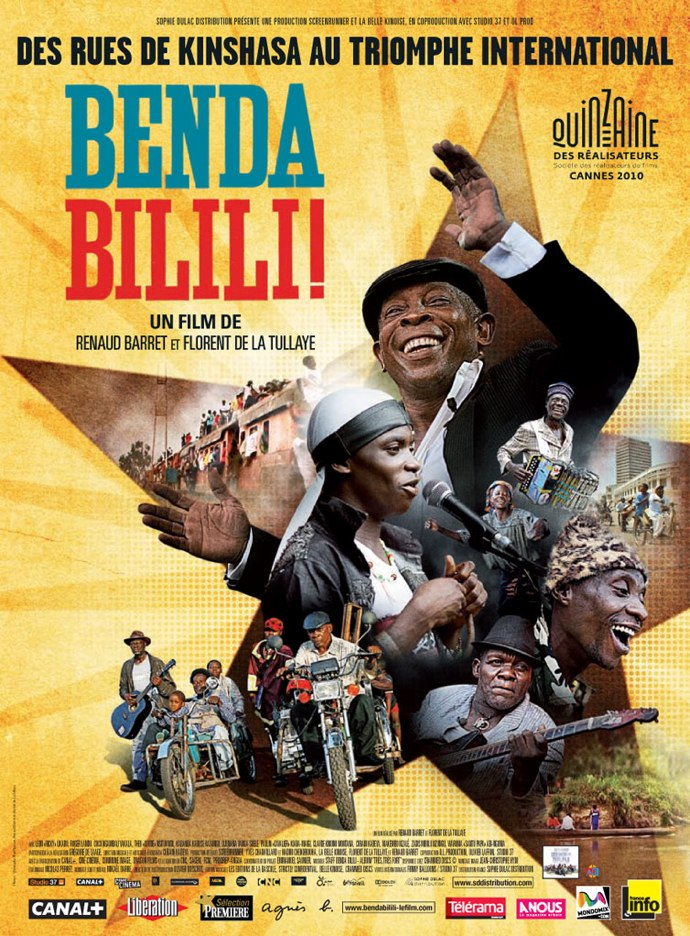
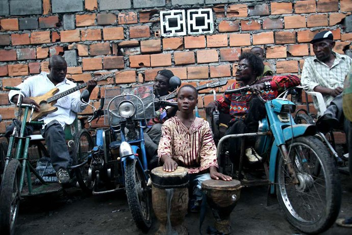
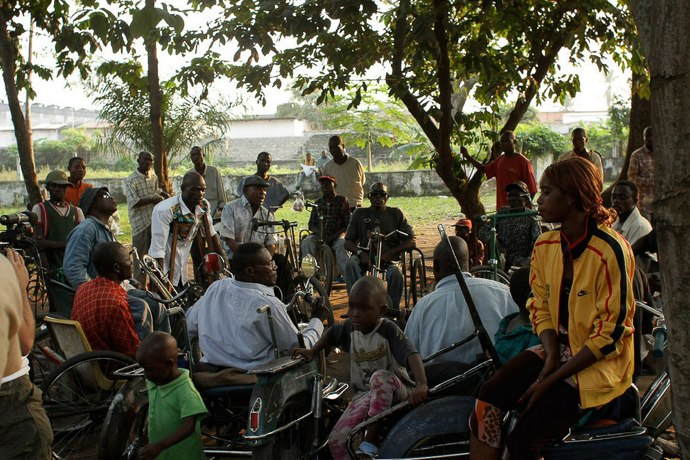

+++
type = "post"
titre = "Benda Bilili !, Renaud Barret et Florent de La Tullaye"
title = "Benda Bilili !, Renaud Barret et Florent de La Tullaye"
url = "/benda-bilili-barret-tullaye"
date = "2010-07-29T22:58:16"
Lastmod = "2012-12-20T09:17:35"
cover = "benda-bilili.jpg"
categorie = [ "À voir" ]
tag = [ "Afrique", "Documentaire", "Musique", "Société" ]
createur = [ "Florent de La Tullaye", "Renaud Barret" ]
annee = [ "2010" ]
weight = 2010
pays = [ "France", "République Démocratique du Congo" ]

+++

<strong>À lire : j’ai été invité à une avant-première pour voir <em>Benda Bilili !</em>. Je n’ai reçu aucun paiement pour cette critique, et je ne pense pas que mon jugement a été influencé par cette invitation. Si cela vous dérange, votre navigateur Internet dispose d’une fonction « Fermer la fenêtre ». Sinon, je vous remercie pour votre confiance et vous propose de continuer votre lecture.</strong>

<em>Benda Bilili !</em> est un documentaire sur un petit miracle. Le Staff Benda Bilili est un groupe de paralysés des rues de <a href="http://maps.google.com/maps?client=safari&amp;q=Kinshasa&amp;oe=UTF-8&amp;ie=UTF8&amp;hq=&amp;hnear=Kinshasa,+R%C3%A9publique+d%C3%A9mocratique+du+Congo&amp;ei=Zs9RTPuCGoTV4gaXhLnMAw&amp;ved=0CB4Q8gEwAA&amp;ll=-4.324501,15.336914&amp;spn=17.309136,32.453613&amp;z=6">Kinshasa en République Démocratique du Congo</a>. Un groupe de musique improbable composé d&rsquo;hommes de la rue rendus handicapés par la maladie et qui jouent sur des instruments de fortunes. Un groupe repéré en 2005 par deux Français venus faire un documentaire sur la musique congolaise. Leur rencontre conduit à la sortie d&rsquo;un album en 2009 et à une large reconnaissance du public européen. Un succès inattendu et un très beau film porté par l&rsquo;excellente musique du groupe. À ne pas rater, tant sur scène que dans les salles obscures !

<em>Benda Bilili !</em> projette le spectateur européen dans un autre univers en posant ses caméras dans les rues de Kinshasa. Le dépaysement est total dans cette énorme ville tentaculaire, capitale du pays et <a href="http://fr.wikipedia.org/wiki/Kinshasa">plus grande métropole subsaharienne</a> avec plus de 10 millions d&rsquo;habitants. On devine un exode rural important vers la ville, sans doute vue comme le meilleur moyen de s&rsquo;enrichir et, peut-être, de partir vers l&rsquo;Europe, point de chute fantasmé de tous les Congolais dès leur plus jeune âge. Comme toutes les grandes villes des pays en voie de développement, Kinshasa est terre de contraste : les grands buildings modernes côtoient les plus infâmes bidonvilles, tandis que des hordes d&rsquo;enfants des rues courent après les énormes 4&#215;4 des plus riches habitants pour mendier. Au milieu de cette grouillante métropole, Ricky et ses potes font de la musique ensemble. Cinq paraplégiques partiels (les jambes ne répondent plus) et quelques enfants chantent et jouent d&rsquo;instruments variés, faits souvent de bric et de broc. On trouve une guitare avec une seule corde, des percussions constituées d&rsquo;objets du quotidien, mais le plus impressionnant est la boite de lait de Roger. Ce jeune garçon — il a 13 ans quand le film commence — joue de la musique pour gagner sa vie sur un <a href="http://www.ecranlarge.com/upload/movies/images/movie20952/large_496808.jpg">instrument qu&rsquo;il a bricolé lui-même</a> et qui se compose d&rsquo;une boite métallique, d&rsquo;un bout de bois plié et d&rsquo;une corde. Le plus étonnant est qu&rsquo;il arrive à sortir de ce bricolage des notes et il a tout du surdoué : il suffit qu&rsquo;il entende un air pour immédiatement et instinctivement le reproduire avec son instrument. Il est très vite adopté par le groupe et devient vite une véritable star, surtout auprès du public européen.

Renaud Barret et Florent de La Tullaye suivent le groupe de leur première rencontre, en 2004, jusqu&rsquo;à leur tournée européenne dans le courant de l&rsquo;année 2009. Cinq années donc où ils se sont rendus à plusieurs reprises à Kinshasa pour les filmer, mais aussi très vite pour les aider. Les deux réalisateurs se sont en effet mis dans l&rsquo;idée de les aider à produire un disque et à sortir ce disque en Europe pour les y faire connaître. <em>Benda Bilili !</em> suit très simplement le groupe, d&rsquo;abord simplement groupe de plus pour un reportage plus général sur la musique congolaise avant de devenir leurs protégés. On voit ainsi les marchandages à l&rsquo;intérieur du groupe sur ces blancs avec leurs caméras, alors que Ricky a très bien compris tout ce que son groupe pouvait espérer de l&rsquo;aide de deux Français. À partir de là, on suit le groupe dans ses répétitions au zoo dévasté de la capitale, puis dans les premières sessions d&rsquo;enregistrement dans un véritable studio. Alors que la chance leur sourit enfin, un incendie détruit totalement leur foyer et les met tous à la rue, dans des conditions où la survie personnelle devient quand même plus importante que la musique. Les deux Français repartent alors chercher des financements, armés des quelques enregistrements déjà réalisés et ils reviennent en 2007 avec des moyens suffisants pour enregistrer complètement l&rsquo;album. <em>Très très fort</em> sort en 2009 et c&rsquo;est un beau succès qui conduit le groupe à faire une tournée triomphale en France, puis dans le Nord de l&rsquo;Europe, de la Hollande à la Norvège où ils découvrent le froid et la neige. Une bien belle histoire qui a permis à ces hommes de quitter la rue tout en aidant une quantité sans doute importante de personnes dans une société où la solidarité familiale reste essentielle.

La musique est évidemment une composante essentielle de <em>Benda Bilili !</em>, même si les réalisateurs se défendent d&rsquo;avoir fait un « <em>film musical</em> », préférant parler de « <em>film sur des outsiders qui défient un système qui les définit comme tels</em> ». Il est vrai que ces hommes impressionnent par leur volonté de fer et le refus continu de céder et d&rsquo;arrêter le combat contre cette vie qu&rsquo;ils n&rsquo;ont pas choisi et que l&rsquo;on ne saurait souhaiter à personne. Ils ont beau être handicapés et pauvres au point de ne pas manger tous les jours, ils veulent se battre et sont persuadés que la musique leur apportera réussite et bonheur. « <em>Outsiders</em> », le mot n&rsquo;est pas trop fort et pourtant leur visage s&rsquo;illumine dès qu&rsquo;il entonne leurs chansons, tous ensembles. Il faut les voir sautiller sur leur fauteuil ou danser sur les genoux (le film montre à un moment une partie de football sur les genoux, c&rsquo;est bluffant)… ils dégagent une force et une vitalité étonnantes. Quand il perd tout dans un incendie, Ricky est un peu déstabilisé, mais se reprend très vite et exprime à la fois la fatalité et la nécessité de continuer, coûte que coûte. Quand le succès survient enfin, quand les salles combles dansent et hurlent leur joie, on sent le bonheur intense pour ces hommes à qui la vie a finalement souri et on partage vraiment ce bonheur avec eux.

Si le film n&rsquo;est pas musical, <em>Benda Bilili !</em> fait quand même une place importante à la musique du groupe. Des petits concerts improvisés dans les rues congolaises jusqu&rsquo;aux Eurockéennes en passant par les répétitions au zoo et les sessions d&rsquo;enregistrement, le staff joue très souvent devant les caméras de Renaud Barret et Florent de La Tullaye. Ces derniers ont choisi un matériel très léger avec notamment de petites caméras numériques qui sont de plutôt mauvaise qualité, surtout quand la lumière se fait rare ce qui est souvent le cas pendant le film. L&rsquo;image est donc pixelisée, très bruitée et parfois difficile à lire, mais le film est en contrepartie très naturel, captant tous les moments, parfois anodins, qui donnent une vraie humanité aux différents membres du groupe. On les voit autant prendre du plaisir à jouer ensemble qu&rsquo;à peiner dans les rues défoncées de la capitale congolaise. L&rsquo;image un peu sale participe aussi de l&rsquo;ambiance et fait bien ressentir l&rsquo;urgence permanente d&rsquo;hommes et de femmes qui luttent pour survivre. Je ne sais pas quelle est la proportion de scènes musicales dans <em>Benda Bilili !</em>, mais je sais en revanche que l&rsquo;on aimerait en entendre encore plus. Le film peine un peu à retranscrire l&rsquo;ambiance de folie qu&rsquo;il semblait y avoir pendant les concerts européens, même si les cinéastes multiplient les plans sur la foule en délire. Leur caméra retranscrit mieux l&rsquo;ambiance des sessions africaines, mais je dois dire que le film m&rsquo;a vraiment donné envie de voir le groupe sur scène. Ils sont actuellement <a href="http://staffbendabilili.com/">en tournée</a> et font quelques dates en France et en Europe avant de s&rsquo;envoler au Japon ! Autant dire que le succès est vraiment impressionnant, et que surtout, s&rsquo;ils passent près de chez vous, ne les ratez surtout pas !

Tourné au cœur du groupe, <em>Benda Bilili !</em> est un documentaire passionnant sur l&rsquo;histoire folle d&rsquo;un groupe qui réussit contre toute attente. Le staff Benda Bilili aurait pu rester dans les rues de Kinshasa, mais il est devenu un gros succès en Europe et même dans le monde. Bien belle histoire que Renaud Barret et Florent de La Tullaye, tout à la fois réalisateurs du film et producteurs de l&rsquo;album, racontent avec simplicité. Ils ne s&rsquo;attardent pas sur les raisons qui peuvent pousser un ancien publicitaire et un reporter international à consacrer leur talent et énergie à un groupe congolais, préférant prendre les temps de les filmer et d&rsquo;enregistrer leur musique. Le résultat est tout à la fois réjouissant — on a envie de se lever pendant le film pour danser sur la musique — et émouvant. Un film à ne surtout pas rater !

En attendant la sortie du film, je ne peux que recommander de patienter avec <em>Très très fort</em>, leur premier album (<a href="https://itunes.apple.com/fr/album/tres-tres-fort/id338551376">iTunes</a> | <a href="http://open.spotify.com/album/6aCoJv19JRe0jUc3zf7VSE">Spotify</a>). Sur album, leur musique conserve l&rsquo;urgence de la rue, même si le son est plus propre. Les voix sont centrales, le fond musical étant essentiellement composé par des guitares sèches et des percussions. L&rsquo;instrument de Roger est vraiment très efficace et apporte au groupe une tonalité propre. Un disque à découvrir…

<h3>Vous voulez m&rsquo;aider ?<a href="#footnote_0_3727" id="identifier_0_3727" class="footnote-link footnote-identifier-link" title="&Agrave; propos de la publicit&eacute;&hellip;">1</a></h3>
<ul>
<li><a href="http://www.amazon.fr/gp/product/B004FK2ML6/ref=as_li_ss_tl?ie=UTF8&tag=leblogdenic07-21&linkCode=as2&camp=1642&creative=19458&creativeASIN=B004FK2ML6">Acheter le film en DVD sur Amazon</a></li>
<li><a href="https://itunes.apple.com/fr/movie/benda-bilili!/id411682234">Acheter le film sur l&rsquo;iTunes Store</a></li>
<li><a href="http://www.amazon.fr/Staff-Benda-Bilili/e/B0020IY8E4/?_encoding=UTF8&tag=leblogdenic07-21&linkCode=ur2&camp=1642&creative=19458">Acheter la musique du groupe sur Amazon</a> (sur <a href="https://itunes.apple.com/fr/artist/staff-benda-bilili/id303307356">l&rsquo;iTunes Store</a>)</li>
</ul>

<ol class="footnotes"><li id="footnote_0_3727" class="footnote"><a href="/soutien/">À propos de la publicité…</a> [<a href="#identifier_0_3727" class="footnote-link footnote-back-link">&#8617;</a>]</li></ol>
