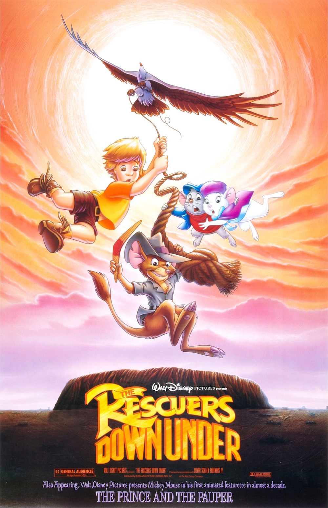
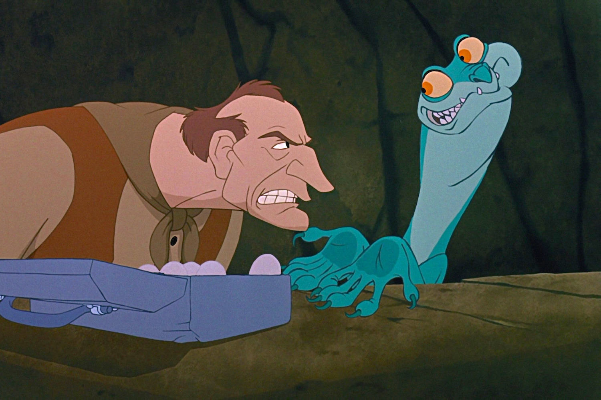

+++
type = "post"
titre = "<em>Bernard et Bianca au pays des Kangourous</em>, Hendel Butoy et Mike Gabriel"
title = "Bernard et Bianca au pays des Kangourous, Hendel Butoy et Mike Gabriel"
url = "/bernard-bianca-pays-kangourous-butoy-gabriel"
date = "2014-06-07T20:03:16"
Lastmod = "2014-06-07T20:05:24"
cover = "bernard-bianca-pays-kangourous-disney.jpg"
categorie = [ "À voir" ]
tag = [ "Animation", "Animaux", "Aventure", "Enfance" ]
createur = [ "Hendel Butoy", "Mike Gabriel" ]
annee = [ "1990" ]
weight = 1990
saga = [ "Classiques d'animation Disney" ]
pays = [ "États-Unis" ]
original = "The Rescuers Down Under"

+++

Alors que le studio Disney retrouve son inspiration et compose un grand film d’animation avec <a href="/petite-sirene-clements-musker/" title="La Petite Sirène, Ron Clements et John Musker"><em>La Petite Sirène</em></a>, le classique qui suit est moins ambitieux, mais pas moins intéressant. Comme son nom l’indique bien, <em>Bernard et Bianca au pays des Kangourous</em> est en effet… une suite. Pour la première fois, les animateurs Disney ne racontent pas une nouvelle histoire, mais poursuivent un classique précédent, en l’occurrence <a href="/aventures-bernard-et-bianca-reitherman-stevens-lounsbery/" title="Les Aventures de Bernard et Bianca, Wolfgang Reitherman, Art Stevens et John Lounsbery"><em>Les Aventures de Bernard et Bianca</em></a>. Sorti en 1977, ce film a été le seul vraiment rentable pour les studios, après une série d’échecs commerciaux et souvent critiques. C’est sans doute en raison de ce succès que le studio décide de faire une suite et surtout de la sortir dans les salles. Henkel Butor et Mike Gabriel, deux animateurs Disney qui n’ont pas encore eu l’occasion de réaliser un long-métrage, s’attellent à la tâche, avec un cahier des charges assez simple : renouveler le succès du premier volet. En salles, on ne se presse pas pour voir ce classique qui ne manque pourtant pas d’arguments, mais qui était sans doute trop dans la redite.

Comme dans le premier volet, Bernard et Bianca sont deux souris qui partent en mission pour sauver des enfants en danger. Après Penny dans le Bayou, les deux héros vont sauver cette fois Cody, un petit garçon australien. Le schéma est identique : dans les deux films, on découvre d’abord le danger, puis les souris sont envoyées depuis New York et elles viennent le sauver. <em>Bernard et Bianca au pays des Kangourous</em> prend un petit peu plus de temps à installer son intrigue, et laisse au passage tout loisir pour admirer l’Australie reconstituée dans le film. Les équipes ont fait des progrès depuis <em>Les Aventures de Bernard et Bianca</em> et même si on note quelques éléments un peu grossiers — toutes les scènes de New York sont très mauvaises, notamment —, l’ensemble est plutôt magnifique. À certains égards, les premières minutes de ce film évoquent <em>Le Roi Lion</em>, c’est dire si elles sont réussies. Les studios ont fait entrer pour la première fois l’ordinateur dans leurs méthodes de travail, et c’est leur première réalisation sans papier : les dessins ne sont plus peints à la main, les animations sont en partie réalisées à l’aide d’ordinateurs. Le résultat est aussi réussi que les œuvres précédentes du studio, mais <em>Bernard et Bianca au pays des Kangourous</em> marque une étape importante dans l’évolution technique chez Disney. Le précédent volet des aventures des souris hésitait plus sur les styles, ici c’est plus propre et plus net : on retrouve beaucoup de traits caractéristiques des productions Disney des années 1990. Ainsi, même s’il est difficile d’associer le film de Hendel Butoy et Mike Gabriel aux autres productions de l’époque — on reste du mode mineur par rapport à <a href="/petite-sirene-clements-musker/" title="La Petite Sirène, Ron Clements et John Musker"><em>La Petite Sirène</em></a>, sorti l’année précédente —, on retrouve de nombreux points communs, notamment sur le plan technique.

Côté histoire, les scénaristes ont eu du mal à éviter le sentiment de redite, mais ils se sont efforcés de trouver un maximum d’idées nouvelles. Ainsi, la première partie consiste à nouveau à présenter la situation de l’enfant en danger, mais <em>Bernard et Bianca au pays des Kangourous</em> prend le temps de nous montrer la relation de Cody avec l’aigle qu’il sauve, dans une séquence de vol d’ailleurs très belle. Plus tard, on retrouve la société des souris telle qu’on la connaissait, on retrouve les deux souris que l’on connaissait aussi et même l’albatros du premier volet. Enfin, pas tout à fait : celui qui agit ici est censé être le frère de celui du film précédent, mais dans toute cette partie, Hendel Butoy et Mike Gabriel ne peuvent éviter le sentiment de répétition pour le spectateur qui a vu <em>Les Aventures de Bernard et Bianca</em>. La suite n’est pas beaucoup plus originale, mais il faut reconnaître que l’on ne s’ennuie jamais. Le rythme est soutenu, l’intrigue est bien menée, l’humour présent, mais pas trop, on évite les chansons un peu tartes du premier volet… bref, on passe un très bon moment. Même si <em>Bernard et Bianca au pays des Kangourous</em> n’a pas forcément une bonne réputation, même s’il a été relativement boudé à sa sortie, il n’en reste pas moins un bon classique. Surtout, il est bien meilleur que toutes les suites qui naîtront à partir de cette première expérience. Devant le manque de succès en salles, Disney décide de ne plus sortir de suites au cinéma — <em>Fantasia 2000</em> est une exception notable —, mais cela n’empêche pas le studio d’abandonner l’idée des suites tout court. Tous les succès des années suivantes auront droit à leur suite, voire à plusieurs suites, en général de qualité assez médiocre. Comparativement, ce film est loin d’être mauvais, et il est même assez plaisant.

<em>Bernard et Bianca au pays des Kangourous</em> n’est pas le meilleur classique, c’est incontestable. Mais avec son Australie particulièrement reconstituée, avec son intrigue simple et plaisante, il constitue un divertissement de qualité, malgré un sentiment de redite indéniable. On sent que ce long-métrage est assez mineur, coincé entre deux classiques qui tirent au chef-d’œuvre, mais il n’est pas aussi mauvais qu’on pourrait le croire.

<h3>Vous voulez <a href="/soutien/">m’aider</a> ?</h3>
<ul>
<li><a href="http://www.amazon.fr/gp/product/B008M8HE7Y/ref=as_li_ss_tl?ie=UTF8&amp;tag=leblogdenic07-21&amp;linkCode=as2&amp;camp=1642&amp;creative=19458&amp;creativeASIN=B008M8HE7Y">Acheter le film en Blu-ray sur Amazon</a></li>
<li><a href="http://www.amazon.fr/gp/product/B0000DD2ZR/ref=as_li_ss_tl?ie=UTF8&amp;tag=leblogdenic07-21&amp;linkCode=as2&amp;camp=1642&amp;creative=19458&amp;creativeASIN=B0000DD2ZR">Acheter le film en DVD sur Amazon</a></li>
</ul>

 

