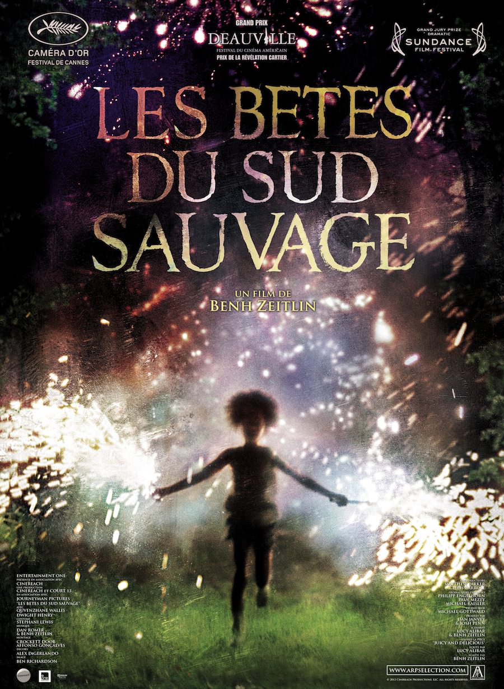
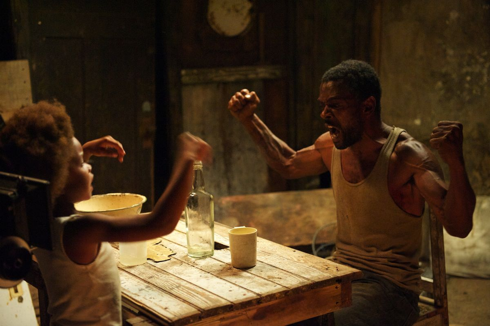
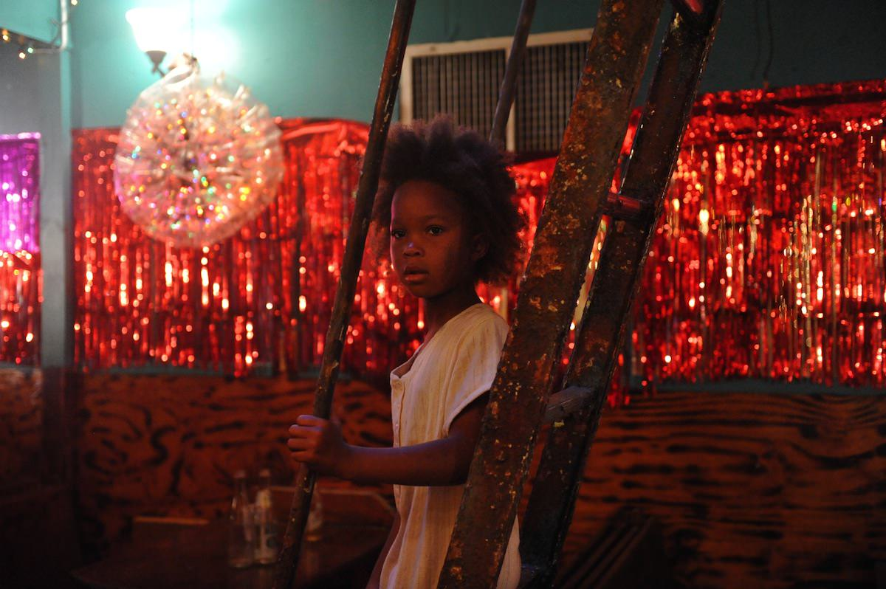

+++
titre = "Les Bêtes du sud sauvage, Benh Zeitlin"
title = "Les Bêtes du sud sauvage, Benh Zeitlin"
url = "/betes-sud-sauvage-zeitlin"
date = "2013-01-01T10:24:29"
Lastmod = "2013-04-22T18:44:28"
cover = "les-betes-du-sud-sauvage-zeitlin.jpg"
categorie = [ "À voir" ]
tag = [ "Animaux", "Apocalypse", "Drame", "Enfance", "Famille", "Fantastique", "Nature", "Société" ]
createur = [ "Benh Zeitlin" ]
acteur = [ "Dwight Henry", "Quvenzhané Wallis" ]
annee = [ "2012" ]
weight = 2012
pays = [ "États-Unis" ]
original = "Beasts of the Southern Wild"

+++

Pour un premier film, <em>Les Bêtes du sud sauvage</em> impressionne déjà par son affiche et ses multiples récompenses. Avec la Caméra d’or à Cannes, le Grand Prix de Deauville et de Sundance, Benh Zeitlin force le respect et place la barre très haut. Au total, ce film réalisé avec un budget ridicule propose un voyage aussi dur que beau dans un bayou teinté de fantastique. Une traversée apocalyptique à ne pas rater…

Hushpuppy est une petite fille de six ans qui vit avec son père dans le bayou, une zone extrêmement humide et qui devrait disparaître rapidement avec le réchauffement climatique. Son père et quelques autres habitants résistent toujours face à une société qui les presse de quitter les lieux pour passer de l’autre côté de la digue, un mur qui protège le reste du pays de l’eau et qui crée une frontière infranchissable. Depuis la mort de sa mère, Hushpuppy se débrouille seule, d’autant que son père, malade, ne peut plus autant l’aider. Quand, à la faveur d’un énorme orage, l’eau monte et finit par tout envahir, c’est la fin d’un monde, du monde qu’a toujours connu Hushpuppy et son père. On veut les envoyer loin de cette région difficile, mais ils résistent tant qu’ils peuvent. Pendant ce temps, Wink, le père, se meurt et sa petite fille ne peut rien faire contre la maladie.

On ne quittera le bayou quasiment jamais, si ce n’est pour une effroyable séquence dans un hôpital. <em>Les Bêtes du sud sauvage</em> plonge ses spectateurs dans cet univers aquatique où l’homme vit plus ou moins en harmonie avec la nature. Benh Zeitlin nous invite dès le départ à découvrir Hushpuppy, étonnante fillette qui écoute le cœur de tous les animaux qui évoluent autour d’elle. Comme si elle voulait s’assurer qu’ils étaient bien vivants, comme pour constater par elle-même l’existence de la vie. D’emblée, on ne peut qu’être frappé par l’hostilité de cet environnement dans lequel la jeune fille évolue pourtant avec un naturel qui en est presque troublant. Hushpuppy est une vraie fille du bayou, elle y est sans doute née et y a toujours vécu, ce qui explique son aisance, mais pour le spectateur habitué à son confort, le dépaysement est complet. Même si <em>Les Bêtes du sud sauvage</em> n’est jamais un film à thèse, encore moins un documentaire, il présente un contexte que l’on connaît mal, alors même que l’on est aux États-Unis. On avait rarement vu un tel bayou, aussi humide et dénué de tout confort moderne. Ici, les pick-up servent à des embarcations de fortune et les maisons ne sont que des assemblages précaires de planches. Il faut toujours composer avec l’eau, omniprésente, et avec la nature qui peut parfois s’avérer extrêmement violente, comme en témoigne l’orage autour duquel Benh Zeitlin construit son film. Malgré toutes ces difficultés, les habitants de la Baignoire, comme ils ont surnommé ce lieu hostile, ne quitteraient leur terre pour rien au monde et sont prêts à se battre pour la conserver et y vivre. Le cinéaste a très bien réussi à rendre cet attachement, mais <em>Les Bêtes du sud sauvage</em> n’intéresse pas que pour cet environnement méconnu.

Benh Zeitlin n’a pas opté pour le regard du documentariste et il est même allé jusqu’au fantastique pour son premier film. Par petites touches, <em>Les Bêtes du sud sauvage</em> impose en effet une ambiance fantastique étonnante, mais surtout très réussie, surtout quand elle tire au poétique. Même si on peut sentir quelque chose d’anormal très rapidement — la séquence d’ouverture ressemble presque à une pratique vaudou —, le fantastique prend un peu de temps à s’imposer explicitement. Quand les aurochs — des créatures partiellement préhistoriques et surtout mythologiques — arrivent à l’écran, cela devient évident, mais avant déjà, le rapport entretenu par ces hommes du bayou avec la nature avait quelque chose de fantastique. Le père de Hushpuppy tire en l’air pour atteindre l’orage et le repousser et même si ce coup semble puéril et inutile, il prend ici une teinte fantastique. <em>Les Bêtes du sud sauvage</em> est baigné tout entier dans cette ambiance si spécifique, entre fantastique, poésie et fête. Le personnage principal est pour beaucoup dans la réussite de cette ambiance hybride : la fillette impose dès les premiers plans un regard d’une profondeur rare pour son âge, tandis que c’est sa voix que l’on entend le plus souvent, parfois sous la forme de monologue. Ce procédé qui, par moments, rappelle inévitablement le travail de <a href="http://voiretmanger.fr/createur/terrence-malick/">Terrence Malick</a> contribue à ajouter un peu de mystère à ce long-métrage décidément bien singulier. 

Un petit budget n’est pas nécessairement synonyme de petit film sans moyens, Benh Zeitlin le prouve bien avec le sien. <em>Les Bêtes du sud sauvage</em> est riche en plans magnifiques, tant par la beauté de ses paysages que par ses situations humaines et on est souvent admiratif de ce que l’on voit. Le décor du bayou offre de multiples configurations avec ses maisons de fortunes isolées, ses fameuses bêtes évoquées par le titre, ses habitants qui font la fête et se serrent les coudes, mais le vrai héros du film finalement, c’est la nature. Tantôt apaisée et belle, tantôt dangereuse et terrifiante, elle est toujours présente et les caméras de Benh Zeitlin ne manquent pas d’occasion de la magnifier. <em>Les Bêtes du sud sauvage</em> est d’abord et avant tout une histoire humaine et le casting de non-professionnels réuni par le cinéaste fait des étincelles. Il y a le père incarné par Dwight Henry, bourru et surtout effrayé par sa maladie et sa mort à venir ; il y a surtout la petite Hushpuppy, interprétée par une Quvenzhané Wallis vraiment époustouflante de présence et de force malgré son jeune âge. On imagine que la jeune fille va commencer une carrière au cinéma, on est curieux de voir ce qu’elle pourra offrir dans d’autres films. De beaux paysages et d’extraordinaires personnages… magnifiés encore par une musique composée en partie par Benh Zeitlin lui-même. La <a href="http://www.amazon.fr/gp/product/B00ANASUJ0/ref=as_li_ss_tl?ie=UTF8&amp;tag=leblogdenic07-21&amp;linkCode=as2&amp;camp=1642&amp;creative=19458&amp;creativeASIN=B00ANASUJ0">bande originale</a> de <em>Les Bêtes du sud sauvage</em> est belle, juste et émouvante et c’est un vrai plaisir de l’écouter pendant et après la séance…

Le film a fait sensation dans les festivals, mais c’est un succès tout à fait mérité. <em>Les Bêtes du sud sauvage</em> est un premier long-métrage et on est frappé déjà par sa maîtrise technique et sa puissance. Benh Zeitlin est un cinéaste qui devrait incontestablement compter à l’avenir. En attendant de découvrir la suite de son travail, on ne peut que recommander ce film étonnant, riche, émouvant et vraiment plaisant.

<h3>Vous voulez m&rsquo;aider ?<a href="#footnote_0_8193" id="identifier_0_8193" class="footnote-link footnote-identifier-link" title="&Agrave; propos de la publicit&eacute;&hellip;">1</a></h3>
<ul>
<li><a href="http://www.amazon.fr/gp/product/B00B7GYQO2/ref=as_li_ss_tl?ie=UTF8&#038;tag=leblogdenic07-21&#038;linkCode=as2&#038;camp=1642&#038;creative=19458&#038;creativeASIN=B00B7GYQO2">Acheter le film en Blu-Ray sur Amazon</a></li>
<li><a href="http://www.amazon.fr/gp/product/B00B7GYQDI/ref=as_li_ss_tl?ie=UTF8&#038;tag=leblogdenic07-21&#038;linkCode=as2&#038;camp=1642&#038;creative=19458&#038;creativeASIN=B00B7GYQDI">Acheter le film en DVD sur Amazon</a></li>
</ul>

<ol class="footnotes"><li id="footnote_0_8193" class="footnote"><a href="http://voiretmanger.fr/soutien/">À propos de la publicité…</a> [<a href="#identifier_0_8193" class="footnote-link footnote-back-link">&#8617;</a>]</li></ol>
