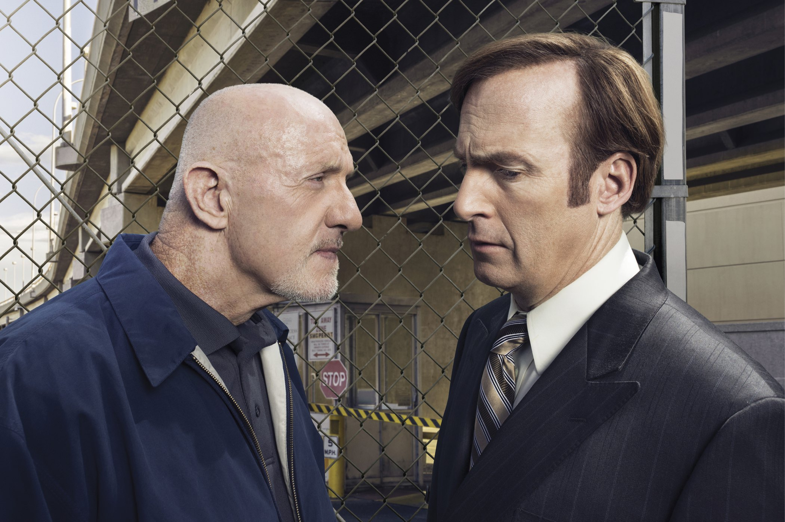
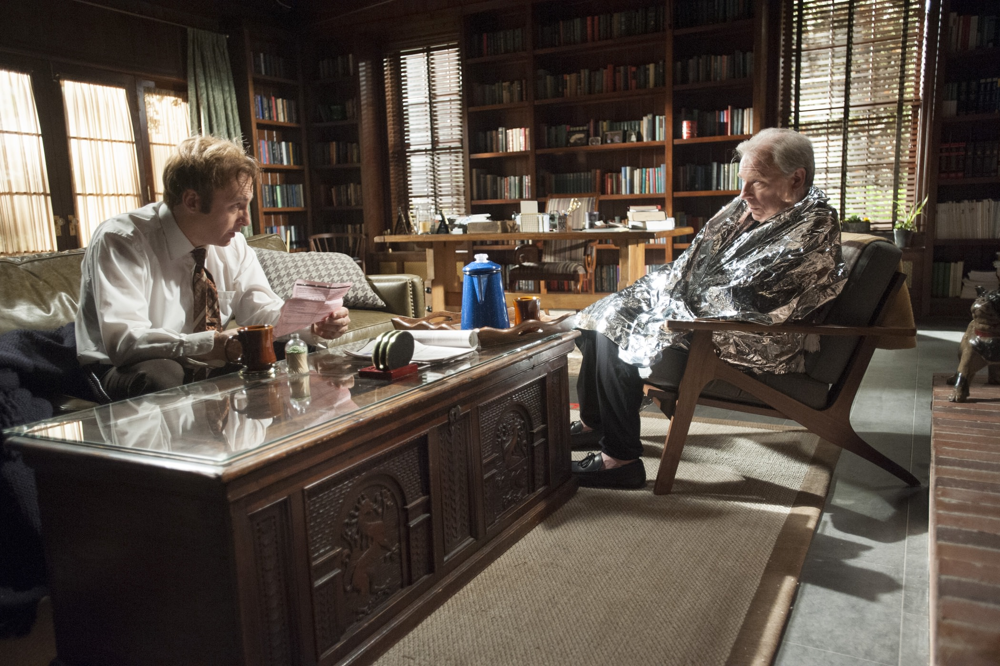
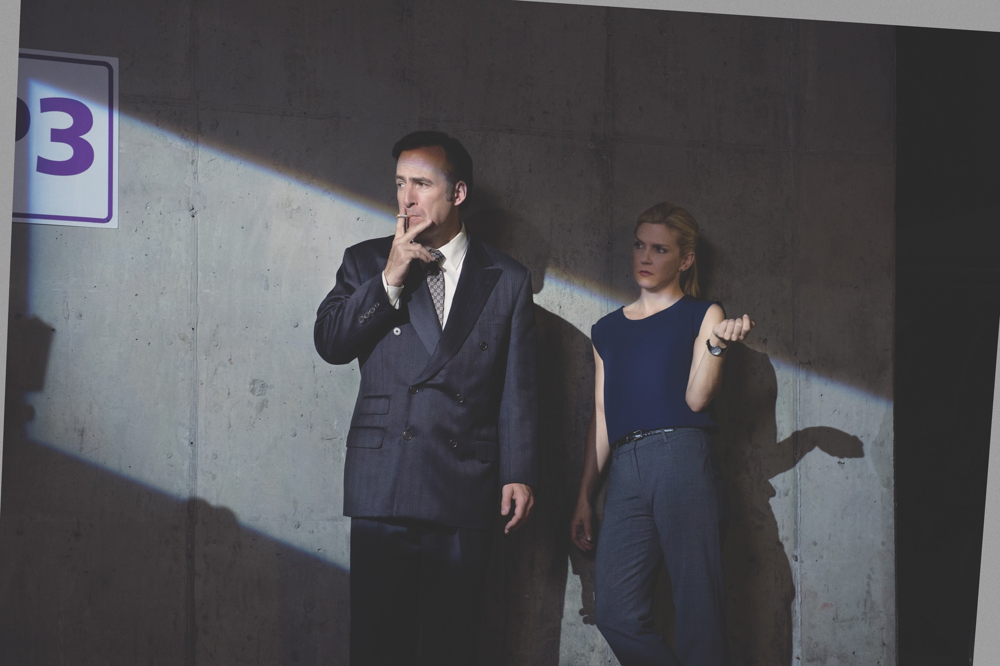

+++
type = "post"
titre = "<em>Better Call Saul</em>, Vince Gilligan et Peter Gould (AMC)"
title = "Better Call Saul, Vince Gilligan et Peter Gould (AMC)"
url = "/better-call-saul-gilligan-gould-amc"
date = "2015-05-13T23:33:03"
Lastmod = "2015-05-13T23:40:08"
cover = "better-call-saul-bob-odenkirk.jpg"
categorie = [ "À voir" ]
tag = [ "Avocat", "Comédie", "Drame", "Famille", "Justice", "Série", "Spin-off" ]
createur = [ "AMC", "Peter Gould", "Vince Gilligan" ]
acteur = [ "Bob Odenkirk", "Jonathan Banks", "Michael Mando", "Michael McKean", "Patrick Fabian", "Rhea Seehorn" ]
annee = [ "2015" ]
weight = 2015
pays = [ "États-Unis" ]

+++

Si la série <a href="http://voiretmanger.fr/breaking-bad-gilligan/" title="Breaking Bad, Vince Gilligan (AMC)"><em>Breaking Bad</em></a> a si bien fonctionné, c&rsquo;est en particulier grâce à ses personnages particulièrement réussis. Et dans le lot de personnages secondaires, celui de l&rsquo;avocat véreux Saul Goodman reste bien ancré en mémoire. Il faut dire qu&rsquo;il avait été particulièrement bien écrit et incarné à merveille par Bob Odenkirk, si bien que les créateurs de la série ont assez rapidement imaginé un <em>spin-off</em>. <em>Better Call Saul</em> est le résultat, une série dérivée qui ne s&rsquo;intéresse qu&rsquo;à ce personnage. Autrefois secondaire, l&rsquo;avocat devient le personnage principal, mais Vince Gilligan, qui avait déjà créé <em>Breaking Bad</em>, et Peter Gould nous ont réservé une surprise. On pouvait craindre la nouvelle série un peu vide qui se contentait de surfer sur le succès de sa devancière, mais <em>Better Call Saul</em> est bien plus que cela. En se plongeant dans l&rsquo;histoire du personnage, son scénario évite la paresse de la répétition et les dix épisodes de la première saison suivent leur propre voie, tout en gardant des similarités avec la série originale. Les deux créateurs ont réussi leur coup : la première saison donne vraiment envie de voir la suite !

Dans <em>Breaking Bad</em>, Saul Goodman était déjà un avocat louche, voire carrément malhonnête, que l&rsquo;on allait voir pour régler des problèmes pas toujours net. Tant que vous pouviez le payer, il faisait ce que vous vouliez sans trop poser de questions, ce qui a permis à Walter White d&rsquo;aller le voir pour régler ses soucis financiers liés à la drogue. <em>Better Call Saul</em>, série basée uniquement sur ce personnage, semblait partir dans la même direction, d&rsquo;autant que son titre reprenait le slogan de l&rsquo;avocat dans ses publicités. Pourtant, dès le premier épisode de ce <em>spin-off</em>, on comprend bien que cela ne sera pas le cas. Nul Saul Goodman ici, le personnage principal de Vince Gilligan et Peter Gould se nomme encore Jimmy McGill et s&rsquo;il est bien avocat, il n&rsquo;a pas du tout la réputation douteuse, ni les clients douteux, qu&rsquo;on lui connaît. C&rsquo;est plutôt un avocat un peu miteux, qui a du mal à joindre les deux bouts en s&rsquo;occupant exclusivement de cas désespérés en tant qu&rsquo;avocat commis d&rsquo;office dans le tribunal du coin. On reconnaît malgré tout le personnage par son côté débrouillard et sa facilité à défendre n&rsquo;importe quel cas, aussi absurde soit-il. La toute première scène de <em>Better Call Saul</em> le présente au tribunal justement, à défendre trois jeunes qui ont fait une « petite bêtise », une erreur de jeunesse comme il le dit si bien. Comme dans <em>Breaking Bad</em>, on ne nous dévoile pas tout et le ressort comique de cette excellente scène est précisément de découvrir la vérité sur ce qu&rsquo;ils ont vraiment fait (ils sont entrés dans une morgue et ont simulé un acte sexuel avec les têtes des morts) après le plaidoyer vibrant du futur Saul Goodman. D&rsquo;emblée, le ton de la série est donné : on n&rsquo;est pas dans la copie de l&rsquo;originale, mais avec le même état d&rsquo;esprit, on a une autre histoire et même une série d&rsquo;un autre genre, avec une ambiance qui rappelle souvent celle de <a href="http://voiretmanger.fr/fargo-hawley-fx/"><em>Fargo</em></a>, la série.

Dix épisodes, c&rsquo;est court pour juger d&rsquo;une série, mais cette première saison est très prometteur. Il faut dire que <em>Better Call Saul</em> n&rsquo;a pas choisi la facilité qui aurait consisté à refaire du <em>Breaking Bad</em>, mais avec un angle différent. En repartant plusieurs années en arrière, Vince Gilligan et Peter Gould ont cherché à repartir sur les origines du personnage, quitte à prendre le risque de déstabiliser en retirant quasiment tout ce que l&rsquo;on connaissait. Certes, on retrouve le personnage de Saul, mais aussi Mike, l&rsquo;homme de main qui l&rsquo;aide dans la série originale. Mais ces deux personnages sont différents ici, on sent qu&rsquo;ils n&rsquo;ont pas encore vécu tout ce qui doit leur arriver dans les années qui précèdent le début de <em>Breaking Bad</em>. L&rsquo;un comme l&rsquo;autre essaient de mener une vie normale et juste, comme avocat et comme gardien du parking devant le tribunal. Et puis ce sont deux personnages beaucoup plus riches dans cette nouvelle série : par une série de flashbacks et de révélations successives, on en apprend plus sur leur histoire. On découvre le passé d&rsquo;arnaqueur de Saul et on apprend ce qui est arrivé à Mike, ancien policier qui trempait dans des affaires louches. À certains égards, le personnage de Jimmy McGill est plus intéressant que Walter White, il est en tout cas plus crédible grâce à une vraie histoire. Ce n&rsquo;est pas simplement un avocat qui découvre les joies de traiter avec des clients louches du jour au lendemain, c&rsquo;est un personnage crédible, qui peine à s&rsquo;imposer face à un frère qui est l&rsquo;un des meilleurs avocats du moment. Pendant toute la saison, il doit faire face à plusieurs frustrations et on sent bien qu&rsquo;elles le conduiront à devenir Saul, mais ce n&rsquo;est pas évident d&rsquo;emblée. <em>Better Call Saul</em> prend le temps de poser ses personnages et son histoire et c&rsquo;est ce qui pouvait sans doute lui arriver de mieux. Bob Odenkirk est parfaitement à l&rsquo;aise dans son rôle et il apporte beaucoup à la série, tandis que les personnages autour de lui sont tout aussi convaincants, à commencer par Jonathan Banks, parfait comme toujours dans le rôle de Mike Ehrmantraut.

<em>Better Call Saul</em> est réalisée par les mêmes qui ont fait <em>Breaking Bad</em> et cela se voit. Même si ce <em>spin-off</em> est différent de la série originale, même s&rsquo;il déploie son propre univers et ses propres personnages, il conserve la même marque de fabrique. C&rsquo;est à la fois très bien — la réalisation est soignée et très réussie — et peut-être aussi son plus gros défaut. Après cinq saisons de <em>Breaking Bad</em>, on connait les habitudes de Vince Gilligan et on les retrouve ici. Cette manie de ne pas tout dévoiler, de couper les scènes pile au moment où l&rsquo;on pourrait enfin avoir une réponse est frustrante et ce n&rsquo;est pas toujours une bonne chose, car c&rsquo;est un petit peu trop systématique. Néanmoins, difficile de faire la fine bouche : <em>Better Call Saul</em> est une série très prometteuse et on a hâte de voir la suite !

<h3>Vous voulez <a href="http://voiretmanger.fr/soutien/">m&rsquo;aider</a> ?</h3>
<ul>
<li><a href="http://www.amazon.fr/gp/product/B00UT9FOJE/ref=as_li_ss_tl?ie=UTF8&amp;tag=leblogdenic07-21&amp;linkCode=as2&amp;camp=1642&amp;creative=19458&amp;creativeASIN=B00UT9FOJE">Acheter la série en Blu-ray sur Amazon</a></li>
<li><a href="http://www.amazon.fr/gp/product/B00UT9FLGA/ref=as_li_ss_tl?ie=UTF8&amp;tag=leblogdenic07-21&amp;linkCode=as2&amp;camp=1642&amp;creative=19458&amp;creativeASIN=B00UT9FLGA">Acheter la série en DVD sur Amazon</a></li>
<li><a href="https://itunes.apple.com/fr/tv-season/better-call-saul-saison-1-vost/id957514659">Acheter ou louer la série sur l&rsquo;iTunes Store</a></li>
<li><a href="http://www.netflix.com/WiMovie/80021955?trkid=50263268">Regarder la série sur Netflix</a></li>
</ul>

