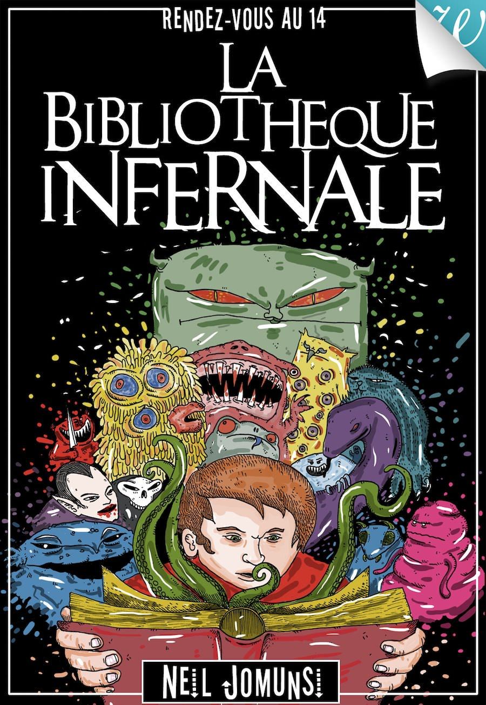
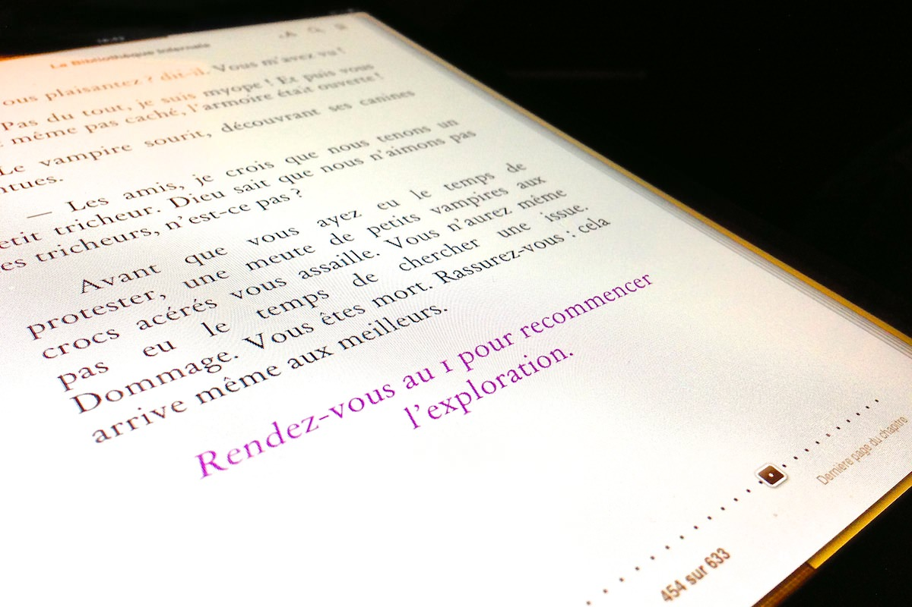

+++
type = "post"
titre = "La bibliothèque infernale, Neil Jomunsi"
title = "La bibliothèque infernale, Neil Jomunsi"
url = "/bibliotheque-infernale-jomunsi"
date = "2013-03-05T19:39:12"
Lastmod = "2013-03-05T20:51:48"
cover = "neil-jomunsi-bibliotheque-infernale.jpg"
categorie = [ "À lire" ]
tag = [ "Fantastique", "Humour", "Jeu", "Livre dont vous êtes le héros", "Roman" ]
createur = [ "Neil Jomunsi" ]
annee = [ "2012" ]
weight = 2012
pays = [ "France" ]

+++

<blockquote class="pull-quote">
Lorsque vous finissez par vous réveiller, un bruit de tonnerre continu et absolument étourdissant fait bourdonner vos oreilles. Vous êtes couché sur un sol pavé de dalles de pierre, et le gigantesque bruit qui vous entoure en fait trembler la surface, comme un séisme. En panique, vous bondissez sur vos pieds.<cite class="author"> — Neil Jomunsi, La bibliothèque infernale, prologue</cite>

</blockquote>

Ainsi commence l’aventure principale de <em>La Bibliothèque infernale</em>, un livre dont vous êtes le héros. Très en vogue dans les années (compléter), le genre est un peu tombé en désuétude. À part pour certains aficionados des jeux de rôles, leur structure désordonnée et surtout la nécessité de lire avec du papier et un crayon, mais aussi souvent un ou deux dès ne facilite pas son utilisation. Walrus, éditeur de livres numériques uniquement a pourtant choisi de dépoussiérer un peu le genre et d’en faire sa spécialité. Un pari audacieux, mais qui s’explique par une raison technique assez simple. En abandonnant le papier, les livres dont vous êtes le héros s’avèrent beaucoup plus simples à utiliser. Inutile de tourner frénétiquement les pages pour trouver le bon chapitre, un lien vous y emmènera automatiquement. Un gain de temps appréciable qui permet d’oublier la technique pour se concentrer sur la lecture et le jeu, puisqu’il s’agit avant tout d’un jeu. Neil Jomunsi s’est lui aussi prêté au jeu et il a composé une aventure surprenante où le héros — c’est-à-dire vous — est enfermé dans un livre qui ressemble bien à une dangereuse tour pleine de créatures. À condition d’accepter le style particulier des livres dont vous êtes le héros, <em>La bibliothèque infernale</em> propose une aventure amusante et pleine de dangers. 

Dans <em>La bibliothèque infernale</em>, vous êtes un libraire toujours un peu en retard, ce qui ne manque pas d’énerver votre patron. Mais avant d’entrer dans le vif du sujet, Neil Jomunsi pose son cadre fantastique en racontant l’histoire d’un mystérieux Livre qui exauce tous les vœux de son propriétaire, mais le condamne dans le même temps à l’oubli une fois la mort venue. Un mystérieux ouvrage qui le devient encore plus quand… il commence à vous parler directement. Une hilarante séquence qui n’est pas sans rappeler l’humour si particulier d’un Terry Pratchett ou d’un Neil Gaiman et qui sera utilisé dans tout le livre. En attendant d’en savoir plus, vous vous réveillez pour partir à votre travail, en retard bien évidemment. L’intrigue commence vraiment quand un homme mystérieux entre dans la boutique et vous tend un livre ancien aux pages totalement blanches. On comprend vite qu’il s’agit du Livre de l’introduction, mais vous n’avez pas le temps de le comprendre que déjà vous êtes absorbé et enfermé dans le livre en question. Il ne vous reste alors plus qu’à suivre les aventures imaginées par l’esprit très productif de l’auteur pour vous sortir de l’intérieur du Livre qui vous a fait prisonnier et qui prend la forme d’une tour formée exclusivement d’autres livres. 

Le fantastique est un genre extrêmement courant dans la catégorie des livres dont vous êtes le héros et <em>La bibliothèque infernale</em> ne modifie pas cette habitude. Neil  de Jomunsi a judicieusement choisi l’angle comique, ce qui allège considérablement l’ensemble et permet même de sourire, voire de rire pendant la lecture. Concrètement, vous l’aurez compris, il faut se rendre de chapitre en chapitre en suivant des liens situés à la fin de chacun des 221 chapitres du roman. Certains sont très courts, d’autres plus longs, tandis que vous aurez parfois le choix entre plusieurs options. Il peut s’agir de choisir une direction (droite/gauche, mais aussi à quel étage se rendre avec un ascenseur), de compter jusqu’à un certain point, de répondre à des questions en forme d’énigmes, ou encore de choisir d’aider un personnage ou plutôt de fuir. Les choix sont assez variés et on ne s’ennuie jamais vraiment dans <em>La bibliothèque infernale</em>, d’autant que le texte reste assez court et se lit rapidement. Neil Jomunsi a astucieusement créé plusieurs scénarios et vous n’êtes pas contraint de suivre une seule route, même s’il faut bien souvent choisir <em>la</em> bonne solution. En cas de mauvais choix, le couperet est inévitable : vous mourrez et il ne vous reste plus qu’à recommencer. On recommandera aux moins patients d’entre nous d’enregistrer mentalement le chapitre de départ, pour revenir plus facilement en arrière en cas d’erreur dans la trajectoire… Puisqu’il s’agit d’un livre numérique, c’est assez facile de le faire avec des annotations. 

À la fois roman et jeu, le livre dont vous êtes le héros a tout à fait sa place sur les liseuses numériques. L’interactivité simplifie considérablement l’utilisation de ces livres un peu particuliers et permettent de les prendre plus pour des romans, que pour de vrais jeux. Ce changement ne sera pas apprécié par tout le monde, mais pour qui avait du mal avec les livres dont vous êtes le héros traditionnels — comme moi —, c’est peut-être le moment de réessayer. Pourquoi ne pas le faire avec <em>La bibliothèque infernale</em> de Neil Jomunsi ? À défaut d’être très originale, l’aventure est bien menée et on ne s’ennuie pas dans les dédales de ce Livre maléfique en forme de tour. Certains chapitres, comme celui avec le dragon, sont même très drôles et on passe de toute manière un bon moment… n’est-ce pas l’essentiel après tout ?

<h3>Vous voulez m&rsquo;aider ?<a href="#footnote_0_8741" id="identifier_0_8741" class="footnote-link footnote-identifier-link" title="&Agrave; propos de la publicit&eacute;&hellip;">1</a></h3>
<ul>
<li><a href="http://www.amazon.fr/gp/product/B007B86FD0/ref=as_li_ss_tl?ie=UTF8&tag=leblogdenic07-21&linkCode=as2&camp=1642&creative=19458&creativeASIN=B007B86FD0">Acheter le livre au format Kindle sur Amazon</a></li>
<li><a href="https://itunes.apple.com/fr/book/la-bibliotheque-infernale/id504239668?mt=11">Acheter le livre sur l&rsquo;iBookstore (iPhone et iPad)</a></li>
<li><a href="http://walrus-books.com/les-livres-dont-vous-etes-le-heros/" target="_blank">Tous les livres dont vous êtes le héros de l&rsquo;éditeur Walrus</a></li>
</ul>

<ol class="footnotes"><li id="footnote_0_8741" class="footnote"><a href="/soutien/">À propos de la publicité…</a> [<a href="#identifier_0_8741" class="footnote-link footnote-back-link">&#8617;</a>]</li></ol>
