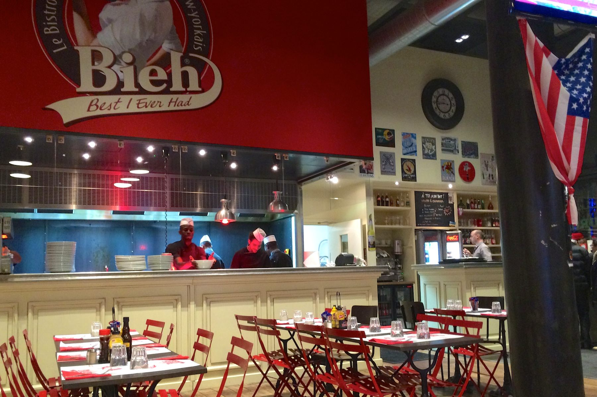
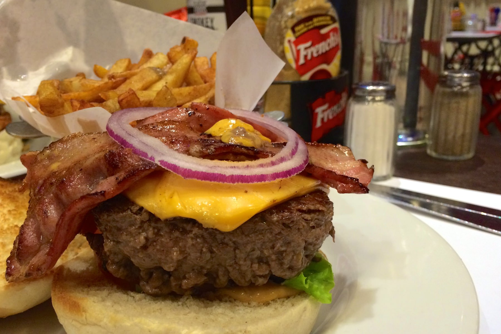
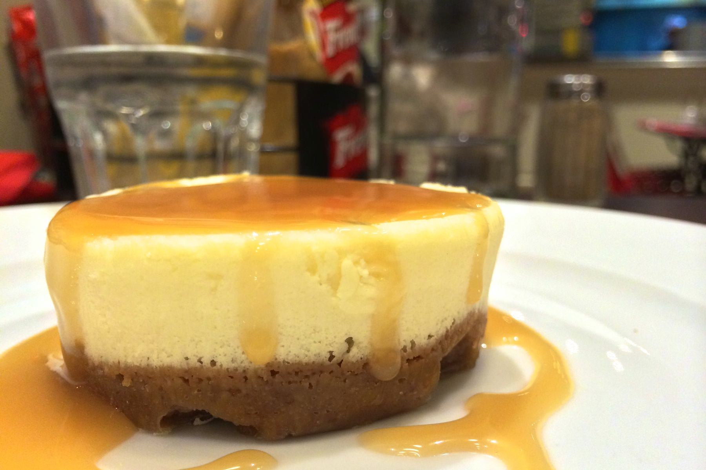

+++
titre = "Le Bieh à Lyon"
title = "Le Bieh à Lyon"
url = "/bieh-lyon"
date = "2014-01-19T09:39:48"
Lastmod = "2015-03-14T23:19:07"
cover = "bieh-lyon.jpg"
categorie = [ "À manger" ]
tag = [ "69009", "Cuisine américaine", "Fast-food", "Hamburger" ]

+++

Lancé en 2009 par un ancien élève de l&rsquo;école de cuisine de Paul Bocuse, <a href="http://www.bieh.fr"><strong>Bieh</strong></a> est passé du restaurant unique à la petite chaîne lyonnaise. Quatre adresses à Lyon, deux dans le deuxième arrondissement, une dans le sixième et une dernière à Vaise, celle qui a été testée ici. Le concept reste le même : amener un bistrot new-yorkais en France. On nous promet des burgers, des bagels ou encore des <em>onion rings</em> et du cheesecake, mais avec une touche française. Le tout étant en théorie le « <em>Best I Ever Had</em> » (d&rsquo;où le nom de la chaîne) : qu&rsquo;en est-il vraiment ?

À deux pas du Pathé Vaise, le restaurant est idéalement situé pour combiner une séance de ciné et un bon burger. Non loin de là, on peut aussi opter pour <a href="http://voiretmanger.fr/ouest-express-lyon/" title="L’Ouest Express à Lyon">L’Ouest Express</a>, le fast-food de Paul Bocuse, mais l&rsquo;ambiance est totalement différente ici. Au cadre minimaliste et presque clinique de ce dernier, le <strong>Bieh</strong> répond avec une ambiance qui doit nous transporter directement dans la capitale américaine. Ce décor façon <em>diner</em> est plutôt bien conçu, avec ses drapeaux et posters américains et ses grands écrans qui tournent en permanence, avec ses banquettes et son mobilier qui évoque vraiment le repas sur le pouce. On apprécie le choix d&rsquo;un plancher brut et de briques pour l&rsquo;un des murs : l&rsquo;ensemble est bien pensé et les produits vraiment américains sur les tables — dont une moutarde au miel qui n&rsquo;a de moutarde que le nom — font toute la différence. La salle de ce <strong>Bieh</strong> est grande, très grande, et ce samedi soir-là, il y avait foule. En d&rsquo;autres termes, n&rsquo;espérez pas faire un repas tranquille en tête à tête, du moins pas un soir de week-end. C&rsquo;est d&rsquo;autant moins le cas que les tables sont un peu proches et surtout que la musique est forte, anormalement forte. On s&rsquo;entend à peine alors qu&rsquo;on est en face l&rsquo;un de l&rsquo;autre, dommage.

Au <a href="http://voiretmanger.fr/wp-content/2014/01/menu_bieh_dec13_bd_ter.pdf">programme du <strong>Bieh</strong></a>, peu de surprises et c&rsquo;est bien normal, on vient ici pour manger américain. On a quelques burgers, deux ou trois bagels, une ou deux salades pour la forme et c&rsquo;est à peu près tout. Si vous aimez les hamburgers originaux comme ceux que savent proposer le <a href="http://voiretmanger.fr/big-fernand-lyon/" title="Big Fernand à Lyon"><strong>Big Fernand</strong></a> ou <a href="http://voiretmanger.fr/king-marcel-lyon/" title="King Marcel à Lyon"><strong>King Marcel</strong></a>, vous serez déçus : il n&rsquo;y a ici que du très grand classique avec un steak, du cheddar et du bacon éventuellement. On aurait aimé un peu plus d&rsquo;inventivité, des fromages différents ou même des sauces spéciales qui ne sont d&rsquo;ailleurs pas du tout évoquées sur la carte. On se contente du strict minimum, même si les amateurs pourront opter pour des burgers végétariens avec des steaks de soja, ou des versions avec poulet. Les prix sont plutôt élevés pour des hamburgers aussi simple, puisque l&rsquo;on s&rsquo;en tire difficilement à moins de 13 ou 14 € avec un accompagnement. Notons au passage que l&rsquo;on peut choisir entre un steak normal et un burger extra qui est non seulement plus épais (120 g contre 180 g), mais qui est aussi de meilleure qualité avec moins de graisse dans la viande. Cette version coûte 3 € de plus, mais elle semble indispensable si on veut s&rsquo;éloigner des fast-food traditionnels. Si l&rsquo;on ajoute à cela une boisson et un dessert, on en aura difficilement pour moins de 20 € par personne, un tarif élevé qui rend exigeant.

À la commande, on est un peu déçu de ne pas avoir le choix de la cuisson pour la viande. Fort heureusement, les burgers que nous avons goûté étaient parfaitement cuits, avec une viande rosée encore juteuse, mais on aurait aimé avoir le choix. Le <strong>Bieh</strong> a fait le pari de la simplicité pour ses burgers, un choix qui peut se comprendre, mais qui ne fonctionne pas vraiment. La viande est excellente, malgré un assaisonnement un petit peu faible.  Le pain était aérien et grillé comme il faut. Le problème, c&rsquo;est qu&rsquo;il n&rsquo;y a quasiment que ça : l&rsquo;ensemble manque cruellement d&rsquo;une sauce pour lier le tout et la tranche de cheddar industriel à peine fondue est loin de convaincre, elle aussi. Dommage, à Lyon, de ne pas faire le pari de fromages plus originaux qui feraient la différence. Dommage aussi, pour un ancien de l&rsquo;école créée par Paul Bocuse, d&rsquo;oublier l&rsquo;importance d&rsquo;une sauce. Au total, ces burgers sont corrects, mais un peu secs et loin d&rsquo;être inoubliables. À côté, les frites auraient mérité d&rsquo;être salées, mais elles ne sont pas mauvaises, quoi qu&rsquo;un peu molles. L&rsquo;ensemble est bon, mais beaucoup trop cher : payer 4 € pour six <em>onion rings</em> loin d&rsquo;être excellents, ou payer 5,5 € pour un brownie soi-disant fait maison, mais qui ressemble à n&rsquo;importe quelle version industrielle, c&rsquo;est trop. Le cheesecake était bon, même si on aurait aimé plus de fromage et moins de biscuit qui croustillait néanmoins comme il se doit.

Proposer des burgers de qualité est une excellente idée et le résultat peut-être exceptionnel et justifier un prix plus élevé que dans un fast-food lambda. Ceux du <strong>Bieh</strong> sont bons, mais ils ne sont pas exceptionnels du tout et ils sont chers, trop chers. Il leur manque la touche d&rsquo;originalité, ou même simplement un peu plus de sauce et un bon fromage : on est à Lyon, quand même. En l&rsquo;état, on trouvera mieux et moins cher ailleurs : ceux de <strong>Big Fernand</strong> sont bien plus originaux et meilleurs à mon avis.

