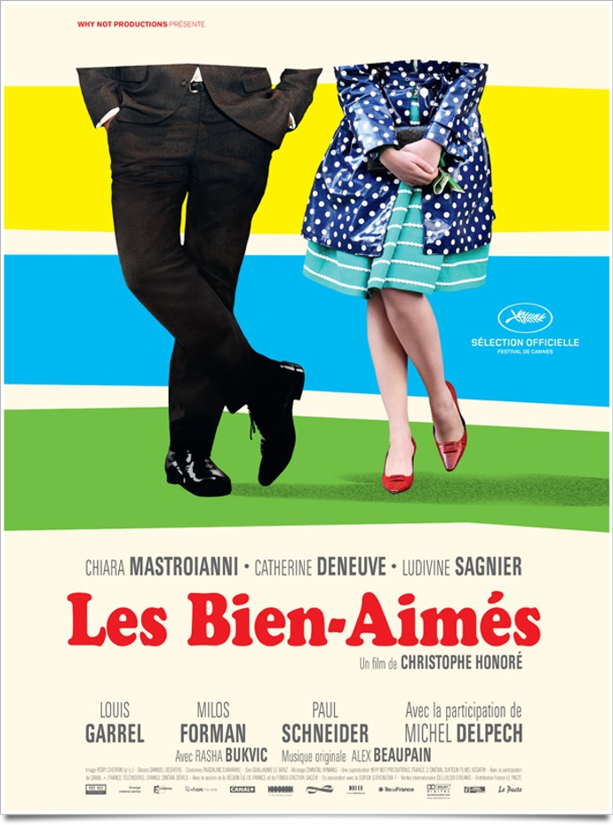
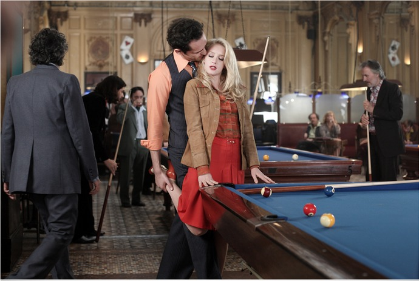

+++
type = "post"
titre = "Les Bien-Aimés, Christophe Honoré"
title = "Les Bien-Aimés, Christophe Honoré"
url = "/bien-aimes-honore"
date = "2011-08-27T18:12:11"
Lastmod = "2012-03-06T12:17:33"
cover = "les-bien-aimes-mastroianni.jpg"
categorie = [ "À voir" ]
tag = [ "Amour", "Chanson française", "Comédie musicale", "Drame", "Famille", "Vite oublié" ]
acteur = [ "Catherine Deneuve", "Chiara Mastroianni", "Louis Garrel", "Ludivine Sagnier", "Milos Forman" ]
annee = [ "2011" ]
weight = 2011
pays = [ "France" ]

+++

Après la parenthèse bretonne de <em><a href="/2009/09/07/non-ma-fille-tu-niras-pas-danser-honore/">Non ma fille, tu n&rsquo;iras pas danser</a></em>, Christophe Honoré revient à Paris et aux chansons avec <em>Les Bien-Aimés</em>. À la manière de ses <em>Chansons d&rsquo;amour</em>, le cinéaste évoque une histoire d&rsquo;amour, ou plutôt des histoires d&rsquo;amour, en chansons. Même si <em>Les Bien-Aimés</em> ne tend pas autant vers la comédie musicale que <em>Les Chansons d&rsquo;amour</em>, le sentiment de déjà-vu ne quitte jamais vraiment le spectateur. Des acteurs aux situations, les deux films sont très proches et la lassitude commence à gagner.

<em>Les chansons d&rsquo;amour</em> exploitait les relations amoureuses sous toutes ses formes : à deux, à trois, entre hommes… <em>Les Bien-Aimés</em> ne parle quasiment que d&rsquo;amours hétérosexuelles normées, même si un des personnages principaux est gay et même si on a une scène à trois. Là n&rsquo;est plus le sujet néanmoins : Christophe Honoré n&rsquo;étudie plus les différentes formes d&rsquo;amour, mais l&rsquo;évolution de l&rsquo;amour avec le temps. Son film se déroule ainsi sur une quarantaine d&rsquo;années, de la fin des années 50 aux années 2000. Deux générations se succèdent et se croisent : Madeleine et son client qui devient son mari, puis leur fille, Vera. Débutant à Paris, le film s&rsquo;ouvre ensuite sur d&rsquo;autres horizons : Prague dans les années 1960, 1970, puis à nouveau Paris dans les années 1980, Londres dans les années 1990, Montréal dans les années 2000 et enfin Reims. Dans tous ces lieux et dans toutes ces époques, <em>Les Bien-Aimés</em> voit évoluer ses personnages et leur amour…

<em>Les Bien-Aimés</em> ne s&rsquo;intéresse plus tant aux formes de l&rsquo;amour et le film interroge ainsi l&rsquo;amour à l&rsquo;épreuve du temps : comment aimer une personne sur plusieurs années ? Comment renouveler l&rsquo;amour initial ? Les relations amoureuses ne sont jamais simples chez Christophe Honoré et ce film ne fait pas exception à la règle. Les personnages semblent incapables de s&rsquo;entendre en amour dans <em>Les Bien-Aimés</em>, ils sont tous en décalage. Jaromil venu chercher du sexe rémunéré tombe amoureux de Madeleine et il réussit à la convaincre de l&rsquo;épouser et de partir avec lui à Prague, mais il semble incapable de rester avec une seule femme. Madeleine ne peut l&rsquo;accepter et elle épouse François, un gendarme qui aime Madeleine alors que cette dernière ne parvient jamais à l&rsquo;aimer vraiment. Quand, beaucoup plus tard, Jaromil voudra épouser à nouveau Madeleine, cette dernière ne pourra se résoudre à abandonner François et elle est obligée de vivre une relation cachée avec l&rsquo;homme de sa vie. Sa fille, Vera, ne s&rsquo;en sort pas mieux : Clément, un collègue, l&rsquo;aime plus que tout, mais elle aime un autre homme, Henderson qui, lui, est homosexuel et ne peut se résoudre à offrir à Vera ce qu&rsquo;elle veut. Ce décalage permanent est sans doute le meilleur aspect de <em>Les Bien-Aimés</em> : le regard et l&rsquo;écriture de Christophe Honoré s&rsquo;avèrent très efficaces pour évoquer ces aspects et rendre les personnages crédibles.

Christophe Honoré, comme beaucoup de réalisateurs d&rsquo;ailleurs, à ses acteurs favoris. Rien d&rsquo;anormal à cela, mais <em>Les Bien-Aimés</em> est l&rsquo;énième film avec la même brochette d&rsquo;acteurs et le spectateur qui suit la filmographie du cinéaste ne pourra qu&rsquo;éprouver un sentiment de déjà-vu par leur seule présence. Dans <em>Les Bien-Aimés</em>, ce sentiment est encore renforcé par le choix d&rsquo;intégrer des parties chantées au film. Le procédé avait déjà été utilisé dans <em>Les Chansons d&rsquo;amour</em> : le film, beaucoup plus clairement associé au genre de la comédie musicale, avait été pensé en fonction des chansons et le résultat était plutôt convaincant et assez original par le choix des chansons d&rsquo;Alex Beaupain. <em>Les Bien-Aimés</em> ne devait à l&rsquo;origine pas être chanté, le film n&rsquo;a pas été écrit pour des chansons, mais Christophe Honoré à demandé à son complice musicien d&rsquo;écrire des chansons pour le film. Quand une histoire avance avec des parties chantées, un décalage se crée toujours tant cette situation est irréaliste, mais ce décalage n&rsquo;était pas trop gênant dans <em>Les chansons d&rsquo;amour</em>. Ici, il l&rsquo;est beaucoup plus : le drame réaliste est rompu à plusieurs (douze…) reprises par des chansons qui tombent un peu comme un cheveu sur la soupe, il faut le dire. Alex Beaupain ayant à nouveau écrit paroles et musique pour <em>Les Bien-Aimés</em>, la ressemblance avec le film précédent est inévitable et elle ne se fait pas en faveur de ce nouveau film qui aurait été bien plus fort sans chansons. Il aurait été aussi plus court : les 2h20 du film durent un peu trop, surtout sur la fin qui perd la légèreté initiale.

Le sentiment de déjà-vu concerne aussi la forme. La caméra de Christophe Honoré s&rsquo;approche de celle de ses précédents films et là encore, on pense surtout aux <em>Chansons d&rsquo;amour</em>. À plusieurs reprises, <em>Les Bien-Aimés</em> filme un personnage pendant sa chanson, face à la caméra, regardant cette dernière. Certains plans dans les rues vides de Paris ou de Prague rappellent aussi les plans équivalents du film précédent. Difficile de savoir si ce choix est motivé pour une raison qui reste dans ce cas obscure ou si le réalisateur peine à se renouveler, mais on a vraiment l&rsquo;impression à plusieurs reprises de revoir <em>Les Chansons d&rsquo;amour</em> et c&rsquo;est assez pénible. Les acteurs et surtout les actrices sont tous très bons, sans surprise malheureusement : Chiara Mastroianni est très bien, mais son rôle est si proche des <em>Chansons d&rsquo;amour</em> quand il ne s&rsquo;approche pas de celui de <em>Non ma fille, tu n&rsquo;iras pas danser</em>. Catherine Deneuve est peut-être un peu plus folle, mais elle reste la matriarche que l&rsquo;on connaît et ce n&rsquo;est pas quelques poils de plus qui vont changer Louis Garrel, constant. Ludivine Sagnier est plus intéressante et heureusement qu&rsquo;il y a quelques rôles masculins un peu nouveaux et notamment celui de Jaromil : Milos Forman est d&rsquo;ailleurs épatant dans ce rôle.

On ne peut reprocher son style à Christophe Honoré quand tant de cinéastes n&rsquo;en ont pas. Ses films sont ainsi tous aisément identifiables, les thématiques proches et c&rsquo;est très bien ainsi. Avec <em>Les Bien-Aimés</em> néanmoins, le cinéaste a presque tendance à se caricaturer, il ne se renouvelle en tout cas pas assez. Tout a un goût de déjà-vu, l&rsquo;histoire, les personnages, la forme chantée, certains plans même… Le film n&rsquo;est pas déplaisant, mais le souvenir des <em>Chansons d&rsquo;amour</em> est trop tenace pour être oublié et ce premier essai dans la comédie musicale était bien meilleur. Dommage, l&rsquo;histoire des <em>Bien-Aimés</em> était loin d&rsquo;être inintéressant…

<h3>Vous voulez m&rsquo;aider ?<a href="#footnote_0_5090" id="identifier_0_5090" class="footnote-link footnote-identifier-link" title="&Agrave; propos de la publicit&eacute;&hellip;">1</a></h3>
<ul>
<li><a href="http://www.amazon.fr/gp/product/B005OYBXV2/ref=as_li_ss_tl?ie=UTF8&tag=leblogdenic07-21&linkCode=as2&camp=1642&creative=19458&creativeASIN=B005OYBXV2">Acheter le film en Blu-Ray sur Amazon</a></li>
<li><a href="http://www.amazon.fr/gp/product/B005OYBXW6/ref=as_li_ss_tl?ie=UTF8&tag=leblogdenic07-21&linkCode=as2&camp=1642&creative=19458&creativeASIN=B005OYBXW6">Acheter le film en DVD sur Amazon</a></li>
</ul>

<ol class="footnotes"><li id="footnote_0_5090" class="footnote"><a href="/a-propos/publicite/">À propos de la publicité…</a> [<a href="#identifier_0_5090" class="footnote-link footnote-back-link">&#8617;</a>]</li></ol>
