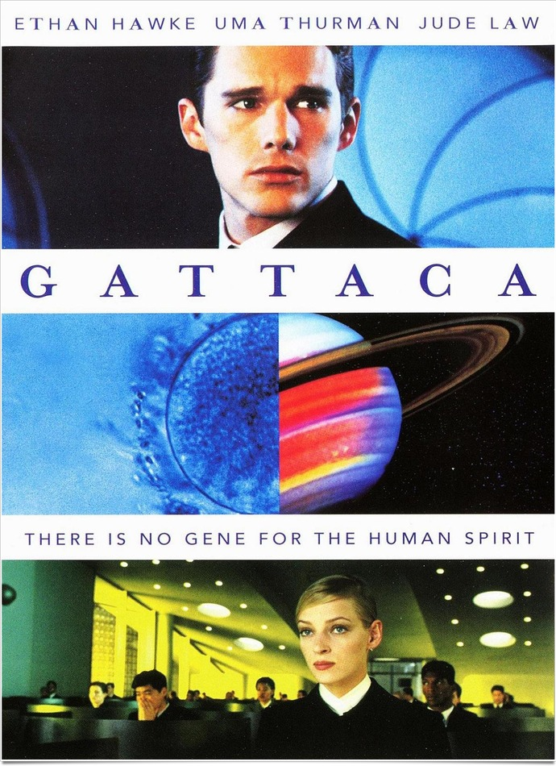
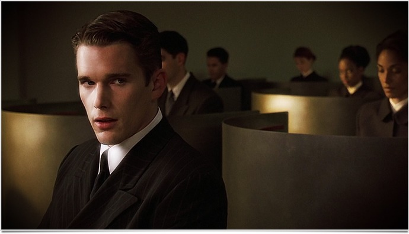
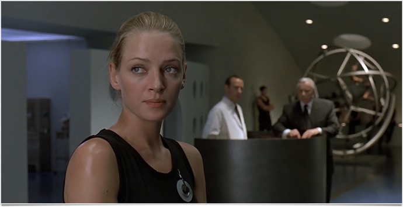

+++
type = "post"
titre = "<em>Bienvenue à Gattaca</em>, Andrew Niccol"
title = "Bienvenue à Gattaca, Andrew Niccol"
url = "/bienvenue-a-gattaca-niccol"
date = "2011-07-31T01:02:22"
Lastmod = "2014-12-29T10:54:43"
cover = "gattaca.jpg"
categorie = [ "À voir" ]
tag = [ "Dystopie", "Polar", "Science-Fiction", "Société" ]
createur = [ "Andrew Niccol" ]
acteur = [ "Ethan Hawke", "Jude Law" ]
annee = [ "1998" ]
weight = 1998
pays = [ "États-Unis" ]

+++

<em>Bienvenue à Gattaca</em> sort alors que les débats sur les questions génétiques font rage en place publique. <a href="http://fr.wikipedia.org/wiki/Dolly_(brebis)">Dolly</a> est née un an plus tôt et on commence à se poser des questions souvent gênantes : l&rsquo;homme a-t-il le droit de manipuler ses gènes, bricoler dans son ADN, modifier sa nature ? C&rsquo;est exactement le sujet du film d&rsquo;Andrew Nicool : <em>Bienvenue à Gattaca</em> montre notre monde dans un futur proche. C&rsquo;est surtout une <a href="http://fr.wikipedia.org/wiki/Dystopie">dystopie</a> génétique qui fait froid dans le dos et qui garde encore tout son sens aujourd&rsquo;hui : à (re)voir absolument.

Vincent a été conçu à l&rsquo;arrière d&rsquo;une voiture, sur une plage, et non dans une éprouvette. Ses parents ont laissé faire la nature, un choix que désormais plus personne ne fait dans cette société située quelque part dans un futur proche. Désormais, la norme est de faire confiance à la science : on donne spermatozoïdes et ovules et on obtient une liste de candidats potentiels. Charge ensuite aux parents de déterminer s&rsquo;ils préfèrent une fille ou un garçon, de choisir sa taille, la couleur de ses yeux et de ses cheveux et éventuellement d&rsquo;autres caractéristiques. Charge à la science d&rsquo;éliminer les maladies génétiques, les problèmes comme l&rsquo;insuffisance cardiaque ou encore tout risque de cancer. C&rsquo;est la norme et c&rsquo;est même le seul moyen de parvenir à faire quoi que ce soit d&rsquo;intéressant dans cette société : le pauvre Vincent se fait rejeter de son école et il ne pourra jamais avoir la carrière d&rsquo;astronaute dont il rêve depuis tout petit. Son petit frère, conçu quant à lui dans l&rsquo;éprouvette, a droit à tous les égards et est promis à un brillant avenir. Pour tenter malgré tout de réaliser son rêve le plus cher, Vincent tente le tout pour le tout et se fait passer pour un valide. Vincent devient Jérôme, mais alors qu&rsquo;il est sur le point de réaliser son rêve, sa véritable identité pourrait être dévoilée…

<em>Bienvenue à Gattaca</em> puise dans les grandes dystopies littéraires pour construire son propre univers. On retrouve beaucoup du <em><a href="http://fr.wikipedia.org/wiki/Le_Meilleur_des_mondes">Meilleur des mondes</a></em> de Huxley évidemment, mais aussi le <em><a href="http://fr.wikipedia.org/wiki/1984_(roman)">1984</a></em> d&rsquo;Orwell, pour ne citer que les plus connus. Au premier, le film reprend l&rsquo;idée de castes et de sélection génétique : il y a d&rsquo;un côté les valides, soigneusement sélectionnés au microscope et qui peuvent accéder aux plus hautes fonctions de la société ; de l&rsquo;autre il y a les invalides conçus par la nature et qui ne peuvent guère plus que laver les toilettes des valides. Deux castes basées uniquement sur le profil génétique : quand Vincent/Jérôme postule à Gattaca, la seule information à son sujet qui importe est son ADN, ses compétences professionnelles ne sont même pas évoquées. Être valide suffit et Vincent parvient à duper les valides avec simplement un peu d&rsquo;organisation et du sang d&rsquo;un autre valide. Une fois dans la caste, Vincent est tranquille tant la caste en question est certaine de la sécurité de ses filtres. La société de <em>Bienvenue à Gattaca</em> est en effet extrêmement sécurisée, c&rsquo;est le propre d&rsquo;ailleurs de toute dystopie. Puisant cette plutôt du côté du roman d&rsquo;Orwell, le film décrit bien comment chaque employé doit tester son sang le matin pour entrer et comment chaque résidu corporel peut à tout moment servir de preuve. La police a tous les pouvoirs, y compris d&rsquo;imposer à tous les employés un test sanguin en bonne et due forme. Le sang, en fait l&rsquo;ADN qu&rsquo;il contient, sert d&rsquo;ailleurs de carte d&rsquo;identité dans cet univers aseptisé.

Comme beaucoup de dystopie, <em>Bienvenue à Gattaca</em> n&rsquo;est pas un film de science-fiction très futuriste. On ne sait pas exactement quand se déroule l&rsquo;histoire : le film indique que c&rsquo;est dans un futur proche, mais déjà lors de sa sortie, le cadre semblait daté. Et pour cause, il n&rsquo;y a vraiment rien de futuriste chez Andrew Niccol, tout serait plutôt au contraire daté des années 1950 et 1960. Le plus évident concerne bien sûr les voitures qui sont, certes, électriques, mais qui ne trompent pas : il s&rsquo;agit de vieilles voitures très très légèrement modifiées (la couleur des phares). Le bâtiment de Gattaca est en fait un bâtiment qui date des années 1950, mais qui n&rsquo;est pas particulièrement daté et plutôt intemporel. Les costumes eux sont extrêmement classiques, de même que la langue (il n&rsquo;y a pas de novlangue orwelienne ici) ou, de manière générale, la vie de tous les jours. Le spectateur retrouvera au mieux les habitudes de son temps, mais il risque même d&rsquo;être déphasé dans le passé. Un choix étonnant qui confère à <em>Bienvenue à Gattaca</em> un ton à part, bien loin de certains films de science-fiction au cinéma. Le film se rapproche plus d&rsquo;un film noir, avec son enquête policière, que d&rsquo;un film résolument futuriste. C&rsquo;est peut-être ce qui a permis à <em>Bienvenue à Gattaca</em> d&rsquo;entrer en résonance avec les débats de son époque : ce film est familier, il ne contient pas suffisamment de différence avec le présent pour l&rsquo;écarter d&rsquo;un revers de la main. <em>Bienvenue à Gattaca</em> est un film d&rsquo;actualité, en 1997 comme aujourd&rsquo;hui.

Andrew Niccol ne disposait que d&rsquo;un budget limité pour son film et si cela se voit parfois, le cinéaste a su l&rsquo;exploiter à plein. Techniquement, <em>Bienvenue à Gattaca</em> fait dans la modestie et l&rsquo;efficacité. Nul combat de sabres laser ici, mais quelques touches ici ou là qui suffisent à faire croire à cet univers dans le futur. Le film montre finalement peu d&rsquo;endroits différents, évite les scènes en extérieur et compense le manque de moyens par une photographie très marquée, quitte à en faire un peu trop. Le filtre sépias par exemple aurait gagné à se faire plus discret, même s&rsquo;il contribue lui aussi à créer cette ambiance rétro-futuriste si particulière. Pour un premier film, Andrew Niccol de débrouille vraiment bien et on a pu voir avec <em><a href="http://voiretmanger.fr/lord-of-war-niccol/" title="Lord of War, Andrew Niccol">Lord of War</a></em> qu&rsquo;il se débrouillait bien également avec un plus gros budget.

<em>Bienvenue à Gattaca</em> est une dystopie très efficace et qui garde tout son intérêt aujourd&rsquo;hui encore. Elle n&rsquo;est pas très originale dans ses idées, mais le premier film d&rsquo;Andrew Niccol condense les grandes idées autour du contrôle génétique et de ses risques à une époque où le débat explose en place publique. Cette bonne synchronisation explique sans nul doute le succès du film, devenu immédiatement culte malgré un succès public très relatif.

<h3>Vous voulez m&rsquo;aider ?</h3>
<ul>
<li><a href="http://www.amazon.fr/gp/product/B0014SM9ZQ/ref=as_li_ss_tl?ie=UTF8&#038;tag=leblogdenic07-21&#038;linkCode=as2&#038;camp=1642&#038;creative=19458&#038;creativeASIN=B0014SM9ZQ">Acheter le film en Blu-Ray sur Amazon</a></li>
<li><a href="http://www.amazon.fr/gp/product/B0012DACEI/ref=as_li_ss_tl?ie=UTF8&#038;tag=leblogdenic07-21&#038;linkCode=as2&#038;camp=1642&#038;creative=19458&#038;creativeASIN=B0012DACEI">Acheter le film en DVD sur Amazon</a></li>
<li><a href="http://itunes.apple.com/fr/movie/bienvenue-a-gattaca/id369305898">Acheter ou louer le film sur l&rsquo;iTunes Store</a></li>
</ul>

