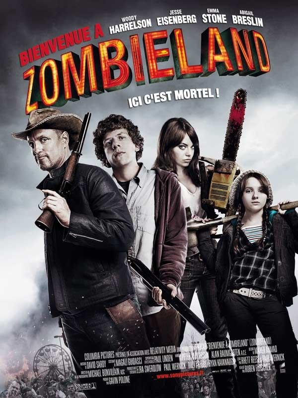
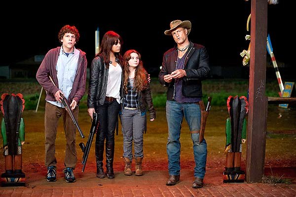
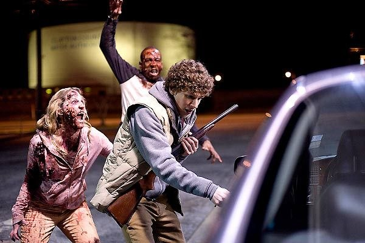

+++
type = "post"
titre = "Bienvenue à Zombieland, Ruben Fleischer"
title = "Bienvenue à Zombieland, Ruben Fleischer"
url = "/bienvenue-a-zombieland-fleischer"
date = "2009-11-28T00:22:06"
Lastmod = "2013-04-01T10:08:15"
cover = "bienvenue-a-zombieland-fleischer.jpg"
categorie = [ "À voir" ]
tag = [ "Hollywood", "Horreur", "Humour" ]
createur = [ "Ruben Fleischer" ]
acteur = [ "Abigail Breslin", "Emma Stone", "Jesse Eisenberg", "Woody Harrelson" ]
annee = [ "2009" ]
weight = 2009
pays = [ "États-Unis" ]
original = "Zombieland"

+++

<em>Bienvenue à Zombieland</em> est un film de morts-vivants. Enfin, au moins sur le papier, dans les faits c&rsquo;est surtout une comédie avec des morts-vivants au fond. Quel que soit le statut exact de ce film, c&rsquo;est une comédie très amusante que je recommande chaudement !

Le principe de départ est archi-connu : une étrange maladie s&rsquo;abat sur les États-Unis (au moins, mais dans ce genre de films, on n&rsquo;a franchement rien à faire du reste du monde) et transforme tous les habitants en morts-vivants sanguinaires et stupides qui n&rsquo;ont plus qu&rsquo;une idée en tête, manger de la chair fraiche. Pas tous, non : à la manière de <em>I am a legend</em> (l&rsquo;excellente nouvelle de Richard Matheson, pas le médiocre film), il reste un survivant qui doit sa survie uniquement au fait qu&rsquo;il s&rsquo;agit d&rsquo;un geek totalement asocial (et évidemment puceau) et vivant selon une série de règles censées le protéger des dangers du monde extérieur. L&rsquo;anti-héros par excellence (d&rsquo;ailleurs, une de ces règles est justement de ne pas jouer les héros) qui parvient miraculeusement à survivre, seul au milieu du désastre général.

Il n&rsquo;est pas non plus tout à fait seul, et croise pendant le film trois autres survivants. D&rsquo;abord un homme pour ainsi dire totalement barré, en recherche permanente d&rsquo;un gâteau spécifique, et qui prend un très grand plaisir à dézinguer par tous les moyens possibles et imaginables des zombies. Les deux forment, on s&rsquo;en doute, un couple des plus improbables et qui devient un quatuor totalement impensable quand il croise la route de deux sœurs prêtes à utiliser leur charme pour survivre, avec d&rsquo;ailleurs une grande efficacité. L&rsquo;ensemble finit, après quelques péripéties, à faire route ensemble au milieu du pays des zombies.

<em>Bienvenue à Zombieland</em> n&rsquo;est pas un film de morts-vivants, vous seriez extrêmement déçus si vous alliez voir un Romero-like. Ici, les morts-vivants ne sont finalement qu&rsquo;un décor (comme en témoigne la vue de la terre réduite à un champ de bataille, mais aussi de jeux) et une excuse. Le spectateur amateur de scènes bien gores sera certes comblé par ces zombies assez crades, il faut le dire, mais il s&rsquo;agit surtout d&rsquo;une astuce scénaristique qui rassemble des personnes très différentes, et qui offre au scénario des passages très drôles.

Le film n&rsquo;est pas pour autant une comédie bien lourde à la manière de <em>Shaun of the Dead</em>. Le comique ici surgit brusquement, sans vraiment prévenir, au détour d&rsquo;une course-poursuite ou de la rencontre très improbable, mais géniale comme d&rsquo;habitude, avec Bill Murray. Ça n&rsquo;est donc pas un humour facile à définir, même si la narration selon le point de vue du héros anti-héros par excellence, amène forcément le comique, ne serait-ce qu&rsquo;à travers ses règles qui s&rsquo;affichent en trois dimensions, intégrées aux décors. Le film refuse la technique du gag qui succède au gag, et c&rsquo;est plutôt très bien vu.

La légèreté est omniprésente dans ce film qui montre quand même une humanité en miette. Le film se veut finalement assez philosophique et prône le plaisir, si possible un plaisir simple et immédiat. Jouer à <em>Ghostbusters</em>, tout casser dans une boutique de souvenirs ou encore aller dans un parc d&rsquo;attraction, tout est bon pour s&rsquo;amuser, y compris massacrer des zombies qui semblent, <em>in fine</em>, moins dangereux que l&rsquo;ennui ou l&rsquo;inactivité. Le rythme du film est d&rsquo;ailleurs assez intense, pour un ensemble trop court (1h30). En même temps, c&rsquo;est peut-être aussi bien puisque le film se termine finalement sur les bonnes vieilles valeurs de l&rsquo;Amérique, et notamment la famille.

Le film est aussi très réjouissant sur le plan de la mise en scène, avec une mention spéciale pour le générique de début qui, en quelques images, présente la situation et les règles de survie du héros sur fond de Metallica. C&rsquo;est vraiment très bien fait et très efficace.

Les blogueurs sont en général enthousiastes, à l&rsquo;image <a href="http://www.toujoursraison.com/2009/11/bienvenue-zombieland.html">de Rob</a> ou encore <a href="http://cinema-ici-ailleurs.over-blog.com/article-bienvenue-a-zombieland-zombieland-2009-39815902.html">de Nicolas</a>. <a href="http://www.critikat.com/Bienvenue-a-Zombieland.html">Critikat</a> pointe du doigt la morale finale ; ils n&rsquo;ont pas tort d&rsquo;ailleurs, je trouve aussi ça assez détestable, mais c&rsquo;est vraiment la fin du film et le reste me semble&#8230; eh bien fun tout simplement.

<h3>Vous voulez m&rsquo;aider ?<a href="#footnote_0_2132" id="identifier_0_2132" class="footnote-link footnote-identifier-link" title="&Agrave; propos de la publicit&eacute;&hellip;">1</a></h3>
<ul>
<li><a href="http://www.amazon.fr/gp/product/B0034CNTD6/ref=as_li_ss_tl?ie=UTF8&#038;tag=leblogdenic07-21&#038;linkCode=as2&#038;camp=1642&#038;creative=19458&#038;creativeASIN=B0034CNTD6">Acheter le film en Blu-Ray sur Amazon</a></li>
<li><a href="http://www.amazon.fr/gp/product/B0034CNT2M/ref=as_li_ss_tl?ie=UTF8&#038;tag=leblogdenic07-21&#038;linkCode=as2&#038;camp=1642&#038;creative=19458&#038;creativeASIN=B0034CNT2M">Acheter le film en DVD sur Amazon</a></li>
<li><a href="http://itunes.apple.com/fr/movie/bienvenue-a-zombieland/id365221701">Acheter ou louer le film sur l&rsquo;iTunes Store</a></li>
</ul>

<ol class="footnotes"><li id="footnote_0_2132" class="footnote"><a href="http://voiretmanger.fr/soutien/">À propos de la publicité…</a> [<a href="#identifier_0_2132" class="footnote-link footnote-back-link">&#8617;</a>]</li></ol>
