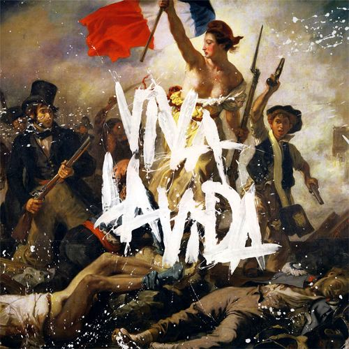
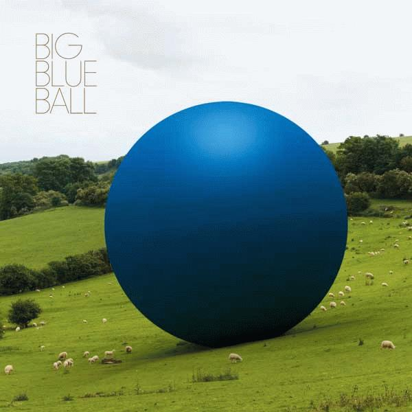

+++
titre = "Big Blue Ball et Coldplay : mes disques de l&rsquo;été 2008"
title = "Big Blue Ball et Coldplay : mes disques de l'été 2008"
url = "/big-blue-ball-et-coldplay-mes-disques-de-lete-2008"
date = "2008-09-04T18:24:42"
Lastmod = "2010-02-01T08:31:29"
cover = "coldplay-bbb1.jpg"
categorie = [ "Musique" ]
tag = [ "Rock" ]
annee = [ "2008" ]
weight = 2008

+++

Je voudrais parler de deux disques différents mais rassemblés ici en un même billet sous un titre qui plus est accrocheur. Pourquoi donc, alors que les sorties n&rsquo;ont pas été concomitantes, et alors que les deux disques sont somme toute très différents ? Eh bien pour une très mauvaise raison, il faut bien l&rsquo;avouer : les deux disques ont été acheté et écouté en même temps cet été&#8230; Bon, trêve de justification, et musique !

<h2 id="502_coldplay-viva-la-vid_3" style="text-align: left;">Coldplay, Viva la Vida or Death and All His Friends</h2>

Coldplay n&rsquo;est plus vraiment le petit groupe anglais encore confidentiel qu&rsquo;il était il y a quelques années (10 ans, le temps passe vite), lors de la sortie du premier album. Coldplay fait aujourd&rsquo;hui partie de ces énormes groupes qui vendent des CD par millions et organisent des tournées monstres dans des salles énormes devant un public toujours plus nombreux. Pensez donc, le disque aurait vendu tout au long de sa carrière (qui reste courte) plus de 30 millions d&rsquo;album dont 4,5 pour ce seul dernier album sorti en juin de cette année<a href="#footnote_0_502" id="identifier_0_502" class="footnote-link footnote-identifier-link" title="Tous ces chiffres proviennent de l&rsquo;habituel Wikipedia&hellip;">1</a>.

Pour ma part, j&rsquo;avais beaucoup aimé le premier album, qui était à l&rsquo;époque assez nouveau et qui changeait de ce que je connaissais à ce moment. Mais j&rsquo;ai très rapidement laché le groupe et les deux albums suivants sont arrivés à des oreilles distraites, à tel point que je ne les connais que très peu, en particulier X&amp;Y. Je pense que l&rsquo;énorme succès et l&rsquo;hyper médiatisation m&rsquo;ont un peu éloigné de ce groupe, vestige sans nul doute de mes anciens réflexes de fanatique de prog&#8230; Bref, toujours est-il que je ne comptais pas Coldplay au rang des groupes qui valaient la peine d&rsquo;être écoutés, c&rsquo;était un groupe de pop basique sans plus.

Avec ce dernier album, il y a eu quelque chose de différent d&rsquo;emblée je crois. Je ne saurais dire quoi exactement, même si il me semble que le buzz qui a précédé la sortie de l&rsquo;album entretenait l&rsquo;idée d&rsquo;un réel renouvellement du groupe qui était parti dans de nouvelles directions, bref qui innovait. En plus, la participation de Brian Eno à l&rsquo;album ne pouvait qu&rsquo;aiguiser ma curiosité. Comme des centaines de milliers d&rsquo;autres Internautes, j&rsquo;ai téléchargé et écouté Violet Hill, le single offert par le groupe courant 2008. Je ne me souviens pas l&rsquo;avoir écouté longuement ceci dit, et lorsque l&rsquo;album est sorti, je ne me suis pas rué chez mon disquaire préféré.

Ma véritable découverte avec l&rsquo;album date des États-Unis où mon père l&rsquo;a acheté, en dollars donc, ce qui le rendait vraiment pas cher. Et là, j&rsquo;ai immédiatement pris du plaisir à écouter et à ré-écouter cet album et à découvrir ainsi un album effectivement plus riche que ce que l&rsquo;on attendrait pour un disque de Coldplay. Entendons nous bien, ce disque reste un disque de Coldplay, pas de doute là dessus, il n&rsquo;y a aucune rupture majeure permettant d&rsquo;avoir l&rsquo;ombre d&rsquo;un doute. Par ailleurs, Coldplay n&rsquo;est pas Radiohead et <em>Viva la Vida</em> n&rsquo;est pas leur<em> Kid A</em>.

Ceci étant posé, force est de l&rsquo;admettre, quelque chose à changé en 2008 pour Coldplay. Peut-être est-ce l&rsquo;influence décisive de Eno, mais le producteur ne transforme jamais une mauvaise musique en bon disque. Je pense que le groupe a muri, et surtout ne sent plus le besoin de prouver quoi que ce soit. Coldplay s&rsquo;est ainsi permis quelques libertés : si les tubes sont nombreux sur l&rsquo;album, ils ne mettent que mieux en valeur d&rsquo;autres titres, plus complexes dans leur construction, moins immédiats, plus recherchés. Trois morceaux de l&rsquo;album dépassent les 6 minutes, deux approchent les 7 minutes : le groupe s&rsquo;est clairement éloigné du format radiophonique, au moins pour une partie de l&rsquo;album. Et si le disque est plaisant dès les premières écoutes, grâce à ces quelques titres à fort potentiel tubesque, l&rsquo;album ne se découvre qu&rsquo;au fil des écoutes, et ceci est, à mon avis, un signe de qualité.

Ainsi, je dois le dire, j&rsquo;ai été complètement séduit par le dernier album de ce groupe dont je n&rsquo;attendais plus rien. Je suis heureux de voir que j&rsquo;ai eu tort, et j&rsquo;attends désormais avec un peu plus d&rsquo;impatience la suite des événements, à savoir leur prochain album (ce qui ne devrait pas tarder apparemment). En attendant, je vous recommande l&rsquo;album ! Et je regretterai presque de ne pas avoir pris de place pour les concerts parisiens&#8230;

<h3 id="502_pour-en-savoir-plus_3">Pour en savoir plus :</h3>
<ul>
<li><a href="http://www.lastfm.fr/music/Coldplay/Viva+La+Vida+Or+Death+And+All+His+Friends">Si vous voulez écouter l&rsquo;album</a>&#8230;</li>
<li>L&rsquo;article de wikipedia (en) sur <a href="http://en.wikipedia.org/wiki/Viva_la_Vida_or_Death_and_All_His_Friends">l&rsquo;album</a> et sur le <a href="http://en.wikipedia.org/wiki/Coldplay">groupe</a></li>
</ul>
<h2 id="502_big-blue-ball_3"><strong>Big Blue Ball</strong></h2>

<strong> </strong>

Après ces amuses bouche, passons maintenant aux choses sérieuses !!

<em>Big Blue Ball</em>, c&rsquo;est de la (très) vieille histoire. En effet, ce projet a été intié par Peter gabriel et quelques autres il y a 15 ans de cela&#8230; L&rsquo;histoire commence dans les studios anglais de Peter Gabriel, là où les artistes du label RealWorld (celui de Peter) s&rsquo;enregistrent. Il y passe des tas d&rsquo;artistes différents et un jour, tous ces artistes se mettent à improviser ensemble. L&rsquo;expérience fut renouvelée trois fois (1991, 1992 et 1995) et de ces trois séries d&rsquo;enregistrement est sorti, aujourd&rsquo;hui, un album. L&rsquo;explication de ce retard est bien simple : on connaît le professionnalisme de Peter Gabriel qui, poussé à l&rsquo;extrême, le conduit à devenir très très peu productif (il est où le prochain album hein ??).

Ainsi, <em>Big Blue Ball</em> n&rsquo;est <em>pas</em> un album de Peter Gabriel, même si son nom figure un peu partout. Il a produit l&rsquo;album (aidé de Stephen Hague qui a sans doute permis à l&rsquo;album de sortir enfin) et il est présent sur quatre des onze titres de l&rsquo;album. <em>Big Blue Ball</em> est caractérisé principalement par la diversité, une diversité qui saute aux oreilles (si j&rsquo;ose dire) dès la première écoute. En effet, si le premier titre est du Peter Gabriel pur jus, le second  est chanté par Natacha Atlas et nous emmène droit en Afrique du Nord, avant de partir en Afrique noire avec Papa Wemba, et de retourner au Royaume-Uni avec Joseph Arthur. L&rsquo;album parcourt ainsi des va et viens constants entre pays et cultures.

Et pourtant, l&rsquo;album ne donne jamais le sentiment d&rsquo;être un assemblage grossier de titres qui n&rsquo;auraient jamais dû être ensemble. Tout semble aller de soi, on passe d&rsquo;un morceau à un autre, d&rsquo;une culture à une autre, d&rsquo;une ambiance à une autre très naturellement, comme s&rsquo;il s&rsquo;agissait d&rsquo;un seul et même groupe mais d&rsquo;un groupe très divers derrière chaque morceau. C&rsquo;est bien la preuve, à mon sens, que la musique (au moins la bonne) est universelle&#8230; C&rsquo;est sans doute aussi la marque du travail de Peter Gabriel en tant que producteur.

Si je ne sais pas dire pourquoi, au fond, je l&rsquo;aime, je dois le dire, j&rsquo;aime beaucoup cet album ! Certes, mon jugement n&rsquo;est sans doute plus très valable quand il s&rsquo;agit de Peter Gabriel mais j&rsquo;insiste, <em>Big Blue Ball </em> est un album à écouter, et à écouter encore ! À noter qu&rsquo;il contient une très bonne version de &laquo;&nbsp;Burn You Up, Burn You Down&nbsp;&raquo; que l&rsquo;on connaissait déjà puisqu&rsquo;il en existait une version sur <em>Hits</em>.

<h3 id="502_pour-en-savoir-plus-_3"><strong>Pour en savoir plus : </strong></h3>

Je recommande le <a href="http://bigblueball.realworldrecords.com/">site officiel</a>, plein d&rsquo;extraits à écouter, de récits sur la création de l&rsquo;album, etc.

<strong>Ajout du 6/09/08</strong> : pour une fois que je ne suis pas d&rsquo;accord avec une <a href="http://www.telerama.fr/musiques/big-blue-ball,32676.php">critique de Télérama</a>, cela vaut la peine de le signaler ! Je trouve que les &laquo;&nbsp;univers contrastés&nbsp;&raquo; évoqués par la journaliste, &laquo;&nbsp;s&rsquo;entrecroisent&nbsp;&raquo; plus &laquo;&nbsp;qu&rsquo;à la marge&nbsp;&raquo; même si ça n&rsquo;est pas évident immédiatement. Ce n&rsquo;est qu&rsquo;après quelques écoutes que j&rsquo;ai senti l&rsquo;unité du disque, enfin, unité est sans doute trop fort car, en effet, ce disque est composé de choses diverses. À défaut d&rsquo;unité, disons le fil rouge, ou plutôt la balle bleue&#8230; 😉

<ol class="footnotes"><li id="footnote_0_502" class="footnote">Tous ces chiffres proviennent de l&rsquo;habituel <a href="http://en.wikipedia.org/wiki/Viva_la_Vida_or_Death_and_All_His_Friends">Wikipedia</a>&#8230; [<a href="#identifier_0_502" class="footnote-link footnote-back-link">&#8617;</a>]</li></ol>
