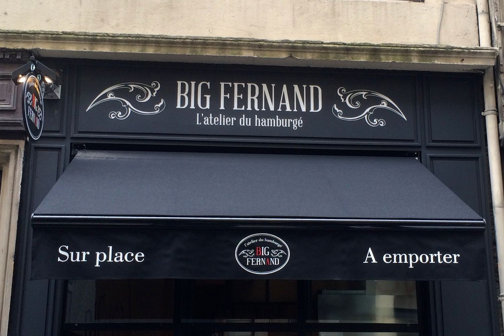
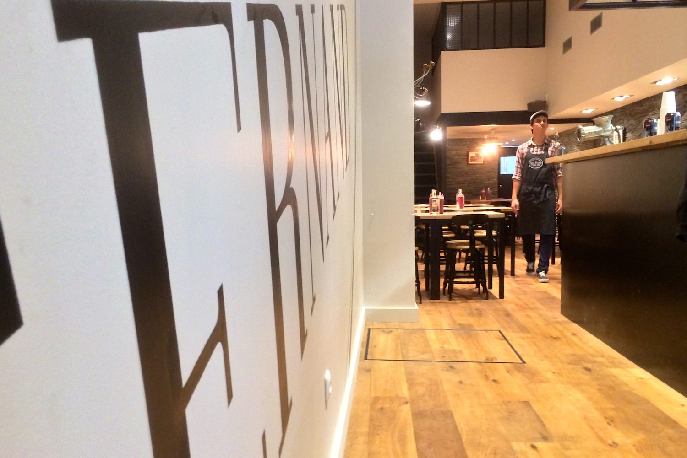
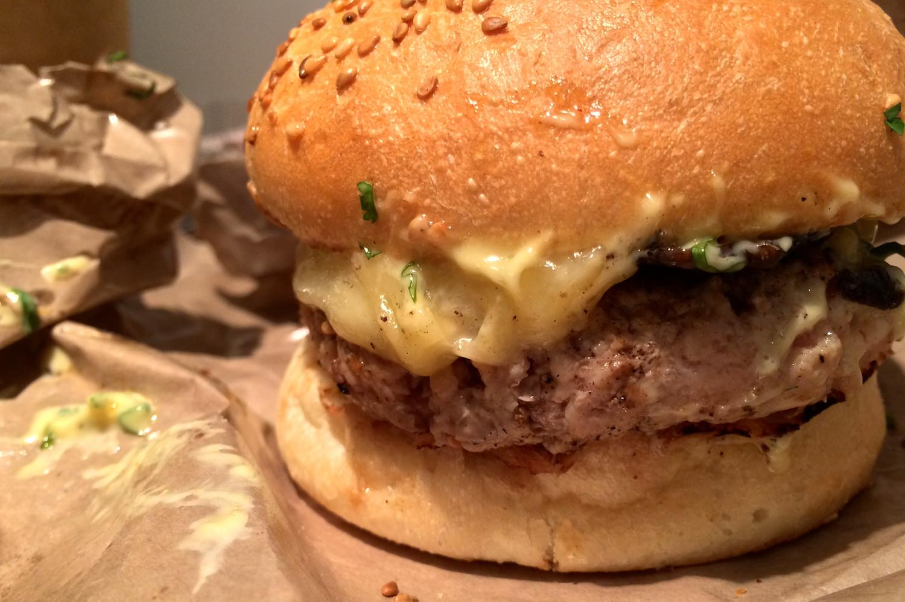
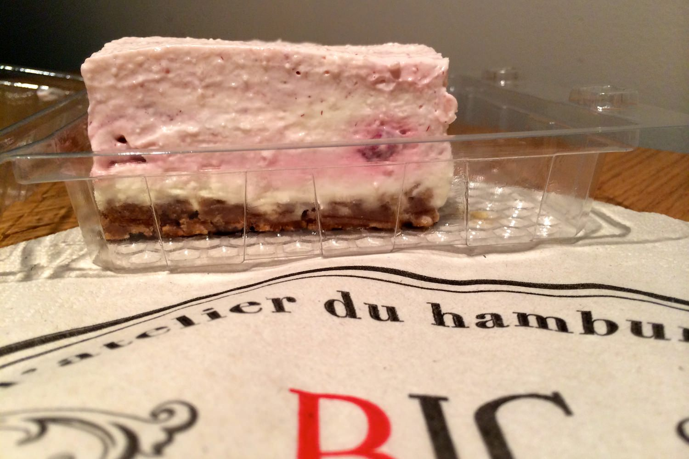

+++
type = "post"
titre = "Big Fernand à Lyon"
title = "Big Fernand à Lyon"
url = "/big-fernand-lyon"
date = "2013-10-05T14:55:28"
Lastmod = "2014-02-06T18:18:33"
cover = "big-fernand.jpg"
categorie = [ "À manger" ]
tag = [ "Fast-food", "Hamburger" ]

+++

<a href="http://mag.lyonresto.com/article/invites/nicolinux-devore-le-big-fernand-lyonnais/3172.html">

À Paris, les deux <a href="http://www.bigfernand.com/fr/browse/home/index.php"><strong>Big Fernand</strong></a> ont excellente réputation et bon nombre d’amateurs de hamburgers ne jurent que par ces adresses. La firme s’étend et sort de la capitale avec l’ouverture d’une première adresse en province. C’est à Lyon que le concept s’exporte, avec un nouvel « atelier du hamburgé » installé depuis le 4 octobre rue Ferrandière, à deux pas de la station Cordeliers. Ce point stratégique dans la presqu’île lyonnaise est parfaitement trouvé, mais que valent les burgers de Fernand ?

La façade marque sa différence avec les fast-foods aseptisés : <strong>Big Fernand</strong> joue à fond la carte de la tradition et de la France pour composer un ensemble élégant et plutôt sobre. Toute de noir vêtue, la première adresse lyonnaise est une boutique plutôt réduite, coincée entre un coiffeur et un boucher. Difficile de la repérer dans la rue, mais à en juger à la file d’attente devant l’entrée ce samedi midi, ce ne sera pas un problème. À l’extérieur, on vous fait patienter avec une carte et quelques explications ; à l’intérieur, on arrive directement au comptoir de commandes. Derrière, les cuisiniers s’affairent autour des plaques de cuisson et de la friteuse : ils sont tous habillés avec des chemises à carreaux et des tabliers à l’ancienne. Comme chez <a href="/king-marcel-lyon/" title="King Marcel à Lyon"><strong>King Marcel</strong></a> qui s’est sans aucun doute inspiré du concept pour faire ses boutiques, on entretient avec soin un côté suranné très tendance. La musique des années 1980 est poussée à fond (un peu trop d’ailleurs), on sert les frites dans des cornets et les burgers dans du papier brun. La décoration de la toute petite salle, derrière les cuisines, est dans le même esprit, chic et rétro. L’affluence en ce deuxième jour d’ouverture n’est peut-être pas représentative, mais on se serrait un peu les coudes, même si l’organisation millimétrée du personnel fluidifie un peu les choses. 

<strong>Big Fernand</strong> refuse le qualificatif de fast-food, trop connoté, et lui préfère l’« atelier du hamburgé », à prononcer à la française, c’est plus chic. On y vient néanmoins d’abord pour manger des burgers avec des frites : <a href="http://www.bigfernand.com/fr/browse/menu/menu.php">à la carte</a> justement, cinq recettes seulement, mais avec la possibilité originale de composer son propre burger selon ses envies, en piochant dans la liste d’ingrédients proposés. Bonne surprise, il n’y a que deux recettes au bœuf parmi les cinq : la chaîne a eu l’excellente idée d’y intégrer du poulet, mais aussi du veau et même de l’agneau, une première en ce qui nous concerne. Autre bonne surprise, le choix de la cuisson est bien mis en avant et on peut même choisir une viande bleue. Nous avons testé le Bartholomé, à base de bœuf, de raclette, de poitrine fumée, d’oignons confits et d’une sauce barbecue maison et l’Alphonse, à l’agneau, à la tomme de Savoie, aux aubergines et avec une sauce originale légèrement sucrée (ci-dessous). Les cuistots de <strong>Big Fernand</strong> sont généreux : la viande est épaisse, les garnitures abondantes et il faudra une bouche suffisamment large pour avaler l’ensemble en une fois. Le pain se tient bien, mais fond une fois avalé comme il se doit. La viande est parfaitement cuite — y compris l’agneau, rosé comme demandé — et elle est savoureuse et absolument pas sèche. Ces burgers sont vraiment bons même si les fromages pourraient être plus corsés : la tomme par exemple était un peu écrasée par les autres ingrédients. Pour le reste, rien à dire, si ce n’est que le papier d’emballage n’est pas de trop pour manger sans en mettre partout…

On peut commander un burger seul chez <strong>Big Fernand</strong> et il vous en coûtera entre 11 € pour le plus simple (bœuf, tomme de Savoie, tomates séchées) et 13 € pour l’Alphonse à l’agneau. On peut aussi opter pour une formule complète en ajoutant trois euros à chaque fois pour des frites et une boisson, et encore deux euros pour un dessert. Les frites justement — ou plutôt des « fernandines » — sont faites sur place à partir de pommes de terre entières. Elles sont cuites à la perfection, d’une belle couleur et elles sont délicieuses, loin des frites insipides des gros fast-foods du marché. Sont-elles cuites dans de la graisse de bœuf, comme en Belgique ? Toujours est-il que le goût était vraiment au rendez-vous et il serait dommage de s’en passer. Rien à dire sur les boissons, sauf peut-être en signalant la présence de Cacolac et de Canada Dry pour les amateurs. Côté desserts, il y en a trois, ils sont censés être faits maison eux aussi et nous avons testé un cheese-cake gourmand, un peu trop peut-être. Aux framboises, ce classique du dessert américain était extrêmement crémeux et plutôt bon, même s’il manquait de fraicheur. Résultat, il était aussi un peu écœurant, mais il faut dire que les burgers mangés juste avant ne sont pas particulièrement légers non plus. À réserver aux plus gros appétits donc, mais une formule de base suffira largement dans la majorité des cas. 

</a>

La concurrence fait rage sur la presqu’île lyonnaise. À quelques mois d’intervalle, ce sont deux chaînes de fast-food de qualité qui ont ouvert à quelques mètres seulement. Dernier arrivé sur place, <strong>Big Fernand</strong> est toutefois précurseur sur le concept et l’enseigne garde une longueur d’avance sur <strong>King Marcel</strong>, qui ne démérite pas pour autant. Les amateurs préfèreront les fromages de ce dernier, mais on apprécie la plus grande diversité des recettes de Fernand, le choix rare et bienvenu de quatre viandes différentes, la possibilité de créer son propre burger ou encore des frites vraiment excellentes. Certes, on mange pour deux à trois plus cher que dans un fast-food traditionnel, certes le service n’est pas forcément meilleur — on aimerait des couverts et des verres, à ce prix —, mais la qualité de la nourriture est incomparable. Si vous aimez les burgers, ne ratez pas ceux de <strong>Big Fernand</strong>, ils sont vraiment bons !

