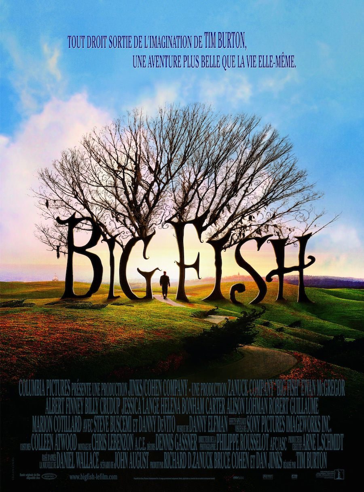
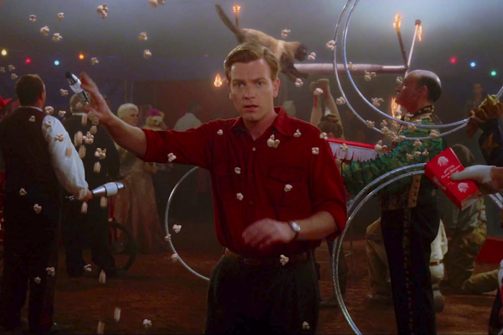
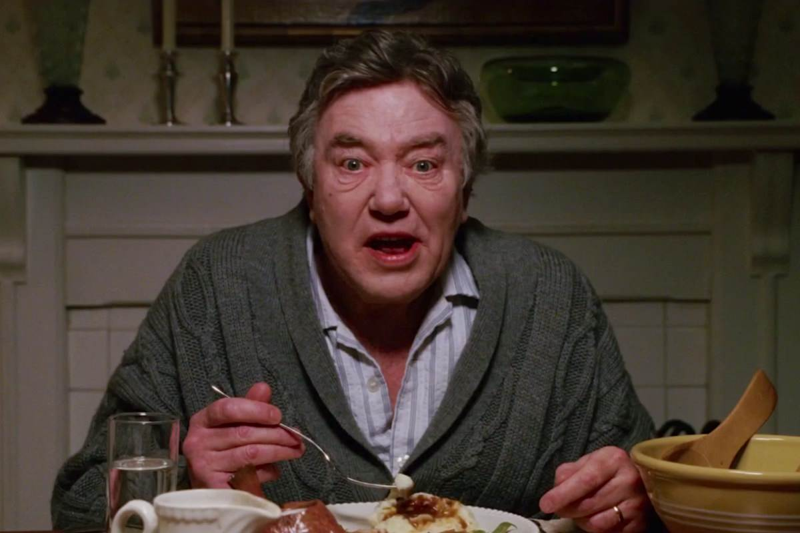

+++
type = "post"
titre = "<em>Big Fish</em>, Tim Burton"
title = "Big Fish, Tim Burton"
url = "/big-fish-burton"
date = "2013-01-15T10:05:25"
Lastmod = "2014-02-22T10:09:36"
cover = "big-fish-burton-mcgregor.jpg"
categorie = [ "À voir" ]
tag = [ "Comédie dramatique", "Conte", "Famille", "Fantastique", "Humour", "Vie" ]
createur = [ "Tim Burton" ]
acteur = [ "Albert Finney", "Billy Crudup", "Ewan McGregor", "Jessica Lange" ]
annee = [ "2004" ]
weight = 2004
pays = [ "États-Unis" ]

+++

« <em>Une aventure plus belle que la vie elle-même.</em> » peut-on lire sur l’affiche de <em>Big Fish</em>. Pour son dixième film, Tim Burton souhaitait revenir à un film plus simple et intimiste, loin des blockbusters qu’il vient de tourner. Trois ans après l’énorme production de <a href="http://voiretmanger.fr/2011/08/21/planete-singes-burton/" title="La planète des Singes, Tim Burton - À voir et à manger"><em>La planète des Singes</em></a>, ce long-métrage se concentre sur l’histoire d’un fils qui essaie de comprendre son père, dont les récits semblent toujours uniquement sortis de son imagination. <em>Big Fish</em> est une œuvre singulière dans la filmographie de Tim Burton : moins sombre, cette histoire d’une vie teintée de fantastique est un très beau film, tout à la fois drôle et émouvant. 

William a toujours eu une relation compliquée avec son père. Edward Bloom, ancien représentant de commerce dans le sud des États-Unis, a un don pour raconter des histoires extraordinaires. Ce conteur né ne manque jamais une occasion pour rappeler la naissance de son fils justement : ce jour-là, Edward a réussi à pêcher le plus gros poisson de la rivière, un énorme poisson-chat qui ne se laisse attirer par aucun appât traditionnel, mais qu’il réussit à capturer grâce à son alliance en or. Le problème pour William, c’est que toutes ces histoires lui semblent fausses. Elles le sont en effet en grande partie, car de l’imagination fertile de son père naissent sorcières, loups-garous ou encore villes magiques au milieu de bois hantés, mais il y a forcément une part de vérité derrière. C’est, en tout cas, ce que croit William qui, arrivé à l’âge adulte, n’en peut plus des contes paternels. Edward et lui se froissent lors de son mariage et ils ne se parlent plus depuis trois ans, quand l’hospitalisation du père force William à lui parler à nouveau. Ce qu’il aimerait, c’est connaître enfin la vérité, avant la disparition de son père…

<em>Big Fish</em> est un récit complexe par sa structure : les récits d’Edward en constituent le cœur, mais Tim Burton n’opte pas pour la linéarité en construisant son long-métrage autour des flashbacks. Le présent du film se déroule quand William est adulte et s’apprête à devenir à son tour un père, tandis qu’Edward est hospitalisé et vit certainement ses derniers instants. Le vieil homme a toujours aimé raconter ses histoires et si ce motif de dispute l’a éloigné de son fils trois ans auparavant, il ne peut s’empêcher d’en raconter de nouvelles. Le film de Tim Burton hésite ainsi en permanence entre ce présent entrecoupé des récits d’Edward, récits qui permettent en même temps de raconter sa vie. On le retrouve ainsi jeune homme dans sa petite ville d’origine et on suit ses aventures avec le géant qui terrorise les habitants, puis avec l’étonnante bourgade de Spectre qui fait figure de paradis, sa rencontre avec la femme qu’il aime et qui deviendra sa femme, puis le travail au cirque pendant trois ans avant de l’épouser enfin, et puis son service militaire où il est envoyé en Corée ou au Vietnam et où il fait la rencontre de deux sœurs siamoises. <em>Big Fish</em> en fait un récit hauts en couleurs, où le fantastique effleure en permanence, quand il n’éclate pas brutalement. L’humour n’est jamais loin et l’ensemble rappelle un peu ces récits improbables du XVIIIe siècle : Tim Burton s’en donne à cœur joie dans des tableaux qui sont autant de petites histoires et qui tissent peu à peu une vie. 

Si les récits étonnants et amusants d’Edward en sont une composante essentielle, <em>Big Fish</em> est aussi un film touchant sur les relations difficiles entre un père et son fils, en même temps qu’une réflexion sur le mensonge et la réalité. William se sent écarté par un père souvent absent et qui n’a jamais voulu lui raconter la vérité. Petit, le garçon était naturellement absorbé par les histoires de son père, mais Tim Burton parvient à montrer en un plan que le père se répète à l’infini et que son fils finit par ne plus l’accepter et par rompre. <em>Big Fish</em> n’adopte jamais directement le point de vue d’Edward, mais on sent malgré tout qu’il regrette ces relations houleuses avec son fils, sans pour autant savoir exactement ce qu’il doit faire. Il n’invente pas ses histoires pour énerver son entourage, c’est sa nature profonde : Edward ne sait pas, en d’autres termes, vivre autrement qu’en vivant par ses fantasmes et ses histoires fantastiques. William n’a pas encore compris cela et il pense que son père lui ment sciemment, pour le tromper et ne pas dévoiler une double vie. Il commence son enquête pour trouver une seconde femme ou toute autre raison logique qui expliquerait le comportement de son père, mais ce qu’il trouve est loin d’être aussi simple. <em>Big Fish</em> est aussi un film sur le récit et l’imaginaire, sur la réalité et le mensonge. Si Edward est si populaire, c’est justement parce qu’il parvient toujours à insuffler la dose de fantastique qui plait tant à toutes ses histoires. Certes, ce n’est pas exactement la réalité, mais la vérité si terne vaut-elle mieux que les récits toujours colorés et vivants du père ? La réponse ne fait guère de doute pour Tim Burton…

Le style de Tim Burton est reconnaissable entre mille, à tel point que le cinéaste a souvent eu tendance à se caricaturer ces dernières années. <em>Big Fish</em> est assez différent pourtant, mais cela ne veut pas dire que le réalisateur californien est absent de sa dixième réalisation, bien au contraire. On le retrouve d’abord dans certains plans, extrêmement burtoniens : la forêt hantée qui rappelle celle de <a href="http://voiretmanger.fr/2013/01/07/sleepy-hollow-legende-cavalier-sans-tete-burton/" title="Sleepy Hollow, la légende du cavalier sans tête, Tim Burton - À voir et à manger"><em>Sleepy Hollow, la légende du cavalier sans tête</em></a> ou la banlieue parfaite d’<em>Edward aux mains d’argent</em> en sont deux exemples, mais il y en aurait bien d’autres. Plus significatif, le questionnement autour de la réalité et du fantastique traverse un peu toute son œuvre, tandis que le personnage d’Edward qui semble hors du monde, à part, est particulièrement typique de son travail. <em>Big Fish</em> n’est pas son film visuellement le plus spectaculaire, c’est un fait, il y a assez peu d’effets spéciaux et beaucoup de décors naturels, mais cela n’est pas si mal. Cette sobriété de moyens qui reste relative — on parle de Tim Burton après tout — est une bonne surprise dans sa filmographie parfois un peu trop marquée, comme en a malheureusement témoigné l’échec récent d’<a href="http://voiretmanger.fr/2010/03/25/alice-au-pays-des-merveilles-burton/" title="Alice au Pays des Merveilles, Tim Burton - À voir et à manger"><em>Alice au Pays des Merveilles</em></a>. <em>Big Fish</em> rassemble également peu de têtes connues — Ewan McGregor est excellent dans le rôle du jeune Edward —, mais la musique de Danny Elfman est, elle, bien au rendez-vous. 

Œuvre à part, <em>Big Fish</em> est un film étonnant, tant il ressemble sans y ressembler à l’univers de Tim Burton. On retrouve certaines de ses marottes, à commencer par les récits fantastiques, mais le long-métrage est beaucoup moins sombre et absolument pas gothique. Un ton différent, plus léger, qui n’est pas désagréable et qui sert une histoire drôle et émouvante à la fois. 

<h3>Vous voulez m&rsquo;aider ?<a href="#footnote_0_8327" id="identifier_0_8327" class="footnote-link footnote-identifier-link" title="&Agrave; propos de la publicit&eacute;&hellip;">1</a></h3>
<ul>
<li><a href="http://www.amazon.fr/gp/product/B000M2EHGE/ref=as_li_ss_tl?ie=UTF8&amp;tag=leblogdenic07-21&amp;linkCode=as2&amp;camp=1642&amp;creative=19458&amp;creativeASIN=B000M2EHGE">Acheter le film en Blu-Ray sur Amazon</a></li>
<li><a href="http://www.amazon.fr/gp/product/B0001NGFI2/ref=as_li_ss_tl?ie=UTF8&amp;tag=leblogdenic07-21&amp;linkCode=as2&amp;camp=1642&amp;creative=19458&amp;creativeASIN=B0001NGFI2">Acheter le film en DVD sur Amazon</a></li>
<li><a href="https://itunes.apple.com/fr/movie/big-fish/id368439142">Acheter ou louer le film sur l&rsquo;iTunes Store</a></li>
</ul>

<ol class="footnotes"><li id="footnote_0_8327" class="footnote"><a href="http://voiretmanger.fr/soutien/">À propos de la publicité…</a> [<a href="#identifier_0_8327" class="footnote-link footnote-back-link">&#8617;</a>]</li></ol>
