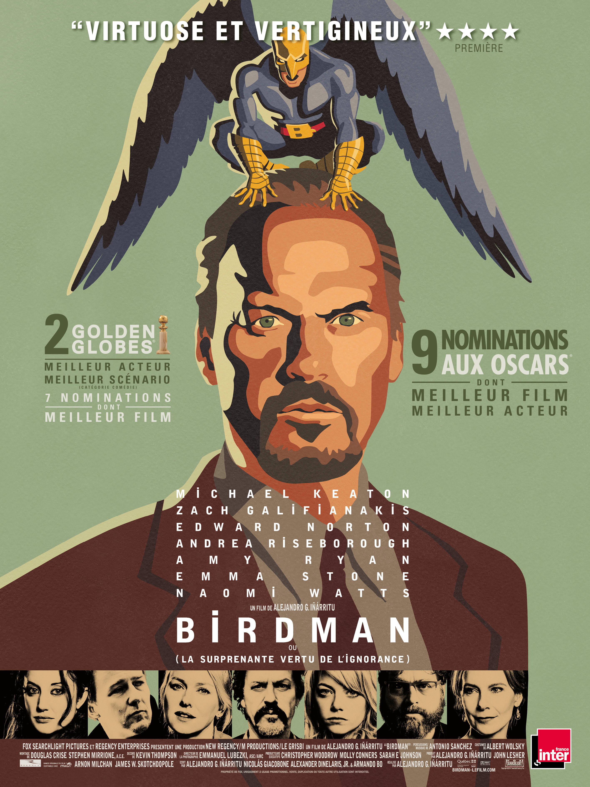
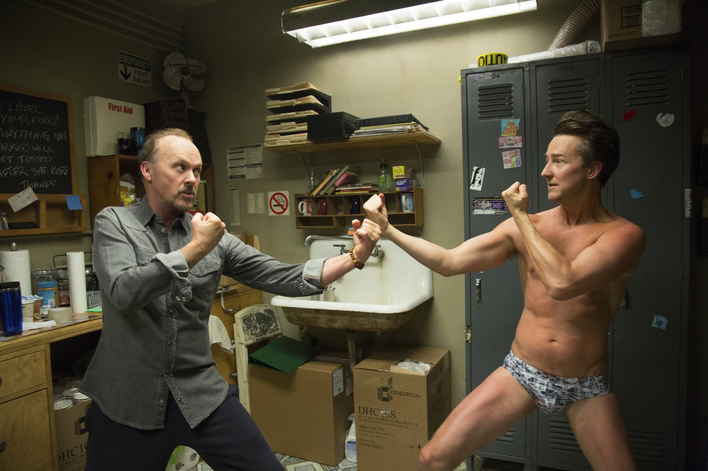

+++
type = "post"
titre = "<em>Birdman</em>, Alejandro González Iñárritu"
title = "Birdman, Alejandro González Iñárritu"
url = "/birdman-inarritu"
date = "2015-02-25T23:52:21"
Lastmod = "2015-02-25T23:59:48"
cover = "birdman-innaritu-michael-keaton.jpg"
categorie = [ "À voir" ]
tag = [ "Acteurs", "Comédie", "Comics", "Drame", "Famille", "Fantastique", "Folie", "Metafilm", "Oscars", "Sorties du mois", "Théâtre" ]
createur = [ "Alejandro González Inárritu" ]
acteur = [ "Andrea Riseborough", "Edward Norton", "Emma Stone", "Michael Keaton", "Naomi Watts", "Zach Galifianakis" ]
annee = [ "2015" ]
weight = 2015
pays = [ "États-Unis" ]

+++

Pour son dernier long-métrage, Alejandro González Iñárritu ne reprend pas son dispositif fétiche qui consistait à mettre en scène plusieurs histoires parallèles qui finissent par se réunir. C&rsquo;était déjà le cas avec <a href="http://voiretmanger.fr/biutiful-inarritu/" title="Biutiful, Alejandro González Inárritu"><em>Biutiful</em></a>, son précédent long-métrage et c&rsquo;est peut-être une tendance lourde de son cinéma. Sur le papier, <em>Birdman</em> est beaucoup plus simple, avec une seule histoire centrée sur un acteur qui a connu la gloire et qui essaie de revenir dans la lumière grâce au théâtre. Bien sûr, ce n&rsquo;est qu&rsquo;une apparence : le cinéaste mexicain n&rsquo;est pas du genre à réaliser de simples films, et son dernier ne fait pas exception. La forme, à nouveau, est très particulière, puisque l&rsquo;on a un long plan-séquence de près de deux heures, quasiment sans interruption. Une belle performance, qui ne résume pas <em>Birdman</em> pour autant. Au-delà de la technique, ce film très méta offre une plongée très crue dans l&rsquo;univers des acteurs et c&rsquo;est une réussite, à voir !

Le cinéaste entend bien nous perturber et c&rsquo;est le cas dès la toute première séquence. <em>Birdman</em> ouvre ainsi avec un homme de dos qui semble assis, mais qui lévite en fait au-dessus du sol. Est-il en train de rêver, ne s&rsquo;agit-il que d&rsquo;une projection, ou bien est-il vraiment en lévitation ? Le film ne répond pas à cette question et il ne faut pas espérer plus de réponses par la suite. Alejandro González Iñárritu prend un malin plaisir, pendant toute la durée du film, pour brouiller les pistes entre réalisme et fantastique. D&rsquo;un côté, on a une plongée brutale et passionnante dans les coulisses d&rsquo;un théâtre de Broadway ainsi que dans la vie d&rsquo;un acteur qui a connu la gloire par le passé et qui peine à retrouver ce qui a fait son succès. D&rsquo;un autre côté, on a cette étrange voix grave qui semble parler en permanence au personnage et on a aussi des pointes de fantastique tout au long du film. Le personnage peut visiblement déplacer des objets sans les toucher et plus tard on le voit en train de voler. Mais le voit-on vraiment ainsi, ou bien ne s&rsquo;agit-il que de projections de son esprit ? <em>Birdman</em> ne tranche jamais vraiment et on reste ainsi à l&rsquo;équilibre entre les deux positions, sans jamais savoir trop à quoi s&rsquo;en tenir. À cet égard, le choix du plan-séquence est bien trouvé pour renforcer ce côté étrange : le film perd en réalisme, d&rsquo;autant que le réalisateur triche un petit peu avec cette forme, notamment en jouant assez librement sur le temps. On ne sait jamais trop quand et où on est, on passe d&rsquo;une répétition privée à une générale l&rsquo;air de rien et on se perd dans le dédale de couloirs du théâtre. Le sentiment de labyrinthe est parfaitement rendu par ce choix et Alejandro González Iñárritu ne simplifie pas son cinéma en définitive, mais trouve un autre angle.

<em>Birdman</em> raconte aussi l&rsquo;histoire d&rsquo;un acteur que tout le monde a associé à un rôle, mais qui n&rsquo;a rien fait depuis. De manière assez ironique, Alejandro González Iñárritu a choisi Michael Keaton pour incarner Riggan Thomson et l&rsquo;acteur et le personnage ont de nombreux points en communs. Tous deux ont connu la gloire dans les années 1990 grâce à un personnage de comics. Dans le film, le personnage est encore plus identifié à ce premier rôle, mais on imagine que l&rsquo;acteur s&rsquo;est retrouvé dans ces scènes où tous ceux qui le reconnaissent associent systématiquement Riggan à son rôle de Birman. Ou bien celle où, interrogé pour sa nouvelle pièce, l&rsquo;acteur dans le film est en fait constamment questionné sur ce rôle qui lui a apporté gloire et argent, mais qui l&rsquo;a quelque peu enfermé. <em>Birdman</em> joue ainsi la carte du métafilm au maximum et il n&rsquo;est pas difficile d&rsquo;imaginer que le cinéaste s&rsquo;est inspiré de sa propre expérience et de sa proximité avec bon nombre d&rsquo;acteurs pour écrire son scénario. Certaines scènes sont ainsi troublantes par leur réalisme, tandis que le film n&rsquo;est, dans l&rsquo;ensemble, guère reluisant pour les acteurs. Entre anciennes stars de Hollywood qui viennent « se recycler » à Broadway et acteurs théâtraux qui ont une extrême opinion d&rsquo;eux-mêmes, le portrait dressé par Alejandro González Iñárritu n&rsquo;est pas vraiment positif. C&rsquo;est une plongée froide et par moment cruelle, mais aussi parfois assez drôle, dans cet univers qui fait tant rêver et <em>Birdman</em> est passionnant à ce titre. La fin, que l&rsquo;on ne révélera pas naturellement, est même à cet égard poignante et on sort de la salle avec un sentiment étrange et mélancolique. L&rsquo;excellente <a href="http://www.amazon.fr/gp/product/B00NAXEAAK/ref=as_li_ss_tl?ie=UTF8&amp;tag=leblogdenic07-21&amp;linkCode=as2&amp;camp=1642&amp;creative=19458&amp;creativeASIN=B00NAXEAAK">bande originale</a>, écrite par le batteur Antonio Sánchez et presque uniquement composée de batterie, renforce ce sentiment et elle fait beaucoup pour composer une ambiance mystérieuse.

Avec <em>Birdman</em>, Alejandro González Iñárritu s&rsquo;éloigne encore une fois du schéma narratif qui l&rsquo;a rendu célèbre, non pas pour rentrer dans le rang et signer un film banal, mais plutôt pour chercher autre chose. L&rsquo;histoire qu&rsquo;il raconte ici n&rsquo;a pas besoin de multiplier les récits séparés, alors que l&rsquo;idée du plan-séquence, loin de n&rsquo;être qu&rsquo;un gadget, sert parfaitement ce scénario là. Michael Keaton est excellent dans son rôle d&rsquo;acteur un peu looser et la réussite du projet lui doit beaucoup. <em>Birdman</em> est une œuvre fascinante et qui mérite d&rsquo;être découverte !

