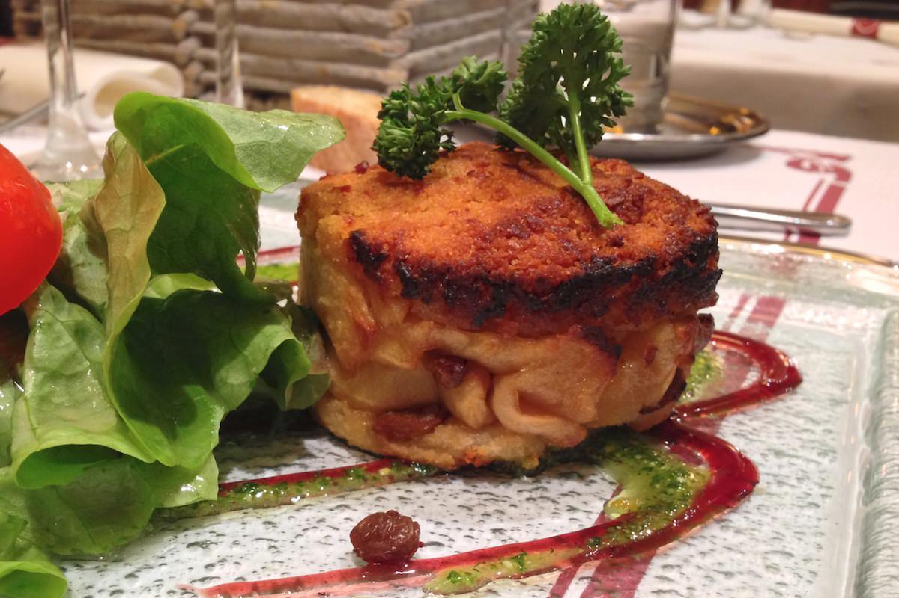
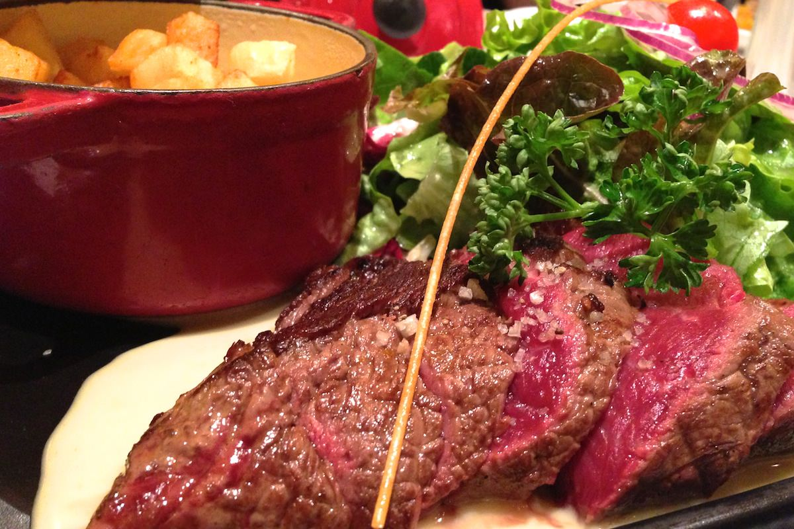
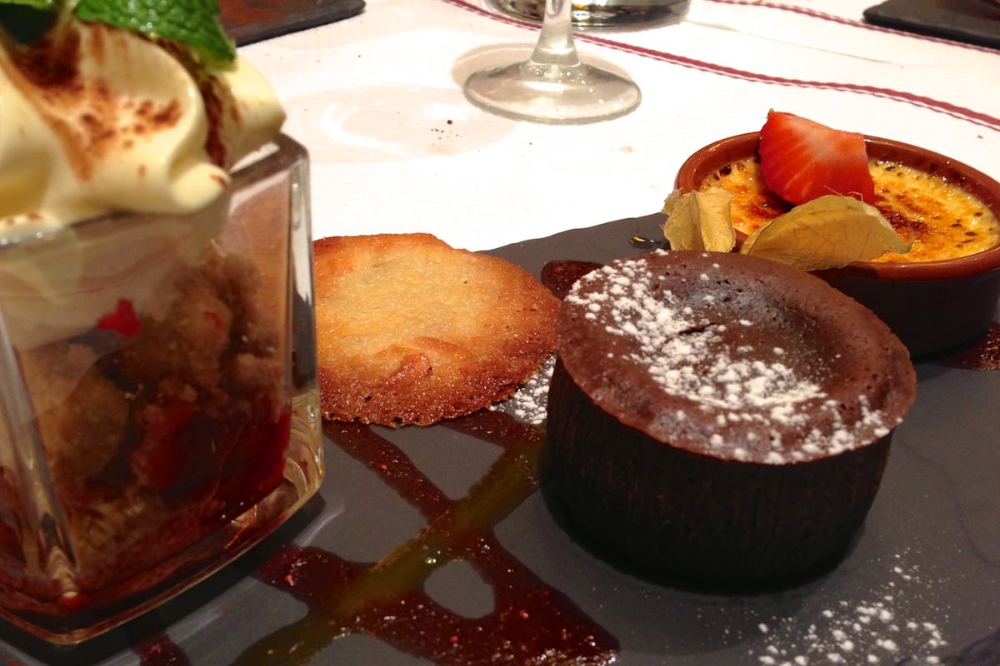

+++
type = "post"
titre = "Le bistrot du boucher à Poitiers"
title = "Le bistrot du boucher à Poitiers"
url = "/bistrot-boucher-poitiers"
date = "2013-02-23T18:23:28"
Lastmod = "2013-02-23T18:30:08"
cover = "bistrot-du-boucher-poitiers.jpg"
categorie = [ "À manger" ]
tag = [ "Bistrot", "Cuisine française", "Viande" ]

+++

<a href="http://www.bistrotduboucher.fr/content/restaurant-37-bistrot-du-boucher-poitiers-86000.htm?PHPSESSID=c1fb0f01b59c710cfea765bfd517fd60"><strong>Le bistrot du boucher</strong></a> ouvre la principale rue piétonne et commerçante de Poitiers. Aux alentours et à la suite, des dizaines de restaurants, mais aucun qui n’est aussi rempli que celui-ci. Un succès qui ne se dément ni le midi, ni le soir avec deux services complets à chaque fois. Mieux vaut réserver pour manger dans cet étrange établissement spécialisé dans la viande, mais le jeu en vaut la chandelle. Cette adresse n’est pas très originale, mais ce n’est pas le but : ici, on mange une cuisine traditionnelle et de qualité. 

Dès son nom, <strong>Le bistrot du boucher</strong> affirme son côté simple et convivial. Sa devanture est assez convenue, mais ce qui attire l’œil, c’est plutôt le monde à l’intérieur et celui qui se presse à l’extérieur. Dans le petit hall d’entrée, des dizaines de personnes attendent en ce vendredi soir, alors qu’il est 21h30. Sylvie, la patronne, prend soin d’accueillir tout le monde d’un petit mot, tout en accompagnant à la sortie ceux qui ont déjà mangé d’un autre mot. Belle performance qui met immédiatement en confiance. C’est mieux, car il y a du monde, beaucoup de monde : toutes les tables sont prises et le niveau sonore assez élevé. Même si la salle se calme en fin de soirée, ce n’est pas le lieu idéal pour un repas romantique à deux et on s’y rendra plutôt en groupe, entre amis. Les prix sont en outre tout à fait corrects, puisqu’il faut compter 25 € environ pour un menu avec entrée, plat et dessert à la carte. Une bonne idée aussi, un menu tout compris avec boissons pour quelques euros de plus… Si vous cherchez un lieu convivial et bon marché, c’est ainsi un très bon choix, surtout si vous aimez la viande.

La viande en effet est à l’honneur sur <a href="http://www.bistrotduboucher.fr/_data/restaurants_menu/37-menu_pdf-1357823231.pdf?PHPSESSID=28ff17448e51f7a2b322dd92dc5f45ef">la carte</a> de ce restaurant. <strong>Le bistrot du boucher</strong> propose plusieurs pièces de bœuf avec des pommes de terre sous toutes ses formes. On trouve également un assez large choix de plats plus variés, mais ce n’est pas le plus intéressant dans un tel lieu. On se portera plus facilement sur le bœuf qui est tendre, très savoureux et cuit précisément selon votre commande. L’essentiel, c’est vraiment le morceau de viande, les pommes de terre, frites ou sautées et la petite salade ne sont là que pour l’accompagner. La sauce secrète &laquo;&nbsp;BBT&nbsp;&raquo; qui accompagne le pavé bistrot est très bonne, le pavé du Boucher est plus classique avec sa sauce servie à part. Les amateurs trouveront aussi pas moins de quatre tartares différents, de la version de base jusqu’à la plus luxueuse déclinaison avec foie gras. Avant ce plat de résistance, vous aurez le choix entre quelques entrées : le trop classique carpaccio ne séduit pas vraiment avec ses morceaux de cantal sans goût et l’huile trop présente, mais le crumble de chèvre chaud aux pommes et raisins est une bonne alliance dans le genre sucré/salé. Pour terminer le repas, ne comptez pas sur une note légère, mais les desserts copieux sont de bonne facture. On recommandera la &laquo;&nbsp;tentation du pâtissier&nbsp;&raquo; qui est composée de trois desserts, dont un petit puits d’amour — sorte de crumble revisité — savoureux. Le moelleux au chocolat pourrait être plus corsé, mais il est coulant à souhait. Dans tous les cas, les tarifs restant modestes, le rapport qualité/prix est très bon.

Par bien des aspects, <strong>Le bistrot du boucher</strong> rappelle <a href="http://voiretmanger.fr/2011/10/09/entrecote-lyon/" title="L'Entrecôte à Lyon - À voir et à manger"><strong>L’Entrecôte</strong></a>. Ce restaurant n’est pas unique lui non plus, il fait partie d’une chaîne avec plusieurs restaurants dans toute la France. On retrouve aussi le même choix de la viande, mais aussi ce monde incessant, midi et soir. En revanche, il faut absolument réserver à l’avance et le choix est plus important à la carte alors que <strong>L’Entrecôte</strong> se contente d’un seul plat. La patronne aussi, fait  la différence : chaleureuse et vive, elle impose son rythme au service et permet de manger rapidement si on le souhaite avec le premier service, ou de prendre son temps au cours du suivant. Finalement, c’est peut-être cet accueil qui fait la différence, avec la viande de très bonne qualité évidemment. <strong>Le bistrot du boucher</strong>  est une bonne adresse en somme pour bien manger et à petit prix à Poitiers…

<strong>À lire également :</strong> <a href="http://blog.adrienvh.fr/2011/12/13/le-bistrot-du-boucher-restaurant-poitiers-86/">l’avis d’Adrien sur le restaurant</a> (avec des photos de la salle)

