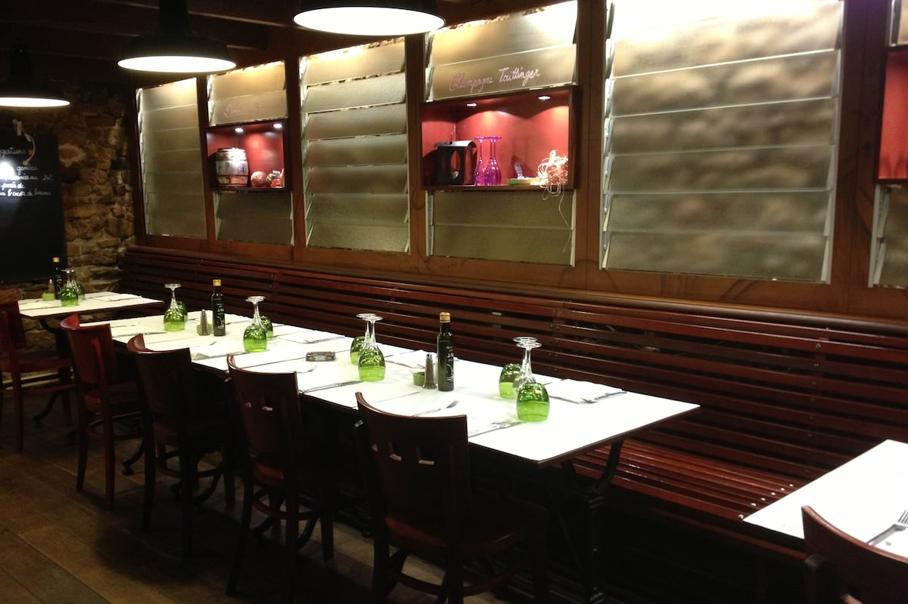
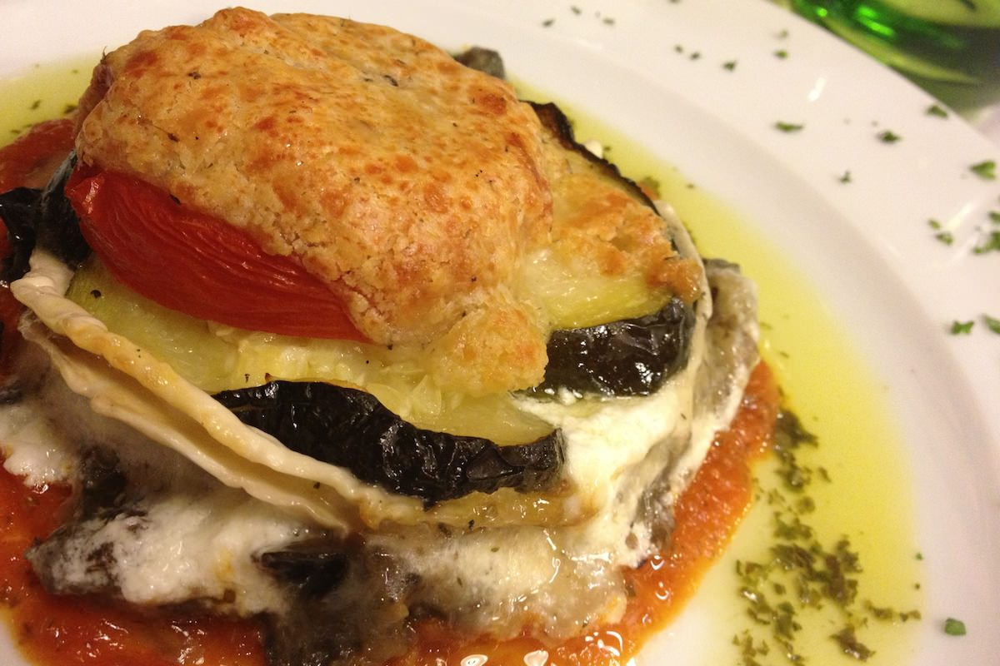
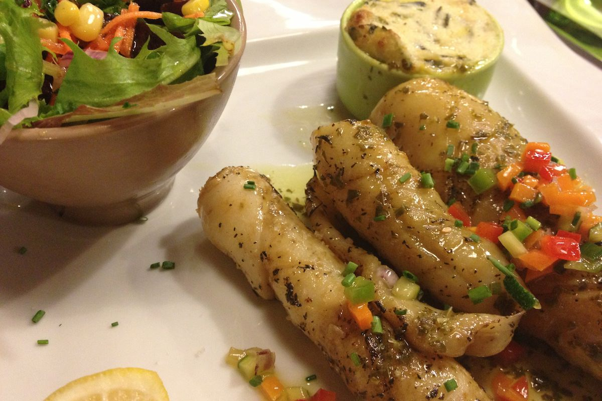
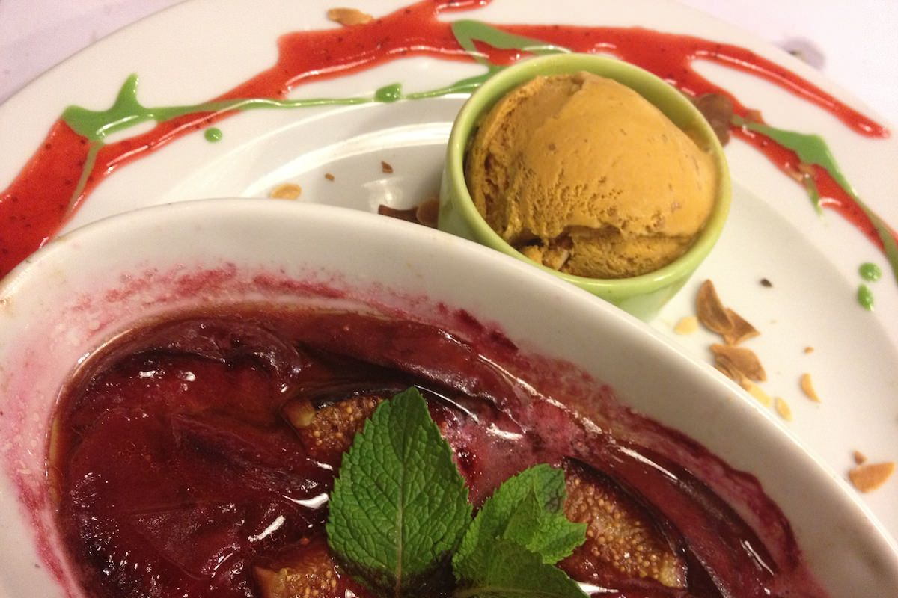

+++
titre = "Le Bistrot des Maquignons à Lyon"
title = "Le Bistrot des Maquignons à Lyon"
url = "/bistrot-maquignons-lyon"
date = "2012-08-26T09:29:44"
Lastmod = "2012-08-25T23:32:51"
cover = "bistrot-maquignons-lyon.jpg"
categorie = [ "À manger" ]
tag = [ "Ambiance", "Bar", "Cuisine française" ]

+++

Situé au nord du septième arrondissement lyonnais, à la limite du troisième, le <a href="http://www.lyonresto.com/restaurant-Lyon/restaurant-Bistrot-des-Maquignons-Lyon/restaurant-Bistrot-des-Maquignons-Lyon-1165.html"><strong>Bistrot des Maquignons</strong></a> est célèbre pour sa terrasse qui semble construite dans les arbres, un fait rare au cœur de Lyon. Ce restaurant qui fait également bar à vins et à tapas propose une cuisine de qualité dans un cadre chaleureux à défaut d&rsquo;être intimiste. Une très bonne adresse pour un repas en famille ou entre amis…

Situé en face d&rsquo;une petite place et d&rsquo;une église, le <strong>Bistrot des Maquignons</strong> propose une devanture largement ouverte sur la salle grâce à de grandes baies vitrées. À l&rsquo;intérieur, le décor mêle harmonieusement l&rsquo;ancien et le moderne. La pierre à l&rsquo;état brute domine sur la plupart des murs, mais un côté a été recouvert de vitres dépolies qui donnent un aspect beaucoup plus moderne. Les poutres en bois sont apparentes, tandis que le plancher et les banquettes en bois façon banc public complètent le tableau. À l&rsquo;entrée, un grand bar rappelle que l&rsquo;adresse n&rsquo;est pas qu&rsquo;un restaurant et quelques tables hautes permettent de voir un verre éventuellement accompagné de tapas. Au fond et sur la mezzanine sont disposées les tables du restaurant, mais s&rsquo;il fait beau vous serez placé automatiquement dehors, sur la grande terrasse qui se déploie <a href="http://www.lebistrotdesmaquignons.com/wpimages/wp1c6fac93_05_06.jpg">autour des arbres</a>. Ce soir de fin d&rsquo;août, nous n&rsquo;avons pas eu de chance et la météo beaucoup trop capricieuse n&rsquo;a pas permis d&rsquo;ouvrir la terrasse. À l&rsquo;intérieur, le cadre est agréable, mais le <strong>Bistrot des Maquignons</strong> était complet et très bruyant, d&rsquo;autant que les groupes étaient nombreux. Mieux vaut le savoir, ce n&rsquo;est pas l&rsquo;adresse idéale pour un repas romantique en couple.

Le <strong>Bistrot des Maquignons</strong> n&rsquo;a de bistrot que le nom, même si le bar rappelle un peu cet esprit. À la carte, les plats ne sont pas des plus recherchés, la cuisine ici se veut efficace avant tout, mais cela ne veut pas dire qu&rsquo;elle est banale et sans intérêt. Le choix est assez large, avec à la fois plusieurs assiettes de viande qui raviront les amateurs et même quelques hamburgers, et des plats de poissons ou de légumes. Particularité ici, toutes les entrées peuvent être converties en plat moyennant un petit supplément qui correspond en fait à l&rsquo;ajout des légumes qui accompagnent les plats de la carte. Inutile de chercher un menu le soir, le <strong>Bistrot des Maquignons</strong> n&rsquo;en propose aucun. C&rsquo;est un peu dommage, mais on peut s&rsquo;en sortir malgré tout pour un prix très correct. À deux, avec trois plats et deux verres de vin par personne, nous en avons eu pour environ 80 €. Les prix peuvent bien sûr s&rsquo;envoler en fonction des choix de la table. Le midi, les tarifs sont encore plus raisonnables si on se limite aux menus proposés.

Une cuisine efficace, mais très bien réalisée, tel est le credo du <strong>Bistrot des Maquignons</strong> et le pari est réussi. L&rsquo;originalité à tout prix n&rsquo;est pas à chercher ici, certes, mais les produits sont d&rsquo;excellente qualité et ils sont traités avec tout le soin qu&rsquo;ils méritent. Le crumble de légumes et de chèvre était savoureux, riche en fromage sans être écœurant et la croute de parmesan sur le dessus apportait jusque ce qu&rsquo;il fallait de croustillant et de goût. De son côté, F. n&rsquo;a pas pu résister au foie gras maison qui était manifestement à la hauteur de ses attentes. La seiche qui a suivi l&rsquo;entrée était d&rsquo;une tendresse remarquable, loin de l&rsquo;effet caoutchouteux que l&rsquo;on retrouve trop souvent dans les restaurants loin des bords de mer. En face, un savoureux hamburger au saint-marcellin moins léger, certes, mais bien dosé en fromage pour éviter l&rsquo;écœurement trop rapide. Les desserts, tous maison apparemment, n&rsquo;ont pas été en reste : le gratin de figues était parfait pour finir sur une touche plus légère, mais les profiteroles sont vraiment réussies, d&rsquo;autant que le chou est fait maison et que le chocolat noir n&rsquo;est pas coupé à l&rsquo;eau.

Sans faire de manière, le <strong>Bistrot des Maquignons</strong> marque des points grâce à ses assiettes. Sa cuisine est simple, mais elle se veut aussi authentique et d&rsquo;excellents produits cuisinés comme il faut ne peuvent que procurer du plaisir. La salle est un peu petite pour contenir autant de monde et les serveurs sont peut-être un peu trop stressés, certes, mais la simplicité de cette adresse mérite vraiment un détour. À conseiller, surtout si le temps se prête à la grande terrasse que l&rsquo;on n&rsquo;attendrait pas dans ce quartier.

