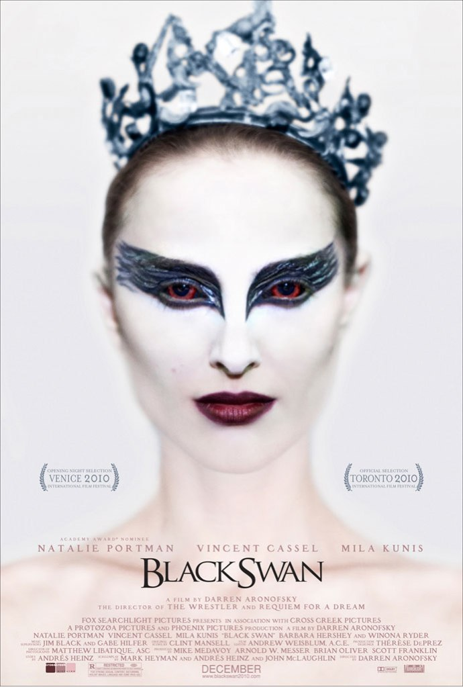
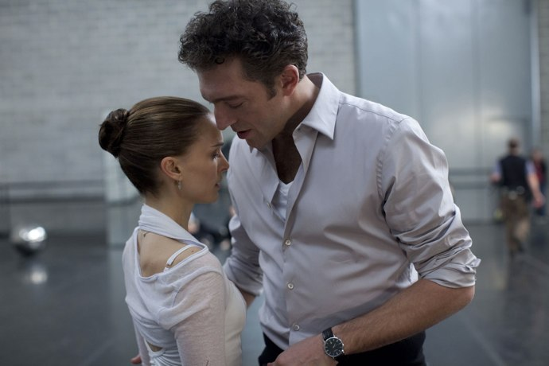
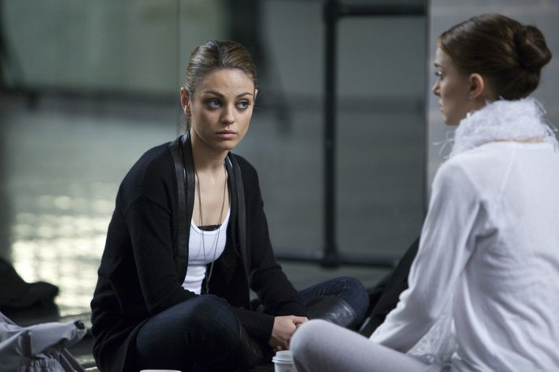

+++
type = "post"
titre = "Black Swan, Darren Aronofsky"
title = "Black Swan, Darren Aronofsky"
url = "/black-swan-aronofsky"
date = "2011-02-18T23:43:26"
Lastmod = "2012-02-11T15:53:06"
cover = "black-swan-portman.jpg"
categorie = [ "À voir" ]
tag = [ "Art", "Danse", "Drame", "Folie" ]
createur = [ "Darren Aronofsky" ]
acteur = [ "Natalie Portman", "Vincent Cassel" ]
annee = [ "2011" ]
weight = 2011
pays = [ "États-Unis" ]

+++

La folie, de nombreux réalisateurs et films se sont penchés sur ce sujet passionnant, mais très difficile à mettre sur la pellicule. Darren Aronofsky s&rsquo;y est risqué avec <em>Black Swan</em> et rarement un film a réussi à rendre avec autant de force la folie de son personnage principal. Autant le dire d&rsquo;emblée, ce n&rsquo;est pas un film forcément très agréable, tant il est capable de mettre le spectateur mal à l&rsquo;aise. Son hésitation permanente entre fantastique et réalisme psychologique s&rsquo;avère extrêmement efficace. Un film à voir, si la folie ne vous effraie pas trop.

<a href="http://www.allocine.fr/film/fichefilm_gen_cfilm=125828.html">

</a>

Nina est une danseuse étoile au New York City Ballet. Elle a consacré sa vie tout entière à la danse et elle n&rsquo;attend plus que sa consécration, la première place dans un ballet et la tête d&rsquo;affiche du ballet. La saison s&rsquo;ouvre avec le classique entre les classiques <em><a href="http://fr.wikipedia.org/wiki/Le_Lac_des_cygnes">Lac des cygnes</a></em>. L&rsquo;histoire du cygne blanc et du cygne noir est connue, mais le metteur en scène du Ballet a décidé d&rsquo;offrir une version revisitée et modernisée où le cygne noir et le cygne blanc ne font plus qu&rsquo;un seul personnage, interprété par une seule danseuse, pour mieux mettre en valeur l&rsquo;ambiguïté du personnage. Une idée astucieuse qui remet au goût du jour le ballet, mais qui implique aussi de trouver une danseuse capable d&rsquo;interpréter autant la naïveté et la douceur du cygne blanc, que la rudesse et la force du cygne noir. Une danseuse hors pair que Thomas, le metteur en scène à résidence, trouve en Nina. La jeune fille excelle surtout dans le rôle du cygne blanc, mais Thomas veut croire en sa capacité à se libérer d&rsquo;une certaine rigidité et se laisser aller vers la noirceur du cygne noir. D&rsquo;abord timide, la noirceur commence à sortir chez Nina alors qu&rsquo;elle fait une rencontre troublante avec Lilly, une danseuse venue de San Francisco, totalement spontanée, sans limite ni contrôle et qui s&rsquo;avère aussi excellente que Nina, mais dans un registre totalement opposé. L&rsquo;opposition entre les deux danseuses était inévitable, d&rsquo;autant que Lilly est désignée comme étant la doublure de Nina et cette dernière suspecte la première de chercher à lui prendre sa place. De quoi attiser la noirceur de Nina…

<em>Black Swan</em> est d&rsquo;abord une plongée dans l&rsquo;univers éprouvant de la danse et du ballet. Un univers complètement fermé, sans repère temporel, mais aussi un univers de compétition où les danseurs et danseuses se battent pour briller plus que les autres, essaient de se mettre en avant pour finir en tête de l&rsquo;affiche. La compétition est terrible et passe aussi par la séduction du maître des lieux, celui qui décide de la mise en scène, Thomas en l&rsquo;occurrence. Darren Aronofsky met bien en avant le doute sur les raisons qui ont poussé Thomas à choisir Nina. Est-ce vraiment seulement en fonction des qualités de danseuse de la jeune femme, ou en attend-il plus ? À dire vrai, il ne laisse pas vraiment de doute sur ce qu&rsquo;il attend de Nina, même si la danseuse et son mentor n&rsquo;iront jamais très loin. L&rsquo;ambiance n&rsquo;est pas des plus saines néanmoins, surtout pour des jeunes qui consacrent leur vie entière à leur art, sacrifiant tout le reste. Nina ne vit que pour la danse, elle n&rsquo;a jamais connu autre chose que le ballet et n&rsquo;imagine sans doute pas de vie sans ballet. C&rsquo;est toute sa vie et c&rsquo;est une vie destructrice. La destruction est d&rsquo;abord physique : cette fille est en permanence à la limite de l&rsquo;anorexie, elle ne s&rsquo;autorise jamais d&rsquo;écart, ne mange quasiment rien et elle survit plus qu&rsquo;elle ne vit. Elle vit avec sa mère, ancienne danseuse de ballet qui a manifestement reporté ses ambitions perdues sur sa fille et qui pousse cette dernière de manière aussi autoritaire que terrifiante. Comment résister face à une telle mère, extrêmement exigeante ? <em>Black Swan</em> est un film sur une fille mal dans sa peau, incapable de trouver sa place dans la société si ce n’est au cœur d’un ballet. Voici une place bien difficile pour une jeune femme et il n’est dès lors guère étonnant que sa santé mentale ne soit pas au beau fixe.

Au-delà de la plongée dans l’univers de la danse, le film de Darren Aronofsky est le récit de la folie de Nina, une folie destructrice et même tragique. La grande force de <em>Black Swan</em> est néanmoins de ne jamais trancher entre film réaliste sur la folie et film fantastique et au contraire hésiter en permanence entre les deux, comme sur un fil. Nina va mal et connaît un dédoublement de la personnalité qui s’amplifie au fur et à mesure qu’elle s’imprègne de son personnage dual. Nina devient le cygne tantôt blanc, tantôt noir et elle se met à avoir des hallucinations et devenir complètement schizophrène. Plus son rôle devient fort et réussi, plus Nina devient folle et la première représentation est le point d’orgue de ce système. Le cygne noir est absolument exceptionnel, tellement bon que le public pourrait jurer avoir vu des plumes sur le corps de la svelte danseuse. Nina, elle est en même temps complètement folle au point d’en perdre totalement la tête. Rien de bien original donc que cette descente aux enfers d’une danseuse de ballet, sauf qu’Aronofsky a eu l’excellente idée de filmer les hallucinations de son personnage au premier degré, offrant à son film une teinte fantastique inattendue et très bien vue. <em>Black Swan</em> offre ainsi deux niveaux de lecture : d’un côté la folie raisonnable, de l’autre la transformation concrète d’une jeune femme en cygne. Ainsi, son dos se marque de blessures à vif d’où sortent des plumes noires : elle seule voit les plumes, mais les blessures sont bel et bien là. Lily est montrée dans le film comme le double de Nina et on a parfois l’impression qu’elle l’est vraiment, qu’elle entre dans le corps de Nina quand cette dernière joue le rôle du cygne noir. Le film ne rate pas une occasion d’opposer les deux danseuses, Nina étant toujours habillée de blanc quand la ténébreuse Lily est en habits sombres. C’est ce décalage constant, cette hésitation qui provoque le malaise chez le spectateur. Darren Aronofsky parvient à maintenir son spectateur dans un état permanent de mal-être, ne sachant pas trop à quoi se rattacher, ne sachant pas exactement que penser de ce qu’il voit, que croire. C’est une véritable réussite, mais mieux vaut être conscient que <em>Black Swan</em> n’est pas un film gentil et agréable. C’est un film prenant, dur, réussi, mais à ne pas montrer à tout le monde : l’avertissement est, une fois n’est pas coutume, pleinement justifié.

Darren Aronofsky utilise tous les artifices que lui offre le cinéma pour mettre en image son scénario et infuser en permanence un doute, entre fantastique et réalisme. Dès la scène d’ouverture, le ton est donné : le réalisateur filme une scène de danse envoutante et déjà teintée de fantastique, comme un signe de ce qui va suivre. Pendant toute la durée de <em>Black Swan</em>, il va utiliser les artifices à sa disposition, mais jamais gratuitement, toujours avec l’envie de faire douter le spectateur et le plonger toujours plus profondément au cœur de la folie de son personnage. Il joue avec les miroirs, utilise abondamment la musique ou plus largement la bande sonore de son film et il s’avère ainsi extrêmement efficace. On notera en particulier la beauté presque magique des scènes de danse qui devraient passionner même ceux qui, comme moi, n’apprécient guère le ballet. Ces corps en mouvement sont vraiment splendides à voir et que dire de ce final sur scène, tout simplement magique et brillant avec une mise aussi complexe que transparente. <em>Black Swan</em> ne serait pas la réussite qu’il est sans son interprète principale et on ne peut être qu’émerveillé, voire époustouflé par Natalie Portman. L’actrice n’avait pas vraiment besoin de prouver son talent, mais elle atteint entre les mains de Darren Aronofsky un niveau jamais vu jusque-là, avec un jeu d’une puissance rare. Elle éclipse en tout cas tous les autres acteurs du film, même si Vincent Cassel s’en sort bien en metteur en scène tyrannique.

Regarder <em>Black Swan</em> est une expérience qui peut s’avérer éprouvante. Le film ressemble fort à un cauchemar que l’on vivrait parfaitement éveillé, ce qui n’est pas forcément agréable. Mais c’est bien là, la grande réussite de Darren Aronofsky : rarement un film n’a été aussi loin dans la folie et c’est une exploration viscérale qu’il nous propose. C’est prenant, pénible aussi, mais surtout brillant. Un film à ne pas rater.

<h3>Vous voulez m&rsquo;aider ?<a href="#footnote_0_4615" id="identifier_0_4615" class="footnote-link footnote-identifier-link" title="&Agrave; propos de la publicit&eacute;&hellip;">1</a></h3>
<ul>
<li><a href="http://www.amazon.fr/gp/product/B004L2LIMW/ref=as_li_ss_tl?ie=UTF8&#038;tag=leblogdenic07-21&#038;linkCode=as2&#038;camp=1642&#038;creative=19458&#038;creativeASIN=B004L2LIMW">Acheter le film en Blu-Ray sur Amazon</a></li>
<li><a href="http://www.amazon.fr/gp/product/B004L2LIMM/ref=as_li_ss_tl?ie=UTF8&#038;tag=leblogdenic07-21&#038;linkCode=as2&#038;camp=1642&#038;creative=19458&#038;creativeASIN=B004L2LIMM">Acheter le film en DVD sur Amazon</a></li>
</ul>

<ol class="footnotes"><li id="footnote_0_4615" class="footnote"><a href="http://voiretmanger.fr/a-propos/publicite/">À propos de la publicité…</a> [<a href="#identifier_0_4615" class="footnote-link footnote-back-link">&#8617;</a>]</li></ol>
