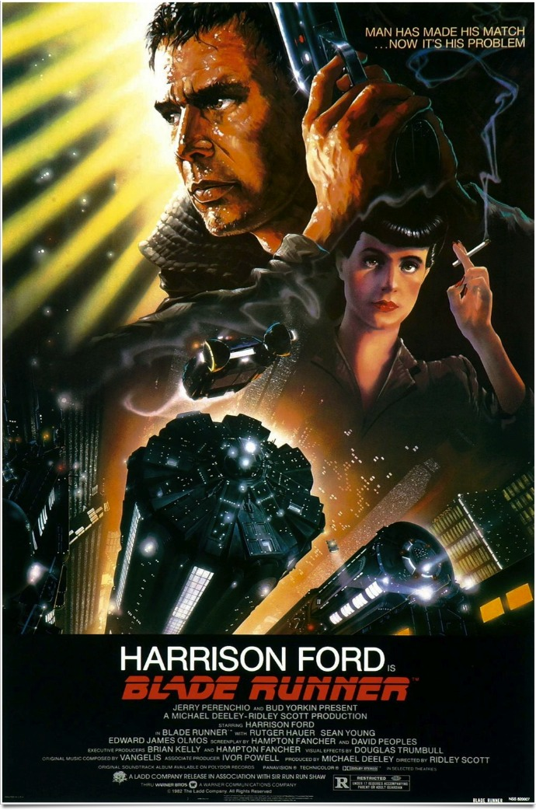
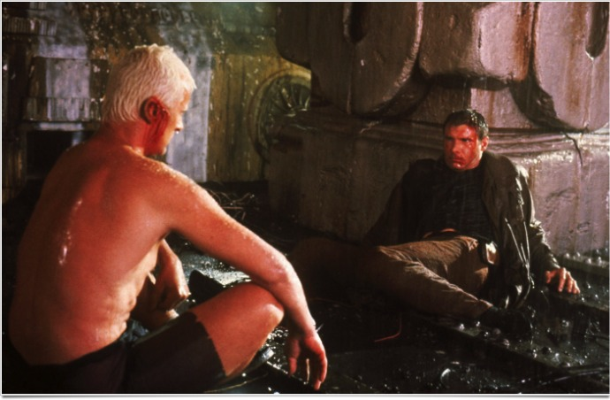

+++
type = "post"
titre = "Blade Runner, Ridley Scott"
title = "Blade Runner, Ridley Scott"
url = "/blade-runner-scott"
date = "2011-11-06T20:11:24"
Lastmod = "2013-04-13T14:45:08"
cover = "blade-runner-ridley-scott.jpg"
categorie = [ "À voir" ]
tag = [ "Culte", "Dystopie", "Film noir", "Science-Fiction", "Société" ]
createur = [ "Ridley Scott" ]
acteur = [ "Harrison Ford", "Rutger Hauer", "Sean Young" ]
annee = [ "1982" ]
weight = 1982
pays = [ "États-Unis" ]

+++

Film culte que tout amateur de science-fiction doit avoir vu dans sa vie, <em>Blade Runner</em> continue de marquer, près de 30 ans après sa sortie dans les salles. Le film de Ridley Scott est d&rsquo;une noirceur rarement vue au cinéma et son climat oppressant associé au rythme très lent en fait une expérience cinématographique rare. <em>Blade Runner</em> est un film des années 1980 et cela se voit, mais il a plutôt bien vieilli et se regarde avec toujours autant de plaisir.

Los Angeles, 2019. La Terre est devenue une vaste mégalopole insalubre où il ne fait pas bon vivre. Le soleil ne se lève plus jamais et les épais nuages qui entourent la planète déversent une pluie continue. Les plus riches partent pour des colonies dans l&rsquo;espace, les autres vivent dans un climat sombre et humide assez oppressant. Progrès techniques aidant, l&rsquo;homme a inventé des machines à son image : les <em>replicants</em> sont des copies parfaites de l&rsquo;homme, ils sont néanmoins dotés d&rsquo;une force bien supérieure et d&rsquo;une intelligence sans faille. Pour les reconnaître, il faut utiliser la seule différence : ils n&rsquo;éprouvent aucune émotion, du moins en théorie. Leur intelligence artificielle est si développée qu&rsquo;ils peuvent finalement ressentir des émotions. Pour éviter les problèmes, ces robots humanoïdes ne peuvent pas vivre plus de quatre ans. On sait depuis Asimov que l&rsquo;intelligence artificielle peut conduire à la perte de l&rsquo;homme et de fait, les <em>replicants</em> ont tendance à ne pas accepter leur état d&rsquo;esclaves à disposition de l&rsquo;homme. Suite à une révolte qui s&rsquo;est terminée en bain de sang, les <em>replicants</em> sont interdits de séjour sur Terre et les Blade Runner sont des policiers spécialement affectés à leur traque. Quand le film commence, quatre <em>replicants</em> sont arrivés sur Terre et Rick Deckard, ancien Blade Runner, doit les traquer jusqu&rsquo;au dernier.

<em>Blade Runner</em> frappe d&rsquo;abord par la noirceur de son univers. Dystopie assez classique dans l&rsquo;idée (état désastreux de la terre expliqué par un problème écologique), elle est illustrée avec une force rare au cinéma. Ridley Scott a réussi à créer un climat poisseux extrêmement réussi et son film est devenu une référence bien au-delà du milieu cinématographique<a href="#footnote_0_5272" id="identifier_0_5272" class="footnote-link footnote-identifier-link" title="Au-del&agrave; de Blade Runner, par Mike Davis, est une r&eacute;f&eacute;rence bien connue des &eacute;tudiants en g&eacute;ographie&hellip;">1</a>. Les rues sales de Los Angeles sont criantes de réalisme et <em>Blade Runner</em> a su trouver l&rsquo;équilibre entre voitures volantes et éléments traditionnels. Tout n&rsquo;est pas réussi, bien sûr : comme tout film d&rsquo;anticipation, celui-ci se trompe en particulier sur l&rsquo;informatique qui est beaucoup plus proche de 1982 que de 2019. Peu importe toutefois : ces éléments qui paraissent datés apportent une touche steampunk plutôt plaisante à <em>Blade Runner</em>. Ils participent aussi à l&rsquo;ambiance spécifique du film, à sa lenteur si spécifique également qui a d&rsquo;ailleurs contribué à son échec en salles. Il est vrai que <em>Blade Runner</em> n&rsquo;est pas un film d&rsquo;action, loin de là. Sur les deux heures que dure le film, il ne se passe finalement pas grand-chose et il faut se laisser porter par une histoire qui prend son temps pour s&rsquo;installer. Ce rythme si spécifique est peut-être aussi ce qui explique aujourd&rsquo;hui encore le succès de <em>Blade Runner</em> et son statut de film culte.

Contrairement à de nombreux autres films de science-fiction, <em>Blade Runner</em> ne s&rsquo;attache pas vraiment aux problèmes liés à l&rsquo;intelligence artificielle ou la robotique. Ils sont évidemment centraux puisqu&rsquo;ils composent l&rsquo;essentiel du film et de son scénario, mais Ridley Scott ne questionne pas vraiment les dangers ou avantages de robots intelligents. Les <em>replicants</em> sont les ennemis désignés et le héros doit les abattre, point. Le film suit le point de vue de Rick et l&rsquo;homme évolue sensiblement, du moins dans la version Final Cut. Au départ hostile aux <em>replicants</em> pour une raison qui reste d&rsquo;ailleurs mystérieuse, Rick les découvre petit à petit et finirait presque à se ranger de leur côté. Derrière une étonnante neutralité en apparence, <em>Blade Runner</em> s&rsquo;avère finalement plus engagé qu&rsquo;il n&rsquo;y paraissait, mais pas tant sur les robots que sur la société présentée. Ridley Scott dénonce par son film une industrialisation à outrance qui entraîne pollution et destruction, même si les plans aériens au-dessus de Los Angeles témoignent d&rsquo;une certaine fascination. La société détruit en tout cas totalement ceux qui la composent : Rick est un homme lessivé, qui ne semble plus avancer que machinalement dans la vie, plus par habitude que par intérêt. Le personnage principal de <em>Blade Runner</em> est à l&rsquo;image de l&rsquo;ambiance du film, très sombre.

<em>Blade Runner</em> fait partie de ces films de science-fiction qui ont marqué : les histoires de science-fiction qui ont puisé dans l&rsquo;imaginaire de Ridley Scott pour construire le leur sont innombrables. Cette noirceur et cette crasse étaient relativement nouvelles pour un film censé se dérouler dans le futur et elles vont donner des idées à d&rsquo;autres films. Le cinéaste s&rsquo;est pourtant basé sur des films plus anciens et loin d&rsquo;être futuristes : <em>Blade Runner</em> est, par bien des aspects, un descendant direct des films noirs des années 1940. L&rsquo;ambiance poisseuse provient directement de ces films : la pluie, les costumes ou encore l&rsquo;immeuble où loge J.F. Sebastian sont autant d&rsquo;éléments caractéristiques de cette époque et de ce cinéma. Ridley Scott propose finalement un univers assez peu moderne et finalement assez daté : on est loin de la saga <em>Star Wars</em> qui a contribué à faire connaître Harrison Ford. L&rsquo;acteur est ici excellent, dans un rôle bien différent ce qui n&rsquo;a pas aidé le film à sa sortie. L&rsquo;ambiance doit aussi beaucoup à la bande originale composée par Vangelis. Calme et aérienne, elle participe à l&rsquo;identité de <em>Blade Runner</em> tout en donnant au film une touche plus moderne et qui a étonnamment plutôt bien vieilli.

Film culte, <em>Blade Runner</em> se regarde avec toujours autant de plaisir trente après. Ridley Scott a réussi à faire durer son film de science-fiction, malgré quelques éléments qui ont mal supporté le poids des années, ce qui n&rsquo;est pas une mince affaire. On a rarement vu un univers dystopique aussi fort, aussi noir et aussi réussi : <em>Blade Runner</em> n&rsquo;est pas une référence pour rien… À (re)voir sans hésiter !

<h3>Vous voulez m&rsquo;aider ?<a href="#footnote_1_5272" id="identifier_1_5272" class="footnote-link footnote-identifier-link" title="&Agrave; propos de la publicit&eacute;&hellip;">2</a></h3>
<ul>
<li><a href="http://www.amazon.fr/gp/product/B000XIABTY/ref=as_li_ss_tl?ie=UTF8&#038;tag=leblogdenic07-21&#038;linkCode=as2&#038;camp=1642&#038;creative=19458&#038;creativeASIN=B000XIABTY">Acheter le film en Blu-Ray sur Amazon</a></li>
<li><a href="http://www.amazon.fr/gp/product/B000ICMGZC/ref=as_li_ss_tl?ie=UTF8&#038;tag=leblogdenic07-21&#038;linkCode=as2&#038;camp=1642&#038;creative=19458&#038;creativeASIN=B000ICMGZC">Acheter le film en DVD sur Amazon</a></li>
<li><a href="https://itunes.apple.com/fr/movie/blade-runner-directors-cut/id367780139">Acheter ou louer le film sur l&rsquo;iTunes Store</a></li>
</ul>

<ol class="footnotes"><li id="footnote_0_5272" class="footnote"><em>Au-delà de Blade Runner</em>, par Mike Davis, est une référence bien connue des étudiants en géographie… [<a href="#identifier_0_5272" class="footnote-link footnote-back-link">&#8617;</a>]</li><li id="footnote_1_5272" class="footnote"><a href="http://voiretmanger.fr/a-propos/publicite/">À propos de la publicité…</a> [<a href="#identifier_1_5272" class="footnote-link footnote-back-link">&#8617;</a>]</li></ol>
