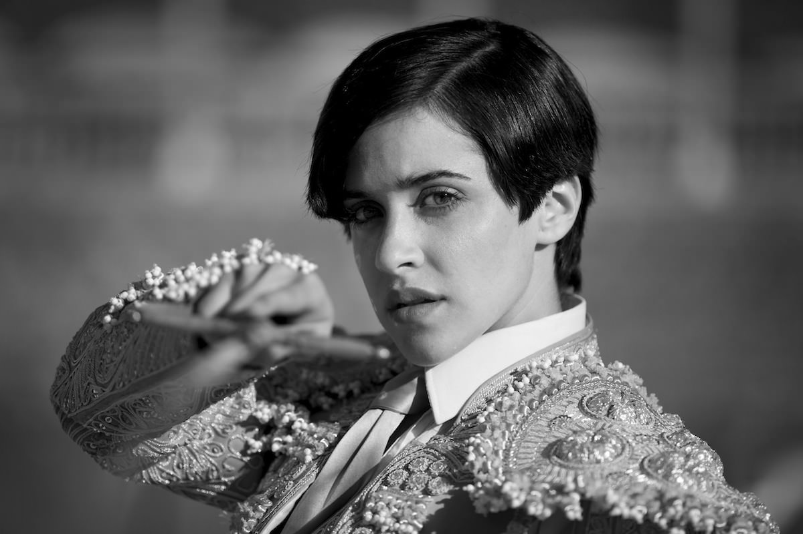
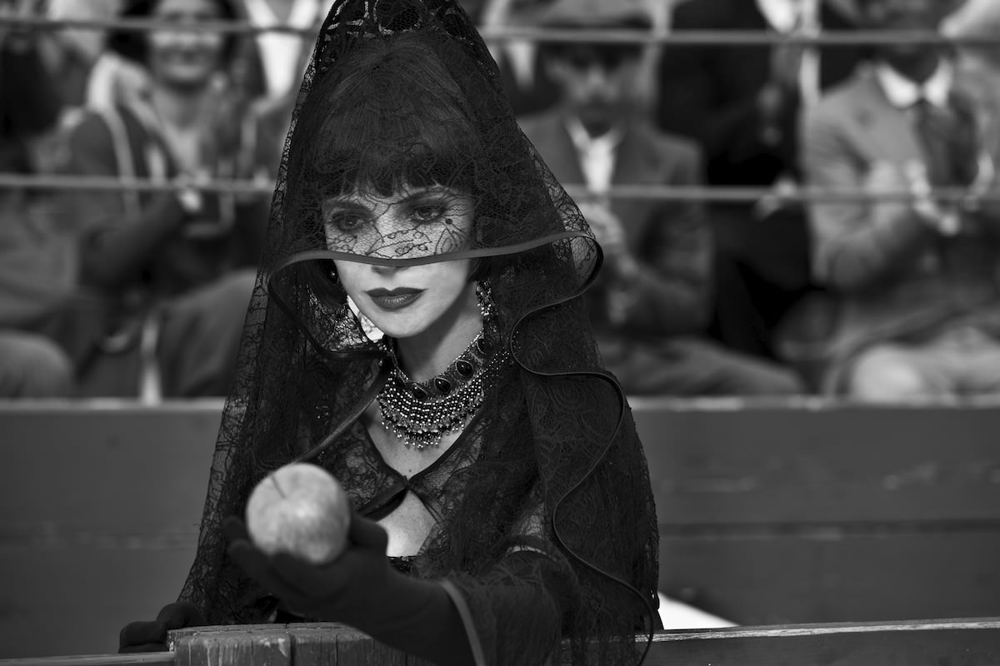

+++
type = "post"
titre = "<em>Blancanieves</em>, Pablo Berger"
title = "Blancanieves, Pablo Berger"
url = "/blancanieves-berger"
date = "2013-01-18T00:13:46"
Lastmod = "2014-08-30T23:12:01"
cover = "blancanieves-pablo-berger.jpg"
categorie = [ "À voir" ]
tag = [ "Adaptation littéraire", "Animaux", "Blanche Neige", "Conte", "Drame", "Famille", "Mort", "Noir et blanc" ]
createur = [ "Pablo Berger" ]
acteur = [ "Macarena García", "Maribel Verdú" ]
annee = [ "2013" ]
weight = 2013
pays = [ "Espagne" ]

+++

Un Blanche-Neige revisité dans l’Espagne des années 1920, dans un film noir et blanc, muet et au format carré ? L’idée de départ de <em>Blancanieves</em> avait de quoi effrayer un peu et pourtant c’est certainement l’une des meilleures idées de cinéma de ce début d’année. Loin de proposer une version lente et pénible, Pablo Berger plonge ses spectateurs dans une ambiance à l’ancienne extrêmement réussie et les entraîne dans une relecture si intense du conte bien connu qu’il en devient presque méconnaissable. Un excellent film, à découvrir absolument.

« <em>Nous t’appellerons Blanche-Neige, comme dans le conte !</em> ». C’est ainsi que le personnage naît vraiment chez Pablo Berger et il s’est passé un bon moment, plus de la moitié de <em>Blancanieves</em> sans doute. Il faut dire que ce long-métrage n’est en rien une adaptation fidèle du conte des frères Grimm, il s’agit d’une relecture, d’une toute nouvelle histoire inspirée par le conte que tout le monde connaît. Ici, Blanche-Neige est d’abord Carmen, la fille d’un torero et d’une danseuse de flamenco qui naît au début du XXe siècle à Séville. Peu avant sa naissance, son père est battu par un taureau dans la grande arène et il en ressort infirme, incapable de bouger ses bras ou ses jambes jusqu’à la fin de ses jours. Sa femme accouche de leur premier enfant, une fille, mais elle meurt en couches. Le point de départ est bien éloigné de celui des frères Grimm, il n’est nulle question ici de roi et de princesse, même si on peut considérer que le torero est un roi dans son domaine. La suite de <em>Blancanieves</em> s’approche un petit peu plus du conte quand le père de la fille, accablé par le chagrin, se laisse séduire par son infirmière qui parvient à l’épouser. La belle-mère est en place, il ne manque plus que la mort de la grand-mère de Carmen qui l’a recueillie pour l’élever et on retrouve la marâtre et sa belle-fille qu’elle déteste sous le même toit. Peu à peu, Pablo Berger pose les éléments de l’histoire traditionnelle telle qu’on la connaît, avec nains et pomme empoisonnée, sans jamais tomber dans les travers de la redite, encore moins de la parodie.

<em>Blancanieves</em> pose son histoire par rapport au <em>Blanche-Neige</em> original, parvenant à jouer en permanence aux équilibristes avec un pied posé du côté du conte et un autre du côté d’un drame plus moderne. Pablo Berger multiplie les références et clins d’œil, mais il parvient à garder ses distances et le choix de la tauromachie n’est, à cet égard, pas qu’une excuse pour faire espagnol. En faisant de son héroïne la fille d’un torero et non celle d’un roi, il exploite un milieu social certes valorisé — la fortune de son père est immense —, mais pas favorisé par un statut favorisé. Le fait que la jeune Carmen soit enfermée dans une cave miteuse en guise de chambre et qu’elle fasse tout le sale boulot semble ainsi plus naturel. Mieux, le cinéaste est parvenu à effacer totalement le fantastique du conte dans <em>Blancanieves</em>, sans renoncer pour autant à une certaine magie, ou du moins à l’émerveillement qui l’accompagne. La belle-mère n’est ainsi plus une sorcière, mais simplement une femme vraiment détestable qui entend hériter de toute la fortune du torero handicapé et qui ne recule devant rien pour satisfaire cet objectif. Le miroir est ici remplacé par un magazine qui lui refuse la couverture au profit de Carmen, ce qui la met dans une rage noire et lui donne l’envie de la tuer. Autant d’idées qui entretiennent cette juste distance entre le conte et le drame et qui permettent à Pablo Berger d’offrir une très belle relecture du conte, bien loin des pitreries de <a href="/2012/06/13/blanche-neige-chasseur-sanders/" title="Blanche-Neige et le Chasseur, Rupert Sanders - À voir et à manger"><em>Blanche-Neige et le Chasseur</em></a> sorti l’an dernier.

Plutôt qu’une banale et finalement peu intéressante relecture guerrière, Pablo Berger fait le pari beaucoup plus risqué de l’émotion pour sa version. <em>Blancanieves</em> est un film muet qui ne peut ainsi compter sur les dialogues pour transmettre non seulement ses messages, mais aussi son émotion. Comme les films muets du début du siècle dernier, quelques panneaux entrecoupent l’action et explicitent la pensée de certains personnages, voire reprennent quelques dialogues importants. Ces cartons restent assez rares, mais ils auraient pu être facilement beaucoup moins nombreux. Faute de dialogues, Pablo Berger n’a à sa disposition que deux autres moyens de faire avancer son film et de transmettre des sentiments : les jeux des acteurs et la musique. Dans les deux cas, la réussite de <em>Blancanieves</em> éclate dès les premiers plans. Le long-métrage fait l’effet d’un concentré d’émotions qui éclate dès l’ouverture : on se sent emporté par le combat dans l’arène, puis par la naissance de l’enfant, avant d’être ému devant cette petite fille qui cherche désespérément à voir son père. C’est ainsi pendant les 1h44 que dure le film de Pablo Berger : on est constamment emporté et ému par ce que l’on voit.

Cette redoutable efficacité s’explique d’abord par le casting réuni par Pablo Berger. Que ce soit Maribel Verdú en belle-mère, Macarena García dans le rôle titre ou encore les sept nains qui ont été transformés ici en personnages d’un spectacle de farce qui mime la corrida, ils sont tous excellents dans leurs rôles et parviennent à retrouver le jeu si typique du cinéma muet, sans le parodier. Alors que <a href="/2011/10/16/artist-hazanavicius/" title="The Artist, Michel Hazanavicius - À voir et à manger"><em>The Artist</em></a> s’en tenait au pastiche, certes amusant et réussi, <em>Blancanieves</em> ne semble jamais copier le cinéma à l’ancienne pour s’amuser, mais utilise ce cinéma pour apporter une palette d’émotions bien plus riche que si le film avait été en couleur et avec des dialogues. C’est justement ce format — carré et noir et blanc — qui permet au cinéaste de composer un film aussi riche et intense. Loin de l’artifice, Pablo Berger a en somme trouvé la forme idéale pour raconter son histoire, si bien que son long-métrage ne semble jamais forcé. Il peut aussi compter, à cet effet, sur la splendide bande originale composée par Alfonso de Vilallonga : parfois strictement dans les années 1920, parfois légèrement modernisée, elle est justement l’élément qui déclenche les émotions dans le film, un personnage à part entière peut-être plus important encore que ceux qui sont visibles à l’écran. Cette composition originale rend presque les images superflues, c’est quelque chose de rare au cinéma. <em>Blancanieves</em> mérite malgré tout d’être vu : son noir et blanc très contrasté est souvent sublime, tandis que le format carré offre à Pablo Berger des opportunités nouvelles pour sa mise en scène. Le film s’offre d’ailleurs quelques libertés folles, à l’image de ces souvenirs affichés comme des images subliminales.

Le projet de <em>Blancanieves</em> pourrait effrayer, mais le résultat est tout simplement réjouissant. Pablo Berger est parvenu à composer une histoire émouvante autour du conte des frères Grimm, sans tomber dans la parodie, mais avec une relecture fine et intelligente. Un film magnifique à voir et à entendre, une expérience de cinéma à ne surtout pas rater en salles ou après.

<h3>Vous voulez <a href="/soutien/">m&rsquo;aider</a> ?</h3>
<ul>
<li><a href="http://www.amazon.fr/gp/product/B00BLIRO5Y/ref=as_li_ss_tl?ie=UTF8&amp;tag=leblogdenic07-21&amp;linkCode=as2&amp;camp=1642&amp;creative=19458&amp;creativeASIN=B00BLIRO5Y">Acheter le film en Blu-ray sur Amazon</a></li>
<li><a href="http://www.amazon.fr/gp/product/B00BLIRO54/ref=as_li_ss_tl?ie=UTF8&amp;tag=leblogdenic07-21&amp;linkCode=as2&amp;camp=1642&amp;creative=19458&amp;creativeASIN=B00BLIRO54">Acheter le film en DVD sur Amazon</a></li>
<li><a href="https://itunes.apple.com/fr/movie/blancanieves/id640606599">Acheter ou louer le film sur l&rsquo;iTunes Store</a></li>
</ul>

