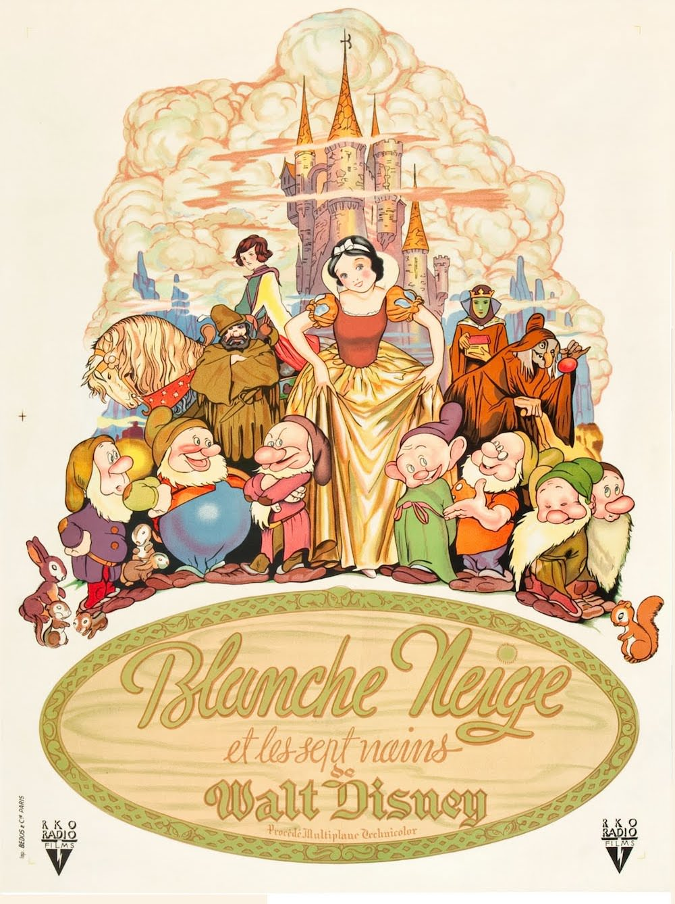
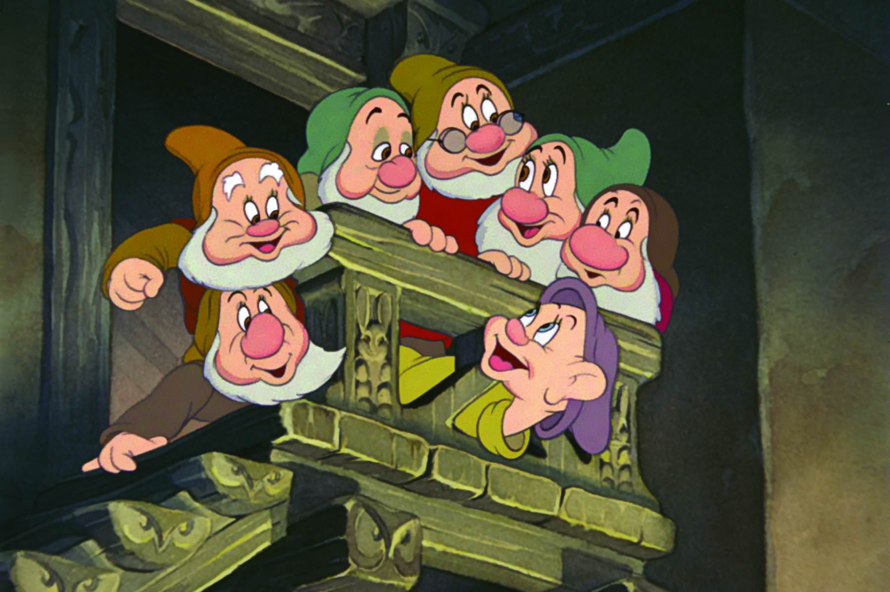
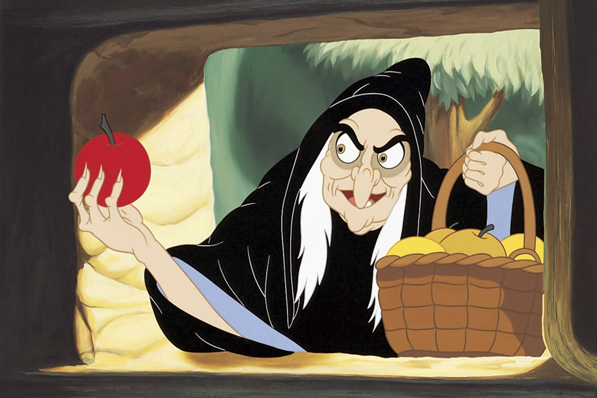

+++
type = "post"
titre = "<em>Blanche-Neige et les sept nains</em>, David Hand"
title = "Blanche-Neige et les sept nains, David Hand"
url = "/blanche-neige-sept-nains-hand"
date = "2014-01-21T09:52:08"
Lastmod = "2014-01-19T19:55:30"
cover = "blanche-neige-et-les-sept-nains-disney.jpg"
categorie = [ "À voir" ]
tag = [ "Amour", "Animation", "Blanche Neige", "Drame", "Fantastique", "Humour", "Princesse" ]
createur = [ "David Hand", "Walt Disney" ]
annee = [ "1937" ]
weight = 1937
saga = [ "Classiques d'animation Disney" ]
pays = [ "États-Unis" ]
original = "Snow White and the Seven Dwarfs"

+++

S’il n’est pas tout à fait <a href="http://fr.wikipedia.org/wiki/Blanche-Neige_et_les_Sept_Nains#La_n.C3.A9cessit.C3.A9_de_faire_un_long_m.C3.A9trage">le premier long-métrage</a> d’animation de l’histoire, <em>Blanche-Neige et les sept nains</em> est sans doute celui qui a le plus marqué les esprits. À sa sortie, en 1937, Walt Disney n’était pas encore mort et son entreprise avait déjà produit plusieurs courts-métrages qui avaient connu un franc succès, mais pas au point d’assurer au studio un futur brillant. Comme Charlie Chaplin ou Laurel et Hardy avant lui, il décide de se tourner vers le long-métrage pour assurer l’avenir de son entreprise. Un projet un peu fou auquel personne ne croyait avant la sortie, mais qui a été couronné d’un immense succès. Certes, <em>Blanche-Neige et les sept nains</em> a vieilli sur le plan technique, mais ce premier essai est incontestablement un coup de maître qui impose de nombreuses idées que l’on retrouvera ensuite dans tous les longs-métrages signés Disney.  

Walt Disney avait beaucoup d’admiration pour l’Europe et c’est assez logiquement en Allemagne qu’il vient chercher l’inspiration pour le premier long-métrage de l’histoire de son entreprise. <em>Blanche-Neige</em> est un conte traditionnel qui a été popularisé par la version des frères Grimm, au XIXe siècle. Quand les studios d’animation s’y intéressent, le conte a déjà bénéficié de plusieurs adaptations au cinéma, toujours sous la forme de courts-métrages, pas toujours d’animation. L’histoire générale est simple, mais universelle : une princesse si belle qu’elle rend sa belle-mère folle de jalousie, au point que cette dernière lui souhaite la mort.  Et puis un prince qui vient sauver sa belle d’une mort certaine : <em>Blanche-Neige et les sept nains</em> adopte ce conte ultra-classique pour mieux innover ailleurs. De fait, si le film réalisé par David Hand semble aujourd’hui tout à fait banal, il était à l’époque révolutionnaire, et ce pour plusieurs raisons. On pourrait consacrer plusieurs articles à la technique, puisqu’il s’agit du premier film d’animation de 90 minutes à la fois en couleurs et sonore, le premier aussi qui représente des humains aussi fidèlement, le premier à proposer une animation aussi vivante, le premier à offrir des mouvements de caméra que l’on pensait impossibles en animation… Pour réaliser ce film qui a battu des records de budget à l’époque — près de 1,5 million de dollars —, Walt Disney a fait former ses équipes qui ont inventé des techniques inédites. <em>Blanche-Neige et les sept nains</em> n’atteint pas encore la perfection technique de ses prédécesseurs, mais même ses erreurs sont touchantes et les équipes derrière le long-métrage ont fait tout leur possible, évinçant par exemple le prince du scénario pour éviter de trop le montrer. Pour de mauvaises raisons peut-être, David Hand avait mis le doigt sur l’un des points forts des productions Disney : l’importance des différents personnages.

Certes, Blanche-Neige est l’héroïne attitrée de <em>Blanche-Neige et les sept nains</em>, elle est la princesse et le personnage que l’on suit du début à la fin. Ce que les scénaristes comprennent ou découvrent au fil d’essais, c’est que ce n’est pas le personnage le plus important pour autant, ou en tout cas pas le seul. Dans le conte original, les sept nains ne sont pas identifiés, ils n’ont pas d’identité propre et ils acceptent de cacher la fugitive uniquement en guise de servante. L’idée géniale du scénario mis en images par David Hand est bien de leur donner une véritable épaisseur en les nommant et en leur offrant une identité bien définie et facile à retenir. Par certains aspects, ce sont eux les vrais héros de <em>Blanche-Neige et les sept nains</em>, ce sont en tout cas eux qui véhiculent la touche d’humour qui plaira aux enfants. Eux aussi qui sont les plus vivants, avec les animaux peut-être : l’animation des personnages humains, en cherchant trop le réalisme, s’en éloigne finalement plus selon le principe de la <a href="http://fr.wikipedia.org/wiki/Vallée_dérangeante">vallée dérangeante</a> que découvre le studio à cette occasion. Hauts en couleur, faciles à reconnaître, ils sont les stars du film et ce n’est sans doute pas pour rien qu’ils partagent le titre avec la princesse. L’autre point fort, c’est le personnage de la belle-mère, la reine qui veut tellement rester la plus belle qu’elle commandite le meurtre de sa belle-fille. Les studios ont la bonne idée de la représenter comme une très belle femme, mais une femme cruelle. Elle est déjà impressionnante, mais c’est encore pire quand elle se transforme en sorcière pour faire avaler la pomme empoisonnée à Blanche-Neige. Cette idée originale — les frères Grimm la faisaient se déguiser en vendeuse — ajoute une touche de fantastique à l’ensemble et offre surtout une séquence qui fait peur à des générations d’enfants. À cet égard, la scène de fuite dans la forêt qui se transforme en un monstre est elle aussi très spectaculaire et signe l’une des premières réussites du studio. 

C’était un pari un peu fou à l’époque et Walt Disney a failli y laisser sa fortune et son studio. Le résultat pourtant est à la hauteur de ces ambitions folles : après quatre années de préparation, trois ans de production, après 800 km de papier et deux millions de croquis et dessin, <em>Blanche-Neige et les sept nains</em> est le premier dessin animé moderne. David Hand exploite un récit universel en s’inspirant d’un conte allemand et son long-métrage pose les bases du cinéma de Disney pour de nombreuses années à venir. De cette séquence avec le livre qui ouvre le film jusqu’à la place de l’humour et des personnages secondaires, ce premier essai témoigne d’excellentes idées qui seront souvent reprises dans les années qui suivent. Même si <em>Blanche-Neige et les sept nains</em> a techniquement vieilli, il ne faut pas oublier l’exploit de l’époque et le récit conserve, quant à lui, toute son actualité. Un grand classique !

<h3>Vous voulez m&rsquo;aider ?<a href="#footnote_0_10994" id="identifier_0_10994" class="footnote-link footnote-identifier-link" title="&Agrave; propos de la publicit&eacute;&hellip;">1</a></h3>
<ul>
<li><a href="http://www.amazon.fr/gp/product/B002EL4RM0/ref=as_li_ss_tl?ie=UTF8&tag=leblogdenic07-21&linkCode=as2&camp=1642&creative=19458&creativeASIN=B002EL4RM0">Acheter le film en Blu-Ray et DVD sur Amazon</a></li>
<li><a href="http://www.amazon.fr/gp/product/B00368CIFS/ref=as_li_ss_tl?ie=UTF8&tag=leblogdenic07-21&linkCode=as2&camp=1642&creative=19458&creativeASIN=B00368CIFS">Acheter le film en DVD sur Amazon</a></li>
</ul>

<ol class="footnotes"><li id="footnote_0_10994" class="footnote"><a href="/soutien/">À propos de la publicité…</a> [<a href="#identifier_0_10994" class="footnote-link footnote-back-link">&#8617;</a>]</li></ol>
