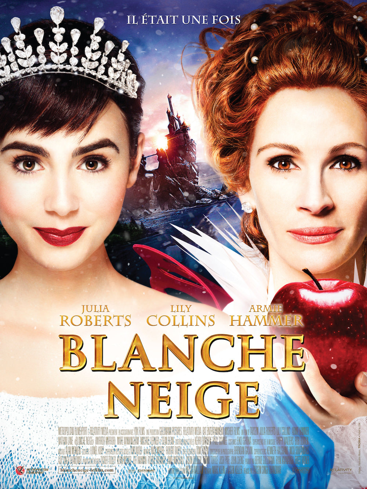
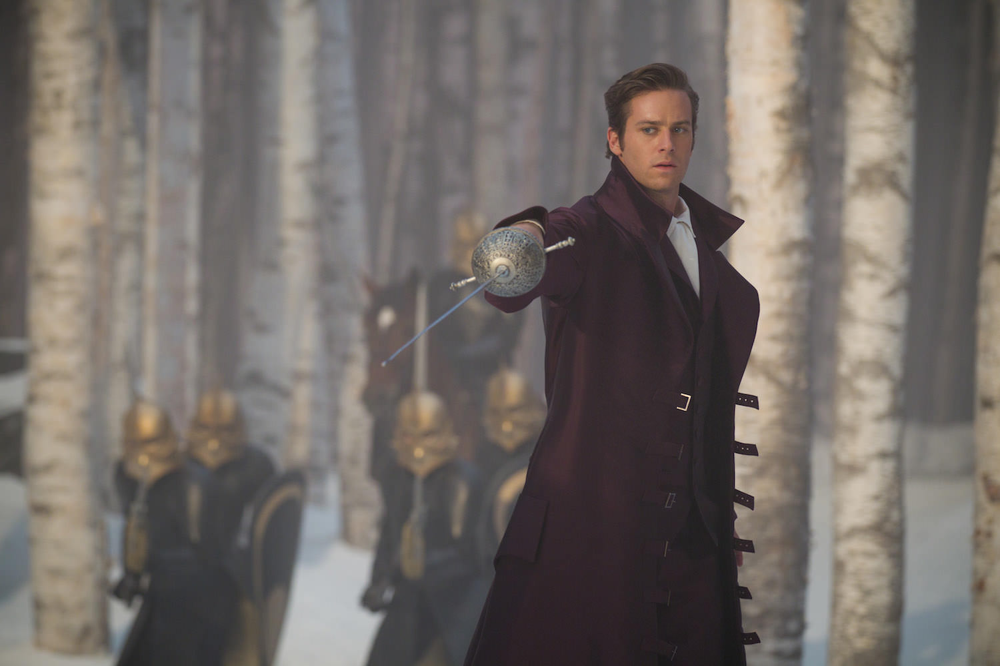

+++
type = "post"
titre = "<em>Blanche Neige</em>, Tarsem Singh"
title = "Blanche Neige, Tarsem Singh"
url = "/blanche-neige-singh"
date = "2013-06-25T10:26:58"
Lastmod = "2013-06-23T23:36:03"
cover = "blanche-neige-julia-roberts-lily-collins.jpg"
categorie = [ "À voir" ]
tag = [ "Adaptation littéraire", "Blanche Neige", "Blockbuster", "Comédie", "Conte", "Fantastique", "Parodie" ]
createur = [ "Tarsem Singh" ]
acteur = [ "Armie Hammer", "Julia Roberts", "Lily Collins", "Nathan Lane" ]
annee = [ "2012" ]
weight = 2012
pays = [ "États-Unis" ]
original = "Mirror Mirror"

+++

Quelques mois après <a href="/blanche-neige-chasseur-sanders/" title="Blanche-Neige et le Chasseur, Rupert Sanders - À voir et à manger"><em>Blanche-Neige et le Chasseur</em></a> qui offrait une relecture du conte sur un mode héroïc fantasy et qui constituait un échec trop sérieux et pas abouti, l’histoire de Blanche Neige faisait à nouveau l’objet d’une adaptation au cinéma. Nommé <em>Blanche Neige</em>, tout simplement, cette version réalisée par Tarsem Singh adopte une tout autre approche. Loin du réalisme et de la noirceur du précédent film, ce long-métrage adopte le ton de la parodie et du second degré. À l’écran, le choix a payé : même si <em>Blanche Neige</em> n’a rien du chef d’œuvre, c’est un blockbuster plutôt plaisant, malgré ses défauts. 

On connaît tous l’histoire de Blanche Neige, cette princesse extrêmement belle et jalousée par sa belle-mère qui décide, pour rester la plus belle, de l’éliminer. Tarsem Singh apporte bon nombre de modifications à cette histoire de base, si bien que l’on perd un peu de vue le conte de Grimm. Dans <em>Blanche Neige</em>, la reine est une femme orgueilleuse et dépensière qui passe son temps à se faire belle et les nains ne sont pas de gentils mineurs, mais des bandits de grand chemin — une idée déjà exploitée par <em>Blanche-Neige et le Chasseur</em> d’ailleurs. Le contexte de l’histoire est raconté du point de vue de la belle-mère et c’est l’occasion de poser le ton de cette comédie : la reine ne peut s’empêcher de faire quelques commentaires sarcastiques qui montrent bien son rôle dans la mort du père et surtout dans l’enfermement de Blanche Neige. Le film commence quand celle-ci atteint ses dix-huit ans. L’héroïne de <em>Blanche Neige</em> entend prendre sa place dans le royaume, d’abord en le visitant et c’est à l’occasion d’une ballade qu’elle découvre une population qui meurt de faim à cause des multiples taxes imposées par la reine pour organiser des bals gigantesques. Osant s’opposer à sa belle-mère, la princesse est envoyée dans la forêt noire pour être tuée, mais elle y découvre les sept nains du conte qui lui apprennent… à se battre. La fin du film consiste ainsi en une lutte pour prendre le pouvoir et au passage prendre le prince de l’histoire qui a été, lui aussi, envouté par la reine.

Construire un film à partir d’un conte, mais en changeant complètement de registre : l’idée fait fureur depuis quelques années et on comprend très bien pourquoi. L’idée est excellente, du moins sur le papier… dans les faits, la réalisation n’est souvent pas à la hauteur. Le projet de <em>Blanche Neige</em> avait de quoi faire peur, la comédie pouvant très mal passer sur la base fantastique du conte. Et pourtant, force est de constater que Tarsem Singh a sans doute fait le bon choix. Très présent, le second degré désamorce toutes les critiques que l’on pourrait faire sur les choix parfois un peu ridicules qui servent à passer du conte au grand écran. Les nains sur échasses qui rebondissent deviennent une excellente idée, à la fois un ressort comique et une idée très graphique. Le prince qui arrive à moitié nu deux ou trois de suite constitue un gag de répétition qui fonctionne, à défaut de faire dans la finesse et l’originalité. Le clou du spectacle reste toutefois la reine, interprétée par une Julia Roberts en pleine forme et qui s’en donne à cœur joie. Dans le genre personnage insupportable, imbu de soi-même et odieux, on ne fait guère mieux et les meilleurs moments de <em>Blanche Neige</em> impliquent d’ailleurs tous la belle-mère de la princesse. Sans surprise, alors que le film avance et que le scénario la met de côté, le long-métrage de Tarsem Singh perd en force et devient même longuet. La fin devient un peu trop sérieuse et elle casse cette dynamique comique qui fonctionnait si bien. C’est regrettable, mais l’ensemble reste plutôt agréable, même s’il faut reconnaître que l’humour déployé reste assez simple, voire simpliste par moment. Cela plaira aux enfants — c’est l’avantage —, mais les plus grands peuvent aussi passer un bon moment, à condition de ne pas prendre <em>Blanche Neige</em> pour ce qu’il n’est pas. C’est une comédie sans prétention qui fonctionne mieux que <em>Blanche-Neige et le Chasseur</em>, mais ce n’est en aucun cas un grand film.

En un an, trois relectures du conte de Blanche Neige sont sorties sur nos écrans. La plus originale et la meilleure reste, de loin, <a href="/blancanieves-berger/" title="Blancanieves, Pablo Berger - À voir et à manger"><em>Blancanieves</em></a> qui offrait, grâce à cette version muette dans l’Espagne des années 1920, une fraicheur et une liberté bienvenues. Ce <em>Blanche Neige</em> conçu par Tarsem Singh est beaucoup moins intéressant sur le plan cinématographique, mais en guise de divertissement décérébré, il remplit son office et s’avère plutôt réussi. On pourra regretter un humour un peu lourdingue par moment ou encore une fin un peu longue, mais l’ensemble fonctionne suffisamment pour une séance en famille. Aussitôt vu, aussitôt oublié, <em>Blanche Neige</em> montre au moins qu’il vaut mieux une bonne dose de second degré à une dose de sérieux en trop…

<h3>Vous voulez m&rsquo;aider ?<a href="#footnote_0_9793" id="identifier_0_9793" class="footnote-link footnote-identifier-link" title="&Agrave; propos de la publicit&eacute;&hellip;">1</a></h3>
<ul>
<li><a href="http://www.amazon.fr/gp/product/B0087WRHN6/ref=as_li_ss_tl?ie=UTF8&tag=leblogdenic07-21&linkCode=as2&camp=1642&creative=19458&creativeASIN=B0087WRHN6">Acheter le film en Blu-Ray sur Amazon</a></li>
<li><a href="http://www.amazon.fr/gp/product/B0087WRI3U/ref=as_li_ss_tl?ie=UTF8&tag=leblogdenic07-21&linkCode=as2&camp=1642&creative=19458&creativeASIN=B0087WRI3U">Acheter le film en DVD sur Amazon</a></li>
<li><a href="https://itunes.apple.com/fr/movie/blanche-neige/id546017469">Acheter ou louer le film sur l&rsquo;iTunes Store</a></li>
</ul>

<ol class="footnotes"><li id="footnote_0_9793" class="footnote"><a href="/soutien/">À propos de la publicité…</a> [<a href="#identifier_0_9793" class="footnote-link footnote-back-link">&#8617;</a>]</li></ol>
