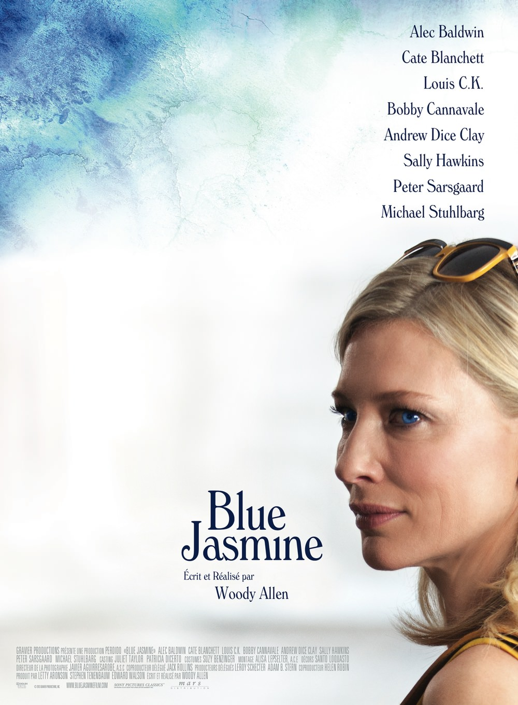
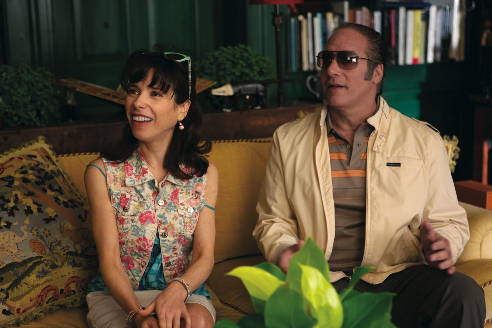

+++
type = "post"
titre = "<em>Blue Jasmine</em>, Woody Allen"
title = "Blue Jasmine, Woody Allen"
url = "/blue-jasmine-allen"
date = "2013-09-27T20:56:25"
Lastmod = "2014-02-05T08:34:05"
cover = "blue-jasmine-cate-blanchett-allen.jpg"
categorie = [ "À voir" ]
tag = [ "Argent", "Comédie dramatique", "Drame", "Humour", "Maladie", "Société" ]
createur = [ "Woody Allen" ]
acteur = [ "Alec Baldwin", "Andrew Dice Clay", "Bobby Cannavale", "Cate Blanchett", "Peter Sarsgaard", "Sally Hawkins" ]
annee = [ "2013" ]
weight = 2013
pays = [ "États-Unis" ]

+++

Imperturbable, Woody Allen poursuit son travail à un rythme impressionnant et sort, cette année encore, un nouveau long-métrage. Après s’être un petit peu perdu en Europe, le cinéaste revient dans son pays natal et ce retour lui fait du bien. Sans atteindre le niveau de ses chefs-d’œuvre passés, <em>Blue Jasmine</em> est un film charmant qui oscille et hésite en permanence entre la comédie et le drame, avec même parfois quelques pointes de mélo. Un ensemble qui détonne et constitue une belle surprise, mais il ne s’agit que d’un petit film, et ce n’est absolument pas grave. Woody Allen se fait manifestement plaisir en filmant des dialogues exquis et des personnages hauts en couleur, et il nous fait plaisir par la même occasion. 

<em>Blue Jasmine</em> ne raconte pas vraiment d’histoire, en tout cas pas une de ces histoires composées de multiples rebondissements et d’autant de péripéties. On suit le parcours difficile de Jasmine, alors qu’elle est obligée de quitter New York pour vivre quelques jours chez sa sœur, à San Francisco. Quelques années auparavant, elle avait épousé Hal, un homme d’affaires qui a réussi à la rendre heureuse et qui lui a surtout offert une vie de rêve dans les plus hautes sphères de Manhattan.  Jusqu’au jour où Jasmine a découvert que non seulement son époux qu’elle s’imaginait fidèle la trompait avec plusieurs femmes à la fois en permanences, mais qu’en plus c’était un escroc qui vivait sur de l’argent volé et des magouilles. Quand le dernier long-métrage de Woody Allen commence, Hal s’est déjà suicidé dans sa cellule et l’héroïne de son récit n’a plus rien pour vivre. Elle essaie de maintenir les apparences en volant en première classe avec ses bagages Vuitton et en donnant d’énormes pourboires au chauffeur de taxi, mais au fond, elle est vraiment dans l’embarras. Il ne lui en fallait pas moins pour qu’elle accepte d’emménager, fut-ce temporairement, chez Ginger, sa sœur. Les deux femmes ont été adoptées, elles ne sont sœurs que par les liens de la famille et cela se voit. <em>Blue Jasmine</em> joue à fond la carte des opposés avec deux personnages radicalement différents : on a d’un côté une blonde très bourgeoise et très ambitieuse, prête à tout pour retrouver un homme capable de lui offrir la vie de standing à laquelle elle s’était habituée avec Hal. En face, Ginger est une brune restée dans les classes populaires qui enchaîne les hommes issus des profondeurs de l’échelle sociale aux yeux de sa sœur. C’est un peu facile, mais il faut reconnaître que Woody Allen sait tisser des dialogues autour de situations de ce type, et c’est souvent drôle. 

Dès le générique, ses lettres blanches avec la même sempiternelle police, son irremplaçable musique de jazz en fond, on est en terrain connu. À bien des égards, <em>Blue Jasmine</em> est un Woody Allen très allenien : le scénario se concentre sur un personnage principal et une ribambelle de personnages secondaires, mais ce n’est pas un film choral, même si c’est un film de dialogues. Écrit par le cinéaste lui-même, le scénario est une réussite : parfois drôles, les répliques sont aussi mordantes et le long-métrage tombe souvent dans une mélancolie noire quand la vie de Jasmine s’effondre devant nous. Loin d’être monolithique, le film avance en eaux troubles et semble en permanence hésiter entre plusieurs genres, ce qui n’est absolument pas une faiblesse, bien au contraire. <em>Blue Jasmine</em> est en équilibre entre la comédie et le drame et on s’amuse beaucoup, certes, mais on a aussi largement de quoi se sentir mal pour cette femme qui a tout perdu. Au fond, Jasmine est une victime de sa propre naïveté, mais aussi de sa cupidité : alors même qu’elle sent que les affaires de son mari ne sont pas toujours nettes, elle se laisse convaincre par ses cadeaux, tout comme elle se laisse volontiers aveugler par ses promesses de fidélité alors que tout le monde sait qu’il fréquente d’autres femmes. Elle refuse la vérité et elle se fait emporter avec d’autant plus de forces quand elle éclate enfin à sa figure. Pour interpréter ce personnage plein de faiblesses — psychologiques, notamment —, mais aussi fière en grande bourgeoise, Cate Blanchett est parfaite, tout simplement. L’actrice passe sans difficulté de l’hystérie aux larmes, de la froideur inhumaine à une faiblesse infinie. Elle est assez époustouflante dans ce rôle et <em>Blue Jasmine</em> n’aurait certainement pas été ce qu’il est sans elle. À ses côtés, on apprécie la pétillante et naturelle Sally Hawkins et les rôles masculins ne sont pas en reste. 

Sans rentrer tout à fait chez lui — San Francisco, pour le New Yorkais qu’il est, c’est aussi de l’exotisme —, Woody Allen revient aux États-Unis et ce n’est pas plus mal. Si l’on avait beaucoup apprécié ses débuts européens — on se souvient encore de <em>Match Point</em> —, la fin de cette période est beaucoup moins bonne et le cinéaste semblait s’être perdu dans une caricature de lui-même teintée de cartes postales des pays qu’il visitait. Avec <em>Blue Jasmine</em>, il revient à un dispositif plus simple qui laisse toute la place aux dialogues. Ce sont eux qui tiennent le film qui oscille entre comédie et drame. Un très beau film, dur et charmant à la fois, à voir sans hésiter si on aime le cinéma de Woody Allen. 

<h3>Vous voulez m&rsquo;aider ?<a href="#footnote_0_10340" id="identifier_0_10340" class="footnote-link footnote-identifier-link" title="&Agrave; propos de la publicit&eacute;&hellip;">1</a></h3>
<ul>
<li><a href="http://www.amazon.fr/gp/product/B00FKSX5FE/ref=as_li_ss_tl?ie=UTF8&tag=leblogdenic07-21&linkCode=as2&camp=1642&creative=19458&creativeASIN=B00FKSX5FE">Acheter le film en Blu-Ray sur Amazon</a></li>
<li><a href="http://www.amazon.fr/gp/product/B00FKSX4L4/ref=as_li_ss_tl?ie=UTF8&tag=leblogdenic07-21&linkCode=as2&camp=1642&creative=19458&creativeASIN=B00FKSX4L4">Acheter le film en DVD sur Amazon</a></li>
<li><a href="https://itunes.apple.com/fr/movie/blue-jasmine/id793491363">Acheter ou louer le film sur l&rsquo;iTunes Store</a></li>
</ul>

<ol class="footnotes"><li id="footnote_0_10340" class="footnote"><a href="/soutien/">À propos de la publicité…</a> [<a href="#identifier_0_10340" class="footnote-link footnote-back-link">&#8617;</a>]</li></ol>
