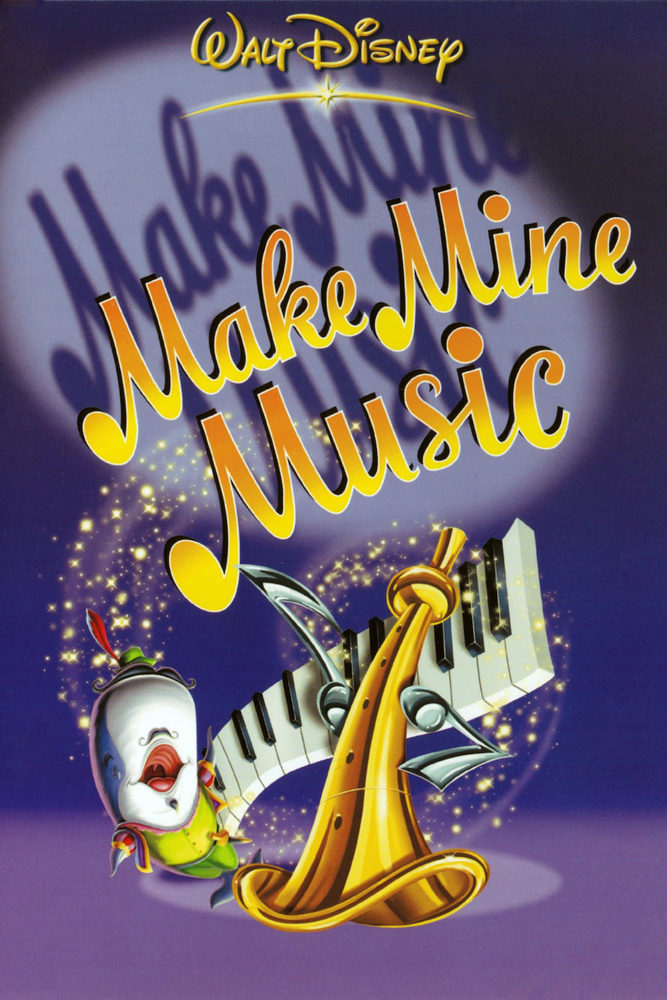
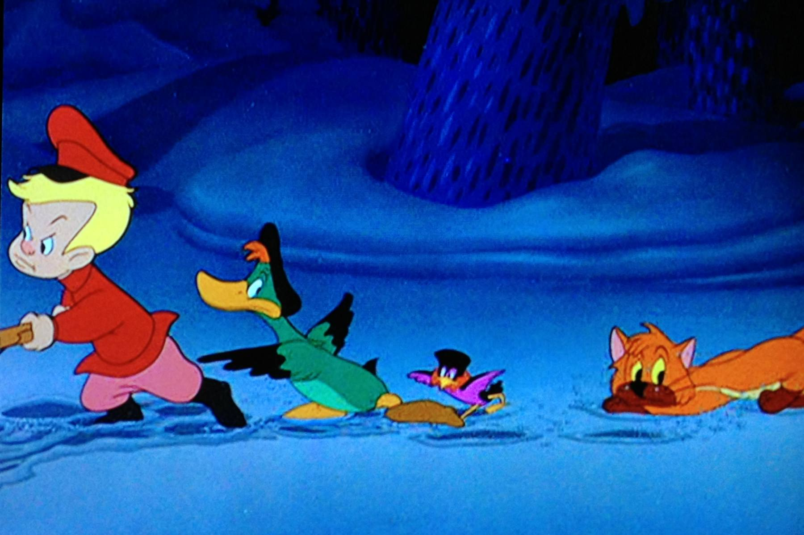
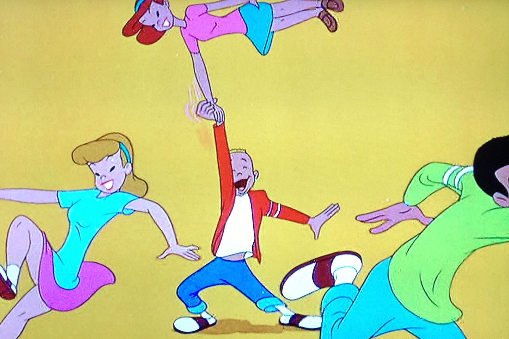

+++
titre = "<em>La boîte à musique</em>, Jack Kinney, Clyde Geronimi, Hamilton Luske, Joshua Meador et Robert Cormack"
title = "La boîte à musique, Jack Kinney, Clyde Geronimi, Hamilton Luske, Joshua Meador et Robert Cormack"
url = "/boite-musique-kinney-geronimi-luske-meador-cormack"
date = "2014-02-15T18:46:40"
Lastmod = "2014-02-15T18:53:23"
cover = "disney-boite-a-musique.jpg"
categorie = [ "À voir" ]
tag = [ "Amour", "Animation", "Court-métrage", "Musique", "Vite oublié" ]
createur = [ "Clyde Geronimi", "Hamilton Luske", "Jack Kinney", "Joshua Meador", "Robert Cormack", "Walt Disney" ]
annee = [ "1946" ]
weight = 1946
saga = [ "Classiques d'animation Disney" ]
pays = [ "États-Unis" ]
original = "Make Mine Music"

+++

1946, la Seconde Guerre mondiale est enfin terminée, mais la situation ne s’est pas arrangée pour autant aux studios Disney. Toujours dans le rouge financièrement, Walt Disney cherche la rentabilité facile et après deux compilations de courts-métrages qui ont rapporté de l’argent, il engage une troisième compilation. Dans l’esprit, <em>La boîte à musique</em> doit être une sorte de <a href="http://voiretmanger.fr/fantasia-sharpsteen/" title="Fantasia, Ben Sharpsteen"><em>Fantasia</em></a>, l’ambition démesurée en moins, la modernité musicale en plus. Ainsi, le huitième <a href="http://voiretmanger.fr/saga/classiques-danimation-disney/">classique d’animation</a> du studio est composé de dix séquences musicales de durées variables qui abordent tous les genres de l’époque : classique, chanson et aussi jazz se partagent l’affiche. Sur le papier, l’idée était bonne, mais le manque d’idées devient criant, autant que la pauvreté de la réalisation. <em>La boîte à musique</em> est classé parmi les classiques, mais ce n’est pas un film à la hauteur du studio…

Pendant une heure et quart environ, une durée tout à fait traditionnelle pour une production Disney, <em>La boîte à musique</em> nous propose quelques courts-métrages de longueur et surtout de qualité très variable. Certains éléments sont des projets inachevés à l’époque de <em>Fantasia</em> — « <em>Blue Bayou</em> » qui met en musique un héron est le plus flagrant —, d’autres sont des créations imaginées pour ce film. Le moins que l’on puisse dire, c’est que les scénaristes n’ont pas été trop sollicités pour raconter ces histoires. On pouvait se plaindre de certains éléments de <a href="http://voiretmanger.fr/saludos-amigos-ferguson/" title="Saludos Amigos, Norman Ferguson"><em>Saludos Amigos</em></a>, le premier de la série de compilations des années 1940, mais au moins y avait-il toujours un peu de recherche. Ici, c’est souvent le strict minimum et on peine à se rappeler des séquences qui composent le film. Dans le lot, on retiendra la plus longue, une illustration de <a href="http://fr.wikipedia.org/wiki/Pierre_et_le_Loup"><em>Pierre et le Loup</em></a>, le conte musical créé dix ans auparavant par Sergueï Prokofiev. Cette œuvre didactique devait permettre à des enfants de comprendre les rudiments de la composition musicale, chaque instrument étant associé à un personnage. Mettre en image cette œuvre était une excellente idée et Walt Disney l’avait déjà à l’époque de <em>Fantasia</em>. Hélas, la version proposée dans <em>La boîte à musique</em> est ratée, parce qu’elle ajoute un commentaire d’une lourdeur extrême à la musique qui se suffisait à elle-même. Résultat, on n’entend plus tellement la partition originale et on doit se farcir la voix du narrateur qui accompagne des dessins assez moches. La séquence finale qui raconte l’histoire d’une baleine chanteuse d’opéra est un petit peu plus réussie, elle a au moins le mérite d’être plus originale et elle fait entendre quelques classiques de l’opéra, comme des extraits de <em>Tristan et Isolde</em> de Wagner.

Ce court-métrage est peut-être celui qui a le mieux vieilli et c’est un des éléments du film qui a été repris, seul, par la suite. Ce n’est pas forcément le plus intéressant pourtant, alors que la compilation frappe par une autre particularité. Si <em>Saludos Amigos</em> et <a href="http://voiretmanger.fr/trois-caballeros-ferguson/" title="Les Trois Caballeros, Norman Ferguson"><em>Les Trois Caballeros</em></a> qui suivait étaient très marqués par la culture sud-américaine, c’est la culture étasunienne qui est ici exploitée. Pour la première fois et pour la dernière fois avant des années, les studios Disney ne se tournent pas vers l’Europe ou vers des récits peu contextualisés dans l’espace ou dans le temps pour raconter des histoires marquées par les États-Unis. C’est le cas du premier court-métrage de <em>La boîte à musique</em> qui raconte l’opposition de deux familles, mais qui rappelle la Guerre de Sécession. Les choix des couleurs — une famille habillée en rouge, l’autre en bleu — et de l’époque vont dans ce sens et le studio semble offrir une relecture historique, au second degré naturellement et avec une fin inattendue. Plus proche de la sortie du film, « <em>All the Cats Join in</em> » évoque l’insouciance de la jeunesse américaine des années 1940. Une jeunesse qui écoute du jazz et danse sur cette musique, pour un segment qui joue encore sur les interactions entre le dessinateur et le récit, comme dans le précédent long-métrage du studio. Au-delà de cet aspect contemporain, on note une prédominance de l’amour qui prend des formes plus variées qu’avant, à l’image du court-métrage qui raconte l’histoire d’amour entre deux chapeaux. Même si cette séquence souffre de son animation vieillotte et d’une chanson — interprétée par Édith Piaf dans la version française, tout de même — assez mièvre, on est malgré tout surpris par sa modernité : comment ne pas penser au <a href="http://www.spi0n.com/le-parapluie-bleu-pixar/"><em>Parabluie Bleu</em></a>, le court-métrage de Pixar qui a repris la même idée ?

Encore une fois, cette compilation de courts-métrages est un terrain de jeu pour les animateurs du studio Disney et ils s’en sont donnés à cœur joie, avec quelques idées intéressantes. Malheureusement, <em>La boîte à musique</em> est loin d’être aussi passionnant qu’escompté et à dire vrai, on trouve même le temps long face à cet enchaînement de séquences sans grand intérêt. Les années 1940 ne sont pas tendres pour le studio, et ce n’est pas encore la fin de ce passage à vide…

<h3>Vous voulez m’aider ?<a href="#footnote_0_11166" id="identifier_0_11166" class="footnote-link footnote-identifier-link" title="&Agrave; propos de la publicit&eacute;&hellip;">1</a></h3>
<ul>
<li><a href="http://www.amazon.fr/gp/product/B00004R99B/ref=as_li_ss_tl?ie=UTF8&#038;tag=leblogdenic07-21&#038;linkCode=as2&#038;camp=1642&#038;creative=19458&#038;creativeASIN=B00004R99B">Acheter le film en DVD sur Amazon</a> (attention, Zone 1 et VO uniquement)</li>
</ul>

<ol class="footnotes"><li id="footnote_0_11166" class="footnote"><a href="http://voiretmanger.fr/soutien/">À propos de la publicité…</a> [<a href="#identifier_0_11166" class="footnote-link footnote-back-link">&#8617;</a>]</li></ol>
