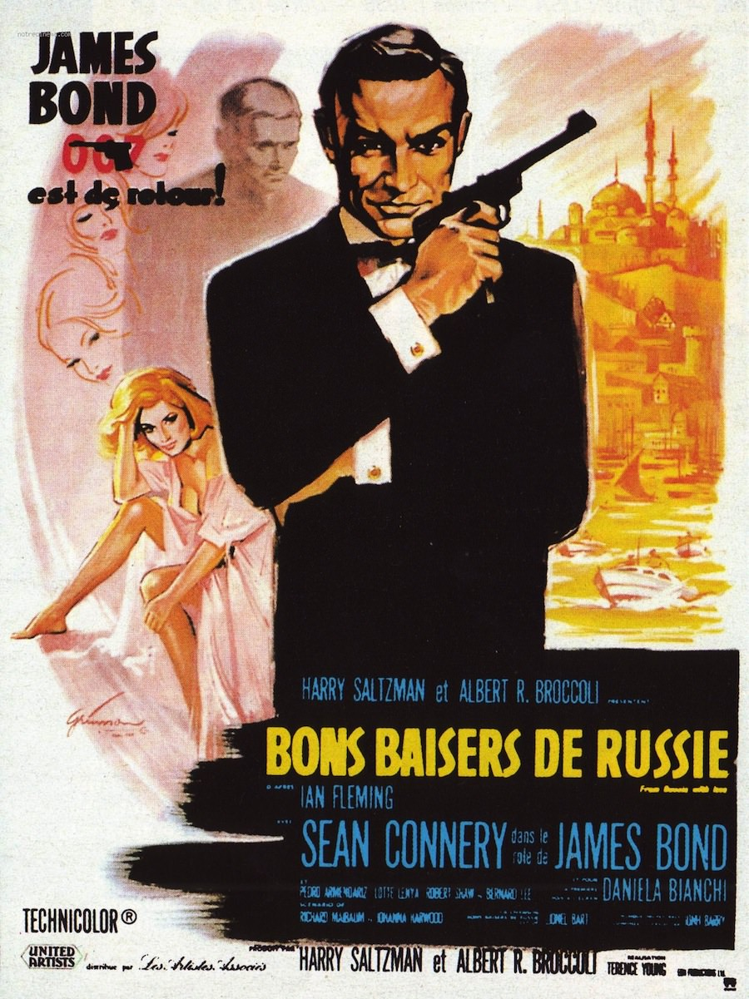
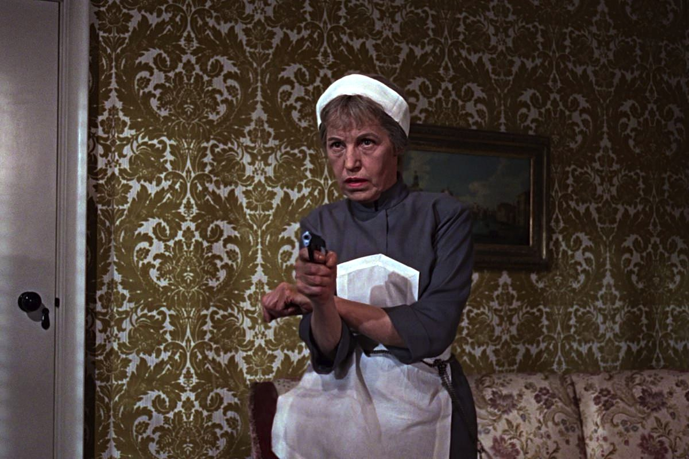

+++
type = "post"
titre = "<em>Bons baisers de Russie</em>, Terence Young"
title = "Bons baisers de Russie, Terence Young"
url = "/bons-baisers-russie-young"
date = "2012-12-30T10:29:51"
Lastmod = "2013-05-11T10:02:13"
cover = "bons-baisers-de-russie-sean-connery-terence-young.jpg"
categorie = [ "À voir" ]
tag = [ "Blockbuster", "Espionnage", "James Bond" ]
createur = [ "Terence Young" ]
acteur = [ "Bernard Lee", "Desmond Llewelyn", "Sean Connery" ]
annee = [ "1964" ]
weight = 1964
saga = [ "James Bond" ]
original = "From Russia with Love"

+++

Il n’a fallu qu’un an pour retrouver James Bond, le fameux espion du MI6, sur les écrans. <a href="/2012/12/23/james-bond-007-contre-dr-no-young/" title="James Bond 007 contre Dr. No, Terence Young - À voir et à manger"><em>James Bond 007 contre Dr. No</em></a> a été un gros succès populaire, un succès largement inattendu qui pousse les studios à croire en ce projet et à désirer son retour au plus vite. Un an après donc, Terence Young signe <em>Bons baisers de Russie</em>, une suite qui reprend et développe le personnage de l’agent 007. Le premier film de la saga était très simple pour des raisons essentiellement budgétaires, cette suite est très différente. Moins spectaculaire malgré les moyens en plus, <em>Bons baisers de Russie</em> est un épisode plus terne, plus complexe aussi, un film intéressant, même s’il semble aujourd’hui bien vide et assez lent. 

<em>Bons baisers de Russie</em> suit son prédécesseur d’assez près par sa date de sortie, mais aussi par son scénario. Ce deuxième long-métrage n’ouvre pas sur son personnage fétiche toutefois, mais sur l’ennemi principal de James Bond, le SPECTRE bien sûr. Introduit dans <em>James Bond 007 contre Dr. No</em>, il a ici les honneurs de l’ouverture avec une séquence pré-générique qui ressemble à une mise à mort de l’agent du MI6, mais qui n’est qu’un entraînement de l’homme chargé de filer et tuer 007. Une tromperie qui annonce la couleur : <em>Bons baisers de Russie</em> joue beaucoup plus sur les rouages traditionnels de l’espionnage que son prédécesseur et les agents doubles y seront légion. Son héros est en tout cas absent pendant la première partie du film de Terence Young et il faut attendre quasiment vingt minutes pour le voir… dans les bras d’une femme. Cette séquence n’a comme unique but de lier cet épisode avec le précédent, ce personnage féminin secondaire y ayant déjà joué un rôle. On retrouve aussi l’image d’un agent tombeur de jupons qui couche à plusieurs reprises, même si <em>Bons baisers de Russie</em> concentre les histoires de femme sur un personnage, une agent russe qui tombe vraiment amoureuse et qui survit d’un bout à l’autre cette fois. Les éléments clés du personnage principal sont à nouveau là et <em>Bons baisers de Russie</em> les affinent encore. Sean Connery a repris le flambeau pour ce deuxième long-métrage et il compose un agent secret toujours aussi flegmatique, même si une brèche se crée ici autour du personnage de Tatiana. L’agent 007 est solide comme un roc, mais s’il s’en sort toujours avec une bonne blague, il prend aussi quelques coups.

Par rapport à <em>James Bond 007 contre Dr. No</em>, ce nouvel opus introduit les gadgets et le personnage de Q, déjà interprété par Desmond Llewelyn qui n’est déjà plus de la première jeunesse, mais qui signe ici sa première participation à la saga dans un rôle qu’il tiendra jusqu’à <a href="/2012/12/09/monde-suffit-pas-apted/" title="Le monde ne suffit pas, Michael Apted - À voir et à manger"><em>Le monde ne suffit pas</em></a><a href="#footnote_0_8177" id="identifier_0_8177" class="footnote-link footnote-identifier-link" title="De 1963 &agrave; 1999, Desmond Llewelyn a jou&eacute; dans pas moins de dix-sept films de la saga James Bond&nbsp;! Une long&eacute;vit&eacute; impressionnante au cin&eacute;ma, surtout sur une saga o&ugrave; l&rsquo;acteur principal n&rsquo;a pas arr&ecirc;t&eacute; de changer&hellip;">1</a>. Ce premier gadget — une mallette dotée de différentes fonctions supplémentaires, comme un couteau ou des pièces d’or — n’a pas encore la complexité des <em>James Bond</em> qui viendront par la suite, mais l’idée est là. Pas de voiture en revanche, il faudra attendre <a href="/2013/01/06/goldfinger-hamilton/" title="Goldfinger, Guy Hamilton"><em>Goldfinger</em></a> sorti dès l’année suivante pour cela. Même si <em>Bons baisers de Russie</em> est le premier à introduire un gadget, ce n’est pas le plus spectaculaire, bien loin de là. Le film a ses moments d’action, avec un réalisme souvent jamais vu sur les écrans de l’époque, même si les explosions et autres effets spéciaux ont naturellement assez mal vieilli. Dans l’ensemble toutefois, Terence Young réalise un long-métrage beaucoup plus calme que le précédent, terne même peut-on dire. Il ne se passe pas grand-chose finalement, tout se déroule entre l’Europe de l’Est et la Turquie, dans un environnement largement dominé par la Guerre froide. Le SPECTRE tente bien de raviver les flammes de cette guerre en sourdine, sans succès et tout l’enjeu dans <em>Bons baisers de Russie</em> est quand même… une sorte de machine à écrire capable de décoder les messages russes. On est déjà loin de la machination à base d’armes atomiques du Dr. No… 

Ce côté terne de <em>Bons baisers de Russie</em> surprend. Le deuxième long-métrage de Terence Young n’est pas mauvais, il est plus complexe, moins immédiat que son prédécesseur et peine sans doute à s’imposer dans la saga <em>James Bond</em> complète. C’est pourtant un film intéressant et plus crédible — on n’ose pas parler de réalisme malgré tout —, avec des personnages secondaires mieux travaillés qu’à l’accoutumée, du côté des gentils, comme des méchants d’ailleurs. Sans parvenir à convaincre totalement, <em>Bons baisers de Russie</em> reste un épisode à voir pour cette raison justement : ce n’est pas qu’un <em>James Bond</em> parmi les autres…

<strong>James Bond reviendra dans… <a href="/2013/01/06/goldfinger-hamilton/" title="Goldfinger, Guy Hamilton"><em>Goldfinger</em></a></strong>

<h3>Vous voulez m’aider ?<a href="#footnote_1_8177" id="identifier_1_8177" class="footnote-link footnote-identifier-link" title="&Agrave; propos de la publicit&eacute;&hellip;">2</a></h3>
<ul>
<li><a href="http://www.amazon.fr/gp/product/B001D45CIM/ref=as_li_ss_tl?ie=UTF8&amp;tag=leblogdenic07-21&amp;linkCode=as2&amp;camp=1642&amp;creative=19458&amp;creativeASIN=B001D45CIM">Acheter le film en Blu-Ray sur Amazon</a></li>
<li><a href="http://www.amazon.fr/gp/product/B000NJM5RE/ref=as_li_ss_tl?ie=UTF8&amp;tag=leblogdenic07-21&amp;linkCode=as2&amp;camp=1642&amp;creative=19458&amp;creativeASIN=B000NJM5RE">Acheter le film en DVD sur Amazon</a></li>
<li><a href="https://itunes.apple.com/fr/movie/bons-baisers-russie-from-russia/id561579653">Acheter ou louer le film sur l’iTunes Store</a></li>
</ul>
<ul>
<li><a href="http://www.amazon.fr/gp/product/B008U6R9B4/ref=as_li_ss_tl?ie=UTF8&amp;tag=leblogdenic07-21&amp;linkCode=as2&amp;camp=1642&amp;creative=19458&amp;creativeASIN=B008U6R9B4">Acheter la trilogie complète en Blu-Ray sur Amazon</a></li>
<li><a href="http://www.amazon.fr/gp/product/B008U6R93C/ref=as_li_ss_tl?ie=UTF8&amp;tag=leblogdenic07-21&amp;linkCode=as2&amp;camp=1642&amp;creative=19458&amp;creativeASIN=B008U6R93C">Acheter la trilogie complète en DVD sur Amazon</a></li>
</ul>

<ol class="footnotes"><li id="footnote_0_8177" class="footnote">De 1963 à 1999, <a href="http://fr.wikipedia.org/wiki/Desmond_Llewelyn">Desmond Llewelyn</a> a joué dans pas moins de dix-sept films de la saga <em>James Bond</em> ! Une longévité impressionnante au cinéma, surtout sur une saga où l’acteur principal n’a pas arrêté de changer… [<a href="#identifier_0_8177" class="footnote-link footnote-back-link">&#8617;</a>]</li><li id="footnote_1_8177" class="footnote"><a href="/soutien/">À propos de la publicité…</a> [<a href="#identifier_1_8177" class="footnote-link footnote-back-link">&#8617;</a>]</li></ol>
