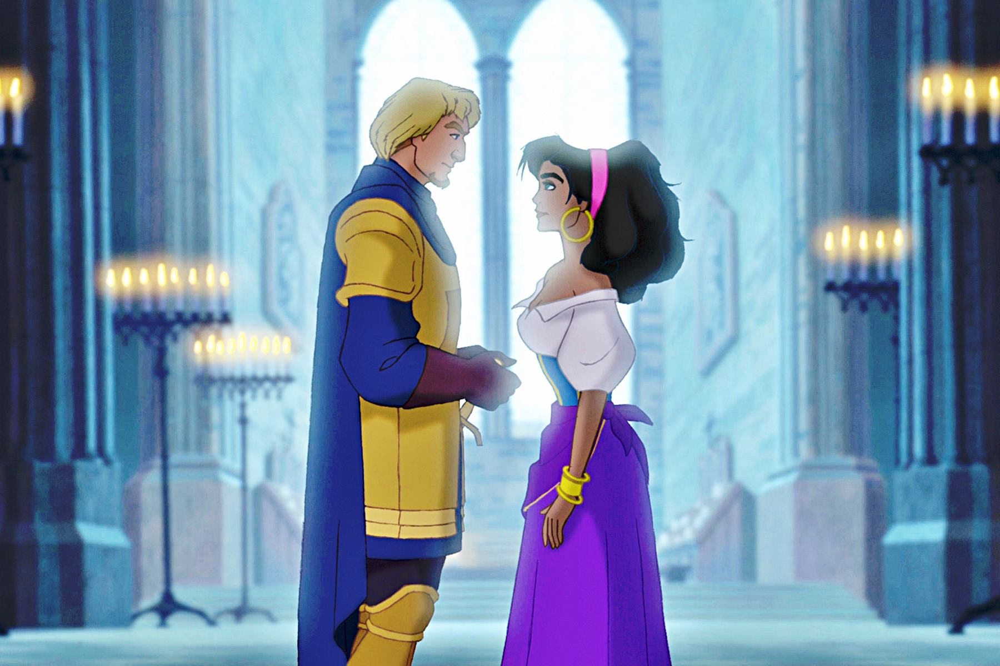
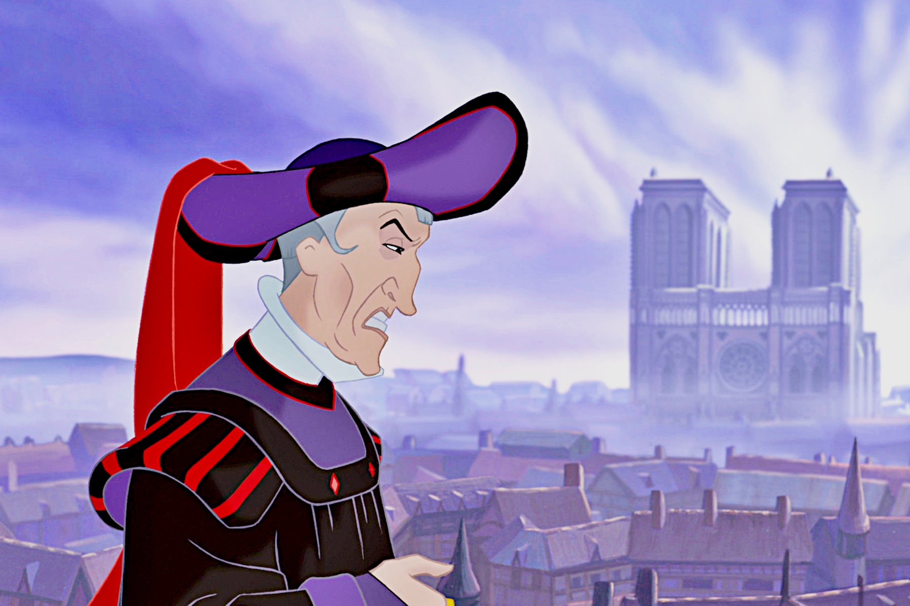

+++
type = "post"
titre = "<em>Le Bossu de Notre-Dame</em>, Gary Trousdale et Kirk Wise"
title = "Le Bossu de Notre-Dame, Gary Trousdale et Kirk Wise"
url = "/bossu-de-notre-dame-trousdale-wise"
date = "2014-06-30T10:06:44"
Lastmod = "2014-06-30T10:09:14"
cover = "bossu-notre-dame-disney.jpg"
categorie = [ "À voir" ]
tag = [ "Adaptation littéraire", "Amour", "Animation", "Comédie musicale", "Histoire", "Politique", "Religion" ]
createur = [ "Gary Trousdale", "Kirk Wise" ]
annee = [ "1996" ]
weight = 1996
saga = [ "Classiques d'animation Disney" ]
pays = [ "États-Unis" ]
original = "The Hunchback of Notre Dame"

+++

Les studios Disney ont trouvé le rythme de croisière qui est toujours le leur aujourd’hui. Depuis <a href="/roi-lion-allers-minkoff/" title="Le Roi Lion, Roger Allers et Rob Minkoff"><em>Le Roi Lion</em></a> sorti en 1994, les <a href="/saga/classiques-danimation-disney/">classiques</a> s’enchaînent au rythme d’un par an. Ainsi, l’année d’après <a href="/pocahontas-legende-indienne-gabriel-goldberg/" title="Pocahontas, une légende indienne, Mike Gabriel et Eric Goldberg"><em>Pocahontas, une légende indienne</em></a> l’un des plus gros projets de la décennie pour le studio, c’est <em>Le Bossu de Notre-Dame</em> qui sort en 1996. Sorti après quelques grands classiques, ce long-métrage réalisé par Gary Trousdale et Kirk Wise est moins connu et sans doute moins bon, mais il n’est pas inintéressant pour autant. Abordant directement la question de la religion pour la première — et la dernière — fois, Walt Disney compose un film plus sombre qu’il n’y paraît. Des touches légères sont bien présentes dans cette comédie musicale qui sait se faire enjouée, mais l’adaptation de Victor Hugo reste une œuvre assez dure à bien des égards. Ce choix étonnant pour un dessin animé censé rassembler justifie à lui seul que l’on s’y intéresse : <em>Le Bossu de Notre-Dame</em> est un classique qui sort du lot et qui, à ce titre, mérite d’être regardé.

Après deux œuvres originales, les studios Disney reviennent à l’adaptation, mais optent cette fois pour un classique de la littérature française qui n’a pas vraiment été écrit pour les enfants. Sous la plume de Victor Hugo, <em>Notre-Dame de Paris</em> est en effet un roman très noir qui dénonce le rôle de la religion, mais aussi du pouvoir monarchique en place au XVe siècle. Le traitement du Bossu qui fait sonner les cloches de la Cathédrale est assez terrible, mais ce n’est pas tout : il n’y a aucun vrai personnage positif, en tout cas pas au sens de Disney, et il ne faut pas compter sur un <em>happy-end</em>. Dans ces conditions, on peut avoir du mal à trouver le film grand public qui saura rassembler toute la famille et sans surprise, le scénario mis en images par Gary Trousdale et Kirk Wise n’a plus grand-chose à voir avec l’original. <em>Le Bossu de Notre-Dame</em> conserve les grandes lignes du roman, et notamment quelques-uns de ses personnages, dont le Bossu, le terrible Frollo, la bohémienne Esmeralda et le capitaine Phœbus. Plusieurs personnages ont été modifiés toutefois : Frollo n’est plus un ecclésiastique (un archidiacre dans le roman), mais un juge laïc, ce qui permet au film d’éviter la majorité des critiques contre la religion adressées par Victor Hugo. Phoebus a été transformé en prince charmant Disney : il vient au secours des gentils, il est brave et courageux et offre ainsi au dessin animé la possibilité d’un happy-end qui manquait dans le roman. Pour cela, il a aussi fallu changer le destin d’Esmeralda, qui devient au passage une sorte de princesse à la Disney. Ce n’est pas tout : pour plaire aux plus jeunes, <em>Le Bossu de Notre-Dame</em> ajoute un peu de magie et d’humour avec le trio de gargouilles vivantes qui font office de personnages comiques.

Tous ces changements et ajouts permettent au trente-quatrième classique Disney de plaire au plus grand nombre, mais <em>Le Bossu de Notre-Dame</em> reste le film le plus sombre de cette période. Sans aller aussi loin que <a href="/taram-chaudron-magique-berman-rich/" title="Taram et le chaudron magique, Ted Berman et Richard Rich"><em>Taram et le chaudron magique</em></a> auquel on pense quand même, le film reste sur le fond et sur la forme un classique étonnamment noir. Sur le fond, on a évoqué les aménagements effectués sur les personnages, mais ils n’enlèvent pas tous les éléments critiques du roman. Même si Frollo est un juge et non un ecclésiastique, il reste un homme avide de pouvoir, un homme rongé par une haine raciale viscérale au point qu’il entend massacrer tous les bohémiens jusqu’au dernier. Il est aussi rongé par l’amour qu’il ne veut s’avouer, ce qui donne une scène très impressionnante avec une chanson — écrite par Alan Menken, le compositeur attitré de Disney à l’époque — plutôt réussie sur ses doutes. Et puis même s’il n’est pas censé représenter l’Église, les animateurs ont multiplié les éléments qui sèment le trouble : il a quand même une croix en permanence sur lui, et son habit en partie violet rappelle inévitablement un prêtre, et ce n’est en aucun cas un hasard. Sur la forme, les animations ont radicalement changé de style après <em>Pocahontas, une légende indienne</em>. Cette fois, ils sont restés dans l’esprit gothique de l’époque et ils ont reconstitué un Paris très fouillé et plutôt réussi. L’animation est fluide, notamment pour les personnages, si bien que même si elle est moins originale que pour d’autres classiques, elle est de qualité et plutôt agréable. Au passage, le dessin de Quasimodo participe au côté sombre du film : le bossu est vraiment difforme et même si c’est ce qui fait son charme, on imagine très bien qu’un enfant peut être impressionné par ce personnage de héros très atypique.

Avec <em>Le Bossu de Notre-Dame</em>, les studios Disney tentent quelque chose qu’ils n’avaient encore jamais fait, avec un dessin animé sombre et traversé par des thématiques inhabituelles, au premier rang desquelles, la religion. Le précédent classique était déjà atypique, avec une place importante accordée à l’écologie et un message quasiment politique. En ce sens, les deux films sont liés et font figure d’exceptions. Avec <a href="/hercule-musker-clements/" title="Hercule, John Musker et Ron Clements"><em>Hercule</em></a> puis <a href="/mulan-bancroft-cook/" title="Mulan, Tony Bancroft et Barry Cook"><em>Mulan</em></a>, Walt Disney revient à des sujets plus attendus et à un traitement plus familial. À ce titre, le film de Gary Trousdale et Kirk Wise est intéressant et mérite d’être vu, même s’il souffre un peu de la comparaison avec ses illustres prédécesseurs.

<h3>Vous voulez <a href="/soutien/">m’aider</a> ?</h3>
<ul>
<li><a href="http://www.amazon.fr/gp/product/B00AHDVHIO/ref=as_li_ss_tl?ie=UTF8&amp;tag=leblogdenic07-21&amp;linkCode=as2&amp;camp=1642&amp;creative=19458&amp;creativeASIN=B00AHDVHIO">Acheter le film en Blu-ray sur Amazon</a></li>
<li><a href="http://www.amazon.fr/gp/product/B00005NYXO/ref=as_li_ss_tl?ie=UTF8&amp;tag=leblogdenic07-21&amp;linkCode=as2&amp;camp=1642&amp;creative=19458&amp;creativeASIN=B00005NYXO">Acheter le film en DVD sur Amazon</a></li>
<li><a href="https://itunes.apple.com/fr/movie/le-bossu-de-notre-dame/id369578577">Acheter ou louer le film sur l’iTunes Store</a></li>
</ul>

